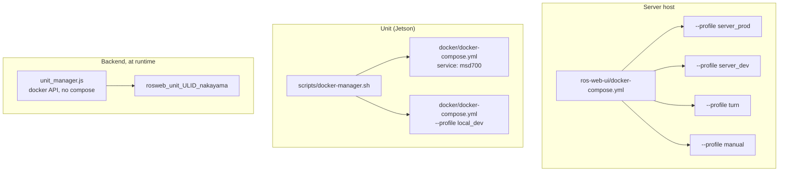
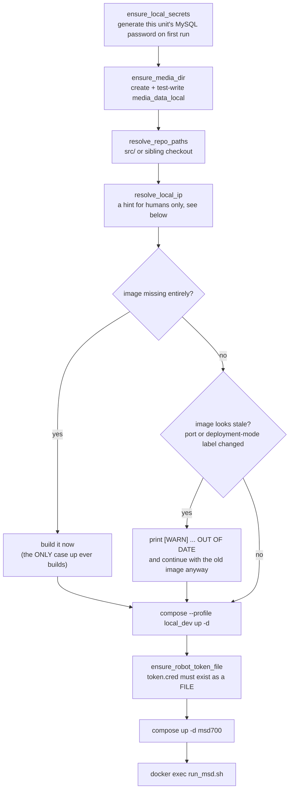

# Docker リファレンス

<RoleBadge role="technician" />

MSD700 で使用されるすべての Docker コマンド、フラグ、構成構造と、それぞれの実際の内容
やってる。このページは、セットアップ ページのリンク先のリファレンスです: 読む
順序付けされたプロシージャの[サーバー セットアップ](/ja/setup/server-setup)および[ユニット セットアップ](/ja/setup/unit-setup)、
なぜそこに旗があるのか、あるいは旗を落とすとどうなるのかを知りたいときにここに来てください。

## どの構成ファイルを見ているのでしょうか?

3 つありますが、それぞれが異なるものではありません。彼らはさまざまなマシンについて説明しています。

|ファイル |実行日 |を引き起こします |
| --- | --- | --- |
| `ros-web-ui/docker-compose.yml` | **サーバー** |クラウド スタック全体: MySQL、HiveMQ、バックエンド + rosbridge、メディア、シグナリング、ダッシュボード、coturn |
| `msd700_noetic/docker/docker-compose.yml` | **ユニット** | `msd700` ロボット コンテナ、およびユニット独自の `local_dev` サーバー スタック |
| `ros-web-ui/docker-compose.robot.yml` |開発用ラップトップ |ロボットは半分単独、スタンドアロン、ユニットのオーケストレーションなし |



## サーバー: プロファイルを作成する

Compose は、宣言されたプロファイルの**いずれか**がアクティブな場合にサービスを実行します。なしでは何も始まりません
このため、このリポジトリ内の裸の `docker compose up -d` は何も役に立ちません。

|プロフィール |サービス |目的 |
| --- | --- | --- |
| `server_prod` | `db`、`hivemq`、`fix_perms_prod`、`nakayama_cloud`、`nakayama_media`、`nakayama_signalling`、`frontend_prod`、`coturn` |ライブ展開 |
| `server_dev` | `db_dev`、`hivemq_dev`、`fix_perms_dev`、`nakayama_cloud_dev`、`nakayama_media_dev`、`nakayama_signalling_dev`、`frontend_dev` |異なるポートと異なるデータベース上の完全な並列スタック |
| `turn` | `coturn` のみ |製品の残りの部分には触れずに、リレーを単独で開始または再起動します。
| `manual` | `dev`、`aws`、`hive`、`hive_serverless`、`nakayama_msd`、`nakayama_msd_sim` |従来のクラウド専用ロボットハーフサービス。通常の展開の一部ではありません |

::: warning `coturn` is in two profiles on purpose
`profiles: ["server_prod", "turn"]` は、通常の製品 `up` にリレーが付属していることを意味し、**そして**
`--profile turn` だけで起動できます。 `server_dev` には意図的に**ありません**: 1 つあります
リレーインスタンスであり、本番に属します。開発スタックを起動しても実稼働を開始してはなりません
インフラストラクチャ。リレーは状態を保持せず、誰もペアにしないため、共有は安全です。ピアはそれぞれを見つけます。
他はシグナリング サーバー経由であり、それらは **分割**されています (本番環境 3001、開発環境 4001)。
:::

### サービスとポートのマップ

|サービス |コンテナ |ネットワーク |ホストポート |メモ |
| --- | --- | --- | --- | --- |
| `db` / `db_dev` | `ros_web_ui_v2_db[_dev]` |橋 | `3307` / `3308` |健康診断済み。バックエンドはそれを待機します。
| `hivemq` / `hivemq_dev` | `ros_web_ui_v2_hivemq[_dev]` |橋 | `8883` / `8884` |コンテナ内部ポートは両方とも `8883` です。
| `nakayama_cloud[_dev]` | `ros_web_ui_v2_nakayama_ros[_dev]` | **ホスト** | `5000` / `5001` API、`9090` / `9091` ロスブリッジ | `unit_manager` も主催します |
| `nakayama_media[_dev]` | `ros_web_ui_v2_nakayama_media[_dev]` | **ホスト** | `3003` / `4003` | |
| `nakayama_signalling[_dev]` | `ros_web_ui_v2_nakayama_signalling[_dev]` | **ホスト** | `3001` / `4001` WS、`3002` / `4002` HTTP | |
| `frontend_prod` / `frontend_dev` | `ros_web_ui_v2_frontend[_dev]` |橋 | `3000` / `3100` | Apache の包括的なポイントは `3000` |
| `coturn` | `ros_web_ui_v2_coturn` | **ホスト** | `3478` + リレー範囲 |製品のみ |

## Compose コマンドリファレンス

### サービスの起動

```bash
# The normal case: start (or restart into) an entire profile, detached.
docker compose --profile server_prod up -d

# Rebuild the images first, then start. Needed after pulling code that changes a dependency.
docker compose --profile server_prod up -d --build

# Start ONE service without starting the rest of its profile.
docker compose up -d nakayama_cloud

# Start the relay alone, without touching anything else in prod.
docker compose --profile turn up -d coturn
```

|旗 |効果 |実際に必要なとき |
| --- | --- | --- |
| `--profile <name>` |プロファイルをアクティブ化します。再現可能。 |常にこのリポジトリ内 |
| `-d`、`--detach` |ログをストリーミングする代わりにシェルに戻る |起動失敗をデバッグする場合を除き、常に |
| `--build` |開始する前にイメージを再構築する |依存関係または Dockerfile の変更後 |
| `--force-recreate` |構成とイメージが変更されていない場合でもコンテナーを再作成します |めったに;スタックしたコンテナは通常、`down` を使用してから `up` を使用した方が適切に処理されます。
| `--no-deps` | `depends_on` チェーンを使用せずに指定されたサービスを開始します。依存関係が意図的にダウンしているサービスのデバッグ |
| `--remove-orphans` |ファイル内に存在しなくなったサービスからコンテナーを削除する |サービスの名前変更または削除後 |
| `--pull always` |基本イメージを再プルする |新しいアップストリーム `mysql:8.0` または `hivemq4` パッチを取得します |

### 建物

```bash
docker compose --profile server_prod build          # all services in the profile
docker compose build nakayama_cloud                 # one service
docker compose build --no-cache nakayama_cloud      # ignore every cached layer
docker compose build --progress plain nakayama_cloud # full build output, not the collapsed view
```

`--no-cache` は、ビルドは「成功」したが、古いコンテンツが生成された場合の答えです。Docker がキャッシュした
`COPY` または入力の変化が確認できない `RUN apt-get` レイヤー。遅いから手を伸ばせ
通常のビルドがすでに何かを取得できていない場合に限ります。

### 検査中

```bash
docker compose ps                        # services in this project and their health
docker compose ps -a                     # including stopped ones
docker compose logs -f nakayama_cloud    # follow one service
docker compose logs --tail=200 hivemq    # last 200 lines, no follow
docker compose logs --since=10m          # everything in the last 10 minutes
docker compose exec nakayama_cloud bash  # shell inside a RUNNING container
docker compose run --rm busybox sh       # one-off container, removed on exit
docker compose config                    # the fully-resolved file, with all variables expanded
```

::: tip `docker compose config` is the fastest `.env` debugging tool there is
すべての `${VARIABLE}` を置換して作成ファイルを出力します。ポート、パス、またはパスワードが
期待したものではありません。これにより、実際に解決された構成が表示されます。多くの場合、これは「空」です
`.env` でキーのスペルが間違っているためです。」
:::

### 停止と削除

```bash
docker compose --profile server_prod stop   # stop, keep the containers
docker compose --profile server_prod down   # stop AND remove containers + networks
docker compose down --remove-orphans        # also remove containers of deleted services
docker compose down -v                      # ALSO DELETE NAMED VOLUMES
```

::: danger `down -v` deletes HiveMQ's data and log volumes
`ros_webui_hivemq_data_prod` は、保持されたメッセージ、クライアント セッション、およびキューに入れられた QoS>0 メッセージを保持します。
このプロジェクトで `-v` を実行する理由はほとんどありません。クリーンなブローカーが必要な場合は、それを削除してください
意図的に1冊の名前で。
:::

## このプロジェクトで使用される構成要素を構成します

サーバー構成ファイルは、スタイルではなく負荷に耐えるいくつかの構造を使用します。それぞれ
1 つは、ドロップすると実際の停止が発生したため、ここにあります。

### YAML アンカー (`x-common-env`、`<<: *`)

```yaml
x-common-env: &common-env
  ROS_DISTRO: "noetic"
  MAPS_FOLDER: "${MAPS_FOLDER:-/home/ubuntu/ros_maps}"

x-common-env-prod: &common-env-prod
  <<: *common-env          # inherit, then override
  PORT_SQL: "${MYSQL_PORT_PROD:-3307}"
```

`&name` はアンカーを定義し、`*name` はそれを参照し、`<<:` はそれをマージします。 `${VAR:-default}` は作成者です
独自の補間: `VAR` が設定されていて空でない場合は使用し、そうでない場合はデフォルトを使用します。

### `network_mode: host`

ROS を搭載するすべてのサービスと `coturn` によって使用されます。これは、コンテナがホストのネットワークを共有していることを意味します
名前空間: ポート マッピングなし、NAT なし、コンテナ内の `localhost` がホストです。

|サービス |ネットワークをホストする理由 |
| --- | --- |
| `nakayama_*` | ROS 1 ノードは、任意の一時ポートを相互にネゴシエートします。ブリッジ ネットワークは、ROS マスターから返された URI を破壊します。 |
| `coturn` |リレーは、`min-port..max-port` からの割り当てごとに 1 つのポートを割り当てます。ブリッジ経由でその範囲を公開するということは、ポートごとに 1 つの `docker-proxy` プロセスを意味します。 coturn のデフォルトの 16384 ポートでは、マシンがダウンします。このホストもすでに NAT の背後にあり、ブリッジによって 2 番目の変換が追加されます。これにより、TURN サーバーが正しく行う必要がある 1 つのこと、つまり自身の外部アドレスを認識してアドバタイズすることができなくなります。 |

### `depends_on` 条件付き

```yaml
depends_on:
  db:
    condition: service_healthy
  fix_perms_prod:
    condition: service_completed_successfully
```

|状態 |意味 |
| --- | --- |
| `service_started` |デフォルト。コンテナが存在するのを待つだけです。ほとんど十分ではありません。 |
| `service_healthy` | `healthcheck` が通過するのを待ちます。これにより、バックエンドが MySQL と競合し、`Connection lost` で失敗することがなくなります。 |
| `service_completed_successfully` |ワンショット コンテナが `0` を終了するまで待機します。権限フィクサーに使用されます。 |

### ワンショットの権限修正ツール

```yaml
fix_perms_prod:
  image: busybox
  profiles: ["server_prod"]
  network_mode: "none"
  user: root
  volumes:
    - /srv/msd/media/map:/srv/msd/media/map
  command: >
    sh -c "mkdir -p ... && chown -R $$USER_UID:$$USER_GID ..."
```

まだ存在しないバインド マウントされたホスト パスは、**Docker デーモンによって root** として自動作成されます。
アプリユーザーとしてではありません。アプリコンテナは特権なしで実行されるため、最初の書き込みは `EACCES` を取得します。これ
コンテナは最初に root として実行され、所有権が修正されるため、手動なしで新しいホストが自己修正されます。
`chown`。

::: warning `network_mode: "none"` on this service is not cosmetic
`networks:` キーがないと、Compose はプロジェクトのデフォルト ネットワークにサービスを配置します。コンテナ
**ID** によってネットワークを記録します。デフォルトのネットワークが削除され、再作成されると (任意の
`docker compose down` と 2 つのチェックアウトがプロジェクト名 `ros-web-ui` を共有しているため、どちらでも実行できます)、
このコンテナは二度と起動できません: `コンテナ ネットワークのセットアップに失敗しました: network <old-id> not
found`. Every app service depends on it with `service_completed_ successly` なので、プロフィール全体
その後、行き詰まった `chown` ジョブの背後に現れることを拒否します。 `network_mode: none` の前にこのようなことが 2 回発生しました
が追加されました。 mkdirs と chown です。ネットワークを必要としたことはありません。
:::

### `user:` および `group_add:`

```yaml
user: "itbdelabo"
group_add:
  - "${DOCKER_GID:-998}"
```

`group_add` は、コンテナのユーザーをホストの `docker` グループに追加して、`backend_node` がホストと通信できるようにします。
`/var/run/docker.sock` をマウントし、ユニットごとのコンテナを管理します。適切な値を見つけるには
ホスト上の `getent group docker | cut -d: -f3`。

HiveMQ は代わりに `user: "1001:0"` を使用し、両方の半分が重要です。uid `1001` は `0600` キーストアを所有し、
したがって、コンテナーは、独自の秘密キーを読み取るために、そのユーザーに「なる」必要があります。 Gid `0` は特権の取得ではありません:
イメージは `/opt/hivemq` として `root:root 775` として出荷され、`bin/run.sh` が開始を拒否しない限り
`$HIVEMQ_HOME` は書き込み可能であり、グループ root は何も chown せずに満足します。

### 長い構文のバインドマウント

```yaml
- type: bind
  source: ${HIVEMQ_KEYSTORE:-/srv/msd/secrets/hivemq/keystore.p12}
  target: /opt/hivemq/conf/keystore.p12
  read_only: true
  bind:
    create_host_path: false
```

ここでは長い構文が単に `create_host_path: false` に使用されています。 Docker のデフォルトは**作成**です
バインド ソースが欠落しており、単一ファイル マウントの場合はそこに **ディレクトリ** が作成されます。行方不明
キーストアは、「これ」としてではなく、HiveMQ の起動の奥深くで読み取り不可能なキー エラーとして表面化します。
ファイルがホスト上にありません。」 `up` で失敗するのが正直な結果です。

### 名前付きボリュームとバインド マウントの比較

|パス |種類 |なぜ |
| --- | --- | --- |
| `./mysql_data/prod` |バインド |リポジトリ内に存在し、リポジトリとともにバックアップされます。
| `hivemq_data_prod`、`hivemq_log_prod` |名前付きボリューム | Docker はそれらを所有し、最初の使用時にイメージからシードし、`$HOME` の下の `rm -rf` 以降も存続します。
| `./Docker/hivemq/config.xml` |バインド、`:ro` |設定は git | に属します。
| `/srv/msd/secrets/...` |バインド、`:ro` |秘密は決して画像に入らない |

::: danger A bind mount MASKS the image's own directory
HiveMQ は、ホーム ディレクトリに手動で抽出した tarball から `conf/ data/ log/` をバインドマウントしていました。あ
それらの「残った」ディレクトリの `sudo rm -rf` には構成が引き継がれ、空のホストが作成されました。
ディレクトリは機能が低下したブローカーではありません。まったく起動できないブローカーです。
(`The configuration file /opt/hivemq/conf/config.xml does not exist`)。リポジトリには何も記録されていません
リスナーブロックが何だったのか。そのため、ホストにはブローカーが起動するために必要なものが何も保持されていません。
:::

### ヘルスチェック

```yaml
healthcheck:
  test: ["CMD", "bash", "-c", "exec 3<>/dev/tcp/127.0.0.1/8080"]
  interval: 30s
  timeout: 5s
  retries: 3
  start_period: 60s
```

コピーする価値のある 2 つの詳細。 MQTT リスナーではなく、HiveMQ の **コントロール センター** ポート (8080) をプローブします。
MQTT ポートに対するベア TCP プローブは `CONNECT` を送信する前に閉じられ、HiveMQ はすべてのプローブを記録します
`log/event.log` にあるもののうち `Client ID: UNKNOWN ... disconnected ungracefully` は約
どのロボットが接続したかを監査するために使用される正確なファイルには、1 日あたり 2880 行のジャンク行があります。リスナーは両方とも所属しています
同じ JVM に送信されるため、8080 応答は適切な活性信号となります。

そして、その画像の `/bin/sh` は `dash` であり、 `/dev/tcp` がなく、
`Directory nonexistent` を含むすべてのプローブは失敗します。

### ログローテーション

```yaml
logging:
  driver: json-file
  options:
    max-size: "20m"
    max-file: "3"
```

現在、ログに上限を設けているのは `coturn` だけです。その構成ログの割り当ては `verbose` と
認証されていないスキャナーが 3478 をハンマリングすると、ディスクが 401 でいっぱいになる可能性があります。その他すべてのサービス
まだ無制限にログが記録されます。これを修正することは、偶然ではなく意図的に行う価値があります。
ログドライバーを変更すると、コンテナーが接続するすべてのサービスでコンテナーが強制的に再作成されます。

### 画像タグ

|タグ |使用者 |
| --- | --- |
| `ros-noetic-webui-app-v2:latest` | prod サービスと prod ユニットごとのコンテナ |
| `ros-noetic-webui-app-v2:dev` |開発サービスと開発ユニットごとのコンテナ |
| `ros-dashboard-next-v2:prod` / `:dev` | 2 つのダッシュボード ビルド |
| `ros-noetic-webui-app-local:latest` |ユニット独自のバックエンド、メディア、シグナリング |
| `ros-dashboard-next-local:latest` |ユニット独自のダッシュボード |
| `msd700:latest` / `msd700-simulator:latest` |ロボットコンテナ |

::: warning Prod and dev must never share a tag
どちらのサーバー プロファイルも `ros-noetic-webui-app-v2:latest` の構築に使用されました。開発者向けにサイレントに実行されるビルド
デプロイもアナウンスもなく、次の再作成時に実行されるプロダクションが変更されました。タグ
現在は分割されており、`UNIT_IMAGE` はプロファイルごとに設定されているため、開発ユニット コンテナーが開発コードを実行します。
:::

## coturn: 実稼働専用サービス

リレーは、prod 内に存在するスタックの 1 つの部分であり、他のどこにも存在しません。

### 構成

coturn は展開しないため、ホストごとの値は構成ファイルではなく **flags** として渡されます。
設定内の環境変数。フラグがファイルよりも優先されるため、共有ポリシーは git に残り、
アドレスは `.env` に残ります。

```bash
# ros-web-ui/.env
TURN_LISTENING_IP=192.168.100.10     # the host's own LAN address
TURN_EXTERNAL_IP=118.22.31.252       # the PUBLIC address, seen from the internet
TURN_USER=msd700
TURN_PASSWORD=<a long random string>
TURN_MIN_PORT=49152                  # optional, coturn's own default
TURN_MAX_PORT=65535                  # optional
```

最初の 4 つの値はすべて、compose の `${VAR:?}` ではなく、**コンテナの開始**時にチェックされます。
必須変数の構文。 Compose は、プロファイルに関係なく、ファイル内のすべてのサービスを補間します。
が起動されるため、ここで必須の変数を使用すると、`--profile server_dev up` が失敗します。
誰もスタートを求めなかったリレー。

::: warning `TURN_EXTERNAL_IP` is the one that breaks video silently
これがないと、coturn はプライベート アドレスをリレー候補としてアドバタイズします。外部のすべてのブラウザ
その後、LAN はルーティングされないアドレスに到達しようとしますが、カメラ フィードはまったく表示されません。
ダッシュボードにエラーはありません。
:::

### 実行する

```bash
# Prod: comes up with the rest of the stack.
docker compose --profile server_prod up -d

# Just the relay: restart it, or start it before joining it to the stack.
docker compose --profile turn up -d coturn

# Watch allocations (the config logs at `verbose` to stdout).
docker compose logs -f coturn

# Stop just the relay.
docker compose --profile turn stop coturn
```

### 開発スタックとリレー

`server_dev` には `coturn` は含まれませんが、それは正しいです。 WebRTC をテストしている場合、
開発スタックでは、開発シグナリング サーバー (`4001`) が **prod** リレーのアドレスをピアに渡します。
必要なもの: 1 つのリレー、共有、ステートレス。

本当にリレーが必要で、本番環境が実行されていない場合は、明示的に開始します。

```bash
docker compose --profile turn up -d coturn
```

### apt/systemd コースからの移行

このホストが依然として systemd の下で coturn を実行している場合、順序は 1 回だけ重要になります。ポート 3478 は単一です
既知のポートであり、2 つのポートの両方がそれを保持することはできません。

```bash
sudo systemctl disable --now coturn                 # 1. free the port
docker compose --profile turn up -d coturn          # 2. prove the container works
docker compose logs -f coturn                       # 3. confirm it bound and is listening
docker compose --profile server_prod up -d          # 4. now it is just another prod service
```

systemd ユニットがまだリッスンしており、コンテナーがバインドに失敗している間に prod `up` を実行します。
`restart: always` は永久に再試行します。騒がしく、無害で、原因からは程遠いです。

## 単位: `docker-manager.sh`

本機が `docker compose` を直接呼び出すことはありません。 `scripts/docker-manager.sh` がそれをラップします。
いくつかのことを **一度** 決定し、両方の部門 (ロボット コンテナと
ユニット独自のサーバー スタック）なので、意見が異なることはありません。

### コマンド

|コマンド |何をするのか |
| --- | --- |
| `up` |ロボット コンテナ ** と ** ユニットの `local_dev` サーバー スタックを起動し、コンテナ内で `run_msd.sh` を実行します。
| `down` / `stop` |ロボット コンテナーとローカル スタックを停止して削除します。
| `build` |ロボット イメージを構築する |
| `build-clean` | `--no-cache` を使用してロボット イメージをビルドします。
| `shell` | `docker exec -it` 実行中のコンテナ内の bash ログイン シェル |
| `logs` |ロボット コンテナのログを追跡します |
| `status` | `docker compose ps` ロボットコンテナ用 |
| `local-up` |ローカル サーバー スタック**のみ**を起動し、ロボットは起動しません |
| `local-down` |ローカルサーバースタックのみを停止する |
| `local-build` |ローカル スタック イメージを再構築します。
| `local-logs` |ローカル スタック ログを追跡する |
| `local-status` | `docker compose ps` ローカル スタックの場合 |
| `help` |フラグと環境に関する完全なヘルプ |

### フラグ

|旗 |適用対象 |効果 |
| --- | --- | --- |
| `--simulator`、`-s` | `build`、`up` | Gazebo イメージ (`msd700-simulator:latest`) とコンテナーを使用します。 `run_msd.sh` にも転送されます。これが実際に `use_simulator_val:=true` を設定するものだからです。
| `--dev` | `up` |どの **クラウド** がこのユニットのピアです: 本番環境ではなく開発スタックです。 MQTT を 8884 に、ROS マスターを 11312 に、開発バックエンドへの登録を変更します。
| `--build` | `up` |開始する前にイメージを再構築します。
| `-d`、`--detach` | `up` のみ |すべてが実行されたら、端末を返してください。
| `--debug` |転送されました | `run_msd.sh` 冗長モード。 **完全に入力してください**: `-d` は、このスクリプトのデタッチ フラグです。
| `--dry-run` |転送されました |実行せずに実行されるものを出力します。
| `--kill` |転送されました |コンテナ内の tmux セッションを強制終了します。
| `--local` |受け入れられ、無視されました |廃止されました。ローカル スタックはどちらの方法でも開始します。
| `--unit_id` | **拒否されました** |意図的に削除されました。 ID はクラウド管理コンソールから取得されます |

::: info What `-d` actually changes, and what it does not
スタートアップは引き続き**フォアグラウンド**で実行されます: イメージのビルド、登録要求コード、および失敗
見たいものはすべてありますが、サービスが起動する前に Ctrl-C を押すと、依然として中断され、サービスが中断されます。
中途半端なスタックダウンが始まりました。変わるのは終わりだ。すべてのサービスが実行されると、コマンドは戻ります。
シェルにアクセスし、その端末を閉じてもロボットは停止しなくなりました。これは次の形式に属します
systemd ユニットまたは `ssh unit './scripts/docker-manager.sh up -d'` ワンライナー。
:::

::: danger `--unit_id` is rejected, not ignored
これを入力すると、置換を説明するエラーが表示されます。キャッシュされた ID を持たないロボットが自己登録する
クレーム コードを出力すると、管理者はそれを **登録**するか (新しいユニット)、**採用**します。
クラウド管理コンソールからの既存のユニットの ULID (ハードウェア スワップ、失われたキャッシュ)。どちらもユニットが必要です
その時点でインターネットにアクセスできるようにする必要があります。その後、`Certificates/robot/device.json`が読み込まれます
その後実行するたびに自動的に実行されます。
:::

### 環境変数 `docker-manager.sh` 転送

|変数 |デフォルト |目的 |
| --- | --- | --- |
| `DEVICE_FINGERPRINT` | **ホスト**から派生 | Jetson シリアル (またはマシン ID、または最初の実際の MAC) の sha256 とモデル。再構築されたコンテナーが新しい保留中のユニットとして再び表示されないように、ホスト上で読み取ります。
| `ENROLL_SERVER_URL` |派生 |登録エンドポイントを完全にオーバーライドします。
| `ENROLL_BOOTSTRAP_KEY` |設定を解除する |共有イメージキー。ゲートではなく、コンソール内のトラスト マーカー |
| `ENROLL_CODE` |設定を解除する | 1 回限りの登録バウチャー、保留中のプールをスキップ |
| `DEV_SERVER_HOST` | `118.22.31.252` | `--dev` が指す場所。そのホストで実行する場合は `localhost` に設定します。
| `DEV_BACKEND_PORT` | `5001` | `--dev` のバックエンド ポート |
| `CLOUD_BASE_URL` |派生 |コードを変更せずにフリート全体を別のクラウドに向ける |
| `ROS_MASTER_PORT` | `11312` と `--dev`、それ以外の場合は `11311` |コンテナと `backend_local` の**両方**に渡されるため、両者の意見に異論はありません |
| `BACKEND_PORT_LOCAL` | `5002` |ローカル ダッシュボードのブラウザが通信するもの、および `camera_client` がユニット ローカル トークンを取得する場所。

::: warning One decision, handed to both halves
`CLOUD_BASE_URL` と `ROS_MASTER_PORT` は `docker-manager.sh` で一度解決され、
コンテナ ** と ** を作成します。以前は両側で独立して導出されていましたが、それはまさに
`--dev` がユニットでどのように壊れたか: `backend_local` を維持したまま、`run_msd.sh` がマスターを 11312 に移動しました
11311 を尋ねると、マスターは存在しますが、何も見つけることができませんでした。
:::

### `up` が行うことの順序



::: warning `up` builds only when an image does not exist at all
2026 年 8 月 13 日より前は、古いイメージ (編集されたソース、または `docker/.env` で変更されたポート) によって、
次の `up` で自動再構築されます。つまり、ユニットをオンラインにすると、突然インターネットが必要になる可能性があります。
これは、ポイント全体がそれなしで実行されているハードウェアにとってはまったく逆です。今となっては古いイメージ
`[WARN] ... is OUT OF DATE` のみを出力し、既に構築されているものから開始します。再構築
意図的に: `./scripts/docker-manager.sh build` (または Web 半分のみの場合は `local-build`)、または
`up --build` は 1 つのコマンドで両方を実行します。 `build-clean` はレイヤー キャッシュをまったく使用せずに再構築を強制します。
:::

これらのステップのうちさらに 2 つが存在するのは、まったく何もないようだった失敗が原因です。

- **`ensure_robot_token_file`.** 4 つのサービスが `Certificates/robot/token.cred` をバインドマウントします。どれでも持ってきてください
  そのうちの 1 つは登録されていないロボット上にあり、Docker はそのようなホスト ファイルを見つけられず、
  root が所有する空の **ディレクトリ** があります。 `enroll.py` は、取得したばかりのトークンを書き込むことができなくなり、
  ロボットは起動するたびに最初から再登録されます。
- **古さチェック自体。** `Dockerfile.webui-local` **ソースを画像にコピー**します。そこに
  これらのサービスにはバインド マウントがありません。ソースファイルの mtime とイメージ ビルドを比較せずに
  時間 (およびポートとデプロイメントモードのラベル) がかかると、ユニットはサービスを提供していることに気づくことができなくなります。
  先週のバックエンドです。このようにして、新しいエンドポイントがソースのユニットで 404 を返すことになります。
  ツリーに明確に含まれています。[トラブルシューティング](/ja/setup/troubleshooting) を参照してください。

## ユニット: `run_msd.sh`

ロボットコンテナの**内部**で実行され、tmuxセッションですべてのROSサービスを起動します
(`robot_services`)。通常は `docker-manager.sh` によって駆動されますが、から直接呼び出すこともできます。
`docker-manager.sh shell`。

|旗 |効果 |
| --- | --- |
| `-s`、`--simulator` |データ ソースはロボットのハードウェアではなく Gazebo です |
| `--dev` |開発に関するすべて: MQTT 8884、ROS マスター 11312、開発シグナリング、開発登録。ユニットの **独自** サービス ポートはシフトしません。
| `-d`、`--debug` |詳細な出力 |
| `-n`、`--dry-run` |コマンドを実行せずに出力します。
| `-k`、`--kill` | tmux セッションを強制終了して終了します。
| `--detach` |すべてを開始し、ステータスを出力し、終了します。長い形式のみ |
| `--unit_id <ULID>` | ID を明示的に固定します。オプションの回復オーバーライド |
| `--camera_device <path>` |カメラデバイスのパスまたはインデックスをオーバーライドする |

|環境 |デフォルト |目的 |
| --- | --- | --- |
| `SERVICE_HOST` | `localhost` |このロボットのサーバー側サービスが存在する場所 |
| `ROS_LOG_CAP_MB` | `512` | ROS 1 が決して回転しない `~/.ros/log` の天井 |
| `ROS_LOG_SWEEP_SECONDS` | `60` |管理人がチェックする頻度 |

`robot_services` セッションの tmux ウィンドウ: `roscore`、`ros_webui`、`camera_client`、
`switch_mode`、`log_janitor`。

```bash
docker exec -it msd700 tmux attach -t robot_services   # attach
# Ctrl-b then d to detach without stopping anything
docker exec -it msd700 tmux list-windows -t robot_services
```

::: danger `--detach` is wrong for `docker-compose.robot.yml`
そのパスでは `run_msd.sh` **はコンテナのメイン コマンドであるため**、リターンするとコンテナが停止し、
tmux サーバーも一緒に持ちます。そのパスは構成レベルですでに切り離されています。前景
ループはコンテナを存続させるものです。
:::

## ユニット自身のスタック (`local_dev` プロファイル)

|サービス |コンテナ |ポート | | にバインド
| --- | --- | --- | --- |
| `db_local` | `msd700_db_local` | `3306` | `127.0.0.1` |
| `mosquitto_local` | `msd700_mosquitto_local` | `1883` | `127.0.0.1` |
| `backend_local` | `msd700_backend_local` | `5002` API、`9090` ロスブリッジ |すべてのインターフェース |
| `media_local` | `msd700_media_local` | `3003` |すべてのインターフェース |
| `signalling_local` | `msd700_signalling_local` | `3001` WS、`3002` HTTP |すべてのインターフェース |
| `frontend_local` | `msd700_frontend_local` | `3000` |すべてのインターフェース |

それらはすべて `network_mode: host` を使用するため、**Docker は何も公開しません**。また、ユニット自体も公開しません。
重要なのはファイアウォールです。 5 つのブラウザ向けポートを許可します。 MySQL と Mosquitto は意図的に
ループバックにバインドされており、ルールは必要ありません。

構成は `msd700_noetic/docker/.env` に存在します (`.env.example` から自動的に作成されます)
最初の実行)。最も検討する価値のあるキー:

```bash
MAPS_FOLDER_LOCAL=/home/ubuntu/ros_maps
#LOCAL_IP=192.168.4.1     # leave commented to auto-detect each run
WITH_SIMULATOR=false      # adds the Gazebo stack to the image; costs over a GB
USER_UID=                 # empty = detect from `id -u` (Jetson 2002, laptop 1000)
USER_GID=
```

::: info `LOCAL_IP` stopped being part of the bundle on 2026-08-13
以前は: `NEXT_PUBLIC_*` URL はユニットの IP が組み込まれた JS にコンパイルされていたため、
ユニットを新しいネットワークに接続するには、必須の再構築が必要です。バンドルは、**ホスト**をどこからでも取得するようになりました
オペレータがページを開くために実際に使用したブラウザのアドレス
(`ROS-dashboard-next-ts` の `src/config/apiConfig.ts`)、構造的には同じマシンです。 
**ポート**のみが引き続きビルドから取得されます。 IP、ホスト名、mDNS によって到達されるユニット
(`msd700.local`)、または `localhost` の SSH トンネルはすべて正しく動作するようになりましたが、どれも不可能でした
前に。 `docker/.env` 内の `LOCAL_IP` は、スクリプト自体の出力 URL と
DHCP を使用しないフォールバックはブラウザが存在する前から組み込まれており、ブラウザにとって誤ることはもはや致命的ではありません。
ダッシュボードには、スクリプトが出力する内容のみが表示されます。
:::

## ユニットごとのコンテナー (compose ではなくバックエンドによって作成されます)

`unit_manager.js` は、Docker API を通じてこれらを作成します。それらに対応する作成ファイルはありません。の
同等の `docker run` は次のとおりです。

```bash
docker run -d \
  --name rosweb_unit_01JZ8P9WZ0UNIT00000000000_nakayama \
  --network host \
  --user itbdelabo \
  --restart unless-stopped \
  --log-driver json-file --log-opt max-size=50m --log-opt max-file=3 \
  -v /home/ubuntu/ros_maps:/home/ubuntu/ros_maps \
  -e UNIT_ID=01JZ8P9WZ0UNIT00000000000 \
  -e ROS_DISTRO=noetic -e ROS_PYTHON_VERSION=3 \
  -e MAPS_FOLDER=/home/ubuntu/ros_maps \
  -e NAKAYAMA_PORT=8883 \
  -e ROS_MASTER_URI=http://localhost:11311 \
  ros-noetic-webui-app-v2:latest \
  bash -c "cd /home/itbdelabo/ros-web-ui-ws && catkin_make && source devel/setup.bash && \
    roslaunch msd700_webui_bringup bringup_cloud.launch use_cloud:=true use_nakayama:=true \
    use_backend_web:=false use_unit_relays:=true unit_id:=01JZ8P9WZ0UNIT00000000000"
```

それらに対して役立つコマンドは次のとおりです。

```bash
docker ps --filter "name=rosweb_unit_"           # every running unit bridge
docker logs -f rosweb_unit_<ULID>_nakayama       # one unit's relays
docker stop rosweb_unit_<ULID>_nakayama          # the backend will restart it on next use
```

::: warning Recreating the backend orphans every unit container
ユニット コンテナは特定の `backend_node` プロセスによって開始されました。後
`docker compose up -d nakayama_cloud` はバックエンドを再作成し、`rosweb_unit_*` ごとに再起動します
コンテナも同様です。そうしないと、新しいバックエンドがそれらが採用されたとみなさない間、それらは実行されます。
:::

## Docker 自体のトラブルシューティング

|症状 |原因 |修正 |
| --- | --- | --- |
| `permission denied ... /var/run/docker.sock` |ユーザーが `docker` グループに属していないか、メンバーシップがこのシェルに適用されていません。 `sudo usermod -aG docker $USER`、ログアウトして再度ログインします (または `newgrp docker`) |
| `network <id> not found` 開始時 |コンテナは再作成されたネットワークを記録しました。 `docker compose down --remove-orphans` 次に `up` |
| `port is already allocated` |別のプロセス (多くの場合、systemd サービス、または他のプロファイル) がそれを保持します。 `sudo ss -lptn 'sport = :3478'` を見つけてください |
| `up` の直後のバックエンド ログ `Connection lost` | MySQL がヘルスチェックに合格する前に開始されました。再試行します。そうでない場合は、`docker compose up -d <backend>` `ps` が DB `healthy` を表示します。
|ビルドは成功しますが、変更は反映されません。キャッシュされたレイヤー | `docker compose build --no-cache <service>` |
|ディスクがいっぱいになっています |古いイメージとビルド キャッシュ | `docker system df`、次に `docker image prune -a`、`docker builder prune` |
| `the input device is not a TTY` |非対話型コンテキストの `docker exec -t` |スクリプトで期待されています。標準入力が TTY ではない場合、`docker-manager.sh` はすでに `-t` を削除します。

## 関連

- [サーバーセットアップ](/ja/setup/server-setup)
- [ユニット設定](/ja/setup/unit-setup)
- [メンテナンス](/ja/setup/maintenance)
- [トラブルシューティング](/ja/setup/troubleshooting)