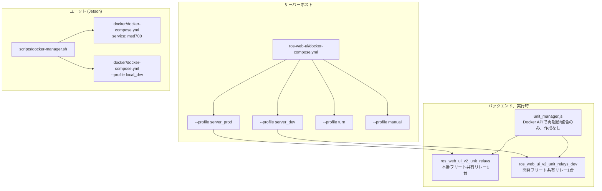
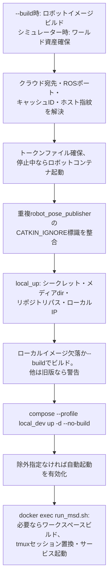

# Dockerリファレンス

<RoleBadge role="technician" />

MSD700のDockerコマンド・フラグ・compose構造とその意味です。セットアップページが参照するリファレンスです。手順の順序は[サーバー構築](/ja/setup/server-setup)と[ユニット構築](/ja/setup/unit-setup)に、フラグや構造の説明が必要ならここに来ます。

## どのcomposeファイルか?

3ファイル・3つの異なる役割です。互換性はありません。

| ファイル | 実行場所 | 起動内容 |
| --- | --- | --- |
| `ros-web-ui/docker-compose.yml` | **サーバー** | クラウド全体:MySQL、HiveMQ、バックエンド+rosbridge、メディア、シグナリング、ダッシュボード、coturn |
| `msd700_noetic/docker/docker-compose.yml` | **ユニット** | `msd700`ロボットコンテナ+ユニット独自の`local_dev`サーバースタック |
| `ros-web-ui/docker-compose.robot.yml` | 開発PC | ロボット半分のみ単独、ユニット管理なし |



## サーバー: composeプロファイル

Composeは宣言プロファイルの**いずれか**が有効だとサービスを実行します。プロファイルなしでは何も起動しません。このリポジトリでの素の`docker compose up -d`は無意味です。

| プロファイル | サービス | 用途 |
| --- | --- | --- |
| `server_prod` | `db`、`hivemq`、`fix_perms_prod`、`nakayama_cloud`、`unit_relays`、`nakayama_media`、`nakayama_signalling`、`frontend_prod`、`coturn` | 本番デプロイ |
| `server_dev` | `db_dev`、`hivemq_dev`、`fix_perms_dev`、`nakayama_cloud_dev`、`unit_relays_dev`、`nakayama_media_dev`、`nakayama_signalling_dev`、`frontend_dev` | 並行スタック:ポート別、DB別 |
| `turn` | `coturn`のみ | 本番の他に触れずリレーのみ |
| `manual` | `dev`、`aws`、`hive`、`hive_serverless`、`nakayama_msd`、`nakayama_msd_sim` | 対話シェル+レガシーサービス。1つ明示選択。全体起動禁止 |

::: warning `coturn`の2プロファイル所属は意図的です
`profiles: ["server_prod", "turn"]`により本番`up`でリレー同伴、**かつ**`--profile turn`で単独起動できます。`server_dev`には**属しません**:リレーは1インスタンスで本番の物です。共有は安全です。リレーは無状態で、相手探索は分離されたシグナリングサーバー(本番3001、開発4001)経由だからです。
:::

### サービス・ポート表

| サービス | コンテナ | ネットワーク | ホストポート | 備考 |
| --- | --- | --- | --- | --- |
| `db` / `db_dev` | `ros_web_ui_v2_db[_dev]` | bridge | `3307` / `3308` | ヘルスチェック付き。バックエンドは待機します |
| `hivemq` / `hivemq_dev` | `ros_web_ui_v2_hivemq[_dev]` | bridge | `8883` / `8884` | コンテナ内は両方`8883` |
| `nakayama_cloud[_dev]` | `ros_web_ui_v2_nakayama_ros[_dev]` | **host** | `5000`/`5001` API、`9090`/`9091` rosbridge、`11311`/`11312` ROSマスター | 環境ごとに共有ROSグラフ1つ |
| `unit_relays[_dev]` | `ros_web_ui_v2_unit_relays[_dev]` | **host** | なし(リレー) | フリート共有データプレーン1つ(デフォルト) |
| `nakayama_media[_dev]` | `ros_web_ui_v2_nakayama_media[_dev]` | **host** | `3003` / `4003` | |
| `nakayama_signalling[_dev]` | `ros_web_ui_v2_nakayama_signalling[_dev]` | **host** | `3001`/`4001` WS、`3002`/`4002` HTTP | |
| `frontend_prod` / `frontend_dev` | `ros_web_ui_v2_frontend[_dev]` | bridge | `3000` / `3100` | Apacheキャッチオールは`3000`向き |
| `coturn` | `ros_web_ui_v2_coturn` | **host** | `3478`+リレー範囲 | 本番のみ |

## Composeコマンドリファレンス

### サービスの起動

```bash
# 通常: プロファイル全体をデタッチ起動
docker compose --profile server_prod up -d

# 先にイメージビルド後起動 (コード変更のpull後に必要)
docker compose --profile server_prod up -d --build

# プロファイル内の1サービス
docker compose --profile server_prod up -d nakayama_cloud

# リレーのみ、本番の他に触れません
docker compose --profile turn up -d coturn
```

| フラグ | 効果 | 使用場面 |
| --- | --- | --- |
| `--profile <name>` | プロファイル有効化(複数可) | スタック全体。サービス指定も有効化します |
| `-d` | ログ流しでなくシェルに戻る | 起動失敗デバッグ時以外は常時 |
| `--build` | 起動前にイメージビルド | アプリソース・依存・Dockerfile変更後(サーバーサービスは`source/`をバインドマウントしません) |
| `--force-recreate` | 無変更でも再作成 | 限定的な復旧。プロジェクト全体破棄より優先 |
| `--no-deps` | `depends_on`連鎖なしで起動 | 依存を意図的に落としたデバッグ |
| `--remove-orphans` | 削除済みサービスのコンテナを削除 | サービス改名/削除後 |
| `--pull always` | `up`前にイメージpull | イメージタグ更新用(pinned版やDockerfileベースは`build --pull`) |

### ビルド

```bash
docker compose --profile server_prod build          # プロファイル内全サービス
docker compose build nakayama_cloud                 # 1サービス
docker compose build --no-cache nakayama_cloud      # キャッシュ層を無視
docker compose build --progress plain nakayama_cloud # 全出力
```

`--no-cache`は「成功」するのに内容が古いビルド用(キャッシュ`COPY` / `apt-get`層)。低速のため、通常ビルドで反映しない場合のみ使います。

### 状態確認

```bash
docker compose ps                        # 当プロジェクトのサービス+ヘルス
docker compose ps -a                     # 停止中を含む
docker compose logs -f nakayama_cloud    # 1サービス追跡
docker compose logs --tail=200 hivemq    # 直近200行
docker compose logs --since=10m          # 直近10分
docker compose exec nakayama_cloud bash  # 稼働中コンテナにシェル
docker compose --profile server_dev config --quiet    # ダンプなし検証
docker compose --profile server_dev config --services # サービス名一覧
```

`compose run`はイメージでなく**サービス名**を取ります。`busybox`というサービスはありません。

::: warning 診断での秘密保護
素の`config`、`config --environment`、完全`inspect`、ログに認証情報が入る場合があります。チケットやチャットに貼らないでください。必要箇所のみ確認し、パスワード・トークン・認証ヘッダーを伏せます。
:::

### 停止と削除

```bash
docker compose --profile server_prod stop   # 停止、コンテナ保持
docker compose --profile server_prod down   # 停止かつコンテナ+ネットワーク削除
docker compose down --remove-orphans        # 削除済みサービスのコンテナも削除
docker compose down -v                      # 名前付きボリュームも削除
```

::: danger `down -v`はHiveMQデータを削除します
`ros_webui_hivemq_data_prod`は保持メッセージ・クライアントセッション・QoS>0キューを持ちます。ここではほぼ使いません。ブローカー掃除は当該ボリューム1つを名前指定で意図的に削除します。
:::

## 本プロジェクトのcompose構造

以下の各構造は、外すと実際に壊れたため存在します。

### YAMLアンカー (`x-common-env`、`<<: *`)

```yaml
x-common-env: &common-env
  ROS_DISTRO: "noetic"
  MAPS_FOLDER: "${MAPS_FOLDER:-/home/ubuntu/ros_maps}"

x-common-env-prod: &common-env-prod
  <<: *common-env          # 継承して上書き
  PORT_SQL: "${MYSQL_PORT_PROD:-3307}"
```

`&name`が定義、`*name`が参照、`<<:`が結合です。`${VAR:-default}`の意味: `VAR`が設定済み非空なら使用、なければデフォルトです。

### `network_mode: host`

ROS搭載の全サービスと`coturn`が使用します。コンテナはホストのネットワークを共有します:ポートマッピングなし、NATなし、内部`localhost`はホストです。

| サービス | hostネットワークの理由 |
| --- | --- |
| `nakayama_*` | ROS 1ノード同士がランダムポートを交渉します。ブリッジではマスター返却URIが壊れます。 |
| `coturn` | リレーは割当ごとに1ポート払い出します。16kポート範囲のブリッジ公開はポート毎`docker-proxy`を生み、マシンを落とします。ブリッジはNATを二重化し、TURNサーバーが広告すべきアドレスも壊します。 |

### `depends_on`条件

```yaml
depends_on:
  db:
    condition: service_healthy
  fix_perms_prod:
    condition: service_completed_successfully
```

| 条件 | 意味 |
| --- | --- |
| `service_started` | デフォルト。コンテナ存在待ちのみ。ほぼ不十分。 |
| `service_healthy` | `healthcheck`通過待ち。バックエンドのMySQL先走り(`Connection lost`)を防ぎます。 |
| `service_completed_successfully` | ワンショットのexit `0`待ち。権限修正用。 |

### ワンショット権限修正

```yaml
fix_perms_prod:
  image: busybox
  profiles: ["server_prod"]
  network_mode: "none"
  user: root
  volumes:
    - /srv/msd/media/map:/srv/msd/media/map
  command: >
    sh -c "mkdir -p ... && chown -R $$USER_UID:$$USER_GID ..."
```

存在しないバインドマウントフォルダは**Dockerデーモンがrootで**自動作成します。アプリコンテナは非特権のため最初の書込が失敗します。このrootコンテナが先に所有者を直し、新規ホストが自己修復します。

::: warning `network_mode: "none"`は構造上必須です
これがないとComposeはサービスをプロジェクト既定ネットワークに付け、**ID**で記録します。`down`でネットワーク再作成後(2チェックアウトはプロジェクト名`ros-web-ui`共有のため、どちらでも発火)、修正器は二度と起動しません(`network <old-id> not found`)。`service_completed_successfully`配下の全サービスが起動拒否します。mkdirとchownのみであり、ネットワークは元々不要です。
:::

### `user:`と`group_add:`

```yaml
user: "itbdelabo"
group_add:
  - "${DOCKER_GID:-998}"
```

`group_add`はコンテナユーザーをホスト`docker`グループに入れ、マウント済み`/var/run/docker.sock`を`backend_node`が使えるようにします。フリートモードは共有リレーを名簿に追従させ、レガシーはユニット単位コンテナを管理します。値はホストの`getent group docker | cut -d: -f3`で取得します。

HiveMQは代わりに`user: "1001:0"`を使い、両方に意味があります:uid `1001`が`0600`キーストアの所有者(コンテナが*そのユーザー*でないと鍵を読めません)。gid `0`はイメージの`/opt/hivemq`書込チェックをchownなしで満たします。

### ロング形式バインドマウント

```yaml
- type: bind
  source: ${HIVEMQ_KEYSTORE:-/srv/msd/secrets/hivemq/keystore.p12}
  target: /opt/hivemq/conf/keystore.p12
  read_only: true
  bind:
    create_host_path: false
```

ロング形式は`create_host_path: false`のためだけにあります。Docker既定は欠落バインド元を**作成**し、単一ファイルには**ディレクトリ**を作ります。欠落キーストアは`up`時の「ホストにファイルなし」でなく、HiveMQ起動深部の鍵読込エラーになります。`up`で失敗する方が正直な結果です。

### 名前付きボリュームとバインドマウント

| パス | 種類 | 理由 |
| --- | --- | --- |
| `./mysql_data/prod` | bind | リポジトリ内にあり共にバックアップ |
| `hivemq_data_prod`、`hivemq_log_prod` | 名前付きボリューム | Docker所有、初回はイメージからseed、`$HOME`下`rm -rf`でも残存 |
| `./Docker/hivemq/config.xml` | bind、`:ro` | 設定はgitの物 |
| `/srv/msd/secrets/...` | bind、`:ro` | シークレットはイメージに入れません |

::: danger バインドマウントはイメージ内フォルダを隠します
設定フォルダ上の空ホストフォルダは劣化サービスではなく起動不能サービスです(`config.xml does not exist`)。ホストがブローカー起動に必要な物を持たないのはそのためです。
:::

### ヘルスチェック

```yaml
healthcheck:
  test: ["CMD", "bash", "-c", "exec 3<>/dev/tcp/127.0.0.1/8080"]
  interval: 30s
  timeout: 5s
  retries: 3
  start_period: 60s
```

真似すべき2点です。HiveMQの**Control Center**ポート(8080)を叩き、MQTTではありません:MQTTポートへの素TCPプローブは`CONNECT`前に閉じ、HiveMQは毎回`disconnected ungracefully`を記録します(監査ログに約2880行/日)。同一JVMのため8080は十分な生存信号です。

`bash`明記はそのイメージの`/bin/sh`が`/dev/tcp`なし`dash`で、全プローブ失敗するためです。

### ログローテーション

```yaml
logging:
  driver: json-file
  options:
    max-size: "20m"
    max-file: "3"
```

**サーバー**ファイルでは`coturn`のみ設定します(割当を冗長ログするため)。他サーバーサービスはデーモン既定です。変更は触れた全サービス再作成のため、ついででなく意図的に行います。**ユニット**ファイルは異なり、全サービスが`x-local-logging`アンカーで20 MB×3に制限されます。

### イメージタグ

| タグ | 使用者 |
| --- | --- |
| `ros-noetic-webui-app-v2:latest` | 本番サービス(フリートリレー含む)+レガシー本番ユニット単位コンテナ |
| `ros-noetic-webui-app-v2:dev` | 開発サービス(開発フリートリレー含む)+レガシー開発ユニット単位コンテナ |
| `ros-dashboard-next-v2:prod` / `:dev` | 2つのダッシュボードビルド |
| `ros-noetic-webui-app-local:latest` | ユニット自前のバックエンド・メディア・シグナリング・ネットワークエージェント |
| `ros-dashboard-next-local:latest` | ユニット自前のダッシュボード |
| `msd700:latest` / `msd700-simulator:latest` | ロボットコンテナ |

::: warning 本番と開発でタグ共有禁止
両プロファイルが昔`:latest`をビルドしました。開発ビルドが次回再作成時の本番実行物を黙って変えました。タグは分離済みで、`UNIT_IMAGE`はプロファイル別に設定され、レガシー開発コンテナは開発コードを実行します。
:::

## coturn: 本番専用サービス

### 設定

ホスト別値は設定ファイルでなく**フラグ**で渡します:coturnは設定内の環境変数を展開しません。フラグがファイルに勝つため、共有ポリシーはgitに、アドレスは`.env`に残ります。

```bash
# ros-web-ui/.env
TURN_LISTENING_IP=192.168.100.10     # 当ホスト自身のLANアドレス
TURN_EXTERNAL_IP=118.22.31.252       # インターネットから見える公開アドレス
TURN_USER=msd700
TURN_PASSWORD=<長いランダム文字列>
TURN_MIN_PORT=49152                  # 任意、coturn既定
TURN_MAX_PORT=65535                  # 任意
```

最初の4値は**コンテナ起動時**に検査され、Compose `${VAR:?}`構文ではありません。Composeはプロファイルに関わらず全サービスを展開するため、ここでの必須変数は誰も求めていないリレーのせいで`--profile server_dev up`を壊します。

::: warning `TURN_EXTERNAL_IP`は黙って映像を壊します
これがないとcoturnはプライベートアドレスを広告します。LAN外の全ブラウザが到達不能アドレスを試し、カメラ映像は出ず、ダッシュボードエラーもありません。
:::

### 実行

```bash
# 本番: スタックと共に起動
docker compose --profile server_prod up -d

# リレーのみ (再起動、またはスタック合流前の起動)
docker compose --profile turn up -d coturn

# 割当の監視 (標準出力への冗長ログ)
docker compose logs -f coturn

# リレーのみ停止
docker compose --profile turn stop coturn
```

### 開発スタックとリレー

`server_dev`は`coturn`除外が正解です。開発相手にWebRTCテスト?開発シグナリングサーバー(`4001`)は相手に**本番**リレーアドレスを渡します。1リレー・共有・無状態が望ましい形です。

本番リレー停止中でリレーが必要なら明示起動します:

```bash
docker compose --profile turn up -d coturn
```

### apt/systemd版coturnからの移行

ホストがまだsystemd下でcoturn運用なら順序が一度だけ重要です。ポート3478は1保持者のみです。

```bash
sudo systemctl disable --now coturn                 # 1. ポート解放
docker compose --profile turn up -d coturn          # 2. コンテナ動作の証明
docker compose logs -f coturn                       # 3. 待受の確認
docker compose --profile server_prod up -d          # 4. 以降は単なる本番サービス
```

systemd保持中の本番`up`はバインド失敗し、`restart: always`が永久リトライします。騒がしく無害で、原因から遠い状態です。

## ユニット: `docker-manager.sh`

ユニットは`docker compose`を直接呼びません。`scripts/docker-manager.sh`が包み、共有値を**一度だけ**決めて両半分(ロボットコンテナ+ユニットサーバースタック)に渡し、不一致を防ぎます。

### コマンド

| コマンド | 内容 |
| --- | --- | --- |
| `up` | ロボットコンテナ**と**`local_dev`スタックを起動し、内部で`run_msd.sh`実行。再起動用`msd700.service`を導入/有効化 |
| `down` / `stop` | ロボットコンテナ+ローカルスタックを停止削除し`msd700.service`無効化 |
| `build` | ロボットイメージ+ローカルスタックイメージをビルドしMySQL/Mosquittoをpull。次回`up`はネット不要に |
| `build-clean` | 同上、Docker層キャッシュなし |
| `shell` | 稼働中コンテナへのbashログインシェル(必要なら起動) |
| `logs` | ロボットコンテナのログ追跡 |
| `status` | ロボットコンテナの`docker compose ps` |
| `local-up` | ローカルサーバースタックのみ、ロボットbringupなし |
| `local-down` | ローカルサーバースタックのみ停止 |
| `local-build` | ローカルスタックイメージをリビルド |
| `local-logs` | ローカルスタックのログ末尾 |
| `local-status` | ローカルスタックの`docker compose ps` |
| `reenroll` | ユニットデータを退避しキャッシュIDを消去。次回`up`でクレームコード表示。コンソールにユニット残存なら管理者**Unbind**優先 |
| `print-autostart-unit` | レンダー済み`msd700.service`表示。`up`がsudoできない導入用 |
| `help` | フラグ+環境の完全ヘルプ |

### フラグ

| フラグ | 対象 | 効果 |
| --- | --- | --- |
| `--simulator`、`-s` | `build`、`up` | Gazeboイメージ(`msd700-simulator:latest`)+コンテナ。`run_msd.sh`にも転送され`use_simulator_val:=true`を設定 |
| `--dev` | `up` | 相手クラウド:本番でなく開発スタック。MQTT 8884、このロボットのROSマスター11322、開発バックエンド登録 |
| `--build` | `up` | ロボット/ローカルイメージ+コンテナ内catkinワークスペースをリビルド。稼働中ロボットは再作成まで旧イメージ保持 |
| `--no-autostart` | `up`、`down` | `msd700.service`不変維持(`up`は起動時自動起動を有効化、`down`は無効化) |
| `-d` | `up`のみ | 全稼働後に端末を返す |
| `--debug` | 転送 | `run_msd.sh`冗長出力。**フル入力**:ここの`-d`はデタッチ意味 |
| `--dry-run` | 転送 | 安全な事前確認ではありません:コンテナ起動・ホスト状態変更・セッションkill・登録接続の可能性あり |
| `--kill` | 転送 | コンテナ内tmuxセッションkill |
| `--local` | 受理、無視 | 非推奨。ローカルスタックはどちらにせよ起動 |
| `--unit_id` | **拒否** | 意図的削除。IDはクラウド管理コンソール由来 |

::: info `-d`が変える物(変えない物)
起動は**フォアグラウンド**のままです:イメージビルド・クレームコード・失敗は全て表示され、サービス稼働前のCtrl-Cは中断して半起動スタックを片付けます。変わるのは最後だけです。全稼働後にコマンドが戻り、端末を閉じてもロボットは止まりません。systemdユニットや`ssh`ワンライナー用の形です。
:::

::: danger `--unit_id`は無視でなく拒否です
説明付きでエラーになります。キャッシュIDなしロボットは自己登録してクレームコード表示し、管理者がクラウドコンソールで**登録**(新規)か既存ULIDへ**引継ぎ**(ハード交換、キャッシュ喪失)します。両方ともその瞬間のインターネットが必要です。以降`Certificates/robot/device.json`は毎回自動読込されます。
:::

### 転送する環境変数

| 変数 | 既定 | 用途 |
| --- | --- | --- |
| `DEVICE_FINGERPRINT` | **ホスト**由来 | Jetsonシリアル(またはmachine-id/先頭実MAC)+機種のsha256。ホストで読むため再ビルドコンテナが新規保留ユニットに見えません |
| `ENROLL_SERVER_URL` | 導出 | 登録エンドポイントの直接上書き |
| `ENROLL_BOOTSTRAP_KEY` | 未設定 | 共有イメージ鍵。コンソールの信頼標識であり関門ではありません |
| `ENROLL_CODE` | 未設定 | 使い切り登録バウチャー、保留プールを省略 |
| `DEV_SERVER_HOST` | `118.22.31.252` | `--dev`の宛先(当ホスト実行時は`localhost`) |
| `DEV_BACKEND_PORT` | `5001` | `--dev`のバックエンドポート |
| `CLOUD_BASE_URL` | 導出 | コード変更なしでフリート全体を別クラウドに向けます |
| `ROS_MASTER_PORT` | `--dev`で`11322`、他は`11321` | コンテナ**と**`backend_local`の両方へ。クラウドの`11311`/`11312`決して不可 |
| `BACKEND_PORT_LOCAL` | `5002` | ローカルダッシュボードのバックエンドポート。`camera_client`はここでユニットローカルトークン取得 |

`CLOUD_BASE_URL`と`ROS_MASTER_PORT`は一度解決して両半分に渡します。昔は両側で独立導出され、`--dev`破損の原因でした:`run_msd.sh`がマスターを移動したのに`backend_local`が旧ポートを聞きました。登録も`run_msd.sh`内で同原則です:1つの`ENROLL_BASE_URL`が起動時ID解決と6時間トークン更新の両方に使われます(昔は乖離し毎更新`401 reenroll`失敗しました)。

### `up`の動作順



`--build`なしでは既存ローカルイメージ再利用で旧版は警告のみ(`[WARN] ... is OUT OF DATE`)です。欠落イメージ・シミュレーター資産・初回登録はネットが必要な場合があります。意図的リビルド(`build`・`local-build`・`up --build`)を使います。`build-clean`はキャッシュ無効です。稼働中ロボットは`up`で再作成されません。ビルド後も同`--dev`/`--simulator`フラグでの計画停止時に再作成します。

無言失敗由来の3ステップ:

- **トークンファイル優先。** 4サービスが`Certificates/robot/token.cred`をバインドマウントします。未登録ロボットでDockerはroot所有の空**ディレクトリ**をそこに作り、`enroll.py`は得たトークンを書けず、毎起動再登録します。
- **更新器はIDを消しません。** `401 reenroll`時はログ記録して停止し`device.json`保持します。消去は実起動時のみです。更新失敗での削除は、ほぼ毎再起動の完全再承認を強制しました。
- **旧版検出。** ローカルWebイメージはソースを**COPY**します(バインドマウントなし)。ソースmtimeとイメージビルド時刻の比較で、先週バックエンド提供に気付けます(典型「ソースにある新エンドポイント404」)。

## ユニット: `run_msd.sh`

ロボットコンテナ**内部**で実行し、全ROSサービスをtmuxセッション(`robot_services`)に起動します。通常`docker-manager.sh`駆動ですが、`docker-manager.sh shell`から直接呼べます。

| フラグ | 効果 |
| --- | --- |
| `-s`、`--simulator` | ハードでなくGazebo |
| `--dev` | 全開発:MQTT 8884、このロボットのROSマスター11322、開発シグナリング+登録。ユニット**自前**サービスポートは不動 |
| `-d`、`--debug` | 冗長出力 |
| `-n`、`--dry-run` | 読み取り専用ではありません:一部起動/ビルド省略も設定実行・tmuxセッションkill・登録接続の可能性あり |
| `-k`、`--kill` | tmuxセッションkill後終了 |
| `--detach` | 全起動・状態表示・終了。ロング形式のみ |
| `--unit_id <ULID>` | ID明示固定。復旧用上書き |
| `--camera_device <path>` | カメラデバイスパス/番号の上書き |
| `--build` / `--no-build` | catkinビルド強制/省略。既定は`devel/setup.bash`欠落時のみビルド |

| 環境 | 既定 | 用途 |
| --- | --- | --- |
| `SERVICE_HOST` | `localhost` | このロボットのサーバー側サービス所在地 |
| `ROS_LOG_CAP_MB` | `512` | ROS 1が回さない`~/.ros/log`の上限 |
| `ROS_LOG_SWEEP_SECONDS` | `60` | janitor確認間隔 |

これらは**内部ランチャー**設定です。ラッパーは`docker exec`経由で転送しません。ホストexportや`docker/.env`追記は内部ランチャーに届きません。ログ体系と上限は[メンテナンス](/ja/setup/maintenance#ログの管理)。

`robot_services`のtmuxウィンドウ: `roscore`、`ros_webui`、`camera_client`、`switch_mode`、`log_janitor`に加え`token_refresh`(`token.cred`を6時間毎更新)と`enrol_collect`(再登録の管理承認待ち中のみ)。

```bash
docker exec -it msd700 tmux attach -t robot_services   # 接続
# Ctrl-b後にdで停止せず切断
docker exec -it msd700 tmux list-windows -t robot_services
```

::: danger `--detach`は`docker-compose.robot.yml`に誤りです
そこでは`run_msd.sh`が**コンテナ主コマンド**のため、復帰はコンテナ停止とtmuxサーバー停止を意味します。当該経路はcomposeレベルで既にデタッチ済みです。フォアグラウンドループがコンテナを生かします。
:::

## ユニット自前スタック (`local_dev`プロファイル)

| サービス | コンテナ | ポート | バインド先 |
| --- | --- | --- | --- |
| `db_local` | `msd700_db_local` | `3306` | `127.0.0.1` |
| `mosquitto_local` | `msd700_mosquitto_local` | `1883` MQTT、`9001` WebSocket | MQTT: `127.0.0.1`、WebSocket: 全インターフェース |
| `backend_local` | `msd700_backend_local` | `5002` API、`9090` rosbridge | 全インターフェース |
| `media_local` | `msd700_media_local` | `3003` | 全インターフェース |
| `signalling_local` | `msd700_signalling_local` | `3001` WS、`3002` HTTP | 全インターフェース |
| `frontend_local` | `msd700_frontend_local` | `3000` | 全インターフェース |
| `network_local` | `msd700_network_local` | `5011` ネットワークAPI | ループバック。バックエンドがプロキシ |

既定値であり自ホストの実測ではありません。全サービス`network_mode: host`のため**Dockerは何も公開しません**。ユニットファイアウォールがアクセス制御します。ブラウザ向け既定:`3000`、`5002`、`9090`、`3003`、`3001`、`3002`、`9001`。MySQL `3306`・素MQTT `1883`・ネットワークエージェント`5011`はユニット内部用です。MQTT WebSocketリスナーはチェックイン設定で匿名可です。信頼できるオペレーターネットワークに留め、公共インターネット禁止です。

設定は`msd700_noetic/docker/.env`(初回自動生成)にあります。要確認キー:

```bash
MAPS_FOLDER_LOCAL=/home/ubuntu/ros_maps
#LOCAL_IP=192.168.4.1     # コメントのまま毎回自動検出
WITH_SIMULATOR=false      # Gazeboスタックをイメージ追加。1GB超消費
USER_UID=                 # 空= `id -u`検出 (Jetson 2002、PC 1000)
USER_GID=
```

::: info `LOCAL_IP`はバンドル形成しません
ダッシュボードJSはページを開いたブラウザのアドレスを**ホスト**にします。ビルド由来は**ポート**のみです。IP・ホスト名・mDNS(`msd700.local`)・`localhost` SSHトンネル全て動作します。`LOCAL_IP`は表示URLヒントとDHCPレス予備のみに残ります。
:::

## フリートリレー (デフォルト)とユニット単位コンテナ (レガシー)

各ロボットのクラウドデータプレーンは共有コンテナ1台で動作します。本番`ros_web_ui_v2_unit_relays`・開発`..._dev`です。バックエンドのROSマスターとrosbridgeを共有します。環境ごとにROSグラフ1つです。フリート用`mqtt_client` nodelet/TLS接続1つと複数ユニットトピックリレーを持ちます。起動コマンドはDB名簿(または`MULTI_UNIT_LIST`上書き)からブリッジ表を生成します。空名簿やDB到達不能では待機再試行します。ロボット追加でユニット単位コンテナは生まれません。

`UNIT_CONTAINERS_ENABLED`既定`false`のためデフォルトです。`unit_manager.js`は**フリートモード**で動作し、ユニット利用を追跡して単一リレーを名簿に追従させ、ユニット単位生成はしません。

```bash
docker ps --filter "name=unit_relays"       # 共有フリートリレー
docker logs -f ros_web_ui_v2_unit_relays    # フリート全体のMQTT/ROSブリッジ
docker restart ros_web_ui_v2_unit_relays    # 名簿変更の取込
```

::: warning フリートリレーとユニット単位コンテナの併用禁止
同MQTTトピック上の2ブリッジは全ゴール・結果を二重配送し、ウェイポイントACKループを二重進行させます(ウェイポイント飛ばしに見えます)。リレーはユニット単位`cloud_mqtt_client`ノード登録中は起動拒否し、`unit_manager.js`はフリートモードの迷子`rosweb_unit_*`を記録します( kill しません)。
:::

### レガシー: ユニット単位コンテナ

バックエンドプロセス環境の`UNIT_CONTAINERS_ENABLED=true`でロボット毎リレーコンテナ1台に戻ります:本番`rosweb_unit_<ULID>_nakayama`・開発`..._nakayama_dev`で、オンデマンド作成・アイドル30分後回収(Autopilotはpin)です。チェックインComposeファイルは当該変数を転送しないため、`.env`編集だけでは有効化しません。デプロイ設定で明示転送し、当該環境のフリートリレーを除外します。次回プロファイル`up`でリレーが再起動します。これら動的コンテナを表すComposeサービスはありません。

```bash
docker ps --filter "name=rosweb_unit_"           # ユニット単位ブリッジ (レガシーのみ)
docker logs -f rosweb_unit_<ULID>_nakayama       # 1台のリレー
docker stop rosweb_unit_<ULID>_nakayama          # 停止。次回利用時にバックエンドが再起動
```

フリートモード:`unit_manager.init()`はバックエンド起動時に既存共有リレーを再起動し、新マスターにノード登録させます。60秒名簿ポーリングも名簿変更時に再起動します。欠落リレーをマネージャーが作ることはありません。作成はComposeのみです。リレー再起動毎に全ユニットのクラウドデータプレーンが一瞬切れます。

レガシーモード:`adoptExisting()`は稼働中コンテナをライフサイクル管理に引継ぎますが、ROSノード再起動はしません。マスター置換時は登録を確認し、当該環境の影響コンテナのみ復旧します。開発と本番に跨る無限定`rosweb_unit_*`一括再起動は禁止です。

## Docker自体のトラブル対処

| 症状 | 原因 | 対処 |
| --- | --- | --- |
| `permission denied ... /var/run/docker.sock` | ユーザーがまだ`docker`グループ外 | `sudo usermod -aG docker $USER`後ログアウト/イン(このシェルは`newgrp docker`) |
| 起動時`network <id> not found` | コンテナが再作成済みネットワークを記録 | `docker compose down --remove-orphans`後`up` |
| `port is already allocated` | 他プロセスが保持(systemdサービスや他プロファイル) | `sudo ss -lptn 'sport = :3478'`で特定 |
| `up`直後バックエンド`Connection lost` | MySQLヘルスチェック前に起動 | 再試行します。DB `healthy`後に`docker compose up -d <backend>` |
| ビルド成功だが変更欠落 | キャッシュ層 | `docker compose build --no-cache <service>` |
| ディスク逼迫 | 旧イメージ+ビルドキャッシュ | `docker system df`、`docker image prune -a`、`docker builder prune` |
| `the input device is not a TTY` | TTYなし`docker exec -t` | スクリプトでは想定内。`docker-manager.sh`はstdin非TTYで`-t`を外します |

## 関連

- [サーバー構築](/ja/setup/server-setup)
- [ユニット構築](/ja/setup/unit-setup)
- [メンテナンス](/ja/setup/maintenance)
- [トラブル対処](/ja/setup/troubleshooting)
