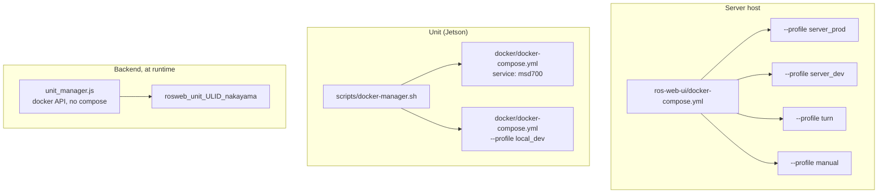
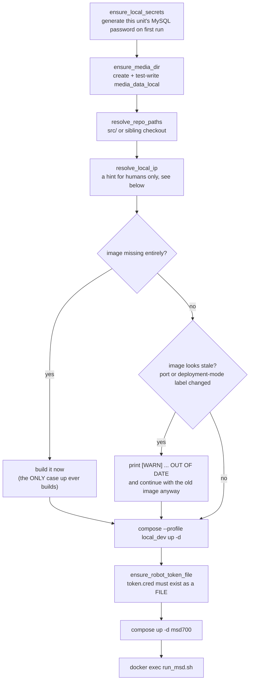

# Docker コマンドリファレンス

<RoleBadge role="technician" />

MSD700 で使用されているすべての Docker コマンド、フラグ、compose の構文と、それぞれが実際に何を
行っているか。このページは、セットアップページからリンクされているリファレンスです。順序立った
手順については [サーバーセットアップ](/ja/setup/server-setup) と [ユニットセットアップ](/ja/setup/unit-setup)
を読み、なぜそのフラグがそこにあるのか、外すと何が起きるのかを知りたいときにここへ戻ってきてください。

## 今見ている compose ファイルはどれか

compose ファイルは 3 つあり、それらは互いのバリエーションではありません。それぞれ異なるマシンを
記述しています。

| ファイル | 実行先 | 起動するもの |
| --- | --- | --- |
| `ros-web-ui/docker-compose.yml` | **サーバー** | クラウドスタック全体: MySQL、HiveMQ、バックエンド + rosbridge、メディア、signalling、ダッシュボード、coturn |
| `msd700_noetic/docker/docker-compose.yml` | **ユニット** | `msd700` ロボットコンテナ、およびユニット自身の `local_dev` サーバースタック |
| `ros-web-ui/docker-compose.robot.yml` | 開発用ラップトップ | ロボット側のみ単独、ユニットオーケストレーションなし |



## サーバー: compose プロファイル

Compose は、宣言されたプロファイルの**いずれか**がアクティブなときにサービスを実行します。プロファ
イルなしでは何も起動しないため、このリポジトリで素の `docker compose up -d` を実行しても何も役に立
ちません。

| プロファイル | サービス | 目的 |
| --- | --- | --- |
| `server_prod` | `db`、`hivemq`、`fix_perms_prod`、`nakayama_cloud`、`nakayama_media`、`nakayama_signalling`、`frontend_prod`、`coturn` | 本番デプロイ |
| `server_dev` | `db_dev`、`hivemq_dev`、`fix_perms_dev`、`nakayama_cloud_dev`、`nakayama_media_dev`、`nakayama_signalling_dev`、`frontend_dev` | 異なるポートと異なるデータベースを持つ、完全に並行するスタック |
| `turn` | `coturn` のみ | 本番の他の部分に触れずに、リレー単体を起動または再起動する |
| `manual` | `dev`、`aws`、`hive`、`hive_serverless`、`nakayama_msd`、`nakayama_msd_sim` | レガシーなクラウド専用ロボット側サービス。通常のデプロイの一部ではない |

::: warning `coturn` は意図的に 2 つのプロファイルに属している
`profiles: ["server_prod", "turn"]` は、通常の本番 `up` がリレーも一緒に起動することを意味し、
**かつ** `--profile turn` で単独でも起動できることを意味します。これは意図的に `server_dev` には
**含まれていません**。リレーのインスタンスは 1 つだけであり、それは本番に属します。開発スタックの
起動が本番インフラを起動してしまってはいけません。共有が安全なのは、リレーが状態を持たず誰もペアリ
ングしないためです。ピア同士は signalling サーバー経由でお互いを見つけますが、こちらは実際に分離さ
れています(本番 3001、開発 4001)。
:::

### サービスとポートの対応表

| サービス | コンテナ | ネットワーク | ホストポート | 備考 |
| --- | --- | --- | --- | --- |
| `db` / `db_dev` | `ros_web_ui_v2_db[_dev]` | bridge | `3307` / `3308` | ヘルスチェックあり。バックエンドはこれを待つ |
| `hivemq` / `hivemq_dev` | `ros_web_ui_v2_hivemq[_dev]` | bridge | `8883` / `8884` | コンテナ内部のポートはどちらも `8883` |
| `nakayama_cloud[_dev]` | `ros_web_ui_v2_nakayama_ros[_dev]` | **host** | API `5000` / `5001`、rosbridge `9090` / `9091` | `unit_manager` もここでホストされる |
| `nakayama_media[_dev]` | `ros_web_ui_v2_nakayama_media[_dev]` | **host** | `3003` / `4003` | |
| `nakayama_signalling[_dev]` | `ros_web_ui_v2_nakayama_signalling[_dev]` | **host** | WS `3001` / `4001`、HTTP `3002` / `4002` | |
| `frontend_prod` / `frontend_dev` | `ros_web_ui_v2_frontend[_dev]` | bridge | `3000` / `3100` | Apache のキャッチオールは `3000` を指す |
| `coturn` | `ros_web_ui_v2_coturn` | **host** | `3478` + リレー範囲 | 本番のみ |

## Compose コマンドリファレンス

### サービスを起動する

```bash
# The normal case: start (or restart into) an entire profile, detached.
docker compose --profile server_prod up -d

# Rebuild the images first, then start. Needed after pulling code that changes a dependency.
docker compose --profile server_prod up -d --build

# Start ONE service without starting the rest of its profile.
docker compose up -d nakayama_cloud

# Start the relay alone, without touching anything else in prod.
docker compose --profile turn up -d coturn
```

| フラグ | 効果 | 実際に必要になる場面 |
| --- | --- | --- |
| `--profile <name>` | プロファイルを有効化する。繰り返し指定可能。 | このリポジトリでは常に |
| `-d`, `--detach` | ログをストリーミングせずシェルに戻る | 起動失敗をデバッグするとき以外は常に |
| `--build` | 起動前にイメージを再ビルドする | 依存関係や Dockerfile の変更後 |
| `--force-recreate` | 設定とイメージに変更がなくてもコンテナを再作成する | まれ。詰まったコンテナは通常 `down` してから `up` する方がよい |
| `--no-deps` | `depends_on` の連鎖なしで指定サービスを起動する | 依存先が意図的に停止しているサービスをデバッグするとき |
| `--remove-orphans` | ファイルにもう存在しないサービスのコンテナを削除する | サービスの名前変更や削除の後 |
| `--pull always` | ベースイメージを再取得する | 新しい上流の `mysql:8.0` や `hivemq4` のパッチを取り込むとき |

### ビルドする

```bash
docker compose --profile server_prod build          # all services in the profile
docker compose build nakayama_cloud                 # one service
docker compose build --no-cache nakayama_cloud      # ignore every cached layer
docker compose build --progress plain nakayama_cloud # full build output, not the collapsed view
```

`--no-cache` は、ビルドが「成功」したのに内容が古いままという場合の答えです。Docker が `COPY` や
`RUN apt-get` のレイヤーをキャッシュしてしまい、その入力の変化を検知できていないのです。これは低速
なので、通常のビルドで既に何かを取りこぼしたときにのみ使ってください。

### 調査する

```bash
docker compose ps                        # services in this project and their health
docker compose ps -a                     # including stopped ones
docker compose logs -f nakayama_cloud    # follow one service
docker compose logs --tail=200 hivemq    # last 200 lines, no follow
docker compose logs --since=10m          # everything in the last 10 minutes
docker compose exec nakayama_cloud bash  # shell inside a RUNNING container
docker compose run --rm busybox sh       # one-off container, removed on exit
docker compose config                    # the fully-resolved file, with all variables expanded
```

::: tip `docker compose config` は最速の `.env` デバッグツール
これは、すべての `${VARIABLE}` が置換された状態で compose ファイルを出力します。ポート、パス、
パスワードが期待どおりでない場合、これは compose が実際に何を解決したかを示してくれます。それは
非常によくあるケースとして「`.env` でキー名を打ち間違えたため空文字列になっている」ことを教えて
くれます。
:::

### 停止と削除

```bash
docker compose --profile server_prod stop   # stop, keep the containers
docker compose --profile server_prod down   # stop AND remove containers + networks
docker compose down --remove-orphans        # also remove containers of deleted services
docker compose down -v                      # ALSO DELETE NAMED VOLUMES
```

::: danger `down -v` は HiveMQ のデータとログのボリュームを削除する
`ros_webui_hivemq_data_prod` には、保持されたメッセージ、クライアントセッション、キューに入った
QoS>0 のメッセージが格納されています。このプロジェクトで `-v` を実行すべき理由はほぼありません。
ブローカーをクリーンにしたい場合は、そのボリュームだけを名前で指定して意図的に削除してください。
:::

## このプロジェクトで使われている compose の構文

サーバーの compose ファイルは、スタイルの問題ではなく構造上必要ないくつかの構文を使用しています。
それぞれは、取り除いたことで実際に障害が起きたために存在しています。

### YAML アンカー(`x-common-env`、`<<: *`)

```yaml
x-common-env: &common-env
  ROS_DISTRO: "noetic"
  MAPS_FOLDER: "${MAPS_FOLDER:-/home/ubuntu/ros_maps}"

x-common-env-prod: &common-env-prod
  <<: *common-env          # inherit, then override
  PORT_SQL: "${MYSQL_PORT_PROD:-3307}"
```

`&name` はアンカーを定義し、`*name` はそれを参照し、`<<:` はそれをマージします。`${VAR:-default}`
は compose 自体の補間構文です。`VAR` が設定されていて空でなければそれを使い、そうでなければデフォ
ルト値を使います。

### `network_mode: host`

ROS を扱うすべてのサービスと `coturn` で使用されています。これはコンテナがホストのネットワーク
名前空間を共有することを意味します。ポートマッピングなし、NAT なし、コンテナ内の `localhost` は
ホストそのものです。

| サービス | ホストネットワーキングが必要な理由 |
| --- | --- |
| `nakayama_*` | ROS 1 ノードは互いに任意のエフェメラルポートをネゴシエートする。ブリッジネットワークは ROS マスターが返す URI を壊してしまう。 |
| `coturn` | リレーは `min-port..max-port` の範囲から割り当てごとに 1 ポートを配布する。その範囲をブリッジ経由で公開すると、ポートごとに 1 つの `docker-proxy` プロセスが必要になる。coturn のデフォルトである 16384 ポートではマシンがダウンしてしまう。このホストは既に NAT の背後にあり、ブリッジは 2 回目の変換を追加することになり、TURN サーバーが絶対に正しく行わなければならない唯一のこと、すなわち自身の外部アドレスを把握し告知することを壊してしまう。 |

### 条件付き `depends_on`

```yaml
depends_on:
  db:
    condition: service_healthy
  fix_perms_prod:
    condition: service_completed_successfully
```

| 条件 | 意味 |
| --- | --- |
| `service_started` | デフォルト。コンテナが存在するのを待つだけ。ほとんどの場合これでは不十分。 |
| `service_healthy` | `healthcheck` が通るのを待つ。これにより、バックエンドが MySQL と競合して `Connection lost` で失敗するのを防いでいる。 |
| `service_completed_successfully` | 一回限りのコンテナが `0` で終了するのを待つ。権限修正処理に使われる。 |

### 一回限りの権限修正コンテナ

```yaml
fix_perms_prod:
  image: busybox
  profiles: ["server_prod"]
  network_mode: "none"
  user: root
  volumes:
    - /srv/msd/media/map:/srv/msd/media/map
  command: >
    sh -c "mkdir -p ... && chown -R $$USER_UID:$$USER_GID ..."
```

まだ存在しないバインドマウントのホストパスは、アプリユーザーとしてではなく、**Docker デーモンに
よって root として**自動的に作成されます。アプリコンテナは非特権ユーザーで動作するため、最初の
書き込みは `EACCES` になります。このコンテナは最初に root として実行され、所有権を修正することで、
新しいホストが手動の `chown` なしに自己修復できるようにします。

::: warning このサービスの `network_mode: "none"` は見た目だけのものではない
`networks:` キーがない場合、compose はサービスをプロジェクトのデフォルトネットワークに配置します。
コンテナは自身のネットワークを **ID** で記録します。そのデフォルトネットワークが削除・再作成される
と(どの `docker compose down` でも起こり得て、しかも 2 つのチェックアウトが同じプロジェクト名
`ros-web-ui` を共有しているため、どちらからでも起こり得ます)、このコンテナは二度と起動できなくな
ります: `failed to set up container networking: network <old-id> not found`。すべてのアプリサービ
スはこれに `service_completed_successfully` で依存しているため、プロファイル全体が、詰まった
`chown` ジョブの後ろで起動を拒否するようになります。これは `network_mode: none` が追加される前に
2 回発生しました。このコンテナは mkdir と chown をするだけで、ネットワークを必要としたことは一度も
ありません。
:::

### `user:` と `group_add:`

```yaml
user: "itbdelabo"
group_add:
  - "${DOCKER_GID:-998}"
```

`group_add` は、コンテナのユーザーをホストの `docker` グループに入れることで、`backend_node` が
マウントされた `/var/run/docker.sock` と通信し、ユニットごとのコンテナを管理できるようにします。
正しい値はホスト上で `getent group docker | cut -d: -f3` を実行して確認してください。

HiveMQ は代わりに `user: "1001:0"` を使用しており、両方の値が重要です。uid `1001` は `0600` の
キーストアを所有しているため、コンテナは自身の秘密鍵を読むためにこのユーザーで**なければなりません**。
gid `0` は権限の奪取ではありません。イメージは `/opt/hivemq` を `root:root 775` で出荷しており、
`bin/run.sh` は `$HIVEMQ_HOME` が書き込み可能でない限り起動を拒否しますが、これは何も chown する
ことなく root グループによって満たされます。

### 長い構文のバインドマウント

```yaml
- type: bind
  source: ${HIVEMQ_KEYSTORE:-/srv/msd/secrets/hivemq/keystore.p12}
  target: /opt/hivemq/conf/keystore.p12
  read_only: true
  bind:
    create_host_path: false
```

ここで長い構文が使われているのは、純粋に `create_host_path: false` のためです。Docker のデフォルト
動作は、存在しないバインドソースを**作成する**ことであり、単一ファイルのマウントの場合、そこに
**ディレクトリ**が作成されてしまいます。すると、キーストアが存在しない場合、「このファイルはホスト
に存在しません」ではなく、HiveMQ の起動処理の奥深くで「鍵が読み取れない」というエラーとして表面化
してしまいます。`up` の時点で失敗するのが、誠実な結果です。

### 名前付きボリューム対バインドマウント

| パス | 種類 | 理由 |
| --- | --- | --- |
| `./mysql_data/prod` | bind | リポジトリの内部にあり、それと一緒にバックアップされる |
| `hivemq_data_prod`、`hivemq_log_prod` | 名前付きボリューム | Docker が所有し、初回使用時にイメージから中身を作成し、`$HOME` 以下を `rm -rf` しても生き残る |
| `./Docker/hivemq/config.xml` | bind、`:ro` | 設定は git に属するべきもの |
| `/srv/msd/secrets/...` | bind、`:ro` | シークレットは決してイメージに入らない |

::: danger バインドマウントはイメージ自身のディレクトリを覆い隠す
かつて HiveMQ は、ホームディレクトリで手動展開した tarball から `conf/ data/ log/` をバインドマウント
していました。それらの「残骸」ディレクトリに対する `sudo rm -rf` は設定ごと消し去ってしまい、空の
ホストディレクトリは機能が低下したブローカーではなく、まったく起動できないブローカーになりました
(`The configuration file /opt/hivemq/conf/config.xml does not exist`)。リスナーブロックが元々どう
なっていたかを記録したものはリポジトリのどこにもありませんでした。だからこそ、今ではホスト側には
ブローカーの起動に必要なものが何も置かれていません。
:::

### ヘルスチェック

```yaml
healthcheck:
  test: ["CMD", "bash", "-c", "exec 3<>/dev/tcp/127.0.0.1/8080"]
  interval: 30s
  timeout: 5s
  retries: 3
  start_period: 60s
```

真似する価値のある詳細が 2 つあります。これは MQTT リスナーではなく、HiveMQ の **Control Center**
ポート(8080)を調べます。単純な TCP プローブを MQTT ポートに対して行うと、`CONNECT` を送信する前に
閉じてしまい、HiveMQ はそのすべてを `log/event.log` に `Client ID: UNKNOWN ... disconnected
ungracefully` として記録します。これは、どのロボットが接続したかを監査するために使う、まさにその
ファイルに、1 日あたり約 2880 行のゴミを生み出すことになります。両方のリスナーは同じ JVM に属して
いるため、8080 が応答することは十分な生存確認シグナルになります。

そして、`bash` を明示的に指定しているのは、そのイメージの `/bin/sh` が `dash` であり、`/dev/tcp`
を持たず、すべてのプローブが `Directory nonexistent` で失敗してしまうためです。

### ログローテーション

```yaml
logging:
  driver: json-file
  options:
    max-size: "20m"
    max-file: "3"
```

現時点でログサイズに上限を設けているのは `coturn` だけです。その設定は `verbose` レベルで割り当てを
ログに記録しており、3478 に対して未認証のスキャナーが連打すると、ディスクを 401 で埋め尽くしかねな
いためです。他のすべてのサービスは今も無制限にログを記録しています。これを修正することは、成り行き
ではなく意図的に行う価値があります。なぜなら、ロギングドライバーを変更すると、それが触れるすべての
サービスでコンテナの再作成が強制されるからです。

### イメージタグ

| タグ | 使用元 |
| --- | --- |
| `ros-noetic-webui-app-v2:latest` | 本番サービスと本番のユニットごとのコンテナ |
| `ros-noetic-webui-app-v2:dev` | 開発サービスと開発のユニットごとのコンテナ |
| `ros-dashboard-next-v2:prod` / `:dev` | 2 つのダッシュボードビルド |
| `ros-noetic-webui-app-local:latest` | ユニット自身のバックエンド、メディア、signalling |
| `ros-dashboard-next-local:latest` | ユニット自身のダッシュボード |
| `msd700:latest` / `msd700-simulator:latest` | ロボットコンテナ |

::: warning 本番と開発は決してタグを共有してはいけない
かつては両方のサーバープロファイルが `ros-noetic-webui-app-v2:latest` をビルドしていました。開発用
に行ったビルドが、デプロイも告知もないまま、次の再作成時に本番が実行する内容を黙って変えてしまって
いました。タグは今では分離されており、`UNIT_IMAGE` はプロファイルごとに設定されるため、開発用ユニ
ットコンテナは開発用コードを実行します。
:::

## coturn: 本番専用のサービス

リレーは、本番にのみ存在し他のどこにも存在しないスタックの唯一の部分です。

### 設定

ホストごとの値は、設定ファイルではなく**フラグ**として渡されます。これは、coturn が設定ファイル内
で環境変数の展開を一切行わないためです。フラグはファイルより優先されるため、共有ポリシーは git に
残り、アドレスは `.env` に残ります。

```bash
# ros-web-ui/.env
TURN_LISTENING_IP=192.168.100.10     # the host's own LAN address
TURN_EXTERNAL_IP=118.22.31.252       # the PUBLIC address, seen from the internet
TURN_USER=msd700
TURN_PASSWORD=<a long random string>
TURN_MIN_PORT=49152                  # optional, coturn's own default
TURN_MAX_PORT=65535                  # optional
```

最初の 4 つの値はすべて、compose の必須変数構文 `${VAR:?}` ではなく、**コンテナ起動時**にチェック
されます。Compose は、どのプロファイルが起動されているかに関わらず、ファイル内のすべてのサービスを
補間します。そのため、ここで必須変数にしてしまうと、誰も起動を頼んでいないリレーのせいで
`--profile server_dev up` が失敗してしまいます。

::: warning `TURN_EXTERNAL_IP` は映像を静かに壊す原因になる項目
これがないと、coturn は自身のプライベートアドレスをリレー候補として広告してしまいます。LAN の外に
いるすべてのブラウザは、その後ルーティングできないアドレスに到達しようとし、カメラ映像はダッシュ
ボードに何のエラーも出さずに、単純に一切表示されなくなります。
:::

### 実行方法

```bash
# Prod: comes up with the rest of the stack.
docker compose --profile server_prod up -d

# Just the relay: restart it, or start it before joining it to the stack.
docker compose --profile turn up -d coturn

# Watch allocations (the config logs at `verbose` to stdout).
docker compose logs -f coturn

# Stop just the relay.
docker compose --profile turn stop coturn
```

### 開発スタックとリレー

`server_dev` には `coturn` が含まれておらず、それは正しい設計です。開発スタックに対して WebRTC を
テストしている場合、開発用の signalling サーバー(`4001`)はピアに**本番**リレーのアドレスを渡し
ます。これはまさに望ましい動作です。リレーは 1 つで、共有され、状態を持ちません。

本当にリレーが必要で、本番のものが起動していない場合は、明示的に起動してください。

```bash
docker compose --profile turn up -d coturn
```

### apt/systemd の coturn からの移行

このホストがまだ systemd の下で coturn を動かしている場合、順序がちょうど一度だけ重要になります。
ポート 3478 は単一のウェルノウンポートであり、両者が同時にそれを保持することはできません。

```bash
sudo systemctl disable --now coturn                 # 1. free the port
docker compose --profile turn up -d coturn          # 2. prove the container works
docker compose logs -f coturn                       # 3. confirm it bound and is listening
docker compose --profile server_prod up -d          # 4. now it is just another prod service
```

systemd ユニットがまだリスンしている状態で本番の `up` を実行するとコンテナはバインドに失敗し、
`restart: always` によって永遠に再試行され続けます。うるさいだけで実害はありませんが、原因からは
かけ離れた症状です。

## ユニット: `docker-manager.sh`

ユニットは決して `docker compose` を直接呼び出しません。`scripts/docker-manager.sh` がそれをラップ
しています。なぜなら、いくつかの事項は**一度だけ**決定され、両サイド(ロボットコンテナとユニット
自身のサーバースタック)に渡されなければならず、そうしないと両者の認識が食い違ってしまうからです。

### コマンド

| コマンド | 動作内容 |
| --- | --- |
| `up` | ロボットコンテナ**と**ユニットの `local_dev` サーバースタックを起動し、続けてコンテナ内で `run_msd.sh` を実行する |
| `down` / `stop` | ロボットコンテナとローカルスタックを停止・削除する |
| `build` | ロボットイメージをビルドする |
| `build-clean` | `--no-cache` でロボットイメージをビルドする |
| `shell` | 実行中のコンテナで `docker exec -it` によるログインシェル(bash)を開く |
| `logs` | ロボットコンテナのログを追跡する |
| `status` | ロボットコンテナに対する `docker compose ps` |
| `local-up` | ロボットを起動せず、ローカルサーバースタック**のみ**を起動する |
| `local-down` | ローカルサーバースタックのみを停止する |
| `local-build` | ローカルスタックのイメージを再ビルドする |
| `local-logs` | ローカルスタックのログを追跡する |
| `local-status` | ローカルスタックに対する `docker compose ps` |
| `help` | フラグと環境変数の完全なヘルプ |

### フラグ

| フラグ | 適用対象 | 効果 |
| --- | --- | --- |
| `--simulator`, `-s` | `build`、`up` | Gazebo イメージ(`msd700-simulator:latest`)とコンテナを使用する。`run_msd.sh` にも転送され、実際に `use_simulator_val:=true` を設定するのはそちら側 |
| `--dev` | `up` | このユニットのピアとなるのはどの**クラウド**か: 本番ではなく開発スタック。MQTT を 8884 に、このロボット自身の ROS マスターを 11322 に、エンロルメントを開発用バックエンドに変更する |
| `--build` | `up` | 起動前にイメージを再ビルドする |
| `-d`, `--detach` | `up` のみ | すべてが起動した時点でターミナルを返す |
| `--debug` | 転送される | `run_msd.sh` の詳細出力モード。**省略しないで入力すること**: `-d` はこのスクリプト自体の detach フラグ |
| `--dry-run` | 転送される | 実行内容を実行せずに出力する |
| `--kill` | 転送される | コンテナ内の tmux セッションを終了する |
| `--local` | 受理されるが無視される | 非推奨。ローカルスタックはいずれにせよ起動する |
| `--unit_id` | **拒否される** | 意図的に削除された。ID はクラウド管理コンソールから来る |

::: info `-d` が実際に変えるもの、変えないもの
起動処理は依然として**フォアグラウンド**で実行されます。イメージのビルド、エンロルメントのクレーム
コード、失敗の有無はすべて確認したいものであり、サービスが起動する前の Ctrl-C は今も中断され、半端
に起動したスタックを解体します。変わるのは終わり方です。すべてのサービスが起動すると、コマンドは
シェルに戻り、そのターミナルを閉じてもロボットは停止しなくなります。これが systemd ユニットや
`ssh unit './scripts/docker-manager.sh up -d'` のようなワンライナーに適した形です。
:::

::: danger `--unit_id` は無視されるのではなく拒否される
入力するとエラーが表示され、代替手段が説明されます。キャッシュされた ID を持たないロボットは自ら
エンロルメントを行いクレームコードを出力し、管理者はクラウド管理コンソールからそれを**登録する**
(まったく新しいユニットの場合)か、既存ユニットの ULID に**採用する**(ハードウェア交換、キャッシュ
消失の場合)かのいずれかを行います。どちらの場合も、その時点でユニットがインターネットに接続して
いる必要があります。その後は、`Certificates/robot/device.json` が以降のすべての実行で自動的に
読み込まれます。
:::

### `docker-manager.sh` が転送する環境変数

| 変数 | デフォルト | 目的 |
| --- | --- | --- |
| `DEVICE_FINGERPRINT` | **ホスト**から導出 | Jetson のシリアル番号(またはマシン ID、または最初の実 MAC アドレス)とモデル名の sha256。ホスト上で読み取られるため、再ビルドされたコンテナが新しい pending ユニットとして再出現することはない |
| `ENROLL_SERVER_URL` | 導出 | エンロルメントエンドポイントを完全に上書きする |
| `ENROLL_BOOTSTRAP_KEY` | 未設定 | 共有イメージキー。コンソール上の信頼の印であり、決してゲートではない |
| `ENROLL_CODE` | 未設定 | 使い捨ての登録用バウチャー。pending プールをスキップする |
| `DEV_SERVER_HOST` | `118.22.31.252` | `--dev` が指す先。そのホスト自身で実行している場合は `localhost` に設定する |
| `DEV_BACKEND_PORT` | `5001` | `--dev` のバックエンドポート |
| `CLOUD_BASE_URL` | 導出 | コード変更なしにフリート全体を別のクラウドに向ける |
| `ROS_MASTER_PORT` | `--dev` 時は `11322`、それ以外は `11321` | コンテナ**と** `backend_local` の両方に渡され、両者の認識が食い違わないようにする。クラウドの `11311`/`11312` には決してならない |
| `BACKEND_PORT_LOCAL` | `5002` | ローカルダッシュボードのブラウザが通信する相手であり、`camera_client` がユニットローカルのトークンを取得する先 |

::: warning 1 つの決定を両サイドに渡す
`CLOUD_BASE_URL` と `ROS_MASTER_PORT` は `docker-manager.sh` 内で一度だけ解決され、コンテナ**と**
compose の両方に渡されます。かつては両サイドで独立に導出されており、それがまさに `--dev` があるユ
ニットで壊れた原因でした。`run_msd.sh` がマスターを移動させる一方、`backend_local` は古いポートを
要求し続けたため、マスターは存在するのに誰もそれを見つけられなかったのです。

同じ原則が、今では `run_msd.sh` **内部**のエンロルメント用バックエンドにも適用されています。
`resolve_enroll_base_url()` は 1 つの `ENROLL_BASE_URL`(`ENROLL_SERVER_URL`、次に `--dev` の開発用
バックエンド、次に本番の順)を導出し、両方の利用箇所がそれを使います。起動時の「自分はどのユニット
か」という解決処理と、6 時間ごとに `token.cred` を更新するトークンリフレッシャーです。以前はこれら
が食い違うことがありました。リフレッシャーが本番の `CLOUD_BASE_URL` をハードコードしていたため、
`run_msd.sh --dev` は開発用バックエンドでエンロルメントを行いながら本番に対してリフレッシュを行い、
毎回のリフレッシュで開発側が発行した `device_secret` が `401 reenroll` で拒否されていました
(2026-09-01 の事象)。
:::

### `up` が行うこと(順番)



::: warning `up` はイメージがまったく存在しない場合にのみビルドする
2026-08-13 より前は、古くなったイメージ(ソースが編集された、あるいは `docker/.env` でポートが変更
された)は、次の `up` で自動的な再ビルドを引き起こしていました。つまり、ユニットをオンラインにする
ことが突然インターネットを必要とする場合があったということであり、これはインターネットなしで動く
ことこそが存在意義であるハードウェアにとって、まさに本末転倒でした。今では、古くなったイメージは
`[WARN] ... is OUT OF DATE` を出力するだけで、既にビルド済みのものでそのまま起動します。再ビルドは
意図的に行ってください: `./scripts/docker-manager.sh build`(Web 側だけなら `local-build`)、または
両方を一度に行う `up --build`。`build-clean` はレイヤーキャッシュを一切使わずに強制的に再ビルドし
ます。
:::

さらに 2 つのステップは、一見何でもないように見える障害のために存在しています。

- **`ensure_robot_token_file`。** 4 つのサービスが `Certificates/robot/token.cred` をバインドマウン
  トします。一度もエンロルメントしたことのないロボットでそのいずれかを起動すると、Docker はそのよ
  うなホストファイルが見つからないため、そこに root 所有の空の**ディレクトリ**を作成してしまいます。
  すると `enroll.py` は取得したばかりのトークンを書き込めず、ロボットは起動のたびに最初からエンロ
  ルメントし直すことになります。
- **トークンリフレッシャーは `device.json` を決して削除しません。** `run_msd.sh` は `token.cred` を
  新鮮に保つため、6 時間ごとに `enroll.py --refresh` を実行します。`401 reenroll` を受け取ると、今
  ではログを記録して停止し、`device.json` はそのまま残します。本当の起動時のみがそれをクリアできま
  す。これ以前は、間違ったバックエンドに対するリフレッシュ(または一時的なサーバー障害)が ID ファ
  イルを削除してしまい、次の再起動で管理者による完全な再承認が強制されていました。リフレッシャーと
  起動時のリゾルバーが異なるバックエンドにずれてしまうと、ほぼ毎回の再起動でこれが発生していました。
- **古さのチェック自体。** `Dockerfile.webui-local` はソースをイメージに **COPY** しており、それら
  のサービスにはバインドマウントがありません。ソースファイルの mtime をイメージのビルド時刻(に加え
  てポートとデプロイモードのラベル)と比較しなければ、ユニットは自分が先週のバックエンドを配信して
  いることにまったく気づく手段がありません。それが、ソースツリーには明らかに含まれている新しいエン
  ドポイントが、あるユニットで 404 を返してしまう仕組みです。[トラブルシューティング](/ja/setup/troubleshooting)
  を参照してください。

## ユニット: `run_msd.sh`

ロボットコンテナの**内部**で実行され、すべての ROS サービスを 1 つの tmux セッション
(`robot_services`)内で起動します。通常は `docker-manager.sh` がこれを制御しますが、
`docker-manager.sh shell` から直接呼び出すこともできます。

| フラグ | 効果 |
| --- | --- |
| `-s`, `--simulator` | データソースがロボットのハードウェアではなく Gazebo になる |
| `--dev` | すべてが開発用になる: MQTT 8884、このロボットの ROS マスター 11322、開発用 signalling、開発用エンロルメント。ユニット**自身**のサービスポートはシフトしない |
| `-d`, `--debug` | 詳細出力 |
| `-n`, `--dry-run` | コマンドを実行せずに出力する |
| `-k`, `--kill` | tmux セッションを終了して終了する |
| `--detach` | すべてを起動し、状態を出力して終了する。長い形式のみ |
| `--unit_id <ULID>` | ID を明示的に固定する。任意のリカバリ用オーバーライド |
| `--camera_device <path>` | カメラデバイスのパスまたはインデックスを上書きする |

| 環境変数 | デフォルト | 目的 |
| --- | --- | --- |
| `SERVICE_HOST` | `localhost` | このロボットのサーバー側サービスが存在する場所 |
| `ROS_LOG_CAP_MB` | `512` | ROS 1 が決してローテーションしない `~/.ros/log` の上限 |
| `ROS_LOG_SWEEP_SECONDS` | `60` | 「janitor」がチェックする頻度 |

`robot_services` セッション内の tmux ウィンドウ: `roscore`、`ros_webui`、`camera_client`、
`switch_mode`、`log_janitor`。

```bash
docker exec -it msd700 tmux attach -t robot_services   # attach
# Ctrl-b then d to detach without stopping anything
docker exec -it msd700 tmux list-windows -t robot_services
```

::: danger `docker-compose.robot.yml` では `--detach` は誤り
その経路では `run_msd.sh` がコンテナの**メインコマンドそのもの**であるため、これが戻る(return)と
コンテナは停止し、tmux サーバーも道連れになります。その経路は compose レベルで既に detach されて
おり、フォアグラウンドのループこそがコンテナを生かし続けているものです。
:::

## ユニット自身のスタック(`local_dev` プロファイル)

| サービス | コンテナ | ポート | バインド先 |
| --- | --- | --- | --- |
| `db_local` | `msd700_db_local` | `3306` | `127.0.0.1` |
| `mosquitto_local` | `msd700_mosquitto_local` | `1883` | `127.0.0.1` |
| `backend_local` | `msd700_backend_local` | API `5002`、rosbridge `9090` | 全インターフェース |
| `media_local` | `msd700_media_local` | `3003` | 全インターフェース |
| `signalling_local` | `msd700_signalling_local` | WS `3001`、HTTP `3002` | 全インターフェース |
| `frontend_local` | `msd700_frontend_local` | `3000` | 全インターフェース |

これらはすべて `network_mode: host` を使用しているため、**Docker は何も公開せず**、重要なのは
ユニット自身のファイアウォールです。ブラウザ向けの 5 つのポートを許可してください。MySQL と
Mosquitto は意図的にループバックにバインドされており、ルールは不要です。

設定は `msd700_noetic/docker/.env`(初回実行時に `.env.example` から自動生成される)にあります。
特に確認する価値のあるキー:

```bash
MAPS_FOLDER_LOCAL=/home/ubuntu/ros_maps
#LOCAL_IP=192.168.4.1     # leave commented to auto-detect each run
WITH_SIMULATOR=false      # adds the Gazebo stack to the image; costs over a GB
USER_UID=                 # empty = detect from `id -u` (Jetson 2002, laptop 1000)
USER_GID=
```

::: info `LOCAL_IP` は 2026-08-13 にバンドルの一部でなくなった
かつては、`NEXT_PUBLIC_*` の URL がユニットの IP を焼き込んだ形で JS にコンパイルされていたため、
ユニットを新しいネットワークに移すには必ず再ビルドが必要でした。バンドルは今では、オペレーターの
ブラウザが実際にページを開くために使用したアドレスから**ホスト**を取得します
(`ROS-dashboard-next-ts` の `src/config/apiConfig.ts`)。これは構造上、同じマシンになりますが、
**ポート**だけは依然としてビルド時のものが使われます。IP、ホスト名、mDNS(`msd700.local`)、
`localhost` 上の SSH トンネルのいずれでアクセスされたユニットも、今では正しく動作します。これらは
以前は不可能でした。`docker/.env` の `LOCAL_IP` は、スクリプト自身が出力する URL のヒントとして、
またブラウザが存在する前に焼き込まれる DHCP なしのフォールバックとして残されていますが、これを
間違えても、もはやダッシュボードにとって致命的ではなく、スクリプトが出力する内容にのみ影響します。
:::

## ユニットごとのコンテナ(compose ではなくバックエンドが作成する)

`unit_manager.js` は Docker API 経由でこれらのコンテナを作成します。これらに対応する compose ファ
イルはありません。相当する `docker run` は次のとおりです。

```bash
docker run -d \
  --name rosweb_unit_01JZ8P9WZ0UNIT00000000000_nakayama \
  --network host \
  --user itbdelabo \
  --restart unless-stopped \
  --log-driver json-file --log-opt max-size=50m --log-opt max-file=3 \
  -v /home/ubuntu/ros_maps:/home/ubuntu/ros_maps \
  -e UNIT_ID=01JZ8P9WZ0UNIT00000000000 \
  -e ROS_DISTRO=noetic -e ROS_PYTHON_VERSION=3 \
  -e MAPS_FOLDER=/home/ubuntu/ros_maps \
  -e NAKAYAMA_PORT=8883 \
  -e ROS_MASTER_URI=http://localhost:11311 \
  ros-noetic-webui-app-v2:latest \
  bash -c "cd /home/itbdelabo/ros-web-ui-ws && catkin_make && source devel/setup.bash && \
    roslaunch msd700_webui_bringup bringup_cloud.launch use_cloud:=true use_nakayama:=true \
    use_backend_web:=false use_unit_relays:=true unit_id:=01JZ8P9WZ0UNIT00000000000"
```

これらに対して便利なコマンド:

```bash
docker ps --filter "name=rosweb_unit_"           # every running unit bridge
docker logs -f rosweb_unit_<ULID>_nakayama       # one unit's relays
docker stop rosweb_unit_<ULID>_nakayama          # the backend will restart it on next use
```

::: warning バックエンドの再作成はすべてのユニットコンテナを孤児にする
ユニットのコンテナは、特定の `backend_node` プロセスによって起動されました。
`docker compose up -d nakayama_cloud` でバックエンドを再作成した後は、すべての `rosweb_unit_*`
コンテナも再起動してください。そうしないと、新しいバックエンドがそれらを採用済みとみなさないまま、
それらは稼働し続けてしまいます。
:::

## Docker 自体のトラブルシューティング

| 症状 | 原因 | 対処 |
| --- | --- | --- |
| `permission denied ... /var/run/docker.sock` | ユーザーが `docker` グループに入っていない、またはそのメンバーシップがこのシェルにまだ適用されていない | `sudo usermod -aG docker $USER` を実行し、ログアウトして再ログイン(または `newgrp docker`) |
| 起動時に `network <id> not found` | あるコンテナが、再作成されたネットワークを記録していた | `docker compose down --remove-orphans` の後に `up` |
| `port is already allocated` | 別のプロセス(多くの場合 systemd サービスや別プロファイル)がそれを保持している | `sudo ss -lptn 'sport = :3478'` で特定する |
| `up` の直後にバックエンドのログが `Connection lost` | MySQL がヘルスチェックに通る前に起動してしまった | 自動的にリトライされる。だめな場合は、`ps` が DB を `healthy` と示した時点で `docker compose up -d <backend>` |
| ビルドは成功するが変更が反映されていない | キャッシュされたレイヤー | `docker compose build --no-cache <service>` |
| ディスクが埋まっていく | 古いイメージとビルドキャッシュ | `docker system df`、続けて `docker image prune -a` と `docker builder prune` |
| `the input device is not a TTY` | 非対話的なコンテキストでの `docker exec -t` | スクリプト内では想定内。`docker-manager.sh` は stdin が TTY でないときは既に `-t` を外している |

## 関連項目

- [サーバーセットアップ](/ja/setup/server-setup)
- [ユニットセットアップ](/ja/setup/unit-setup)
- [メンテナンス](/ja/setup/maintenance)
- [トラブルシューティング](/ja/setup/troubleshooting)
