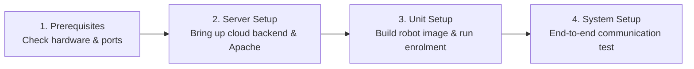

# セットアップおよび展開ガイド

<RoleBadge role="technician" />

このセクションには、MSD700 のハードウェアとソフトウェアを構成する **技術者、システム エンジニア、フィールド インストーラー**向けの技術文書が含まれています。

すべての手順には、段階的なシェル コマンド、予想される出力、構成テンプレート、およびアーキテクチャの説明が含まれています。

<LinkCards>
  <LinkCard icon="✅" title="Prerequisites" details="Hardware sizing, compute requirements, OS versions, and network port firewall rules." link="/setup/prerequisites" />
  <LinkCard icon="🖥️" title="Server Setup" details="Step-by-step production cloud deployment: Docker Compose, Apache reverse proxy, and SSL." link="/setup/server-setup" />
  <LinkCard icon="📡" title="Unit Setup" details="Install and configure the physical robot on NVIDIA Jetson SBCs, build runtime, and enrol." link="/setup/unit-setup" />
  <LinkCard icon="🔗" title="System Setup" details="End-to-end integration checklist, network verification, and operator handover." link="/setup/system-setup" />
  <LinkCard icon="🐳" title="Docker Reference" details="Exhaustive reference for Docker Compose profiles, environment variables, and volume mounts." link="/setup/docker-reference" />
  <LinkCard icon="📶" title="WiFi Hotspot + Client" details="Configure onboard Wi-Fi hotspot, Access Point mode, and local network client bridge." link="/setup/wifi-hotspot" />
  <LinkCard icon="🧰" title="Maintenance" details="Routine log rotation, JWT keyring rotation, Certbot Let's Encrypt updates, and backups." link="/setup/maintenance" />
  <LinkCard icon="🛠️" title="Technician Troubleshooting" details="Diagnose and resolve hardware, container, MQTT broker, and sensor issues." link="/setup/troubleshooting" />
</LinkCards>

## 推奨される展開の進行状況

MSD700 プラットフォームは 2 マシン モデル (サーバー + 物理ユニット) を使用します。新規インストールの場合は、次の順序に従ってください。

1. [前提条件](/ja/setup/prerequisites): コンピューティングのサイジング、Jetson ハードウェア周辺機器、およびネットワーク ファイアウォール ルールを確認します。
2. [サーバー セットアップ](/ja/setup/server-setup): まずクラウド サーバー スタックを起動し、物理ユニットが登録するための中央エンドポイントを持てるようにします。
3. [ユニットのセットアップ](/ja/setup/unit-setup): Jetson SBC 上にロボット コンテナーを構築し、自動暗号化登録ハンドシェイクを完了します。
4. [システムセットアップ](/ja/setup/system-setup): 10 項目のエンドツーエンド動作検証チェックリストを実行します。

初期インストール後、継続的なフリートのメンテナンスについては、[メンテナンス](/ja/setup/maintenance) および [トラブルシューティング](/ja/setup/troubleshooting) を参照してください。