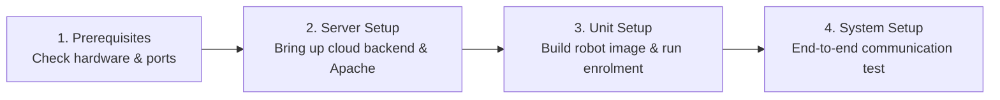

# セットアップおよび展開ガイド

<RoleBadge role="technician" />

このセクションには、MSD700 のハードウェアとソフトウェアを構成する **技術者、システム エンジニア、フィールド インストーラー**向けの技術文書が含まれています。

すべての手順には、段階的なシェル コマンド、予想される出力、構成テンプレート、およびアーキテクチャの説明が含まれています。

<LinkCards>
  <LinkCard icon="✅" title="前提条件" details="ハードウェアのサイジング、コンピューティング要件、OS バージョン、およびネットワーク ポートのファイアウォール ルール。" link="/ja/setup/prerequisites" />
  <LinkCard icon="🖥️" title="サーバーのセットアップ" details="段階的な実稼働クラウド展開: Docker Compose、Apache リバース プロキシ、および SSL。" link="/ja/setup/server-setup" />
  <LinkCard icon="📡" title="ユニットのセットアップ" details="NVIDIA Jetson SBC に物理ロボットをインストールして構成し、ランタイムを構築して登録します。" link="/ja/setup/unit-setup" />
  <LinkCard icon="🔗" title="システムセットアップ" details="エンドツーエンドの統合チェックリスト、ネットワーク検証、オペレーターの引き継ぎ。" link="/ja/setup/system-setup" />
  <LinkCard icon="🐳" title="ドッカーリファレンス" details="Docker Compose プロファイル、環境変数、ボリューム マウントに関する包括的なリファレンス。" link="/ja/setup/docker-reference" />
  <LinkCard icon="📶" title="WiFi ホットスポット + クライアント" details="オンボード Wi-Fi ホットスポット、アクセス ポイント モード、およびローカル ネットワーク クライアント ブリッジを構成します。" link="/ja/setup/wifi-hotspot" />
  <LinkCard icon="🧰" title="メンテナンス" details="定期的なログのローテーション、JWT キーリングのローテーション、Certbot Let's Encrypt の更新、およびバックアップ。" link="/ja/setup/maintenance" />
  <LinkCard icon="🛠️" title="技術者のトラブルシューティング" details="ハードウェア、コンテナ、MQTT ブローカー、センサーの問題を診断して解決します。" link="/ja/setup/troubleshooting" />
</LinkCards>

## 推奨される展開の進行状況

MSD700 プラットフォームは 2 マシン モデル (サーバー + 物理ユニット) を使用します。新規インストールの場合は、次の順序に従ってください。

1. [前提条件](/ja/setup/prerequisites): コンピューティングのサイジング、Jetson ハードウェア周辺機器、およびネットワーク ファイアウォール ルールを確認します。
2. [サーバー セットアップ](/ja/setup/server-setup): まずクラウド サーバー スタックを起動し、物理ユニットが登録するための中央エンドポイントを持てるようにします。
3. [ユニットのセットアップ](/ja/setup/unit-setup): Jetson SBC 上にロボット コンテナーを構築し、自動暗号化登録ハンドシェイクを完了します。
4. [システムセットアップ](/ja/setup/system-setup): 10 項目のエンドツーエンド動作検証チェックリストを実行します。

初期インストール後、継続的なフリートのメンテナンスについては、[メンテナンス](/ja/setup/maintenance) および [トラブルシューティング](/ja/setup/troubleshooting) を参照してください。