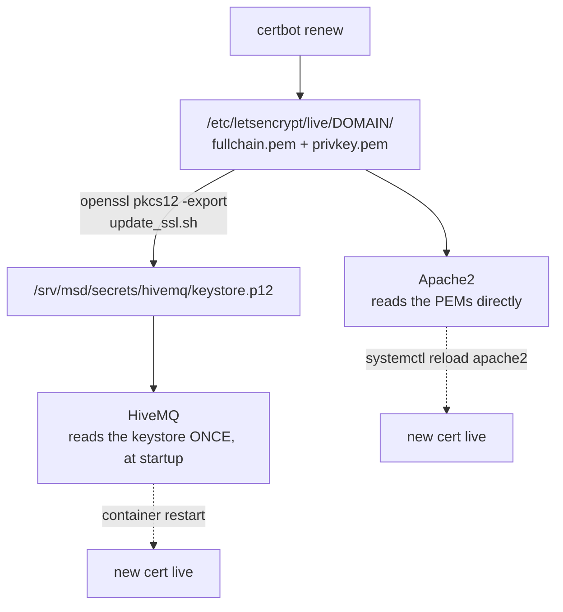

# メンテナンス

<RoleBadge role="technician" />

導入された MSD700 システムの定期的なメンテナンス タスク。適用するマシンによって分割されます。のために
以下の Docker コマンドの動作については、[Docker リファレンス](/ja/setup/docker-reference) を参照してください。

## 定期的なチェックリスト

|タスク |周波数 |どこ |メモ |
| --- | --- | --- | --- |
| `~/.ros/log` ディスク使用量を確認する |受動的: 管理人がこれを自動的に行います。単位 | [ログハウスキーピング](#log-housekeeping) を参照してください。ユニットが他の理由でオフラインになっているかどうかを手動で確認する価値があるだけです。
| JWT 署名キーリングをローテーションする |数か月ごと、または漏れの疑いがある直後 |サーバー | [秘密のローテーション](#rotating-secrets) を参照してください。
| TLS 証明書を更新する |有効期限が切れる前 |サーバー | [証明書](#certificates) を参照してください。プレーン `certbot renew` は HiveMQ キーストアを**更新しません**。
|取得されるはずだったユニットごとのアイドル状態のコンテナーを確認します。時々 |サーバー | `docker ps --filter name=rosweb_unit_`: ユニットがアイドル状態になった後も長時間実行されているものは、やみくもに再起動するのではなく、調査する価値があります。
| JWT キーリングから期限切れのキーを削除する |ローテーションの猶予期間が経過した後 |サーバー | `./scripts/secrets.sh prune` |
| Docker のディスク使用量を確認する |月刊 |両方 | `docker system df`、次に `docker image prune -a`、`docker builder prune` |
| TURN リレーがまだ中継していることを確認します。ネットワークまたはルーターを変更した後 |サーバー | [TURN リレー](#the-turn-relay) を参照してください。
|ソフトウェア スタックを更新する |リリースとして土地 |両方 | [更新中](#updating) | を参照してください。

## ログハウスキーピング

ROS 1 は独自のログをローテーションせず (`~/.ros/log`)、放っておくとログは際限なく増大します: 1 単位
到達不能なクラウド ブローカーを使用すると、1 日あたり約 860 MB と測定され、そのほとんどすべてが `rosout.log` に書き込まれました。
Jetson のルート ファイル システムに直接コピーします。すべてのユニットは、そのユニットの 1 つとしてログ ジャニタを自動的に実行します。
tmux ウィンドウ、そのツリーをキャップし (デフォルトでは 512 MB、60 秒ごとにスイープ)、以前のツリーをクリアします。
起動時のセッションのログ。

```bash
# Watch what it's doing:
tmux attach -t robot_services   # window: log_janitor
tail -f ros-web-ui/logs/log_janitor.log
```

通常、これに触れる必要はありません。意図的に追いかけている場合にのみ `ROS_LOG_CAP_MB` を上げてください
`rosout.log` に何かを保存し、そのためのディスク バジェットを確保してください。

## シークレットのローテーション

```bash
./scripts/secrets.sh status          # see what's active, without printing secret values
./scripts/secrets.sh rotate          # mint a new active key; the old one stays valid for a grace window
# after the grace window has passed:
./scripts/secrets.sh prune
```

::: info Why rotate instead of just replacing the secret?
単一の共有シークレットにより、ローテーションは鈍器になります。ローテーションは上書きされ、ログインしているすべてのオペレータが上書きされます。
そして、接続されているすべてのロボットは一度に拒否されます。キーリング形式は、1 つのアクティブなトークンで新しいトークンに署名します。
設定可能な猶予期間 (デフォルトでは 48 時間) の間、前のキーを *受け入れ* したまま、キーを押します。
そのため、すでに接続している人には回転は見えません。
:::

ローテーション後、キーリングを読み取るサービスを再起動して、新しいアクティブ キーを取得できるようにします。

```bash
docker compose --profile server_dev  restart nakayama_cloud_dev nakayama_media_dev nakayama_signalling_dev
docker compose --profile server_prod restart nakayama_cloud nakayama_media nakayama_signalling
```

## 証明書

Let's Encrypt 証明書は 2 つの異なるものによって消費されますが、そのうちの 1 つだけが自動的に更新されます。



|消費者 | | による更新を選択します。自動？ |
| --- | --- | --- |
|アパッチ |リロード |はい、certbot 独自の更新フック |
| HiveMQ | PKCS#12 キーストアを再構築し、コンテナーを再起動します。 **いいえ** |

```bash
sudo ./source/dependencies/ssl_update/update_ssl.sh   # renew + rebuild the keystore
docker compose --profile server_dev  restart hivemq_dev
docker compose --profile server_prod restart hivemq   # maintenance window, see below
```

::: danger A prod broker restart trips the safety watchdog fleet-wide
HiveMQ は復帰するまでに約 14 秒かかりますが、これは 10 秒の ping ウォッチドッグよりも長くなります。毎
ロボットが動作中に`/emergency_pause`を上げて停止します。メンテナンス中に本番ブローカーが再起動されますか
ご都合主義ではなく、窓。開発ブローカーにはそのような制約はありません。
:::

::: warning The keystore has never renewed itself
`update_ssl.sh` に接続された certbot デプロイ フックはありません。証明書の更新があるまで
Apache は正しいままで、MQTT ブローカーは期限切れの証明書を提供します。目に見える症状は次のとおりです。
ロボットのログに TLS エラーが記録され、フリート全体が一度にオフラインになります。有効期限を入れてください
カレンダー。
:::

## ターンリレー

`coturn` は **本番環境のみ**です。参照
[Docker リファレンス](/ja/setup/docker-reference#coturn-the-production-only-service) の詳細については、
推論。

```bash
docker compose --profile turn up -d coturn      # start or restart just the relay
docker compose logs -f coturn                   # watch allocations
docker compose --profile turn stop coturn       # stop just the relay
```

そのログは 3 つの 20 MB ファイルに制限されているため、認証されていないスキャナーがポート 3478 を攻撃することはできません。
ディスクをいっぱいにします。スタック内の他のものにはまだその上限はありません。

|これが変更された後 |こうする |
| --- | --- |
|ホストの LAN アドレス | `TURN_LISTENING_IP` と `TURN_EXTERNAL_IP` を更新し、リレーを再起動し、ルーターの転送を再確認します。
|パブリックIP | `TURN_EXTERNAL_IP` の公開部分を更新し、リレーを再開します。
| `TURN_USER` / `TURN_PASSWORD` |資格情報がバンドルに組み込まれているため、リレーを再起動し**、両方のダッシュボード イメージを再構築します。
|ルーターまたはファイアウォール | UDP+TCP 3478 と UDP リレー範囲が両方とも `TURN_LISTENING_IP` に達していることを再確認します。

::: info Symptom to recognise
カメラ フィードは、同じ LAN 上のオペレータに対しては機能しますが、LAN の外にいるオペレータには決して表示されません。つまり
カメラではなくリレー: シグナリングは成功し (両方のピアがお互いを見つけました)、メディア パスは成功しました。
そうではありません。
:::

## バックアップ

バックアップが必要なものと、それがすでに存在する場所:

|データ |場所 |どのように |
| --- | --- | --- |
|マップ、ルート、カスタムエリア、プレイリスト | MySQL (`db`/`db_dev` コンテナ) + `/srv/msd/media/map` 下のマップ ファイル |管理コンソールの **プロファイル バックアップ** 機能を使用します。プロファイルごとに単一の `.tar.gz` が生成され、復元は追加的です。
|ユニットごとのデータ (ハードウェア スワップまたはユニット固有のアーカイブ用) |同じソースを 1 つのユニットに限定 |バックアップ システムは、まさにこれのために `scope` 列をサポートしています。プロファイル全体を取り込まずに 1 つのユニットをアーカイブします。
| JWT キーリング / TLS キーストア | `/srv/msd/secrets` |アプリレベルのバックアップの一部ではありません。このディレクトリをファイルシステム/インフラレベルでバックアップします。

::: warning
バックアップ アーカイブはバックエンドによって `/srv/msd/media/backup` (`/srv/msd/media/backup_dev`) に書き込まれます。
開発スタック用)。そのディレクトリがまだ存在しないか、アプリのユーザーが書き込みできない場合は、バックアップが行われます。
失敗する。 [トラブルシューティング](/ja/setup/troubleshooting) を参照してください。
:::

## 更新中

### サーバー

```bash
git pull
docker compose --profile server_dev  build && docker compose --profile server_dev  up -d   # test first
docker compose --profile server_prod build && docker compose --profile server_prod up -d
```

::: danger Recreating the backend orphans every per-unit container
`rosweb_unit_*` コンテナは、前の `backend_node` プロセスによって開始されました。その後
バックエンドが再作成されるか、バックエンドも再起動するか、新しいバックエンドがバックエンドを考慮しないまま実行されます。
採用された:

```bash
docker ps --filter "name=rosweb_unit_" --format '{{.Names}}' | xargs -r docker restart
```
:::

### ユニット

```bash
git pull --recurse-submodules
./scripts/docker-manager.sh build
./scripts/docker-manager.sh up -d
```

::: info When a rebuild is actually needed
`src/` は **robot** コンテナにバインドマウントされているため、日常のスクリプト編集を再構築する必要はありません。
all: コンテナは次回の起動時にそれらを取得します。完全な `build` は、依存関係がある場合にのみ必要です。
またはベースイメージが変更されました。

ユニット独自の **サーバー** スタックが異なります。 `Dockerfile.webui-local` はソースを
イメージなので、これらのサービスは常に再構築する必要があります。 `docker-manager.sh` は画像のタイムスタンプを比較します
ソース ツリーに対して再構築され、自動的に再構築されます。そのため、`up` で説明のない再構築が行われます。
通常、誰かがバックエンドを編集したことを意味します。
:::

ここには、Arduino ベースのモーター コントローラー用の個別のファームウェア アップデート パスは記載されていません。
これは手動の再フラッシュであり、この Docker ベースのスタックの一部ではありません。

## ディスクのハウスキーピング

```bash
docker system df                 # what is using space
docker image prune -a            # images no container references
docker builder prune             # build cache
docker volume ls                 # inspect BEFORE removing anything
```

::: danger Never `docker compose down -v` on this project casually
`-v` は、保持されたメッセージを保持する `ros_webui_hivemq_data_prod` を含む名前付きボリュームを削除します。
クライアント セッションとキューに入れられた QoS>0 メッセージ。クリーンなブローカーが必要な場合は、次の方法でその 1 つのボリュームを削除します。
意図的に名前を付けます。
:::

## 関連

- [Docker リファレンス](/ja/setup/docker-reference): 上記の各コマンドの動作
- [トラブルシューティング](/ja/setup/troubleshooting): メンテナンスで問題が発見された場合
- [システムセットアップ](/ja/setup/system-setup): システムトポロジーリファレンス