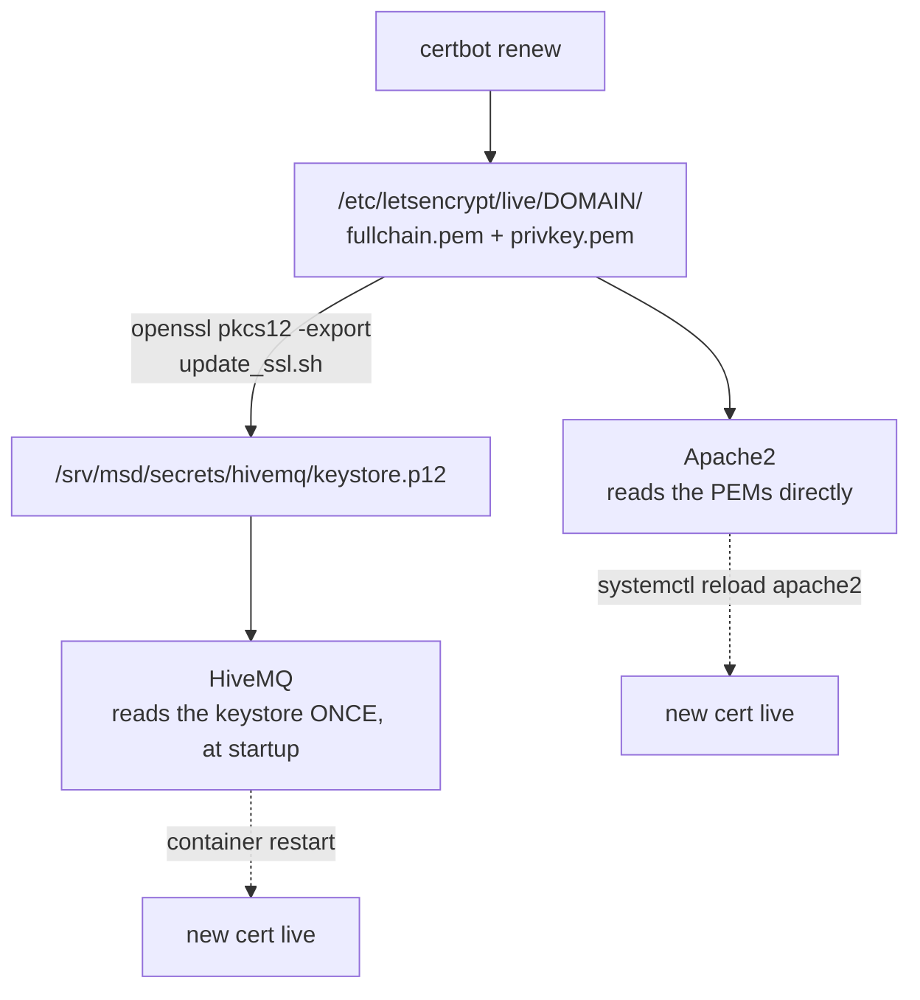

# メンテナンス

<RoleBadge role="technician" />

デプロイ済みの MSD700 システムに対する定期メンテナンス作業を、どのマシンに適用されるかで分けたも
のです。以下の Docker コマンドがそれぞれ何を行っているかについては、[Docker コマンドリファレンス](/ja/setup/docker-reference)
を参照してください。

## 定期チェックリスト

| タスク | 頻度 | 対象 | 備考 |
| --- | --- | --- | --- |
| `~/.ros/log` のディスク使用量を確認する | 受動的: janitor が自動的に行う | ユニット | [ログのハウスキーピング](#log-housekeeping) を参照。他の理由でユニットがオフラインのときだけ手動で確認する価値がある |
| JWT 署名キーリングをローテーションする | 数か月ごと、または漏洩が疑われた直後 | サーバー | [シークレットのローテーション](#rotating-secrets) を参照 |
| TLS 証明書を更新する | 期限切れ前に | サーバー | [証明書](#certificates) を参照。素の `certbot renew` は HiveMQ のキーストアを更新**しません** |
| 回収されるべき idle なユニットごとのコンテナがないか確認する | 随時 | サーバー | `docker ps --filter name=rosweb_unit_`: ユニットが idle になってから長時間経ってもまだ動いているものは、盲目的に再起動するのではなく調査する価値がある |
| JWT キーリングから期限切れのキーを削除する | ローテーションの猶予期間が過ぎた後 | サーバー | `./scripts/secrets.sh prune` |
| Docker のディスク使用量を確認する | 毎月 | 両方 | `docker system df`、続けて `docker image prune -a` と `docker builder prune` |
| TURN リレーがまだリレーできているか確認する | ネットワークやルーターの変更後は毎回 | サーバー | [TURN リレー](#the-turn-relay) を参照 |
| ソフトウェアスタックを更新する | リリースが出るたびに | 両方 | [更新する](#updating) を参照 |

## ログのハウスキーピング

ROS 1 は自身のログ(`~/.ros/log`)をローテーションしないため、放置すると際限なく肥大化します。
クラウドブローカーに到達できないあるユニットでは、1 日あたり約 860 MB が計測され、そのほとんどが
`rosout.log` で、Jetson のルートファイルシステムに直接書き込まれていました。すべてのユニットは、
tmux ウィンドウの 1 つとして自動的にログ janitor を実行し、そのツリーに上限を設け(デフォルト 512
MB、60 秒ごとに掃除)、起動時に前回セッションのログをクリアします。

```bash
# Watch what it's doing:
tmux attach -t robot_services   # window: log_janitor
tail -f ros-web-ui/logs/log_janitor.log
```

通常これに触れる必要はありません。`ROS_LOG_CAP_MB` を上げるのは、意図的に `rosout.log` の中の何かを
追っていて、そのためのディスク予算がある場合のみにしてください。

## シークレットのローテーション

```bash
./scripts/secrets.sh status          # see what's active, without printing secret values
./scripts/secrets.sh rotate          # mint a new active key; the old one stays valid for a grace window
# after the grace window has passed:
./scripts/secrets.sh prune
```

::: info なぜシークレットを単に置き換えるのではなくローテーションするのか
単一の共有シークレットでは、ローテーションが鈍器になってしまいます。上書きすれば、ログイン中のすべ
てのオペレーターと接続中のすべてのロボットが一斉に拒否されてしまいます。キーリング形式は、新しい
トークンを 1 つのアクティブなキーで署名しつつ、設定可能な猶予期間(デフォルト 48 時間)の間は以前の
キーも引き続き*受け入れる*ため、ローテーションは既に接続済みの誰の目にも見えません。
:::

ローテーション後は、キーリングを読み込むサービスを再起動して新しいアクティブキーを反映させます。

```bash
docker compose --profile server_dev  restart nakayama_cloud_dev nakayama_media_dev nakayama_signalling_dev
docker compose --profile server_prod restart nakayama_cloud nakayama_media nakayama_signalling
```

## 証明書

Let's Encrypt 証明書を消費するものは 2 つあり、そのうち自動更新されるのは 1 つだけです。



| 消費者 | 更新の反映方法 | 自動化されているか |
| --- | --- | --- |
| Apache | リロード | はい。certbot 自身の更新フック |
| HiveMQ | PKCS#12 キーストアを再構築し、コンテナを再起動する | **いいえ** |

```bash
sudo ./source/dependencies/ssl_update/update_ssl.sh   # renew + rebuild the keystore
docker compose --profile server_dev  restart hivemq_dev
docker compose --profile server_prod restart hivemq   # maintenance window, see below
```

::: danger 本番ブローカーの再起動はフリート全体で安全ウォッチドッグを作動させる
HiveMQ が復帰するまで約 14 秒かかり、これは 10 秒の ping ウォッチドッグより長い時間です。稼働中の
すべてのロボットが `/emergency_pause` を発報して停止します。本番ブローカーの再起動は、機会を見て
行うのではなく、メンテナンスウィンドウで行ってください。開発用ブローカーにはこの制約はありません。
:::

::: warning キーストアは一度も自動更新されたことがない
`update_ssl.sh` に接続された certbot のデプロイフックはありません。それが実装されるまでは、証明書
の更新は Apache を正しい状態に保つ一方、MQTT ブローカーは期限切れの証明書を配信し続けます。目に
見える症状は、フリート全体が一斉にオフラインになり、ロボットのログに TLS エラーが記録されることで
す。期限日をカレンダーに記入しておいてください。
:::

## TURN リレー

`coturn` は**本番のみ**です。完全な理由については
[Docker コマンドリファレンス](/ja/setup/docker-reference#coturn-本番専用のサービス) を参照
してください。

```bash
docker compose --profile turn up -d coturn      # start or restart just the relay
docker compose logs -f coturn                   # watch allocations
docker compose --profile turn stop coturn       # stop just the relay
```

そのログは 20 MB のファイル 3 つに制限されているため、未認証のスキャナーがポート 3478 を連打しても
ディスクを埋め尽くすことはできません。スタック内の他の部分にはまだこの上限はありません。

| これが変わったら | これを行う |
| --- | --- |
| ホストの LAN アドレス | `TURN_LISTENING_IP` と `TURN_EXTERNAL_IP` を更新し、リレーを再起動し、ルーターのフォワード設定を再確認する |
| パブリック IP | `TURN_EXTERNAL_IP` のパブリック側を更新し、リレーを再起動する |
| `TURN_USER` / `TURN_PASSWORD` | リレーを再起動し、**かつ**両方のダッシュボードイメージを再ビルドする。認証情報はバンドルに焼き込まれているため |
| ルーターまたはファイアウォール | UDP+TCP 3478 と UDP リレー範囲の両方が `TURN_LISTENING_IP` に到達することを再確認する |

::: info 認識すべき症状
カメラ映像は同一 LAN 上のオペレーターには機能するが、LAN 外の誰にも決して表示されない。これはカメラ
ではなくリレーの問題です。signalling は成功しており(両方のピアが互いを見つけている)、メディア
経路だけが失敗しています。
:::

## バックアップ

何をバックアップする必要があり、それが既にどこにあるか:

| データ | 場所 | 方法 |
| --- | --- | --- |
| 地図、ルート、カスタムエリア、プレイリスト | MySQL(`db`/`db_dev` コンテナ)+ `/srv/msd/media/map` 以下の地図ファイル | 管理コンソールの**プロファイルバックアップ**機能を使用する。プロファイルごとに 1 つの `.tar.gz` を生成し、復元は加算的(additive) |
| ユニットごとのデータ(ハードウェア交換やユニット固有のアーカイブ用) | 同じソース、1 ユニットに限定 | バックアップシステムはまさにこのために `scope` 列をサポートしており、プロファイル全体を巻き込まずに 1 ユニットだけをアーカイブできる |
| JWT キーリング / TLS キーストア | `/srv/msd/secrets` | アプリケーションレベルのバックアップには含まれない。このディレクトリはファイルシステム/インフラレベルでバックアップすること |

::: warning
バックアップアーカイブはバックエンドによって `/srv/msd/media/backup`(開発スタックの場合は
`/srv/msd/media/backup_dev`)に書き込まれます。そのディレクトリがまだ存在しない、またはアプリの
ユーザーに書き込み権限がない場合、バックアップは失敗します。[トラブルシューティング](/ja/setup/troubleshooting)
を参照してください。
:::

## 更新する

### サーバー

```bash
git pull
docker compose --profile server_dev  build && docker compose --profile server_dev  up -d   # test first
docker compose --profile server_prod build && docker compose --profile server_prod up -d
```

::: danger バックエンドの再作成はすべてのユニットごとのコンテナを孤児にする
`rosweb_unit_*` コンテナは以前の `backend_node` プロセスによって起動されました。バックエンドが再作
成された後は、それらも再起動してください。そうしないと、新しいバックエンドがそれらを採用済みとみな
さないまま、それらは動き続けてしまいます。

```bash
docker ps --filter "name=rosweb_unit_" --format '{{.Names}}' | xargs -r docker restart
```
:::

### ユニット

```bash
git pull --recurse-submodules
./scripts/docker-manager.sh build
./scripts/docker-manager.sh up -d
```

::: info 再ビルドが実際に必要になるのはどんなときか
`src/` は**ロボット**コンテナにバインドマウントされているため、日常的なスクリプトの編集にはまった
く再ビルドが必要ありません。コンテナは次回起動時にそれを取り込みます。完全な `build` が必要になる
のは、依存関係やベースイメージが変更された場合だけです。

ユニット自身の**サーバー**スタックは事情が異なります。`Dockerfile.webui-local` はソースをイメージ
に COPY するため、それらのサービスは常に再ビルドが必要です。`docker-manager.sh` はイメージのタイム
スタンプをソースツリーと比較し、自動的に再ビルドします。そのため、`up` の際に理由のわからない再
ビルドが起きた場合、たいていは誰かがバックエンドを編集したというだけの意味です。
:::

Arduino ベースのモーターコントローラ用の別個のファームウェア更新手順は、ここでは文書化されていま
せん。それは手動での再書き込みであり、この Docker ベースのスタックの一部ではありません。

## ディスクのハウスキーピング

```bash
docker system df                 # what is using space
docker image prune -a            # images no container references
docker builder prune             # build cache
docker volume ls                 # inspect BEFORE removing anything
```

::: danger このプロジェクトで軽々しく `docker compose down -v` を実行しないこと
`-v` は名前付きボリュームを削除します。これには、保持されたメッセージ、クライアントセッション、
キューに入った QoS>0 のメッセージを保持する `ros_webui_hivemq_data_prod` も含まれます。ブローカーを
クリーンにしたい場合は、そのボリュームだけを名前で指定して意図的に削除してください。
:::

## 関連項目

- [Docker コマンドリファレンス](/ja/setup/docker-reference): 上記の各コマンドが何をしているか
- [トラブルシューティング](/ja/setup/troubleshooting): メンテナンス中に問題が見つかった場合
- [システムセットアップ](/ja/setup/system-setup): システムトポロジーのリファレンス
