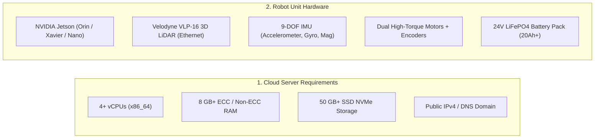
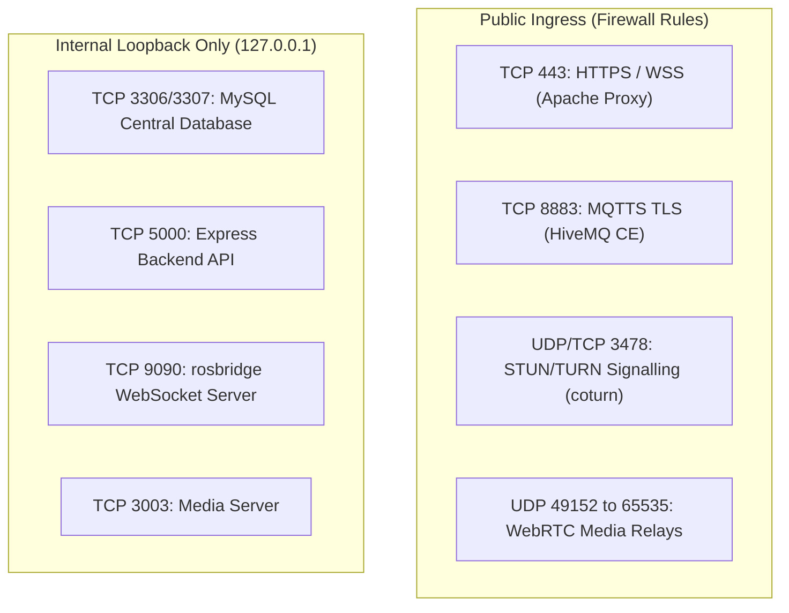

# 前提条件

<RoleBadge role="technician" />

このドキュメントでは、**MSD700 サーバー**または **MSD700 物理ロボットユニット**をデプロイする前に必要となるハードウェア仕様、オペレーティングシステム要件、ネットワークルール、およびソフトウェア依存関係について詳しく説明します。

## システム構成規模とハードウェア仕様



### 1. サーバーハードウェア仕様(クラウドホスト)

| コンポーネント | 最小仕様 | 推奨本番仕様 |
| --- | --- | --- |
| **プロセッサ** | 2 vCPU(x86_64 / amd64) | 4〜8 vCPU |
| **システムメモリ** | RAM 4 GB | RAM 8〜16 GB |
| **ディスクストレージ** | SSD 30 GB | NVMe 100 GB(地図アーカイブとメディアログ用) |
| **ネットワークイングレス** | ポート 443、8883 をフォワードした静的パブリック IPv4 | 100 Mbps 以上の全二重リンク |

### 2. 物理ロボットユニット仕様(Jetson SBC)

| コンポーネント | ハードウェア仕様 | 用途 |
| --- | --- | --- |
| **シングルボードコンピュータ** | NVIDIA Jetson(JetPack 5.x / 6.x) | Docker 上で ROS Noetic ランタイム、センサーフュージョン、ローカル Web スタックを実行。 |
| **メイン 3D LiDAR** | Velodyne VLP-16(16 チャンネル、Ethernet) | 360 度の環境マッピングと 100 m 範囲の障害物検知。 |
| **状態推定用 IMU** | 9 軸 MEMS センサー(I2C/UART) | Madgwick フィルタでホイールオドメトリと融合し高レートな姿勢推定を実現。 |
| **モーター用マイクロコントローラ** | Arduino / Teensy 組み込みコントローラ | 閉ループ PID 速度制御とエンコーダのティック割り込みを実行。 |
| **シャーシ & 駆動方式** | 4 個の自在キャスターを備えた差動駆動 | 物理シャーシフットプリント 0.90 x 0.70 m、設計最大速度 2.5 m/s。 |
| **電源段** | 24V LiFePO4 バッテリーパック | 4〜6 時間の連続自律稼働、ハードウェア E-Stop リレー。 |

---

## ネットワークファイアウォールとポート一覧

ネットワークルーターとセキュリティグループで、以下のトラフィックを許可してください。



| ポート | プロトコル | 範囲 | サービス | 用途 |
| --- | --- | --- | --- | --- |
| **`443`** | TCP | パブリック | Apache2 リバースプロキシ | Web ダッシュボードの HTTPS、REST API、rosbridge WebSocket ストリーム。 |
| **`8883`** | TCP | パブリック | HiveMQ TLS ブローカー | ロボットとクラウドを接続する暗号化 MQTT コマンド・テレメトリブリッジ。 |
| **`3478`** | UDP + TCP | パブリック | coturn TURN サーバー | ピアツーピアの NAT パンチが遮断された場合の WebRTC カメラ映像のトラバーサル。 |
| **`49152 - 65535`** | UDP | パブリック | coturn 動的メディア範囲 | シンメトリック NAT を越えた WebRTC 映像ペイロードのリレー。 |
| **`3307`** | TCP | Localhost | MySQL 本番 DB | アカウント、地図、ルート、レンタルプロファイルの中央リレーショナルストア。 |
| **`5000`** | TCP | Localhost | Express バックエンド API | 内部 REST API と Docker コンテナオーケストレーター。 |
| **`9090`** | TCP | Localhost | rosbridge WebSocket | Web キャンバスに供給する高頻度 ROS トピックのデシリアライザ。 |

---

## ホスト OS と依存関係

### クラウドサーバー向け:
1. **オペレーティングシステム**: Ubuntu 22.04 LTS または Ubuntu 24.04 LTS(x86_64)。
2. **Docker Engine**: Compose プラグイン(`docker compose` v2)付き Docker CE 20.10 以降。
3. **Web サーバー**: Apache 2.4 以降(`a2enmod ssl proxy proxy_http proxy_wstunnel headers rewrite alias`)。
4. **SSL 証明書**: Let's Encrypt の自動更新のために Certbot をインストール。

### 物理 Jetson ユニット向け:
1. **オペレーティングシステム**: Ubuntu 20.04 / 22.04 LTS(ARM64 上の JetPack 5.x / 6.x)。
2. **Docker Engine**: `network_mode: host` をサポートする Docker CE。
3. **USB デバイスルール**: `/dev/ttyUSB*`(モーターコントローラ)への非 root アクセスを許可する `udev` ルール。
4. **静的 IP 設定**: 専用 LiDAR Ethernet ポート(`end0`)に静的 IP `192.168.103.100` を設定。

---

## Ubuntu への Docker Engine のインストール

クラウドサーバーと Jetson ユニットの両方で、Compose プラグイン(`docker compose` v2)付きの Docker CE が必要です。Ubuntu のデフォルトリポジトリにある `docker.io` パッケージ(バージョンが古く、Compose プラグインが同梱されないことが多い)ではなく、Docker 公式の `apt` リポジトリからインストールしてください。

```bash
# 1. Remove any old or conflicting packages
for pkg in docker.io docker-doc docker-compose docker-compose-v2 podman-docker containerd runc; do
  sudo apt-get remove -y $pkg
done

# 2. Install prerequisites and add Docker's official GPG key
sudo apt-get update
sudo apt-get install -y ca-certificates curl
sudo install -m 0755 -d /etc/apt/keyrings
sudo curl -fsSL https://download.docker.com/linux/ubuntu/gpg -o /etc/apt/keyrings/docker.asc
sudo chmod a+r /etc/apt/keyrings/docker.asc

# 3. Add the Docker apt repository
echo \
  "deb [arch=$(dpkg --print-architecture) signed-by=/etc/apt/keyrings/docker.asc] https://download.docker.com/linux/ubuntu \
  $(. /etc/os-release && echo "$VERSION_CODENAME") stable" | \
  sudo tee /etc/apt/sources.list.d/docker.list > /dev/null
sudo apt-get update

# 4. Install Docker Engine, the CLI, containerd, and the Compose plugin
sudo apt-get install -y docker-ce docker-ce-cli containerd.io docker-buildx-plugin docker-compose-plugin

# 5. Verify the installation
sudo docker run hello-world
```

::: info `amd64` と `arm64` の両方で動作
上記の手順はアーキテクチャに依存しません。`dpkg --print-architecture` はクラウドサーバーでは `amd64`、Jetson ユニットでは `arm64` に解決され、Docker のリポジトリはそれぞれに対応するパッケージを提供します。JetPack 用に別手順は不要です。
:::

### インストール後: `sudo` なしで Docker を実行する

`docker-manager.sh` と `run_msd.sh`([Docker コマンドリファレンス](/ja/setup/docker-reference)を参照)は、実行ユーザーが `sudo` なしで `docker` を実行できることを前提としています。ユーザーを `docker` グループに追加し、新しいシェルセッションを開始して反映させてください。

```bash
sudo usermod -aG docker $USER
newgrp docker

# Confirm access without sudo
docker run hello-world
```

::: warning それでも `sudo` を要求される場合はログアウトして再ログイン
`newgrp docker` は現在のシェルにのみ新しいグループを適用します。他のシェル、SSH セッション、または systemd ユニットが `/var/run/docker.sock` への権限エラーで失敗し続ける場合は、完全にログアウトして再ログイン(またはリブート)し、グループメンバーシップがどこでも反映されるようにしてください。
:::

### 起動時に Docker を有効化

```bash
sudo systemctl enable docker.service
sudo systemctl enable containerd.service
```

---

## 安全チェックリスト

::: danger 安全第一
1. **E-Stop を手の届く範囲に**: モーターテストを実行する前に、物理的な Emergency Stop のマッシュルームボタンがすぐ手の届く場所にあることを確認してください。
2. **初回電源投入時はシャーシを持ち上げる**: 初期ファームウェアの立ち上げとモーター回転方向テストの際は、駆動輪が床に触れずに自由に回転するよう、ロボットシャーシを木製ブロックの上に置いてください。
3. **LiDAR の目に対する安全性**: Velodyne VLP-16 はクラス 1 のアイセーフレーザー機器(波長 $905\text{ nm}$)です。稼働中の光学系の正面に光学拡大レンズを置かないでください。
:::

## 次のステップ

- クラウドバックエンドをデプロイするには [サーバーセットアップ](/ja/setup/server-setup) に進みます。
- サーバーが既に稼働している場合は、直接 [ユニットセットアップ](/ja/setup/unit-setup) に進んでください。
