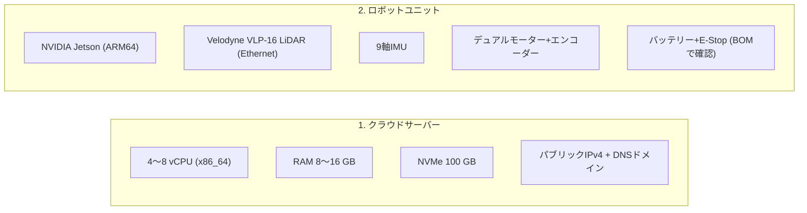
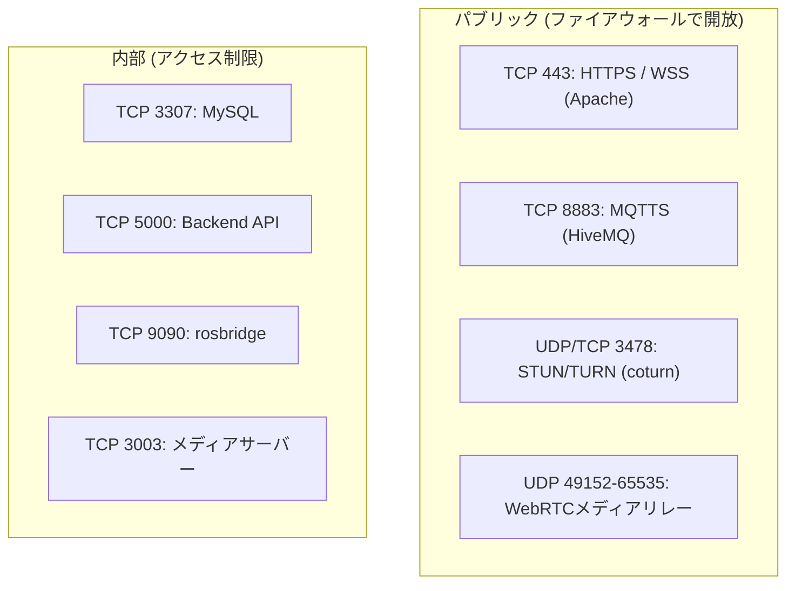

# 前提条件

<RoleBadge role="technician" />

MSD700サーバーやロボットユニットをインストールする**前に**必要なハードウェア、OS、ネットワークポート、ソフトウェアです。

## ハードウェア



### 1. クラウドサーバー

| 項目 | 最小 | 推奨 |
| --- | --- | --- |
| **CPU** | 2 vCPU (x86_64) | 4〜8 vCPU |
| **RAM** | 4 GB | 8〜16 GB |
| **ディスク** | SSD 30 GB | NVMe 100 GB (地図アーカイブ、メディアログ用) |
| **ネットワーク** | 固定パブリックIPv4、ポート443+8883を転送 | 100 Mbps以上全二重 |

### 2. ロボットユニット (Jetson)

| 項目 | 内容 |
| --- | --- |
| **コンピューター** | NVIDIA Jetson (ARM64)。機種に合ったBSP/カーネルが必要 |
| **LiDAR** | Velodyne VLP-16 (Ethernet接続)。ホスト`192.168.103.100/24`、センサー`192.168.103.231`、UDP `2368` |
| **IMU** | 姿勢フィルタとオドメトリ融合用 |
| **モーター** | STM32コントローラー(`/dev/stm32`として認識、udevルールが必要) |
| **電源** | バッテリー、保護回路、E-Stop:ユニットBOMと照合すること |

---

## ファイアウォールポート

下の**パブリック**ポートを開けます。それ以外は信頼できるネットワークからのみ到達できるよう閉じてください。



| ポート | プロトコル | 範囲 | サービス |
| --- | --- | --- | --- |
| **`443`** | TCP | パブリック | Apacheリバースプロキシ(ダッシュボード、API、rosbridge、シグナリング) |
| **`8883`** | TCP | パブリック | HiveMQブローカー(ロボットの接続先) |
| **`3478`** | UDP + TCP | パブリック | coturn TURNサーバー(NAT越えのカメラ映像) |
| **`49152-65535`** | UDP | パブリック | coturnメディアリレー範囲(`.env`で狭められます) |
| **`3307`** | TCP | 内部のみ | MySQL本番データベース |
| **`5000`** | TCP | 内部のみ | バックエンドAPI |
| **`9090`** | TCP | 内部のみ | rosbridge WebSocket |
| **`3003`** | TCP | 内部のみ | メディアサーバー |
| **`3001` / `3002`** | TCP | 内部のみ | シグナリングサーバー (WS / HTTP) |

::: warning MySQLとバックエンドは自動的にはループバック専用になりません
ComposeはMySQLをループバックバインドなしで公開し、バックエンドは全インターフェースで待ち受けます。内部に留めるのはファイアウォールの役割です。ホスト上で確認してください。
:::

開発用ポートはずれています:MySQL `3308`、バックエンド`5001`、rosbridge `9091`、MQTT `8884`、シグナリング`4001`/`4002`、メディア`4003`。TURNは本番専用です。

**ユニット側**では、LAN上のオペレーターPCがダッシュボード`3000`、バックエンド`5002`、rosbridge `9090`、メディア`3003`、シグナリング`3001`、MQTT WebSocket `9001`を使います。ロボット自身のroscoreは`11321`(`--dev`付きで`11322`)で、クラウドの`11311`/`11312`とは別です。

---

## OSと依存ソフト

### クラウドサーバー

1. **OS**: Ubuntu 22.04または24.04 LTS (x86_64)。
2. **Docker**: Docker CE 20.10以上+Composeプラグイン(`docker compose` v2)。
3. **Apache**: 2.4以上(`ssl proxy proxy_http proxy_wstunnel headers rewrite alias`)。
4. **Certbot**: Let's Encrypt証明書用。

### Jetsonユニット

1. **OS**: 機種対応BSPのARM64 Ubuntu。
2. **Docker**: Docker CE + Compose v2。
3. **udevルール**: `/dev/stm32`モーターコントローラーとRealSense USB用(`setup.sh`が導入、[ユニット構築](/ja/setup/unit-setup)参照)。
4. **LiDAR接続**: 専用Ethernet。通常ホスト`192.168.103.100/24`、センサー`192.168.103.231`。インターフェース名は自動検出、必要なら`VELODYNE_IFACE`で上書き。
5. **ホットスポット用ツール**: NetworkManager、`iw`、`dnsmasq`、`iptables`、systemd、udev、polkit。初回起動前に導入、[WiFiホットスポット](/ja/setup/wifi-hotspot)参照。

---

## UbuntuへのDockerインストール

サーバーもJetsonもDocker公式aptリポジトリを使います。Ubuntu標準の`docker.io`パッケージは古く、Composeプラグインが無い場合があります。

```bash
# 1. 競合パッケージを削除
for pkg in docker.io docker-doc docker-compose docker-compose-v2 podman-docker containerd runc; do
  sudo apt-get remove -y $pkg
done

# 2. Docker公式鍵を追加
sudo apt-get update
sudo apt-get install -y ca-certificates curl
sudo install -m 0755 -d /etc/apt/keyrings
sudo curl -fsSL https://download.docker.com/linux/ubuntu/gpg -o /etc/apt/keyrings/docker.asc
sudo chmod a+r /etc/apt/keyrings/docker.asc

# 3. Docker aptリポジトリを追加
echo \
  "deb [arch=$(dpkg --print-architecture) signed-by=/etc/apt/keyrings/docker.asc] https://download.docker.com/linux/ubuntu \
  $(. /etc/os-release && echo "$VERSION_CODENAME") stable" | \
  sudo tee /etc/apt/sources.list.d/docker.list > /dev/null
sudo apt-get update

# 4. Docker + Composeプラグインをインストール
sudo apt-get install -y docker-ce docker-ce-cli containerd.io docker-buildx-plugin docker-compose-plugin

# 5. 動作確認
sudo docker run hello-world
```

`amd64`と`arm64`の両方で動作します(アーキテクチャは自動選択)。

### `sudo`なしでDockerを使う

```bash
sudo usermod -aG docker $USER
newgrp docker
docker run hello-world
```

::: warning まだ`sudo`を求められる場合
`newgrp docker`は現在のシェルのみに有効です。他のシェルやSSHセッションでは一度ログアウト・ログインし直してください。
:::

### 起動時にDockerを有効化

```bash
sudo systemctl enable docker.service
sudo systemctl enable containerd.service
```

---

## 安全チェックリスト

::: danger 安全第一
1. **E-Stopを手元に。** モーターテストの前に、赤い非常停止ボタンを手の届く場所に置いてください。
2. **初回電源投入時は車体を浮かせる。** モーター方向テスト中、車輪が自由に回るよう台の上に載せてください。
3. **LiDARレーザー。** Velodyne VLP-16はClass 1アイセーフです。それでも動作中に拡大光学系を前に置かないでください。
:::

## 次のステップ

- [サーバー構築](/ja/setup/server-setup):クラウドバックエンドをデプロイします。
- [ユニット構築](/ja/setup/unit-setup):ロボットをセットアップします(サーバー稼働済みの場合)。
