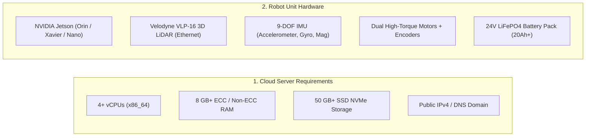
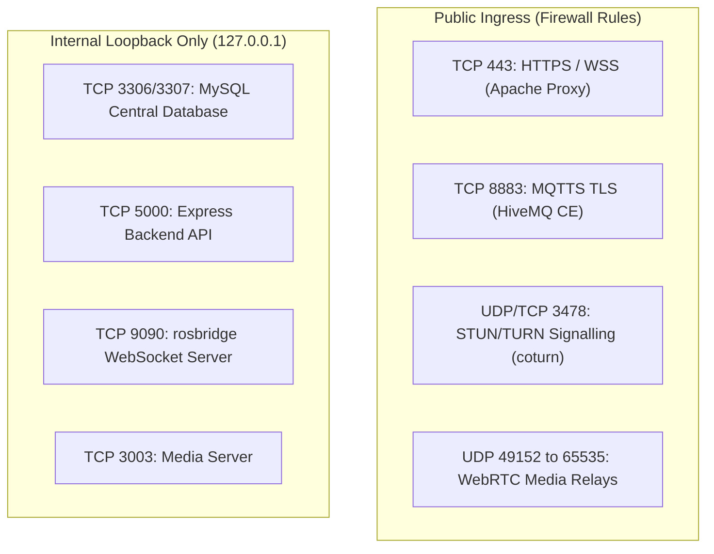

# 前提条件

<RoleBadge role="technician" />

このドキュメントでは、**MSD700 サーバー** または **MSD700 物理ロボット ユニット** を展開する前に必要なハードウェア仕様、オペレーティング システム要件、ネットワーク ルール、およびソフトウェアの依存関係について詳しく説明します。

## システムのサイジングとハードウェア仕様

### 1. サーバーのハードウェア仕様 (クラウドホスト)

|コンポーネント |最小仕様 |おすすめの制作 |
| --- | --- | --- |
| **プロセッサ** | 2 vCPU (x86_64 / amd64) | 4 ～ 8 個の vCPU |
| **システム メモリ** | 4 GB RAM | 8 ～ 16 GB RAM |
| **ディスク ストレージ** | 30 GB SSD | 100 GB NVMe (マップ アーカイブおよびメディア ログ用) |
| **ネットワークイングレス** |ポート 443、8883 が転送される静的パブリック IPv4 | 100 Mbps+ 全二重リンク |

### 2. 物理ロボットユニットの仕様 (Jetson SBC)

|コンポーネント |ハードウェア仕様 |目的 |
| --- | --- | --- |
| **シングルボード コンピューター** | NVIDIA Jetson (JetPack 5.x / 6.x) | Docker、センサー フュージョン、ローカル Web スタックで ROS Noetic ランタイムを実行します。 |
| **プライマリ 3D LiDAR** | Velodyne VLP-16 (16 チャンネル、イーサネット) | 360 度の環境マッピングと 100 m 範囲の障害物検出。 |
| **州 IMU** | 9-DOF MEMS センサー (I2C/UART) | Madgwick フィルターを介してホイール オドメトリと融合し、高速オリエンテーションを実現します。 |
| **モーター マイクロコントローラー** | Arduino / Teensy 組み込みコントローラー |閉ループ PID 速度制御とエンコーダ ティック割り込みを実行します。 |
| **シャーシとドライブ** | 4 つのスイベルキャスター付きディファレンシャルドライブ |物理シャーシの設置面積は 0.90 x 0.70 m。最大設計速度 2.5 m/s。 |
| **パワーステージ** | 24V LiFePO4 バッテリーパック | 4 ～ 6 時間の連続自律動作。ハードウェア非常停止リレー。 |

---

## ネットワーク ファイアウォールとポート マトリックス

ネットワークルーターとセキュリティグループが次のトラフィックを許可していることを確認してください。

|ポート |プロトコル |範囲 |サービス |必須 |
| --- | --- | --- | --- | --- |
| **`443`** | TCP |パブリック | Apache2 リバース プロキシ | Web ダッシュボードの HTTPS、REST API、および rosbridge WebSocket ストリーム。 |
| **`8883`** | TCP |パブリック | HiveMQ TLS ブローカー |ロボットをクラウドに接続する暗号化された MQTT コマンドとテレメトリ ブリッジ。 |
| **`3478`** | UDP + TCP |パブリック | coturn TURN サーバー |ピアツーピア NAT パンチがブロックされている場合の WebRTC カメラ ビデオ トラバーサル。 |
| **`49152 - 65535`** | UDP |パブリック | coturn ダイナミック メディア レンジ |対称 NAT 間で中継する WebRTC ビデオ ペイロード。 |
| **`3307`** | TCP |ローカルホスト | MySQL プロダクション データベース |アカウント、地図、ルート、レンタル プロファイルの中心的なリレーショナル ストア。 |
| **`5000`** | TCP |ローカルホスト | Express バックエンド API |内部 REST API と Docker コンテナ オーケストレーター。 |
| **`9090`** | TCP |ローカルホスト |ロスブリッジ WebSocket |高頻度の ROS トピック デシリアライザーが Web キャンバスにフィードします。 |

---

## ホストのオペレーティング システムと依存関係

### クラウドサーバーの場合:
1. **オペレーティング システム**: Ubuntu 22.04 LTS または Ubuntu 24.04 LTS (x86_64)。
2. **Docker エンジン**: Compose プラグインを備えた Docker CE 20.10+ (`docker compose` v2)。
3. **Web サーバー**: Apache 2.4+ (`a2enmod ssl proxy proxy_http proxy_wstunnel headers rewrite alias`)。
4. **SSL 証明書**: Let's Encrypt の自動更新のためにインストールされた Certbot。

### 物理的な Jetson ユニットの場合:
1. **オペレーティング システム**: Ubuntu 20.04 / 22.04 LTS (ARM64 上の JetPack 5.x / 6.x)。
2. **Docker エンジン**: `network_mode: host` をサポートする Docker CE。
3. **USB デバイス ルール**: `/dev/ttyUSB*` (モーター コントローラー) への非 root アクセスを許可する `udev` ルール。
4. **静的 IP 構成**: 静的 IP `192.168.103.100` は、専用 LiDAR イーサネット ポート (`end0`) に構成されます。

---

## 安全チェックリスト

::: danger Safety First
1. **非常停止を到達可能な状態に保つ**: モーター テストを実行する前に、物理的な緊急停止マッシュルーム ボタンがすぐに物理的に到達できる範囲にあることを確認します。
2. **最初の電源投入時にシャーシを上昇させる**: 初期ファームウェアの立ち上げテストとモーター方向のテスト中に、駆動輪が床に触れずに自由に回転できるように、ロボット シャーシを木のブロックの上に置きます。
3. **LiDAR Eye Safety**: Velodyne VLP-16 は、クラス 1 のアイセーフ レーザー デバイス ($905\text{ nm}$ 波長) です。光学拡大レンズをアクティブ光学系の直接前に置かないでください。
:::

## 次のステップ

- [サーバーのセットアップ](/ja/setup/server-setup) に進み、クラウド バックエンドをデプロイします。
- または、サーバーがすでにアクティブな場合は、[ユニットのセットアップ](/ja/setup/unit-setup)に直接進みます。