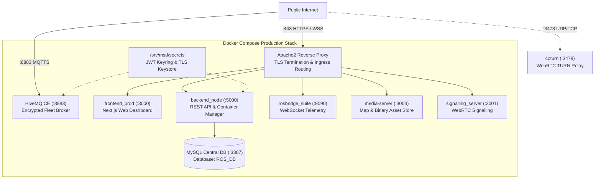
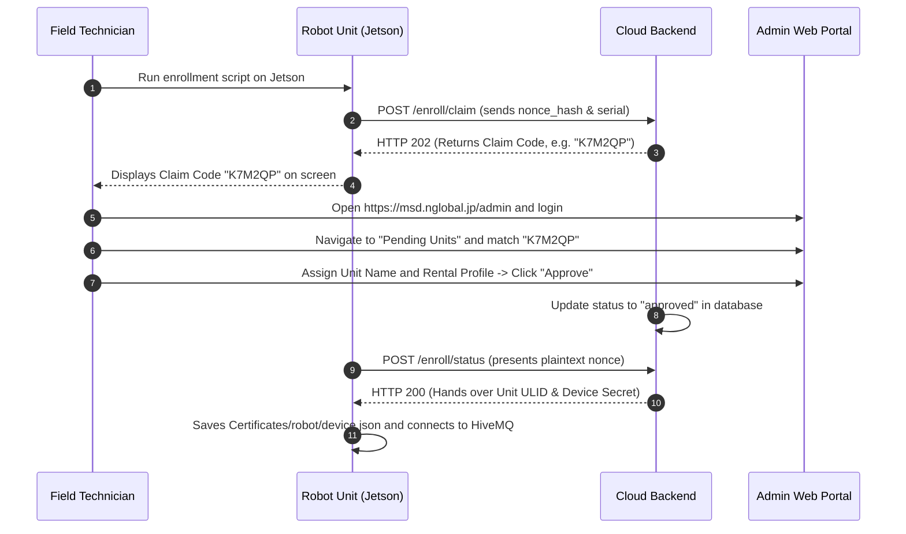

# サーバーのセットアップ

<RoleBadge role="technician" />

このガイドでは、**MSD700 クラウド サーバーと Web ダッシュボード** を展開するための段階的な手順を説明します。

続行する前に、[前提条件](/ja/setup/prerequisites) を完了してください。

::: info Production-First Architecture
このガイドのデフォルトは、標準の **実稼働展開** です。開発モードの手順と高度なカスタム パラメーターは、下部の [高度な構成](#advanced-configurations) セクションにあります。
:::

## システム トポロジ



## ディレクトリ構造の概要

コマンドを実行する前に、ホスト ファイル システム上でリポジトリがどのように構成されているかを理解してください。

```
~/ (e.g. /home/ubuntu)
└── ros-web-ui/                               # Main Server Repository (branch: v2)
    ├── docker-compose.yml                    # Docker Compose Multi-Service Definition
    ├── .env                                  # Environment & Port Configuration
    ├── scripts/
    │   └── secrets.sh                        # JWT Keyring Management Utility
    └── source/
        └── dependencies/
            ├── ROS-dashboard-backend/        # Express REST API (backend_node)
            ├── ROS-dashboard-next-ts/        # Frontend Dashboard (CLONED HERE, branch: v2)
            ├── media-server/                 # Static Map Media Server
            ├── signalling_server/            # WebRTC Camera Signalling
            └── ssl_update/
                └── update_ssl.sh             # Certbot to HiveMQ Keystore Converter
```

---

## コアの段階的なセットアップ

完全な運用サーバーを立ち上げるには、次の 6 つの手順を順番に実行してください。

### ステップ 1: リポジトリのクローンを作成する

ブランチ `v2` で `ros-web-ui` のクローンを作成し、`ROS-dashboard-next-ts` フロントエンド リポジトリを `source/dependencies/` に直接クローン作成します。

```bash
# 1. Clone main server repository on branch v2
git clone -b v2 https://github.com/itbdelaboprogramming/ros-web-ui.git ~/ros-web-ui

# 2. Clone the frontend dashboard repository directly into dependencies on branch v2
git clone -b v2 https://github.com/itbdelaboprogramming/ROS-dashboard-next-ts.git \
  ~/ros-web-ui/source/dependencies/ROS-dashboard-next-ts
```

::: tip Why is the frontend cloned inside dependencies?
Dockerfile は、`ros-web-ui` の Docker ビルド コンテキスト内で直接 Next.js フロントエンドをビルドします。 `source/dependencies/ROS-dashboard-next-ts` パスは親リポジトリによって gitignor されます。
:::

---

### ステップ 2: セキュリティ シークレットを初期化する

シークレットは `/srv/msd/secrets/` の Docker コンテナの外に存在し、イメージの再構築後も保持されます。

```bash
# 1. Navigate to the ros-web-ui repository
cd ~/ros-web-ui

# 2. Initialize the production JWT Keyring
sudo mkdir -p /srv/msd/secrets
./scripts/secrets.sh init

# 3. Verify that the keyring was created
./scripts/secrets.sh status
```

---

### ステップ 3: HiveMQ TLS キーストアを生成する

HiveMQ MQTT ブローカーには、ドメインの Let's Encrypt SSL 証明書から生成された PKCS#12 キーストアが必要です。

```bash
# 1. Obtain Let's Encrypt certificate for your server domain
sudo certbot certonly --standalone -d msd.nglobal.jp

# 2. Run the automated keystore generator script in ros-web-ui
cd ~/ros-web-ui
sudo ./source/dependencies/ssl_update/update_ssl.sh
```

このスクリプトは、UID `1001` 所有権と `0600` 権限を持つ `/srv/msd/secrets/hivemq/keystore.p12` を作成します。

---

### ステップ 4: 環境の構成 (`.env`)

`~/ros-web-ui/.env` に `.env` を作成します。

```bash
cd ~/ros-web-ui
nano .env
```

次の運用構成を貼り付けます。

```ini
# Storage path for recorded map files on the host
MAPS_FOLDER=/home/ubuntu/ros_maps

# Host User and Docker Group IDs (run: id -u, id -g, getent group docker | cut -d: -f3)
USER_UID=1001
USER_GID=1001
DOCKER_GID=998

# Idle timeout before stopping inactive unit containers (1800000 ms = 30 min)
UNIT_IDLE_TIMEOUT_MS=1800000

# Central Database Credentials
MYSQL_ROOT_PASSWORD=SetYourStrongRootPasswordHere
MYSQL_DATABASE=ROS_DB
MYSQL_USER=itbdelabo
MYSQL_PASSWORD=SetYourStrongUserPasswordHere

# MQTT Broker Settings
MQTT_BROKER_TYPE=nakayama
NAKAYAMA_HOST=msd.nglobal.jp
HIVEMQ_KEYSTORE=/srv/msd/secrets/hivemq/keystore.p12
HIVEMQ_UID=1001

# Production Port Map
MYSQL_PORT_PROD=3307
BACKEND_PORT_PROD=5000
MEDIA_SERVER_PORT_PROD=3003
SIGNALLING_PORT_WS_PROD=3001
SIGNALLING_PORT_HTTP_PROD=3002
HIVE_MQTT_TLS_PORT_PROD=8883
FRONTEND_PORT_PROD=3000

# WebRTC TURN Relay (coturn)
TURN_LISTENING_IP=192.168.100.14
TURN_EXTERNAL_IP=118.22.31.252/192.168.100.14
TURN_USER=msd700
TURN_PASSWORD=SetYourStrongTurnPasswordHere
```

---

### ステップ 5: 実稼働 Docker コンテナーを開始する

本番構成スタックを起動します。

```bash
cd ~/ros-web-ui

# Start production containers in detached mode
docker compose --profile server_prod up -d

# Verify all containers are Up or Healthy
docker compose --profile server_prod ps
```

---

### ステップ 6: Apache リバース プロキシを構成する

Apache はポート 443 で SSL を終了し、受信トラフィックを内部コンテナ ポートにルーティングします。

```bash
# 1. Enable required Apache modules
sudo a2enmod ssl proxy proxy_http proxy_wstunnel headers rewrite alias
sudo systemctl restart apache2
```

`/etc/apache2/sites-available/000-default-le-ssl.conf` を編集:

```apache
<IfModule mod_ssl.c>
<VirtualHost *:443>
    ServerName msd.nglobal.jp
    ServerAdmin webmaster@localhost
    DocumentRoot /var/www/html

    ErrorLog ${APACHE_LOG_DIR}/error.log
    CustomLog ${APACHE_LOG_DIR}/access.log combined

    ProxyAddHeaders On

    # 1. WebRTC Signalling Server (WebSocket)
    ProxyPass /services/signalling ws://localhost:3001
    ProxyPassReverse /services/signalling ws://localhost:3001

    # 2. Media Server (Map files and images)
    ProxyPass /services/media http://localhost:3003
    ProxyPassReverse /services/media http://localhost:3003

    # 3. Express REST API Backend
    ProxyPass /services/rosbackend http://localhost:5000
    ProxyPassReverse /services/rosbackend http://localhost:5000

    # 4. rosbridge WebSocket Server
    <Location /services/rosbridge>
        ProxyPass ws://localhost:9090 timeout=86400 keepalive=On flushpackets=on
        ProxyPassReverse ws://localhost:9090
        RequestHeader set Host "localhost:9090"
    </Location>

    # 5. Documentation Site Static Files
    ProxyPass /itbdelabo/docs !
    Alias /itbdelabo/docs /home/itbdelabo/ITBdeLabo/Documentation/msd700_documentation/docs/.vitepress/dist

    <Directory /home/itbdelabo/ITBdeLabo/Documentation/msd700_documentation/docs/.vitepress/dist>
        Options -Indexes -MultiViews +FollowSymLinks
        AllowOverride None
        Require all granted
        DirectoryIndex index.html

        RewriteEngine On
        RewriteCond %{REQUEST_FILENAME} !-f
        RewriteCond %{REQUEST_FILENAME} !-d
        RewriteCond %{REQUEST_FILENAME}.html -f
        RewriteRule ^ %{REQUEST_FILENAME}.html [L]

        ErrorDocument 404 /itbdelabo/docs/404.html
    </Directory>

    # 6. Web Dashboard Frontend (Catch-All, MUST BE LAST)
    ProxyPass / http://localhost:3000/
    ProxyPassReverse / http://localhost:3000/

    # SSL Certificate Paths
    SSLCertificateFile /etc/letsencrypt/live/msd.nglobal.jp/fullchain.pem
    SSLCertificateKeyFile /etc/letsencrypt/live/msd.nglobal.jp/privkey.pem
    Include /etc/letsencrypt/options-ssl-apache.conf
</VirtualHost>
</IfModule>
```

Apacheをリロードします:

```bash
sudo apache2ctl configtest
sudo systemctl reload apache2
```

---

## ユニット登録と登録の流れ

サーバーが実行されたら、物理ロボットを登録できます。



1. `https://msd.nglobal.jp/admin` で管理パネルにログインします。
2. **保留中のユニット** で、技術者がロボットに表示した 6 文字の請求コードを見つけます。
3. アクティブな **レンタル プロファイル**を選択し、ユニット表示ラベルを割り当てて、**承認** をクリックします。
4. ロボットは登録を完了し、すぐにフリート ダッシュボードに表示されます。

---

## 高度な構成

<details>
<summary><b>開発モード プロファイル (`server_dev`)</b></summary>

分離された開発スタックを本番環境と並行して実行するには、次の手順を実行します。

1. 開発キーリングを初期化します。
   ```bash
   cd ~/ros-web-ui
   ./scripts/secrets.sh init --dev
   ```

2. 開発プロファイルを開始します。
   ```bash
   docker compose --profile server_dev up -d
   ```

3. 開発ポートは衝突を防ぐためにオフセットされています。
   - MySQL 開発者: `3308`
   - 開発バックエンド: `5001`
   - 開発者 HiveMQ: `8884`
   - ロズブリッジ開発者: `9091`
   - 開発フロントエンド: `3100`

</details>

<details>
<summary><b>キーリングのローテーションと猶予期間</b></summary>

アクティブなユーザー セッションを終了せずに、アクティブな JWT 署名キーをローテーションします。

```bash
cd ~/ros-web-ui

# Rotate active key (old key remains valid for 48 hours)
./scripts/secrets.sh rotate --grace-hours 48

# Check status of keys in keyring
./scripts/secrets.sh status

# Remove expired keys after grace window
./scripts/secrets.sh prune
```

</details>

<details>
<summary><b>HiveMQ キーストアの手動作成</b></summary>

`update_ssl.sh` を使用せずにキーストアを手動で生成する場合:

```bash
sudo mkdir -p /srv/msd/secrets/hivemq
sudo openssl pkcs12 -export \
  -in   /etc/letsencrypt/live/msd.nglobal.jp/fullchain.pem \
  -inkey /etc/letsencrypt/live/msd.nglobal.jp/privkey.pem \
  -out  /srv/msd/secrets/hivemq/keystore.p12 \
  -name hivemq \
  -passout "pass:SetKeystorePasswordHere"

sudo chown -R 1001:1001 /srv/msd/secrets/hivemq
sudo chmod 700 /srv/msd/secrets/hivemq
sudo chmod 600 /srv/msd/secrets/hivemq/keystore.p12
```

</details>

---

## 検証とヘルスチェック

次の診断コマンドを実行して、すべてのサーバー サブシステムが動作していることを確認します。

```bash
# 1. Confirm all Docker containers are running
docker compose --profile server_prod ps

# 2. Test Apache HTTPS ingress
curl -sI https://msd.nglobal.jp/ | head -n 1

# 3. Test Backend API health endpoint
curl -s https://msd.nglobal.jp/services/rosbackend/

# 4. Check MQTT broker listening socket
sudo ss -lptn 'sport = :8883'
```

## 関連ドキュメント

- [ユニットのセットアップ](/ja/setup/unit-setup): 物理的な Jetson SBC を構成します。
- [システム セットアップ](/ja/setup/system-setup): エンドツーエンドの統合と調整。
- [Docker リファレンス](/ja/setup/docker-reference): コンテナーのオプションとライフサイクルの詳細。