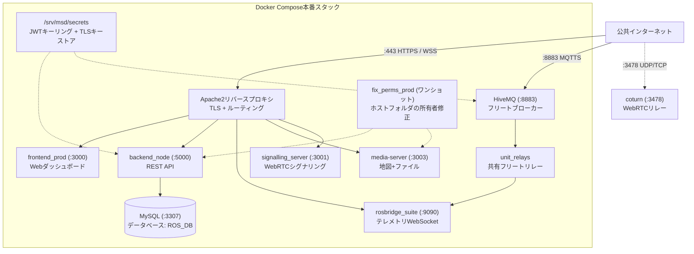
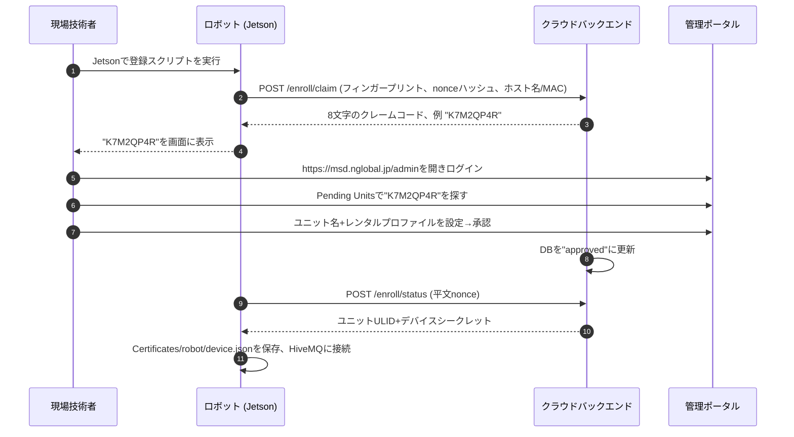

# サーバー構築

<RoleBadge role="technician" />

**MSD700クラウドサーバーとWebダッシュボード**のデプロイ方法です。

先に[前提条件](/ja/setup/prerequisites)を済ませてください。

::: info 本番優先
このページは**本番**をデプロイします。開発モードと追加設定は下の[高度な設定](#高度な設定)にあります。
:::

## システム構成



::: warning フリートモードがデフォルトです
共有`unit_relays`コンテナ1台が全フリートを担当します。ユニット単位の`rosweb_unit_*`コンテナはレガシーモード(`UNIT_CONTAINERS_ENABLED=true`)でのみ存在します。`server_prod`と`server_dev`を1台のホストで同時に動かさないでください。`coturn`は本番専用です。MySQL (`3307`)とバックエンドは全インターフェースで待ち受けるため、ファイアウォールの内側に置きます([前提条件](/ja/setup/prerequisites)参照)。
:::

## フォルダ構成

```
~/ (例 /home/ubuntu)
└── ros-web-ui/                      # サーバーリポジトリ (ブランチ: v2)
    ├── docker-compose.yml
    ├── .env                         # ホスト別設定、git管理下 (Step 4参照)
    ├── Docker/
    │   ├── Dockerfile               # サーバーイメージ (./sourceを取り込み、バインドマウントなし)
    │   ├── hivemq/config.xml        # ブローカー設定、本番+開発で1ファイル
    │   └── coturn/turnserver.conf   # 共有TURNポリシー (アドレスは.envに)
    ├── scripts/
    │   └── secrets.sh               # JWTキーリングツール
    └── source/
        └── dependencies/
            ├── ROS-dashboard-backend/
            ├── ROS-dashboard-next-ts/  # フロントエンド (ネストしたクローン、ブランチv2、gitignore)
            ├── media-server/
            ├── signalling_server/
            ├── aws_mqtt/               # MQTTブリッジ+フリートリレーヘルパー
            ├── topic2string/
            ├── network-agent/
            ├── shared/
            └── ssl_update/
                └── update_ssl.sh       # Certbot更新+HiveMQキーストア生成
```

フロントエンドは`source/dependencies/ROS-dashboard-next-ts`内の独立したgitチェックアウトです(独自`.git`を持ち、親リポジトリでは無視されます)。Dockerイメージは`./source`を`COPY`で取り込むため、アプリコード編集後は**リビルド**が必要です。再起動だけでは反映されません。

---

## 構築手順

次の6ステップを順番に実行します。

### Step 1: リポジトリのクローン

```bash
# 1. メインサーバーリポジトリ、ブランチv2
git clone -b v2 git@github.com:itbdelaboprogramming/ros-web-ui.git ~/ros-web-ui

# 2. フロントエンドリポジトリをdependenciesへ、ブランチv2
git clone -b v2 git@github.com:itbdelaboprogramming/ROS-dashboard-next-ts.git \
  ~/ros-web-ui/source/dependencies/ROS-dashboard-next-ts
```

::: tip なぜdependenciesの中か?
Dockerfileが`ros-web-ui`のビルドコンテキスト内からフロントエンドをビルドするためです。このパスは親リポジトリでgitignoreされています。
:::

---

### Step 2: シークレットの作成

シークレットはコンテナ外の`/srv/msd/secrets/`に置き、リビルドしても残るようにします。

```bash
cd ~/ros-web-ui
sudo mkdir -p /srv/msd/secrets
./scripts/secrets.sh init     # jwt_keyring.jsonを作成、上書きしません
./scripts/secrets.sh status   # 確認 (シークレット値は表示されません)
```

`--dev`は開発スタック用の別ファイル`jwt_keyring.dev.json`を使います。旧`JWT_SECRET`からの移行は`init --seed-legacy <old-secret>`を使います。

---

### Step 3: HiveMQキーストアの生成

HiveMQにはLet's Encrypt証明書から作るPKCS#12キーストアが必要です。

```bash
cd ~/ros-web-ui
sudo ./source/dependencies/ssl_update/update_ssl.sh
```

`certbot renew`を実行し、`/srv/msd/secrets/hivemq/keystore.p12`を書き込みます(所有者`1001`、モード`600`)。注意点:

- スクリプトはドメイン`msd.nglobal.jp`とこのパスに固定です。エクスポートパスワードは`Docker/hivemq/config.xml`と一致させます。
- 1つのキーストアファイルを**本番・開発**両ブローカーで使います。
- HiveMQは起動時に一度だけ読むため、後は**ブローカーを再起動**します。メンテナンス時間帯に行います。再起動はフリート全体のMQTTを切断し、10秒ウォッチドッグ(`/emergency_pause`)が発動する場合があります。
- `certbot renew`だけではHiveMQは更新され**ません**。[メンテナンス](/ja/setup/maintenance#証明書)参照。

---

### Step 4: `.env`の記入

```bash
cd ~/ros-web-ui
nano .env
```

```ini
# このホストの地図保存先
MAPS_FOLDER=/home/ubuntu/ros_maps

# ホストユーザー+dockerグループID (確認: id -u; id -g; getent group docker | cut -d: -f3)
USER_UID=1001
USER_GID=1001
DOCKER_GID=998

# アイドル状態のオペレーターのユニット占有を30分で解放
UNIT_IDLE_TIMEOUT_MS=1800000

# データベース (初回起動前に強いパスワードを設定)
MYSQL_ROOT_PASSWORD=SetYourStrongRootPasswordHere
MYSQL_DATABASE=ROS_DB
MYSQL_USER=itbdelabo
MYSQL_PASSWORD=SetYourStrongUserPasswordHere

# MQTTブローカー
MQTT_BROKER_TYPE=nakayama
NAKAYAMA_HOST=msd.nglobal.jp
HIVEMQ_KEYSTORE=/srv/msd/secrets/hivemq/keystore.p12
HIVEMQ_UID=1001

# 本番ポート
MYSQL_PORT_PROD=3307
BACKEND_PORT_PROD=5000
ROSBRIDGE_PORT_PROD=9090
MEDIA_SERVER_PORT_PROD=3003
SIGNALLING_PORT_WS_PROD=3001
SIGNALLING_PORT_HTTP_PROD=3002
HIVE_MQTT_TLS_PORT_PROD=8883
FRONTEND_PORT_PROD=3000

# 開発ポート (別スタック、同ホスト)
MYSQL_PORT_DEV=3308
BACKEND_PORT_DEV=5001
ROSBRIDGE_PORT_DEV=9091
MEDIA_SERVER_PORT_DEV=4003
SIGNALLING_PORT_WS_DEV=4001
SIGNALLING_PORT_HTTP_DEV=4002
HIVE_MQTT_TLS_PORT_DEV=8884
FRONTEND_PORT_DEV=3100

# ビルド時にダッシュボードへ焼き込む公開アドレス
SERVER_PUBLIC_IP=118.22.31.252

# TURNリレー (本番専用、コンテナ起動時に4つ全て必須)
TURN_LISTENING_IP=192.168.100.14
TURN_EXTERNAL_IP=118.22.31.252/192.168.100.14
TURN_USER=msd700
TURN_PASSWORD=SetYourStrongTurnPasswordHere
```

::: warning `.env`はgit管理下でホスト別です
`DOCKER_GID`、`MAPS_FOLDER`、`TURN_*`、`SERVER_PUBLIC_IP`、パスワードはプロジェクトではなく**このマシン**の値です。`git pull`で上書きされ、コミットで漏洩します。ホストごとに確認し、他ホストのファイルをコピーしないでください。`FRONTEND_PORT_PROD`変更時はApacheのキャッチオールも編集します。TURN認証情報のローテーションはリレー再起動+リビルドが必要です([メンテナンス](/ja/setup/maintenance#turnリレー)参照)。
:::

---

### Step 5: 本番コンテナの起動

```bash
cd ~/ros-web-ui

# fix_perms_prodが自動で先に実行されます。プロファイルなしでは何も起動しません
docker compose --profile server_prod up -d

# 全てUpまたはhealthyか確認 (fix_perms_*は通常exit 0)
docker compose --profile server_prod ps
```

アプリソースやDockerfileを変えるコードをpullした後はリビルドします:`up -d --build`(イメージは`source/`をバインドマウントしません)。本番`up`は`coturn`も起動します。フラグ一覧は[Dockerリファレンス](/ja/setup/docker-reference)。

---

### Step 6: Apacheの設定

Apacheはポート443でTLSを終端し、コンテナへ振り分けます。

```bash
sudo a2enmod ssl proxy proxy_http proxy_wstunnel headers rewrite alias
sudo systemctl restart apache2
```

`/etc/apache2/sites-available/000-default-le-ssl.conf`を編集:

```apache
<IfModule mod_ssl.c>
<VirtualHost *:443>
    ServerName msd.nglobal.jp
    ServerAdmin webmaster@localhost
    DocumentRoot /var/www/html

    ErrorLog ${APACHE_LOG_DIR}/error.log
    CustomLog ${APACHE_LOG_DIR}/access.log combined

    ProxyAddHeaders On

    # 1. WebRTCシグナリング (WebSocket)
    ProxyPass /services/signalling ws://localhost:3001
    ProxyPassReverse /services/signalling ws://localhost:3001

    # 2. メディアサーバー (地図、画像)
    ProxyPass /services/media http://localhost:3003
    ProxyPassReverse /services/media http://localhost:3003

    # 3. バックエンドREST API
    ProxyPass /services/rosbackend http://localhost:5000
    ProxyPassReverse /services/rosbackend http://localhost:5000

    # 4. rosbridge WebSocket
    <Location /services/rosbridge>
        ProxyPass ws://localhost:9090 timeout=86400 keepalive=On flushpackets=on
        ProxyPassReverse ws://localhost:9090
        RequestHeader set Host "localhost:9090"
    </Location>

    # 5. ドキュメントサイト (除外はキャッチオールより上に)
    ProxyPass /itbdelabo/docs !
    Alias /itbdelabo/docs /home/itbdelabo/ITBdeLabo/V2/msd700_documentation/docs/.vitepress/dist

    <Directory /home/itbdelabo/ITBdeLabo/V2/msd700_documentation/docs/.vitepress/dist>
        Options -Indexes -MultiViews +FollowSymLinks
        AllowOverride None
        Require all granted
        DirectoryIndex index.html

        RewriteEngine On
        RewriteCond %{REQUEST_FILENAME} !-f
        RewriteCond %{REQUEST_FILENAME} !-d
        RewriteCond %{REQUEST_FILENAME}.html -f
        RewriteRule ^ %{REQUEST_FILENAME}.html [L]

        ErrorDocument 404 /itbdelabo/docs/404.html
    </Directory>

    # 6. ダッシュボードフロントエンド (キャッチオール、必ず最後)
    ProxyPass / http://localhost:3000/
    ProxyPassReverse / http://localhost:3000/

    SSLCertificateFile /etc/letsencrypt/live/msd.nglobal.jp/fullchain.pem
    SSLCertificateKeyFile /etc/letsencrypt/live/msd.nglobal.jp/privkey.pem
    Include /etc/letsencrypt/options-ssl-apache.conf
</VirtualHost>
</IfModule>
```

実ホストには追加ブロックがあります(MQTT WebSocket、webhook、旧ドキュメント、`/development/`のBasic認証)。原則:`ProxyPass /`は最後に、`ProxyPass ... !`の除外はその上に置きます。

```bash
sudo apache2ctl configtest
sudo systemctl reload apache2
```

---

## ユニット登録 (エンロールメント)

サーバー稼働後、ロボットを登録できます:



1. `https://msd.nglobal.jp/admin`にログインします。
2. **Pending Units**でロボット表示の8文字コードを探します。
3. 有効な**レンタルプロファイル**を選び、ユニット名を付けて**承認**します。
4. ロボットが登録を完了し、フリートダッシュボードに表示されます。

---

## 高度な設定

<details>
<summary><b>開発モード (`server_dev`)</b></summary>

同ホスト上の分離された開発スタック:

```bash
cd ~/ros-web-ui
./scripts/secrets.sh init --dev
docker compose --profile server_dev up -d
```

開発ポート: MySQL `3308`、バックエンド`5001`、HiveMQ `8884`、rosbridge `9091`、ROSマスター`11312`(本番`11311`)、フロントエンド`3100`、メディア`4003`、シグナリング`4001` WS / `4002` HTTP。

開発は別ファイル`jwt_keyring.dev.json`を使いますが、キーストアファイルは本番と共通です。`coturn`は本番専用のままです。

</details>

<details>
<summary><b>全員をログアウトさせない鍵ローテーション</b></summary>

```bash
cd ~/ros-web-ui
./scripts/secrets.sh rotate --grace-hours 48  # 旧鍵は48時間有効
./scripts/secrets.sh status
./scripts/secrets.sh prune                    # 期間後に期限切れ鍵を削除
```

</details>

<details>
<summary><b>HiveMQキーストアの手動作成</b></summary>

`update_ssl.sh`が使えない場合のみ:

```bash
sudo mkdir -p /srv/msd/secrets/hivemq
sudo openssl pkcs12 -export \
  -in   /etc/letsencrypt/live/msd.nglobal.jp/fullchain.pem \
  -inkey /etc/letsencrypt/live/msd.nglobal.jp/privkey.pem \
  -out  /srv/msd/secrets/hivemq/keystore.p12 \
  -name hivemq \
  -passout "pass:<must-match-Docker-hivemq-config.xml>"

sudo chown -R 1001:1001 /srv/msd/secrets/hivemq
sudo chmod 700 /srv/msd/secrets/hivemq
sudo chmod 600 /srv/msd/secrets/hivemq/keystore.p12
```

パスワードは`Docker/hivemq/config.xml`と一致させます。後はブローカーを再起動します。

</details>

---

## ヘルスチェック

```bash
# 1. コンテナ稼働中?
docker compose --profile server_prod ps

# 2. Apache HTTPSはOK?
curl -sI https://msd.nglobal.jp/ | head -n 1

# 3. バックエンドAPIは応答?
curl -s https://msd.nglobal.jp/services/rosbackend/

# 4. MQTTブローカーは待受中?
sudo ss -lptn 'sport = :8883'

# 5. フリートリレー稼働中?
docker ps --filter name=unit_relays
```

## 関連

- [ユニット構築](/ja/setup/unit-setup): Jetsonロボットのセットアップ。
- [システム構築](/ja/setup/system-setup): サーバーとユニットの連携確認。
- [Dockerリファレンス](/ja/setup/docker-reference): コンテナの詳細。
