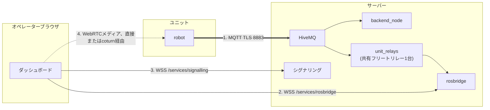

# システム構築

<RoleBadge role="technician" />

完成した[サーバー](/ja/setup/server-setup)と完成した[ユニット](/ja/setup/unit-setup)が一つのシステムとして動作することの確認方法です。両ページの手順とユニット登録が済んでいれば、ここは新規設定ではなく確認が中心です。

## 概要

ユニットとサーバーは**独立に故障する**経路で通信します。それらを切り分けることがここの要点です。



| # | 経路 | 運ぶもの | 故障時の様子 |
| --- | --- | --- | --- |
| 1 | MQTT | コマンド、フィードバック、全ストリーム | ユニットが**オフライン**。全滅 |
| 2 | rosbridge | ブラウザのクラウドトピック購読 | ユニットは**オンライン**、コマンド可、地図が空白 |
| 3 | シグナリング | WebRTCネゴシエーション | 映像なし、それ以外は正常 |
| 4 | WebRTCメディア | カメラ映像自体 | LAN内では映るが外部では映らない:TURNリレー |

#2に似たもう一つの故障:ユニットはオンライン、rosbridgeも接続済みだが、共有フリートリレー(`unit_relays`)が停止し、rosbridgeが読むクラウドトピックが存在しない。同じ空白地図、原因は別です。`docker ps --filter name=unit_relays`で確認してください。(ユニット単位の`rosweb_unit_*`コンテナはレガシーモード(`UNIT_CONTAINERS_ENABLED=true`)でのみ存在します。)

## 1. ネットワーク経路の確認

| 送信元 | 宛先 | ポート | 用途 |
| --- | --- | --- | --- |
| ユニット | サーバー | `8883` TCP (本番)または`8884` (開発) | 全て。唯一の必須 |
| ブラウザ | サーバー | `443` TCP | ダッシュボード、API、rosbridge、シグナリング |
| ブラウザ | サーバー | `3478` UDP+TCP+リレー範囲 | 直接経路がない場合のWebRTC映像 |

```bash
# ユニットから:ブローカーに届くか?
nc -zv msd.nglobal.jp 8883

# ブローカーの証明書は有効か?
openssl s_client -connect msd.nglobal.jp:8883 -servername msd.nglobal.jp </dev/null 2>/dev/null \
  | openssl x509 -noout -subject -dates
```

::: warning 期限切れ証明書は黙って失敗します
ダッシュボードのWebSocket接続が開かず、ブラウザには一般的なネットワークエラーしか出ません。他を調べる前に証明書を確認してください。MQTT証明書はApacheとは**別ファイル**で、同じPEMから作ります:[メンテナンス](/ja/setup/maintenance#証明書)参照。
:::

::: info 本番か開発か?
ユニット側の`./scripts/docker-manager.sh up --dev`は登録とMQTTを`server_prod`ではなく`server_dev`に向けます:ポート別、DB別、フリート別です。テスト中はこれを使い、本番ではフラグを外します。開発で登録したユニットは本番には**登録されません**。逆も同様です。
:::

## 2. ユニット登録の確認

管理コンソールの**Registered Units**で、[ユニット構築](/ja/setup/unit-setup)で承認したユニットを探します。ULIDをメモしてください。

```bash
# サーバー上で。共有フリートリレーがRUNNINGでないとこれらのトピックは存在しません。
docker ps --filter "name=unit_relays"
docker exec -it ros_web_ui_v2_nakayama_ros bash -lc \
  'source /home/itbdelabo/ros-web-ui-ws/devel/setup.bash && rostopic list | grep unit_<ULID>'
```

`/unit_<ULID>/system_command`、`/unit_<ULID>/system_feedback`、`/unit_<ULID>/server/robot_pose`のようなトピックが見えるはずです。他にエラーがないのに何も見えない場合、このシステムで最も多い「黙った故障」です。

ブローカーを直接見る方法もあります。「ロボットが配信していない」のか「クラウドリレーが動いていない」のか切り分けられます:

```bash
mosquitto_sub -h msd.nglobal.jp -p 8883 --capath /etc/ssl/certs \
  -t '/unit_<ULID>/#' -v | head -20
```

## 3. エンドツーエンドのチェックリスト

上から順に進めます。各項目で上の図の経路を一つずつ除外します。

- [ ] サーバー正常: `docker compose --profile server_prod ps`ですべて`Up`または`healthy`
- [ ] ユニットのROSグラフ正常: ユニットコンテナ内の`rosnode list`にbringupノードが見える
- [ ] Registered Unitsでユニットが**オンライン**(経路1、MQTT)
- [ ] 共有フリートリレー稼働中: `docker ps --filter name=unit_relays`
- [ ] ユニットを開くと現在位置とライブ地図が見える(経路2、rosbridge)
- [ ] カメラ映像がユニットLANの**外から**見える(経路3と4)
- [ ] W-A-S-D操作でロボットが動き、ダッシュボード位置が追従する
- [ ] クリックナビのゴールが受理され、ロボットが走行する
- [ ] Emergency Stopを一度テストし、即停止する
- [ ] 操作中にブラウザを閉じると約2秒以内にロボットが停止する(クラウドダッシュボードの場合。ローカルダッシュボードは5 Hzのheartbeatがタブと一緒に止まるため即座に停止)

::: warning 最後の4つを飛ばさないでください
片方向のコマンド経路が壊れていても、オンライン表示・映像正常に見える場合があります。動かす指示を出して初めて分かります。切断テストは安全動作です:周囲に空間を確保して一度わざと実行してください。
:::

## 4. 引き渡し

全チェック通過後、オペレーターに渡す前に残り2つあります:

1. **ダッシュボード権限の付与。** 管理コンソールで、このユニットを含むレンタルプロファイルにオペレーターのアカウントを追加します。登録済みだけでは誰にも見えません:アクセスはユニットではなくプロファイルで管理されます。
2. **[ユーザーガイド](/ja/user-guide/)の案内。** そこはこの状態(インストール済み、接続済み、権限付与済み)を前提にしています。

## 次のステップ

- 新デプロイの[メンテナンス](/ja/setup/maintenance)計画を立てます。
- [トラブル対処](/ja/setup/troubleshooting)を手元に置きます。
