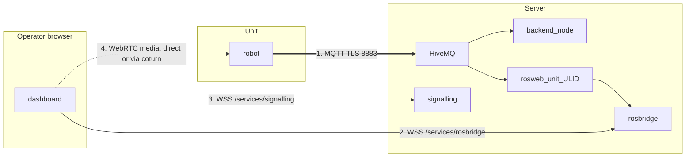

# システムセットアップ

<RoleBadge role="technician" />

設定済みの[サーバ](/ja/setup/server-setup)と設定済みの[ユニット](/ja/setup/unit-setup)の確認方法
実際には 1 つのシステムとして連携して動作します。これらのページの両方を順番にたどった場合、
ユニットは正常に登録されました。これの大部分は、新しい構成ではなく検証です。

## 概要

ユニットとサーバーは、**独立して**障害が発生したチャネルを介して通信します。それらを区別するのは、
スキル全体がここにあります。



| # |チャンネル |キャリー |壊れた様子 |
| --- | --- | --- | --- |
| 1 | MQTT |コマンド、フィードバック、およびすべてのストリームを文字列として |ユニットには **オフライン** と表示されます。何も機能しません |
| 2 |ロズブリッジ |クラウド側で型指定されたトピックに対するブラウザのサブスクリプション |ユニットは **オンライン**、コマンドは機能します、マップ キャンバスは空白です |
| 3 |シグナリング | WebRTC ピア ネゴシエーション |ビデオはありませんが、その他は問題ありません |
| 4 | WebRTC メディア |カメラ画像自体 |ビデオは LAN 上で動作し、LAN から離れることはありません。それがTURNリレーです |

番号 2 に似た 5 番目の障害があります。ユニットはオンラインで、ロスブリッジは接続されています。
しかし **ユニットごとのコンテナがまだ実行できるほど最近そのユニットを開いた人は誰もいません**、
したがって、rosbridge がサブスクライブするクラウド側リレーは存在しません。同じ真っ白なキャンバスでも違う
原因。 `docker ps --filter name=rosweb_unit_` に確認してください。

## 1. ネットワークパスを確認する

|から |へ |ポート | | に必要です
| --- | --- | --- | --- |
|単位 |サーバー | `8883` TCP (製品) または `8884` TCP (開発) |すべて。これは唯一の必須のものです |
|オペレータブラウザ |サーバー | `443` TCP |ダッシュボード、API、ロスブリッジ、シグナリング |
|オペレータブラウザ |サーバー | `3478` UDP+TCP とリレー範囲 |直接パスがない場合の WebRTC ビデオ |

```bash
# From the Unit: can it reach the broker at all?
nc -zv msd.nglobal.jp 8883

# And is the certificate the broker presents actually valid?
openssl s_client -connect msd.nglobal.jp:8883 -servername msd.nglobal.jp </dev/null 2>/dev/null \
  | openssl x509 -noout -subject -dates
```

::: warning An expired certificate fails silently in the browser
ダッシュボードの WebSocket 接続がまったく開きません。ほとんどのブラウザでは、
コンソールに一般的なネットワーク エラーが表示されるため、何かを追跡する前に証明書を確認してください。注記
MQTT ブローカーの証明書は Apache の証明書とは **別のアーティファクト** であり、同じものから再構築されたものであること
PEM ファイル: [メンテナンス](/ja/setup/maintenance#certificates) を参照してください。
:::

::: info Choosing production vs. dev
本体側（`./scripts/docker-manager.sh up --dev`）の`--dev`ポイント登録とMQTT
`server_prod` ではなく、サーバーの `server_dev` プロファイルにブリッジします: 異なるポート、異なる
データベース、異なるフリート。新しいユニットまたはサーバー側をテストする場合には、これは正しい選択です。
変化;実際にデプロイする場合はフラグを外してください。ユニットのアイデンティティは、メンバー間で共有されません*。
2 つ目: dev に対して登録しても prod には登録されず、その逆も同様です。
:::

## 2. ユニットが正しく登録されていることを確認します

管理コンソールの **登録済みユニット** で、承認したユニットを見つけます。
[ユニット設定](/ja/setup/unit-setup)。その ULID に注目してください。次のチェック時に必要になります。

```bash
# On the Server. The per-unit container has to be RUNNING for these topics to exist,
# so open the unit in the dashboard first, or start it by hand.
docker ps --filter "name=rosweb_unit_"
docker exec -it ros_web_ui_v2_nakayama_ros bash -lc \
  'source /home/itbdelabo/ros-web-ui-ws/devel/setup.bash && rostopic list | grep unit_<ULID>'
```

`/unit_<ULID>/system_command`、`/unit_<ULID>/system_feedback`、および
`/unit_<ULID>/server/robot_pose`。ここには何も表示されず、他のどこにもエラーはありません。
このシステムで最も一般的な「壊れているように見えますが、その理由はわかりません」という症状です。

ブローカーを直接監視することもできます。これにより、「ロボットが公開していない」ことと「
クラウドリレーが実行されていません":

```bash
mosquitto_sub -h msd.nglobal.jp -p 8883 --capath /etc/ssl/certs \
  -t '/unit_<ULID>/#' -v | head -20
```

## 3. エンドツーエンドの検証チェックリスト

このリストを下に向かって進めていきます。各項目は、概要図内のチャネルの 1 つを除外します。

- [ ] サーバーは正常です: `docker compose --profile server_prod ps` はすべてのサービスを示します `Up` または `healthy`
- [ ] ユニットの ROS グラフは正常です: ユニットのコンテナ内の `rosnode list` には起動ノードが表示されます
- [ ] ユニットは管理コンソールの登録済みユニット リストに **オンライン** と表示されます (チャネル 1、MQTT)
- [ ] ユニットごとのコンテナが実行中です: `docker ps --filter name=rosweb_unit_`
- [ ] ユニットを開くと、最新のロボットの位置とライブマップが表示されます (チャンネル 2、ロスブリッジ)
- [ ] ライブカメラのフィードが **ユニットの LAN の外側から**表示されます (チャンネル 3 および 4)
- [ ] W-A-S-D の小さな動きで実際にロボットが動き、ダッシュボードの位置がそれに追従します
- [ ] クリックしてナビゲートする目標が受け入れられ、ロボットがその目標に向けて走行します
- [ ] 緊急停止 (1 回テスト済み) はロボットを即時に停止します
- [ ] 動作中にブラウザを閉じると、約 10 秒以内にロボットが一時停止します。

::: warning Do not skip the last four
コマンド パスが遮断されている間、ユニットは完全に接続されているように見えます (オンライン バッジ、ビデオが動作している)。
一方向であり、それは何かが移動するように要求された場合にのみ表示されます。切断テストが重要
同様に、これは安全動作であり、それが機能するかどうかを知る唯一の方法は、それをトリガーすることです
周囲に空きスペースのあるロボット上で意図的に 1 回だけ。
:::

## 4.引き継ぎ

検証に合格すると、ユニットは日常的に使用できるようになります。その前にまだやるべきことが 2 つあります
それをオペレーターに渡します。

1. **ダッシュボードへのアクセスを許可します。** 管理コンソールで、オペレーターのアカウントをレンタルに追加します。
   本機を含むプロファイルを選択します。存在し、登録されているユニットは、それだけでは完成しません。
   すべてのユーザー アカウントに表示されます。ユニットはフリート全体のリソースを共有し、それらへのアクセスは
   ユニット自体ではなく、プロファイルを通じて完全に制御されます。
2. **[Getting Started](/ja/getting-started/) を参照してください。** このセクションでは、まさに次の状態を想定しています。
   すでにインストールされ、接続され、アクセスが許可されているユニット。

## 次のステップ

- 新しい展開の [メンテナンス](/ja/setup/maintenance) スケジュールを設定します。
- 今後の問題に備えて、[トラブルシューティング](/ja/setup/troubleshooting) を手元に置いておいてください。