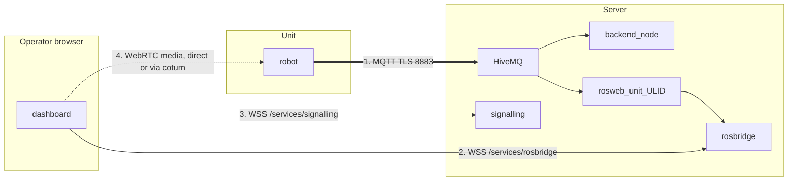

# システムセットアップ

<RoleBadge role="technician" />

設定済みの [サーバー](/ja/setup/server-setup) と設定済みの [ユニット](/ja/setup/unit-setup) が
実際に 1 つのシステムとして連携して動作していることを確認する方法です。両方のページを順番どおりに実施し、
ユニットの登録(enrolment)が成功していれば、ここでの作業のほとんどは新規設定ではなく検証です。

## 概要

ユニットとサーバーは、**それぞれ独立して**障害が発生し得る複数のチャンネルを介して通信します。それらを
見分けることが、ここで求められるスキルのすべてです。



| # | チャンネル | 運ぶもの | 故障時の見え方 |
| --- | --- | --- | --- |
| 1 | MQTT | コマンド、フィードバック、すべてのストリーム(文字列として) | ユニットが**オフライン**と表示される。何も動作しない |
| 2 | rosbridge | クラウド側の型付きトピックに対するブラウザの購読(subscription) | ユニットは**オンライン**、コマンドは動作するが地図キャンバスが空白 |
| 3 | signalling | WebRTC のピアネゴシエーション | 映像なし、それ以外は正常 |
| 4 | WebRTC メディア | カメラ映像そのもの | LAN 内では映像が動作するが、LAN の外では一切動作しない。これは TURN リレーの問題 |

番号 2 のように見える 5 番目の障害があります。ユニットはオンラインで rosbridge も接続されていますが、
**そのユニット専用のコンテナがまだ稼働し続けられるほど最近誰も開いていない**ため、
rosbridge が購読しているクラウド側のリレーが存在しないケースです。同じ空白のキャンバスですが、原因は
異なります。`docker ps --filter name=rosweb_unit_` で確認してください。

## 1. ネットワーク経路の確認

| 送信元 | 宛先 | ポート | 用途 |
| --- | --- | --- | --- |
| ユニット | サーバー | TCP `8883`(本番)または TCP `8884`(開発) | すべての基盤。唯一の必須項目 |
| オペレーターのブラウザ | サーバー | TCP `443` | ダッシュボード、API、rosbridge、signalling |
| オペレーターのブラウザ | サーバー | UDP+TCP `3478` とリレー範囲 | 直接経路がない場合の WebRTC 映像 |

```bash
# From the Unit: can it reach the broker at all?
nc -zv msd.nglobal.jp 8883

# And is the certificate the broker presents actually valid?
openssl s_client -connect msd.nglobal.jp:8883 -servername msd.nglobal.jp </dev/null 2>/dev/null \
  | openssl x509 -noout -subject -dates
```

::: warning 期限切れの証明書はブラウザで静かに失敗する
ダッシュボードの WebSocket 接続が単に開かなくなります。ほとんどのブラウザはコンソールに汎用的な
ネットワークエラー以上の有用な情報を表示しないため、他の原因を追う前にまず証明書を確認してください。
なお、MQTT ブローカーの証明書は Apache のものとは**別の成果物**であり、同じ PEM ファイルから再構築
されたものです。[メンテナンス](/ja/setup/maintenance#certificates) を参照してください。
:::

::: info 本番と開発の選択
ユニット側の `--dev`(`./scripts/docker-manager.sh up --dev`)は、登録(enrolment)と MQTT ブリッジを
サーバーの `server_prod` ではなく `server_dev` プロファイルに向けます。ポートも、データベースも、
フリートも異なります。新しいユニットやサーバー側の変更をテストしている間はこれが正しい選択ですが、
実際にデプロイする際はこのフラグを外してください。ユニットの ID は両者の間で共有され*ません*。
dev に対して登録しても prod には登録されず、その逆も同様です。
:::

## 2. ユニットが正しく登録されたことを確認する

管理コンソールの **Registered Units** で、[ユニットセットアップ](/ja/setup/unit-setup) で承認した
ユニットを探します。その ULID をメモしてください。次の確認で必要になります。

```bash
# On the Server. The per-unit container has to be RUNNING for these topics to exist,
# so open the unit in the dashboard first, or start it by hand.
docker ps --filter "name=rosweb_unit_"
docker exec -it ros_web_ui_v2_nakayama_ros bash -lc \
  'source /home/itbdelabo/ros-web-ui-ws/devel/setup.bash && rostopic list | grep unit_<ULID>'
```

`/unit_<ULID>/system_command`、`/unit_<ULID>/system_feedback`、`/unit_<ULID>/server/robot_pose` のような
トピックが表示されるはずです。ここで何も表示されず、かつ他のどこにもエラーがない場合、それがこの
システムにおける「壊れているように見えるが理由を教えてくれない」という最も典型的な症状です。

ブローカーを直接監視することもできます。これにより「ロボットが publish していない」のか
「クラウド側のリレーが動いていない」のかを切り分けられます。

```bash
mosquitto_sub -h msd.nglobal.jp -p 8883 --capath /etc/ssl/certs \
  -t '/unit_<ULID>/#' -v | head -20
```

## 3. エンドツーエンド検証チェックリスト

このリストを上から順に確認してください。各項目は、概要図にあるチャンネルのうち 1 つを除外していきます。

- [ ] サーバーが正常: `docker compose --profile server_prod ps` ですべてのサービスが `Up` または `healthy`
- [ ] ユニットの ROS グラフが正常: ユニットのコンテナ内で `rosnode list` を実行すると bringup ノードが表示される
- [ ] 管理コンソールの Registered Units 一覧でユニットが**オンライン**と表示される(チャンネル 1、MQTT)
- [ ] ユニット専用コンテナが稼働中: `docker ps --filter name=rosweb_unit_`
- [ ] ユニットを開くと最新のロボット位置とライブ地図が表示される(チャンネル 2、rosbridge)
- [ ] ライブカメラ映像が**ユニットの LAN 外から**表示される(チャンネル 3 と 4)
- [ ] W-A-S-D の小さな移動操作で実際にロボットが動き、ダッシュボードの位置表示が追従する
- [ ] クリックナビゲーションのゴールが受け入れられ、ロボットがそこまで走行する
- [ ] Emergency Stop を 1 回テストし、ロボットが即座に停止する
- [ ] 操作中にブラウザを閉じると、約 10 秒以内にロボットが一時停止する

::: warning 最後の4項目を省略しないこと
ユニットは、コマンド経路が片方向で壊れていても、完全に接続されているように見える(オンラインバッジ、
映像も正常)ことがあり、それは実際に何か動かすよう指示して初めて明らかになります。切断テストも同様に
重要です。これは安全に関わる挙動であり、それが機能することを知る唯一の方法は、周囲に十分な空間がある
ロボットで意図的に一度トリガーしてみることです。
:::

## 4. 引き渡し

検証に合格したら、そのユニットは日常運用の準備が整っています。オペレーターに引き渡す前に、まだ
やるべきことが2つあります。

1. **ダッシュボードへのアクセスを付与する。** 管理コンソールで、このユニットを含むレンタルプロファイルに
   オペレーターのアカウントを追加します。ユニットが存在し登録済みであるというだけでは、どのユーザー
   アカウントに対しても自動的に可視化されるわけではありません。ユニットはフリート全体で共有される
   リソースであり、それへのアクセスはユニット自体ではなくプロファイルを通じて完全に制御されます。
2. **[はじめに](/ja/getting-started/) へ案内する。** そのセクションはまさにこの状態、つまり既にインストール
   され、接続され、アクセス権が付与されたユニットを前提としています。

## 次のステップ

- 新しいデプロイのために [メンテナンス](/ja/setup/maintenance) スケジュールを設定します。
- 今後の問題に備えて [トラブルシューティング](/ja/setup/troubleshooting) を手元に置いておきます。
