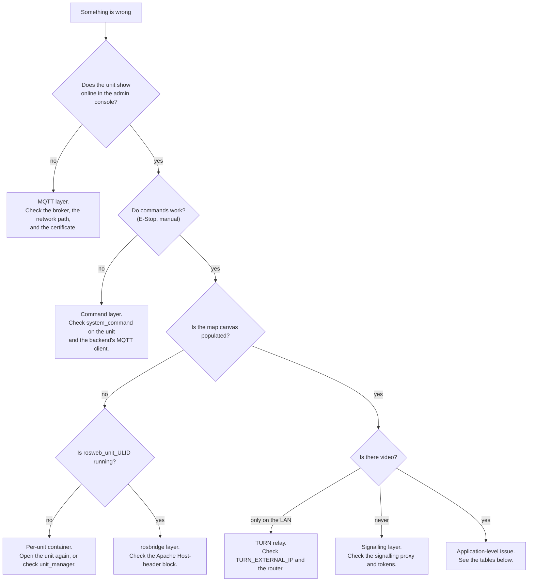

# トラブルシューティング

<RoleBadge role="technician" />

インストールおよび展開の問題に関する技術診断。ユーザーが直面する問題については、代わりに [はじめに > トラブルシューティング](/ja/getting-started/troubleshooting) を参照してください。

## ここから始めましょう: どの層が壊れていますか?

## 診断チェックリスト

これらを順番に処理してください。それぞれがレイヤー全体を除外します。

1. **サーバーは実行されていますか?** `docker compose --profile server_prod ps`: すべてのサービスが表示されるはずです
   `Up` または `healthy` ([サーバーセットアップ](/ja/setup/server-setup#_7-verify))。
2. **ユニットのコンテナは実行されていますか?** ユニット上の `./scripts/docker-manager.sh status`。
3. **ユニットは正常に登録されましたか?** 管理コンソールで **登録されたユニット** を確認してください。
   ULID、それがオンラインで表示されます。
4. **ユニットごとのコンテナは実行されていますか?** サーバー上で `docker ps --filter name=rosweb_unit_`。
5. **ネットワーク パスは開いていますか**。
   [システムセットアップ](/ja/setup/system-setup#_1-confirm-the-network-path)?
6. **ログを確認します**: サーバー上の `docker compose logs -f <service>`、
   ユニット上の `docker exec -it msd700 tmux attach -t robot_services` (Windows: `roscore`、
   `ros_webui`、`camera_client`、`switch_mode`、`log_janitor`)。

## よくある問題

|症状 |考えられる原因 |修正 |
| --- | --- | --- |
|ロボットが起動し、すべてが正常に見えますが、ダッシュボードには何も表示されません。ユニットの ULID が、ダッシュボード/管理コンソールに記録されているものと一致しません。これは**サイレントに**失敗します。ROSは、誰もサブスクライブしていない名前空間にパブリッシュするだけです。 |サーバー側の `rostopic list \| grep unit_<ULID>` で ID を確認し、管理コンソールの登録ユニットと照合してください。 `UNIT_ID` を手動で設定する場合は、必ず大文字にしてください。ULID エンコードでは大文字と小文字が区別されなくても、トピック名では大文字と小文字が区別されます。 |
| `docker: permission denied` ユニット上 |あなたのユーザーは (まだ) `docker` グループに属していないか、グループのメンバーシップがこのシェルに適用されていません。 `sudo usermod -aG docker $USER`、ログアウトしてから再度ログインします (現在のシェルの場合は `newgrp docker`) |
| RViz/Gazebo ウィンドウが開かない | X11 転送はコンテナ内からは許可されません。コンテナを起動する前に、ホスト上で `xhost +local:docker` |
| `catkin_make`/`catkin build` がコンテナ内で失敗します。通常、依存関係が欠落しているか、`logs/` がワークスペース独自のログ ディレクトリにマウントされています (uid の不一致: ホスト コピーの所有者は uid 2002、コンテナ内ビルド ユーザーは 1000)。シェル (`./scripts/docker-manager.sh shell`) 内で再実行して、実際のエラーを確認します。 `logs/` を `/workspace/logs` の上にマウントしないでください。
| `up` の直後の `Connection lost` でバックエンドが起動できない |バックエンドは MySQL のヘルス チェックが完了する前に開始され、通常はワークスペースのビルドが遅い (コールド キャッシュ) 場合にのみ表示されます。自動的に再試行されるはずです。そうでない場合は、`docker compose ps` が DB を `healthy` として表示してから、`docker compose up -d <backend service>` を再度実行します。
|プロファイルのバックアップが保存できない | `/srv/msd/media/backup` (または `_dev`) はまだ存在しないか、アプリのユーザーによって所有されていません。ワンショット権限フィクサーを明示的に起動します: `docker compose up fix_perms_prod` (または `fix_perms_dev`)、`ls -la /srv/msd/media/backup` を確認します。
| `resource not found: gazebo_ros` で最初の起動時にシミュレーターのビルドが失敗する |イメージは `--simulator` なしでビルドされました。Gazebo はデフォルトでは依存関係として宣言されていないため、ストック イメージには依存関係がありません。 `./scripts/docker-manager.sh build --simulator`、次に `up --simulator` |
|開発用ラップトップ (実際の Jetson ではない) でのみ、マップの保存が権限エラーで失敗します。 `docker/.env` の `USER_UID`/`USER_GID` は、依然として自分のユーザーではなく Jetson のデフォルト (2002) を指しています。独自の `id -u`/`id -g` に設定します。
|すでに存在するコンテナーは正常に起動しません。以前の `down`/crash から残ったコンテナ/ネットワークの状態 | `docker compose down --remove-orphans`、その後元に戻します |
|マップ キャンバスは空白ですが、ユニットはオンラインでコマンドは機能します。ユニットごとのコンテナーが実行されていないため、rosbridge がサブスクライブしているクラウド側のリレーは存在しません。 `docker ps --filter name=rosweb_unit_`。ダッシュボードでユニットを再度開きます。それでも表示されない場合は、バックエンド ログの `unit_manager` 行を確認してください。
|ブラウザ コンソールに rosbridge ハンドシェイクの失敗が表示される | Apache は `Host` ヘッダーを書き換えずに rosbridge をプロキシしているため、rosbridge は `missing port in HTTP Host header` に応答します。 [サーバー セットアップ](/ja/setup/server-setup#the-vhost-block) から `<Location /services/rosbridge>` ブロックを追加します。
|すべての WebSocket パスは失敗しますが、HTTP パスは問題ありません。 `mod_proxy_wstunnel` は有効になっていません | `sudo a2enmod proxy_wstunnel && sudo systemctl restart apache2` |
|カメラのフィードは LAN 上で機能し、外部からは機能しません | TURN リレーが到達不能なアドレスをアドバタイズしているか、そのポートが転送されていません。 `TURN_EXTERNAL_IP` をチェックするとルーターが転送されます。 [メンテナンス](/ja/setup/maintenance#the-turn-relay) を参照してください。
| TLS エラーによりフリート全体が一度にオフラインになります。 HiveMQ キーストアは期限切れの証明書を提供しています。 `certbot renew` だけでは更新されません。 `sudo ./source/dependencies/ssl_update/update_ssl.sh`、メンテナンス期間中にブローカーを再起動します。
| `coturn` はループ内で再起動され、決してバインドされません。 apt/systemd `coturn` はまだポート 3478 を保持しています。 `sudo systemctl disable --now coturn`、コンテナを起動します |
|バックエンド ログ `ECONNREFUSED 127.0.0.1:1883` が繰り返し発生します | `MQTT_BROKER_TYPE` が設定されていない、または `nakayama` ではないため、バックエンドは何もサービスを提供しないローカル ブローカーにフォールバックしました。 `.env` に `MQTT_BROKER_TYPE=nakayama` を設定し、バックエンドを再作成します。
|バックエンド ログ `EACCES /var/run/docker.sock` がユニット コンテナーが表示されない | `DOCKER_GID` はこのホストの Docker グループと一致しません。 `getent group docker \| cut -d: -f3`、`.env` を修正、バックエンドを再作成 |
|新しいエンドポイントは、ソースが明らかにそれを持っているユニットに対して 404 を返します。ユニットのローカル サーバー イメージが古いです。これらのサービスはイメージに**コピー**され、バインドマウントされません。 `./scripts/docker-manager.sh local-build`、次に `up` |
|ローカルモードのソースを編集した後、バッジに画像が古いと表示される | 2026 年 8 月 13 日以降、`up` は警告 (`[WARN] ... OUT OF DATE`) のみを実行し、古いイメージを実行し続けます。自動的に再構築されなくなりました。そのため、ユニットをオンラインにするのにインターネットは必要ありません。意図的に再構築します: `./scripts/docker-manager.sh local-build` (またはロボット イメージの場合も `build`)、または `up --build` の両方を実行して 1 つのコマンドで開始します。

## 知っておく価値のある回帰

過去のいくつかの事件は、症状が明らかに示すものではないため、一目で認識する価値があります。
彼らの理由で：

- **動作していたユニットがコード更新後に表示されなくなり、それ以外の場合はビルドが表示されなくなります。
  問題ありません。** `CATKIN_IGNORE` マーカー ファイルが誤ってパッケージにコミットされていないか確認してください
  それはロボットの*唯一*の構築可能なコピーです。このようなことは以前にも発生しました (`robot_pose_publisher`)
  `navigation.launch` は、実際の原因を示す明らかなエラーなしでサイレントに中止されます。
- **ナビゲーションとマッピングが完全にフリーズし、「シミュレートされた時間」に関する TF エラーが表示されます。** これは、
  `/use_sim_time` は、`/clock` パブリッシャーのない roscore で `true` をスタックしました。単独での起動の再開
  古い値は 1 つのノードではなく ROS マスター上に存在するため、これは修正されません。これは
  デプロイメントミスではなく、コードレベルのバグです。ローカルで回避しようとするのではなく、エスカレーションしてください。

- **普通に運転しているロボットには「ロボットスタック」のバナーが表示されます。** これは常にそうなっていることが判明しました。
  `idle_detector` 独自のロジック (スティッキー アンカー ポイント、または低速には大きすぎる変位しきい値)
  モーション)、決してフロントエンドではありません。参照
  [状態と動作](/ja/development/state-and-behavior#idle-and-stuck-arbitration)。
- **取材実行により、明らかに掃討されていないエリアに「到着」が報告されました。** 今すぐ救済
  `aborted` をパブリッシュし、「失敗」と読み取りますが、実行が失敗するのは N 回**連続** 失敗した場合のみです。
  断続的に残りの脚を完了しても `complete` として終了します。それを認識します
  不完全なカバレッジ オーバーレイの隣にある `arrived` 状態。
- **ローカル ダッシュボードのみ: オートパイロットは「作動しませんでした」と表示されますが、ロボットは正常に動作しています
  ** 両方とも同じ欠落ホップです。 2026-08-15まで
  `local.launch` は、ダッシュボードからロボットへの文字列トピックを中継しましたが、それ以外の方法では何も中継しませんでした。
  ダッシュボードがリッスンしている間にスーパーバイザが `/string/operation_snapshot` を公開しました
  `/unit_<ULID>/string/operation_snapshot`。 `rostopic list | grep operation_` で確認してください
  ユニット: プレフィックスの付いていないツインのないフラットな名前がフィンガープリントです。クラウドパスは決して存在しませんでした
  MQTT が両方向をブリッジするため、影響を受けます。
- **掃き掃除された部屋でも、すべての壁に沿ってまだ掃いていない部分があります。** その一部は幾何学であり、一部は
  それはバグでした。床は壁あたり `wall_clearance - body_half_width` = 0.225 m であり、どのプランも可能ではありません。
  倒せ。幅が広い場合は、クリアランスが複数回適用されていることを意味します。ジオメトリを読んでください。
  起動時にブロック `path_coverage` が出力され、有効セットバックが 0.575 m であることを確認します。
  1.10メートル。参照
  [ブーストロフェドン § 2 つのロボット ジオメトリ](/ja/development/boustrophedon-and-alignment#_1-two-robot-geometries)。
- **ジオメトリの問題はロボットでは再現されますが、シミュレーターでは再現されません。** 2026 年 8 月 19 日までは、
  シミュレートされたロボットは TurtleBot3 Waffle から派生したもので、実際のロボットに対して 0.266 x 0.266 m のボディでした。
  0.90×0.70mのもの。内接半径 0.133 m は、0.425 m の半径を止めるギャップを通過します。
  狭い通路での苦情は再現できませんでした。さらに悪いことに、世界は小さなロボットと一致しました。
  `turtlebot_world` の最高点は 0.39 m なので、実際のロボットは 1 つのスペースに収まりません。
  それのセル。 `msd700_simulation msd700_warehouse_nav.launch` を使用すると生成されます。
  `msd700_field.urdf.xacro` を 14 x 21 m のホールに実物大で展示します。参照
  【シミュレーション】(@@MU8@@)。
- **Gazebo は空の灰色のグリッドで開き、マップは空白になります。** サードパーティの世界は
  決して取得されませんでした。 Gazebo は `world_name` が欠落しても失敗しません。何も開かず、何も言いません。
  そして、下流の症状はすべて危険なニシンです。走る
  `rosrun msd700_simulation fetch_sim_worlds.sh`。ウェアハウスの起動が読み取り可能なエラーで中止されるようになりました。
  代わりにメッセージが表示されますが、ベンダー ディレクトリで `world_path` を指定して手動で起動することは可能です。
  これを打ちます。
- **シミュレートされたロボットは、おそらく通過できない 2 つの棚の脚の間の経路を計画します。** `move_base`
  リアルサイズのボディの下にワッフルのフットプリントを搭載しています。 `sim_body:=field` を渡すとロードされます
  `_sim` バリアントの代わりに `costmap_common_params.yaml` (1.20 x 0.85 m エンベロープ)
  (0.28×0.31メートル)。で確認してください
  `rosparam get /move_base/global_costmap/footprint`。
- **AMCL のポーズは、大きなマップの開けた中央をさまよっています。** `laser_max_range` のデフォルトは 3.5 m、
  部屋に入るくらいの大きさのフィギュアです。 21 メートルのホールでは、パーティクルが可能な唯一のロングリターンを破棄します。
  に対して重み付けされます。これは現在 `amcl.launch` の引数です。倉庫リグは 12.0 に合格します。
- **狭い廊下には掃き出し路がまったくありません。** ロボットが進入し、移動するには 1.15 m の距離が必要です。
  インサイドで折り返すまで1.77メートル。最初の図の下では、自由空間の侵食によりコリドーが除去されています。
  完全に計画するものは何もありません。 `rostopic echo -n1 /msd700/coverage_debug` は描画されたものを示します
  エリアとカバー可能エリアを比較します。これは、「廊下が狭すぎる」ことを最も簡単に判断する方法です。
  「プランナーが失敗した」より。
- **出入り口の後ろの部屋全体が掃除されることはありません。** 空きスペースの抽出は、
  最大の連結ブロブであるため、クリアランスの 2 倍より狭い出入り口が部屋を分断し、
  何もメッセージも残さず消えてしまいました。現在は、到達不能のフラグが付けられ、マップ上で影付きで返されます。
  `/msd700/uncovered_regions`。部屋が再び消えた場合は、プランナーの前にそのトピックを確認してください。
- **ロボットは、車線内のボックスの周りを走行するのではなく、車線を諦めます。** これが L4 再計画です。
  ループが発火しない。残りのレーンの `~replan_blocked_fraction` をブロックする必要があります。または
  `~replan_failure_streak` が連続して失敗すると、次の頻度で起動されなくなります。
  `~replan_min_interval`。体よりも小さい障害物は意図的に決して作動させません。
  地元のプランナーはすでにそれらを回避しています。
- **スイープ パスは、単純な前後のコームではなく、スクランブルされているように見えます。** 2 つの設定によって形成されます。
  `~lane_order` は `adjacent` である必要があります (`skip` は意図的に 1、3、5、次に 6、4、2 をスイープします)。
  `~turn_style` は `square` でなければなりません。どちらもデフォルトです。起動ファイルがまだ渡されています
  `lane_order:=skip` が一般的な原因です。正方形のパス上の斜めの脚は、
  設定: ロボットがそのコーナーで旋回できなかったため、プランナーが元の位置に戻ったことを意味します。
  フィットする最短の操作。 `rostopic echo -n1 /msd700/coverage_debug` と `turn_clearance`
  スタートアップ ブロックの行は、コーナーに 0.885 m のスペースがあるかどうかを示します。
- **パスは片側を最初に終了するのではなく、柱を何度も飛び越えます。** 列をスキャンします。
  穴を横切るものは別のバンドにグループ化されることになっています。そうでない場合は、すべての列
  横断費用がかかります。 `~boustrophedon_decomposition` が `true` であることを確認します。
  穴が含まれていると、まずバンドのグループ化に負荷がかかります。
- **ロボットは各レーンの端で振動します。** ターンが合いません。その場でのターンの必要性
  自由半径0.885メートル。岬の通行が禁止されている場合、車線は壁のすぐ近くまで続きます。
  部屋がありません。 `~headland` が `true` であること、および TEB カバレッジ プロファイルが適用されていることを確認します (
  ログにはそう書かれています）したがって、ロボットは後進することができます。
- **古い実行のボストロフェドン スイープ ラインは、新たにログインした後に再び表示されます。** オーバーレイ トピックは次のとおりです。
  2 Hz でラッチされて再放送され、長い間、それを無視する唯一のものは
  `sessionStorage` ログアウト時に消去するフラグ。再び戻ってきた場合は、何もせずに終了した実行を探してください。
  ブラウザではなく端末 `coverage_status` に到達します。
- **ログイン後、完了した操作は「進行中」として戻り、カバレージエリアが再描画され、
  all.** スーパーバイザは `stop` または `complete` でのみバッチを削除します。忘れた出口パス
  送信すると、完了した実行 `active` がラッチされたスナップショットに残り、セッション回復によりそれが復元されます。
  まさに設計通り。参照
  [状態と動作 § セッションの回復](/ja/development/state-and-behavior#session-recovery)。
- **ロボットはキャンセルされた操作を続行します。** エリアリストは**ラッチ付き**で公開されます。
  トピックなので、キャンセルしてもクリアされず、次に開始するカバレッジ ノードが古いエリアを選択します。
- **`skipped profile_units ...: parent row not present`、ユニットのマップの一部のみがプルダウンされます
  (例: 7 of 30).** `sync_state` は、どのレンタル プロファイルではなく、タイムスタンプのウォーターマークのみを保存するために使用されます。
  に範囲が定められていました。ユニットを別のテナントに再レンタルすると、古いウォーターマークが静かに残ります。
  ユニットが受信したことがない場合でも、**そのプロファイル**にとって新しい行をフィルターで除外しました。
  `last_pull_profile_id` も記録し、ハンドシェイクのたびに完全な再プルを強制することで修正されました。
  プロファイルはこれに同意しませんが、すでにこれに該当するユニットには必要があります
  `node scripts/migrate_sync.js --profile <name> --apply` 修正が有効になる前。参照
  [データ同期 § ウォーターマークはレンタル プロファイルに限定されます](/ja/development/data-sync#watermarks-are-scoped-to-a-rental-profile-not-just-a-clock)。
- **同期は成功を報告しますが、レンタルとその下のすべてのマップが到着しません。** `units` は、
  一方、`profile_units.unit_id` および
  `maps_data.unit_id` 両方の外部キーをそれに入れます。欠落している親行は通常のスキップされたものとして扱われました
  トラフィックはサイレントに、エラーも出力されず、`skipped` カウントも出力されないため、データのブランチ全体が送信されます。
  ラウンドがまだ `ok` を報告している間に同期に失敗する可能性があります。同じような形のサイレントギャップが現れたら
  もう一度、トランスポートではなく、`sync_tables.js` のレジストリを最初に確認してください。
- **一方の側で削除されたマップは、データベース行がすでに削除された後も、もう一方のディスクを占有します。
  ** トゥームストーンはデータベース行のみを削除するために使用されます。どちらが墓石を受け取ったとしても
  (元の削除を実行した側ではなく) 同期を通じて `.pgm`/`.yaml` が削除されたことはありません
  サムネイルファイル。この問題が修正される前に蓄積されたファイルは、遡って自動的にクリーンアップされません。
  手動スイープが必要です。
- **クラウド管理コンソールから転送、交換、またはクリアされたマップがユニットに到達しない、または
  クリアされると再び表示されます。** SQL の作成に使用される管理者の転送/スワップ/クリア/復元エンドポイント
  `sync_engine.js` を経由するのではなく直接、墓石を記録することはありませんでした。
  通常の削除は行います。部隊側から見ると、何事もなかったかのように見えましたが、
  次のプッシュにより、クラウド内の「削除された」マップが復活しました。これらすべてをルーティングすることで修正されました。
  通常の削除と同じトゥームストーン書き込みパス。
- **同期パス内のどこにも `HEX()` の ID を指定しないでください。** `toBinary()` は生の `BINARY(16)` を期待しており、
  ULID は Crockford Base32 の 26 文字であるため、32 文字の 16 進文字列を完全に拒否します。
  32 の 16 進文字ではありません。 `collectChanges needs a rental profile` は 15% で止まっており、まさに次のとおりでした。
  プロファイル検索は `HEX(pu.profile_id)` で書き込まれており、それを使用するすべての行は解決できませんでした。

症状が次のいずれかに似ている場合 (表面的にはもっともらしいですが、上記のチェックリストはそうではありません)
説明してください）、それは推測し続けるのではなくエスカレートする信号です。

## エスカレーション

チェックリストと上の表では表示されている内容が説明できない場合、または問題が次のとおりであることが判明した場合
導入ミスではなくソフトウェア/ロジックのバグの場合は、開発チームにエスカレーションします。
[ドキュメント](/ja/development/) セクションに、チェックリストのどのステップで最初に問題が発生したかを含めます。
問題と関連するログ出力。