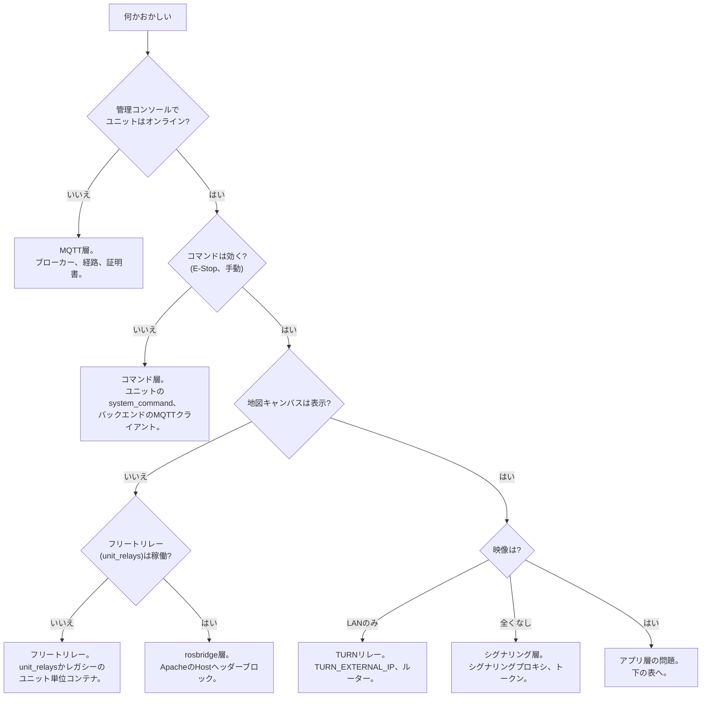

# トラブル対処

<RoleBadge role="technician" />

インストールとデプロイの問題対処です。ユーザー向けの問題は[ユーザーガイド>トラブル対処](/ja/user-guide/troubleshooting)を見てください。

::: info 役割分担
トラブル対処3ページは症状を役割で分担します:[ユーザーガイド](/ja/user-guide/troubleshooting)がオペレーター対処(マップ選択、再読込、再試行)、当ページが技術者対処(ポート、env、コンテナ、ログ)、[開発者向け診断](/ja/development/troubleshooting-guide)が根本原因を担当します。症状の修正は直せる役割のページで行い、リンクして重複させません。
:::

## 最初に:どの層が壊れているか?

## 診断チェックリスト

先に環境とマシンを決めます。クラウドサーバー上のV2チェックアウトは実機ユニットではありません。Jetsonの診断にロボットランチャーを動かさないでください。コンテナ稼働だけではROSノード・MQTTブリッジ・ブラウザ接続の正常を証明しません。

1. **サーバースタック稼働?** `ros-web-ui`から`docker compose --profile server_prod ps`(開発は`server_dev`+`_dev`名)。長期サービスは`Up`/`healthy`のはず。`fix_perms_*`は通常exit `0`のワンショットです。
2. **ユニットコンテナ稼働?** ユニット上で`./scripts/docker-manager.sh status`。
3. **ユニット登録済み?** 管理コンソールの**Registered Units**でULIDを探し、オンライン表示を確認。
4. **フリートリレー稼働?** サーバー上で`docker ps --filter name=unit_relays`。
5. **ネットワーク経路は開通?** [システム構築](/ja/setup/system-setup#_1-ネットワーク経路の確認)のポート。
6. **ログ**: サーバーで`docker compose logs -f <service>`、ユニットで`docker exec -it msd700 tmux attach -t robot_services`(ウィンドウ: `roscore`、`ros_webui`、`camera_client`、`switch_mode`、`log_janitor`、`token_refresh`)。

読み取り専用のROS確認は**稼働中**コンテナに`docker exec`で入ります(`shell`は停止中コンテナを起動する場合あり)。ROSワークスペースをsourceし、新しいシェルごとに正しいマスターを指定します:クラウド本番`http://localhost:11311`、クラウド開発`http://localhost:11312`、ロボット`http://localhost:11321`、ロボット`--dev`は`http://localhost:11322`。`rosnode list`、`rostopic list`、`rosparam get /use_sim_time`は動かさずに状態を見ます。運転やE-Stop切替での診断は禁止です。通信が別プロセスに届く場合、`ss -ltnp`でポート所有者を確認します(意図せぬIDEポート転送を含む)。

::: warning 診断での秘密保護
ログ、起動出力、`docker inspect`、解決済みCompose出力に認証情報が含まれる場合があります。共有前にパスワード・トークン・デバイスシークレット・認証ヘッダーを伏せます。完全ダンプの代わりに`config --quiet` / `config --services`を使います。
:::

## よくある問題

| 症状 | 可能性の高い原因 | 対処 |
| --- | --- | --- |
| ロボット動作中だがダッシュボードに何も出ない | ユニットULID不一致:ROSが誰も読まない名前空間に配信。無言の失敗 | サーバー側で`rostopic list \| grep unit_<ULID>`し、Registered Unitsと照合。手動`UNIT_ID`は大文字に(トピック名は大文字小文字を区別) |
| ユニットで`docker: permission denied` | ユーザーがまだ`docker`グループ外 | `sudo usermod -aG docker $USER`後ログアウト/イン(このシェルは`newgrp docker`) |
| RViz/Gazeboウィンドウが開かない | コンテナからのX11が未許可 | ホストで先に`xhost +local:docker` |
| コンテナ内の`catkin build`失敗 | 依存不足か`robot_pose_publisher`重複(ros-web-ui同梱+msd700_robotサブモジュール) | シェル(`docker-manager.sh shell`)で真のエラーを確認。迷子の`CATKIN_IGNORE`をチェック |
| `up`直後にバックエンド`Connection lost` | MySQLヘルスチェック通過前にバックエンドが先走り | `ps`でDB `healthy`確認後に`up -d <backend service>`を再実行 |
| プロファイルバックアップの保存失敗 | `/srv/msd/media/backup`(または`_dev`)がないかアプリユーザーが書けない | 権限修正を実行:`docker compose --profile server_prod up fix_perms_prod`(開発は同等物) |
| シミュレータービルド失敗`resource not found: gazebo_ros` | `--simulator`なしでビルドしたイメージ | `docker-manager.sh build --simulator`後`up --simulator` |
| 地図保存の権限エラー、開発PCのみ | `docker/.env`の`USER_UID`/`USER_GID`がJetsonデフォルトのまま | 自分の`id -u` / `id -g`に設定(空の時のみ自動検出) |
| 既存コンテナが正常起動しない | 前回実行の残り状態 | そのComposeファイルから`down --remove-orphans`後`up` |
| 地図空白、ユニットオンライン、コマンド可 | フリートリレー欠落/未登録か下流の地図/rosbridge問題 | `unit_relays[_dev]`コンテナとログを確認。欠落リレーはComposeが作成します。マネージャーは既存の再起動のみです。開発の修正に本番を起動しないでください。レガシーは対応する`rosweb_unit_*`サフィックス |
| ブラウザコンソールでrosbridgeハンドシェイク失敗 | Apacheが`Host`ヘッダー書換なしでrosbridgeをプロキシ | [サーバー構築](/ja/setup/server-setup)の`<Location /services/rosbridge>`ブロックを追加 |
| WebSocket経路全滅、HTTPは正常 | `mod_proxy_wstunnel`が無効 | `sudo a2enmod proxy_wstunnel && sudo systemctl restart apache2` |
| カメラはLAN内のみ、外部なし | TURNが到達不能アドレスを広告かポート未転送 | `TURN_EXTERNAL_IP`+ルーター転送を確認([メンテナンス](/ja/setup/maintenance#turnリレー)) |
| フリート全体が同時オフライン、TLSエラー | HiveMQが期限切れ証明書を提示(`certbot renew`だけでは更新されません) | `sudo ./source/dependencies/ssl_update/update_ssl.sh`後メンテナンス時間帯にブローカー再起動 |
| `coturn`がループしバインドしない | apt/systemd版`coturn`がポート3478を保持 | `sudo systemctl disable --now coturn`後コンテナ起動 |
| バックエンドログ`ECONNREFUSED 127.0.0.1:1883` | 旧起動や上書きがMQTTをループバックに向けた。現サーバーデフォルトは`nakayama` | そのサービスのconfigを修正し限定再作成。(ユニットの`backend_local`は意図的ループバック:`mosquitto_local`を確認) |
| バックエンドログ`EACCES /var/run/docker.sock` | `DOCKER_GID`がホストのdockerグループと不一致 | `getent group docker \| cut -d: -f3`で確認し`.env`修正、バックエンド再作成 |
| ソースにある新エンドポイントがユニットで404 | 古いローカルサーバーイメージ(ソースはバインドマウントでなく**コピー**) | `./scripts/docker-manager.sh local-build`後`up` |
| ランチャーがローカルイメージ旧版と警告 | 通常`up`は設計上古いイメージを再利用 | `local-build`・`build`・`up --build`でリビルド。稼働中ロボットは再作成まで旧イメージのまま |

## 既知の過去バグ (見分けてエスカレーション)

デプロイミスに見えますがコードのバグです。上のチェックリストで説明できず、以下に該当したら推測を続けず開発にエスカレーションします:

- 動作中のユニットがコード更新後に消えた(ビルドは正常に見える):ビルド可能唯一コピーへの迷子`CATKIN_IGNORE`(`robot_pose_publisher`で発生)。
- TF「simulated time」エラーでナビ/地図が凍結:`/use_sim_time`が`/clock`発行者なしで`true`固定。bringup再起動では直りません。古い値はROSマスター上にあります。
- 開発ユニットのブローカーログが`msd.nglobal.jp`:正常です。開発と本番は同マシンでポート分離(`8884`開発)し、TLS証明書はその名前です。ポートを見てください。
- 開発/simユニットが再起動後にhardware-on-productionで戻る:旧`msd700.service`がモードフラグを落としました。`grep ExecStart /etc/systemd/system/msd700.service`を確認し、希望フラグで`up`再実行します。
- Databaseからの地図表示が遅い、または前セッションの部屋が一瞬出る:片側のmap-on-demand部品欠落。クラウド側`/unit_<ULID>/string/map_request`とロボットの`map_compression_node`ログ`Map resend requested`を確認。
- 未走査エリアにCoverage「到着」報告、またはCoverage中のWASDで実行破損:カバレッジ状態のバグ。`path_coverage`ログで確認後エスカレーション。
- 再現しないシミュレーター形状の不満:旧simは小型TurtleBot3ボディと小型ワールドでした。`msd700_simulation msd700_warehouse_nav.launch`(実寸ボディ、14×21 mホール)を使います。
- 同期成功だがデータ欠落、削除した地図が復活:同期エンジンの隅条件(ウォーターマーク範囲、tombstone、登録漏れ)。同期状態エンドポイントを確認しログ付きでエスカレーション。

## エスカレーション

チェックリストと表で説明できない場合、ソフトウェアのバグの匂いがする場合は開発にエスカレーションします:最初に失敗したチェックリスト手順と関連ログ(伏せ字済み)を添えます。
