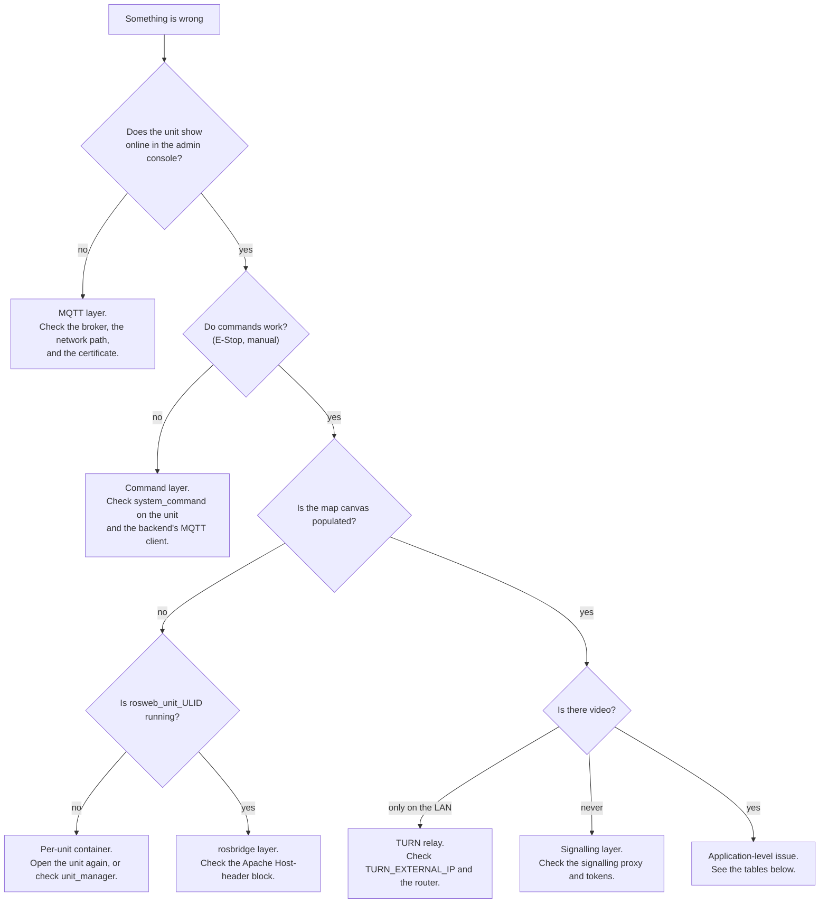

# Troubleshooting

<RoleBadge role="technician" />

Technical diagnostics for installation and deployment issues. For user-facing issues, see [User Guide &gt; Troubleshooting](/ja/user-guide/troubleshooting) instead.

## Start here: which layer is broken?

## Diagnostic checklist

Work through these in order: each one rules out an entire layer.

1. **Is the Server running?** `docker compose --profile server_prod ps`: every service should show
   `Up` or `healthy` ([Server Setup](/ja/setup/server-setup#_7-verify)).
2. **Is the Unit's container running?** `./scripts/docker-manager.sh status` on the Unit.
3. **Did the Unit enrol successfully?** Check **Registered Units** in the admin console for its
   ULID, and that it shows online.
4. **Is the per-unit container running?** `docker ps --filter name=rosweb_unit_` on the Server.
5. **Is the network path open**, on the ports in
   [System Setup](/ja/setup/system-setup#_1-ネットワーク経路の確認)?
6. **Check the logs**: `docker compose logs -f <service>` on the Server,
   `docker exec -it msd700 tmux attach -t robot_services` on the Unit (windows: `roscore`,
   `ros_webui`, `camera_client`, `switch_mode`, `log_janitor`).

## Common issues

| Symptom | Likely cause | Fix |
| --- | --- | --- |
| Robot starts, everything looks fine, but the dashboard shows nothing for it | The unit's ULID doesn't match what the dashboard/admin console has on record. This fails **silently**: ROS just publishes into a namespace nobody is subscribed to. | Confirm the id with `rostopic list \| grep unit_<ULID>` on the Server side, and cross-check against the admin console's Registered Units. If you ever set `UNIT_ID` by hand, make sure it's uppercase: the topic name is case-sensitive even though the ULID encoding isn't. |
| `docker: permission denied` on the Unit | Your user isn't (yet) in the `docker` group, or the group membership hasn't applied to this shell | `sudo usermod -aG docker $USER`, then log out and back in (or `newgrp docker` for the current shell) |
| RViz/Gazebo windows don't open | X11 forwarding isn't allowed from inside the container | `xhost +local:docker` on the host, before starting the container |
| `catkin_make`/`catkin build` fails inside the container | Usually a missing dependency, or `logs/` mounted over the workspace's own log directory (a uid mismatch: the host copy is owned by uid 2002, the in-container build user is 1000) | Re-run inside a shell (`./scripts/docker-manager.sh shell`) to see the real error; do not mount `logs/` over `/workspace/logs` |
| Backend fails to start with `Connection lost` right after `up` | The backend started before MySQL finished its health check, usually only visible when the workspace build was slow (cold cache) | It should retry automatically; if it doesn't, `docker compose up -d <backend service>` again once `docker compose ps` shows the DB as `healthy` |
| Profile backups fail to save | `/srv/msd/media/backup` (or `_dev`) doesn't exist yet, or isn't owned by the app's user | Bring up the one-shot permissions fixer explicitly: `docker compose up fix_perms_prod` (or `fix_perms_dev`), then check `ls -la /srv/msd/media/backup` |
| Simulator build fails at the first launch with `resource not found: gazebo_ros` | The image was built *without* `--simulator`: Gazebo isn't declared as a dependency by default, so a stock image doesn't have it | `./scripts/docker-manager.sh build --simulator`, then `up --simulator` |
| Map saving fails with a permission error, only on a dev laptop (not the real Jetson) | `USER_UID`/`USER_GID` in `docker/.env` still point at the Jetson's default (2002) instead of your own user | Set them to your own `id -u`/`id -g` |
| A container that already exists won't start cleanly | Leftover container/network state from a previous `down`/crash | `docker compose down --remove-orphans`, then bring it back up |
| Map canvas blank, but the unit is online and commands work | The per-unit container is not running, so the cloud-side relays rosbridge subscribes to do not exist | `docker ps --filter name=rosweb_unit_`. Re-open the unit in the dashboard; if it still does not appear, check `unit_manager` lines in the backend log |
| Browser console shows a rosbridge handshake failure | Apache is proxying rosbridge without the `Host` header rewrite, so rosbridge answers `missing port in HTTP Host header` | Add the `<Location /services/rosbridge>` block from [Server Setup](/ja/setup/server-setup#the-vhost-block) |
| Every WebSocket path fails, HTTP paths are fine | `mod_proxy_wstunnel` is not enabled | `sudo a2enmod proxy_wstunnel && sudo systemctl restart apache2` |
| Camera feed works on the LAN, never from outside | The TURN relay is advertising an unreachable address, or its ports are not forwarded | Check `TURN_EXTERNAL_IP` and the router forward; see [Maintenance](/ja/setup/maintenance#turn-リレー) |
| The whole fleet drops offline at once with TLS errors | The HiveMQ keystore is serving an expired certificate. `certbot renew` alone does not update it | `sudo ./source/dependencies/ssl_update/update_ssl.sh`, then restart the broker in a maintenance window |
| `coturn` restarts in a loop and never binds | The apt/systemd `coturn` still holds port 3478 | `sudo systemctl disable --now coturn`, then start the container |
| Backend logs `ECONNREFUSED 127.0.0.1:1883` repeatedly | `MQTT_BROKER_TYPE` is unset or not `nakayama`, so the backend fell back to a local broker nothing serves | Set `MQTT_BROKER_TYPE=nakayama` in `.env` and recreate the backend |
| Backend logs `EACCES /var/run/docker.sock` and no unit containers appear | `DOCKER_GID` does not match this host's docker group | `getent group docker \| cut -d: -f3`, fix `.env`, recreate the backend |
| A new endpoint returns 404 on a unit whose source clearly has it | The unit's local server image is stale. Those services are **copied** into the image, not bind-mounted | `./scripts/docker-manager.sh local-build`, then `up` |
| Badge says image is out of date after editing local-mode source | Since 2026-08-13, `up` only warns (`[WARN] ... OUT OF DATE`) and keeps running the old image, it no longer rebuilds automatically, so bringing a unit online never requires internet | Rebuild deliberately: `./scripts/docker-manager.sh local-build` (or `build` for the robot image too), or `up --build` to do both and start in one command |

## Regressions worth knowing about

A couple of past incidents are worth recognizing on sight, since their symptoms don't obviously point
at their cause:

- **A unit that was working stops appearing after a code update, with a build that otherwise looks
  fine.** Check whether a `CATKIN_IGNORE` marker file accidentally got committed into a package
  that's the robot's *only* buildable copy. This has happened before (`robot_pose_publisher`) and
  silently aborts `navigation.launch` with no obvious error pointing at the real cause.
- **Navigation and mapping freeze completely, with TF errors mentioning "simulated time."** This is
  `/use_sim_time` stuck `true` on a roscore with no `/clock` publisher. Restarting the bringup alone
  does not fix it, because the stale value lives on the ROS master, not in any one node. This is a
  code-level bug, not a deployment mistake; escalate it rather than trying to work around it locally.

- **普通に運転しているロボットには「ロボットスタック」のバナーが表示されます。** これは常にそうなっていることが判明しました。
  `idle_detector` 独自のロジック (スティッキー アンカー ポイント、または低速には大きすぎる変位しきい値)
  モーション)、決してフロントエンドではありません。参照
  [状態と動作](/ja/development/state-and-behavior#idle-and-stuck-arbitration)。
- **取材実行により、明らかに掃討されていないエリアに「到着」が報告されました。** 今すぐ救済
  `aborted` をパブリッシュし、「失敗」と読み取りますが、実行が失敗するのは N 回**連続** 失敗した場合のみです。
  断続的に残りの脚を完了しても `complete` として終了します。それを認識します
  不完全なカバレッジ オーバーレイの隣にある `arrived` 状態。
- **ローカル ダッシュボードのみ: オートパイロットは「作動しませんでした」と表示されますが、ロボットは正常に動作しています
  ** 両方とも同じ欠落ホップです。 2026-08-15まで
  `local.launch` は、ダッシュボードからロボットへの文字列トピックを中継しましたが、それ以外の方法では何も中継しませんでした。
  ダッシュボードがリッスンしている間にスーパーバイザが `/string/operation_snapshot` を公開しました
  `/unit_<ULID>/string/operation_snapshot`。 `rostopic list | grep operation_` で確認してください
  ユニット: プレフィックスの付いていないツインのないフラットな名前がフィンガープリントです。クラウドパスは決して存在しませんでした
  MQTT が両方向をブリッジするため、影響を受けます。
- **Database からマップを開いたときに地図の表示が非常に遅い、あるいは一瞬 *前のセッション* の部屋が
  表示される。** 2026 年 9 月以降、ロボットはグリッドが変化したときとハートビートのときだけマップを
  送ります。ナビゲーションモードではグリッドは `map_server` 由来で一切変化しません。その 1 通を逃す
  と、以前は次のチャンスがハートビートまで来ませんでした(監視中のユニットで実測およそ 52 秒に 1 通)。
  修正済みのダッシュボードはマウント時にマップを要求し、描画されるまで再要求し、その間「Loading map
  from robot...」を表示します。ロボット側はリセット後の最初のマップを繰り返し送り、`navigation.init`
  が古いマップを 0x0 グリッドで引退させます(`/map/retire`。実行の終了は `/map/reset` を使い、キャン
  バスには触れません)。長い待ち時間が出る場合は、どちらか一方の仕組みが欠けています。クラウド側は
  ブリッジに `/unit_<ULID>/string/map_request` があるか、ロボット側は `map_compression_node` のログに
  `Map resend requested` があるかを確認してください。
  [メッセージ契約 § マップの配送](/ja/development/message-contracts#map-delivery)を参照。
- **カバレッジ走行中にWASDで運転したあと、ダッシュボードは「On Progress」に戻るのにロボットが
  まったく動かず、Pauseに2回クリックが必要。** 2026-09-16以前、Manual Overrideの有効化は自律走行を
  止めるために素の`GoalID`を`/move_base/cancel`へ発行していました。`path_coverage_node`はこの
  トピックを購読しており、自分が発行していないキャンセルを「ミッション終了」と読むため、終端フラグ
  `cancelled`が立ち掃引スレッドが終了していました。キャンセルされた走行は終端ステータスを一切
  発行しないので、エリアが放棄されたことを上位層は誰も知りません。ハンドルを離すとラベルだけが
  `boustrophedon_ready`に戻り、もう存在しない走行を再開していました。Pauseの2回クリックは
  ダッシュボード側のもう半分です。手動解除の'Paused'を解除するエフェクトはロボットが
  `boustrophedon_ready`を報告することだけを条件にしており、その報告はオペレーター自身のPauseの
  約1秒後まで直前のpingに残るため、そのPauseが画面上で取り消されていました。ユニット側では、
  Manual Overrideを有効にした瞬間の`path_coverage`ログに
  `External cancel received on /move_base/cancel`が出ているかで確認できます。すでにこの状態に
  陥ったロボットは、カバレッジの再初期化でしか復帰しません。
  [手動操作 & オートパイロット § カバレッジ掃引をオペレーターに渡し、また受け取る](/ja/development/webui/navigation/manual-and-autopilot#カバレッジ掃引をオペレーターに渡し、また受け取る)
  を参照してください。
- **掃き掃除された部屋でも、すべての壁に沿ってまだ掃いていない部分があります。** その一部は幾何学であり、一部は
  それはバグでした。床は壁あたり `wall_clearance - body_half_width` = 0.225 m であり、どのプランも可能ではありません。
  倒せ。幅が広い場合は、クリアランスが複数回適用されていることを意味します。ジオメトリを読んでください。
  起動時にブロック `path_coverage` が出力され、有効セットバックが 0.575 m であることを確認します。
  1.10メートル。参照
  [ブーストロフェドン § 2 つのロボット ジオメトリ](/ja/development/boustrophedon-and-alignment#_1-two-robot-geometries)。
- **ジオメトリの問題はロボットでは再現されますが、シミュレーターでは再現されません。** 2026 年 8 月 19 日までは、
  シミュレートされたロボットは TurtleBot3 Waffle から派生したもので、実際のロボットに対して 0.266 x 0.266 m のボディでした。
  0.90×0.70mのもの。内接半径 0.133 m は、0.425 m の半径を止めるギャップを通過します。
  狭い通路での苦情は再現できませんでした。さらに悪いことに、世界は小さなロボットと一致しました。
  `turtlebot_world` の最高点は 0.39 m なので、実際のロボットは 1 つのスペースに収まりません。
  それのセル。 `msd700_simulation msd700_warehouse_nav.launch` を使用すると生成されます。
  `msd700_field.urdf.xacro` を 14 x 21 m のホールに実物大で展示します。参照
  【シミュレーション】(@@MU8@@)。
- **Gazebo は空の灰色のグリッドで開き、マップは空白になります。** サードパーティの世界は
  決して取得されませんでした。 Gazebo は `world_name` が欠落しても失敗しません。何も開かず、何も言いません。
  そして、下流の症状はすべて危険なニシンです。走る
  `rosrun msd700_simulation fetch_sim_worlds.sh`。ウェアハウスの起動が読み取り可能なエラーで中止されるようになりました。
  代わりにメッセージが表示されますが、ベンダー ディレクトリで `world_path` を指定して手動で起動することは可能です。
  これを打ちます。
- **シミュレートされたロボットは、おそらく通過できない 2 つの棚の脚の間の経路を計画します。** `move_base`
  リアルサイズのボディの下にワッフルのフットプリントを搭載しています。 `sim_body:=field` を渡すとロードされます
  `_sim` バリアントの代わりに `costmap_common_params.yaml` (1.20 x 0.85 m エンベロープ)
  (0.28×0.31メートル)。で確認してください
  `rosparam get /move_base/global_costmap/footprint`。
- **AMCL のポーズは、大きなマップの開けた中央をさまよっています。** `laser_max_range` のデフォルトは 3.5 m、
  部屋に入るくらいの大きさのフィギュアです。 21 メートルのホールでは、パーティクルが可能な唯一のロングリターンを破棄します。
  に対して重み付けされます。これは現在 `amcl.launch` の引数です。倉庫リグは 12.0 に合格します。
- **狭い廊下には掃き出し路がまったくありません。** ロボットが進入し、移動するには 1.15 m の距離が必要です。
  インサイドで折り返すまで1.77メートル。最初の図の下では、自由空間の侵食によりコリドーが除去されています。
  完全に計画するものは何もありません。 `rostopic echo -n1 /msd700/coverage_debug` は描画されたものを示します
  エリアとカバー可能エリアを比較します。これは、「廊下が狭すぎる」ことを最も簡単に判断する方法です。
  「プランナーが失敗した」より。
- **出入り口の後ろの部屋全体が掃除されることはありません。** 空きスペースの抽出は、
  最大の連結ブロブであるため、クリアランスの 2 倍より狭い出入り口が部屋を分断し、
  何もメッセージも残さず消えてしまいました。現在は、到達不能のフラグが付けられ、マップ上で影付きで返されます。
  `/msd700/uncovered_regions`。部屋が再び消えた場合は、プランナーの前にそのトピックを確認してください。
- **ロボットは、車線内のボックスの周りを走行するのではなく、車線を諦めます。** これが L4 再計画です。
  ループが発火しない。残りのレーンの `~replan_blocked_fraction` をブロックする必要があります。または
  `~replan_failure_streak` が連続して失敗すると、次の頻度で起動されなくなります。
  `~replan_min_interval`。体よりも小さい障害物は意図的に決して作動させません。
  地元のプランナーはすでにそれらを回避しています。
- **スイープ パスは、単純な前後のコームではなく、スクランブルされているように見えます。** 2 つの設定によって形成されます。
  `~lane_order` は `adjacent` である必要があります (`skip` は意図的に 1、3、5、次に 6、4、2 をスイープします)。
  `~turn_style` は `square` でなければなりません。どちらもデフォルトです。起動ファイルがまだ渡されています
  `lane_order:=skip` が一般的な原因です。正方形のパス上の斜めの脚は、
  設定: ロボットがそのコーナーで旋回できなかったため、プランナーが元の位置に戻ったことを意味します。
  フィットする最短の操作。 `rostopic echo -n1 /msd700/coverage_debug` と `turn_clearance`
  スタートアップ ブロックの行は、コーナーに 0.885 m のスペースがあるかどうかを示します。
- **パスは片側を最初に終了するのではなく、柱を何度も飛び越えます。** 列をスキャンします。
  穴を横切るものは別のバンドにグループ化されることになっています。そうでない場合は、すべての列
  横断費用がかかります。 `~boustrophedon_decomposition` が `true` であることを確認します。
  穴が含まれていると、まずバンドのグループ化に負荷がかかります。
- **ロボットは各レーンの端で振動します。** ターンが合いません。その場でのターンの必要性
  自由半径0.885メートル。岬の通行が禁止されている場合、車線は壁のすぐ近くまで続きます。
  部屋がありません。 `~headland` が `true` であること、および TEB カバレッジ プロファイルが適用されていることを確認します (
  ログにはそう書かれています）したがって、ロボットは後進することができます。
- **古い実行のボストロフェドン スイープ ラインは、新たにログインした後に再び表示されます。** オーバーレイ トピックは次のとおりです。
  2 Hz でラッチされて再放送され、長い間、それを無視する唯一のものは
  `sessionStorage` ログアウト時に消去するフラグ。再び戻ってきた場合は、何もせずに終了した実行を探してください。
  ブラウザではなく端末 `coverage_status` に到達します。
- **ログイン後、完了した操作は「進行中」として戻り、カバレージエリアが再描画され、
  all.** スーパーバイザは `stop` または `complete` でのみバッチを削除します。忘れた出口パス
  送信すると、完了した実行 `active` がラッチされたスナップショットに残り、セッション回復によりそれが復元されます。
  まさに設計通り。参照
  [状態と動作 § セッションの回復](/ja/development/state-and-behavior#session-recovery)。
- **ロボットはキャンセルされた操作を続行します。** エリアリストは**ラッチ付き**で公開されます。
  トピックなので、キャンセルしてもクリアされず、次に開始するカバレッジ ノードが古いエリアを選択します。
- **`skipped profile_units ...: parent row not present`、ユニットのマップの一部のみがプルダウンされます
  (例: 7 of 30).** `sync_state` は、どのレンタル プロファイルではなく、タイムスタンプのウォーターマークのみを保存するために使用されます。
  に範囲が定められていました。ユニットを別のテナントに再レンタルすると、古いウォーターマークが静かに残ります。
  ユニットが受信したことがない場合でも、**そのプロファイル**にとって新しい行をフィルターで除外しました。
  `last_pull_profile_id` も記録し、ハンドシェイクのたびに完全な再プルを強制することで修正されました。
  プロファイルはこれに同意しませんが、すでにこれに該当するユニットには必要があります
  `node scripts/migrate_sync.js --profile <name> --apply` 修正が有効になる前。参照
  [データ同期 § ウォーターマークはレンタル プロファイルに限定されます](/ja/development/data-sync#watermarks-are-scoped-to-a-rental-profile-not-just-a-clock)。
- **同期は成功を報告しますが、レンタルとその下のすべてのマップが到着しません。** `units` は、
  一方、`profile_units.unit_id` および
  `maps_data.unit_id` 両方の外部キーをそれに入れます。欠落している親行は通常のスキップされたものとして扱われました
  トラフィックはサイレントに、エラーも出力されず、`skipped` カウントも出力されないため、データのブランチ全体が送信されます。
  ラウンドがまだ `ok` を報告している間に同期に失敗する可能性があります。同じような形のサイレントギャップが現れたら
  もう一度、トランスポートではなく、`sync_tables.js` のレジストリを最初に確認してください。
- **一方の側で削除されたマップは、データベース行がすでに削除された後も、もう一方のディスクを占有します。
  ** トゥームストーンはデータベース行のみを削除するために使用されます。どちらが墓石を受け取ったとしても
  (元の削除を実行した側ではなく) 同期を通じて `.pgm`/`.yaml` が削除されたことはありません
  サムネイルファイル。この問題が修正される前に蓄積されたファイルは、遡って自動的にクリーンアップされません。
  手動スイープが必要です。
- **クラウド管理コンソールから転送、交換、またはクリアされたマップがユニットに到達しない、または
  クリアされると再び表示されます。** SQL の作成に使用される管理者の転送/スワップ/クリア/復元エンドポイント
  `sync_engine.js` を経由するのではなく直接、墓石を記録することはありませんでした。
  通常の削除は行います。部隊側から見ると、何事もなかったかのように見えましたが、
  次のプッシュにより、クラウド内の「削除された」マップが復活しました。これらすべてをルーティングすることで修正されました。
  通常の削除と同じトゥームストーン書き込みパス。
- **同期パス内のどこにも `HEX()` の ID を指定しないでください。** `toBinary()` は生の `BINARY(16)` を期待しており、
  ULID は Crockford Base32 の 26 文字であるため、32 文字の 16 進文字列を完全に拒否します。
  32 の 16 進文字ではありません。 `collectChanges needs a rental profile` は 15% で止まっており、まさに次のとおりでした。
  プロファイル検索は `HEX(pu.profile_id)` で書き込まれており、それを使用するすべての行は解決できませんでした。

If a symptom looks like one of these (plausible on the surface, but the checklist above does not
explain it), that is the signal to escalate rather than keep guessing.

## Escalation

If the checklist and the table above don't explain what you're seeing, or the issue turns out to be
a software/logic bug rather than a deployment mistake, escalate to the development team: see the
[Documentation](/ja/development/) section, and include what step of the checklist first showed the
problem plus the relevant log output.
