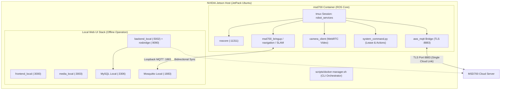

# ユニットのセットアップ

<RoleBadge role="technician" />

このガイドでは、**MSD700 ユニット** (NVIDIA Jetson シングルボード コンピューター上で実行される物理ロボット) のインストールと構成の手順を段階的に説明します。

続行する前に、実行中の [MSD700 Server](/ja/setup/server-setup) が存在することを確認してください。

::: info Production-First Architecture
このガイドのデフォルトでは、**Production Cloud** に接続する実際のハードウェア ロボットをデプロイします。シミュレーション オプション (`--simulator`) と開発クラウド ルーティング (`--dev`) は、[詳細構成](#advanced-configurations) セクションにあります。
:::

## システム トポロジ



## ディレクトリ構造の概要

Jetson ワークスペースは、ロボット パッケージ、Web ブリッジ、オンボード Web UI をサブモジュールとして管理します。

```
~/msd700_noetic/                              # Main Jetson Orchestration Workspace
├── setup.sh                                  # Host Dependency Installer (Docker, xhost)
├── scripts/
│   └── docker-manager.sh                     # Core Lifecycle CLI (build, up, down, logs)
├── docker/
│   ├── Dockerfile                            # ROS 1 Noetic Desktop Full Container
│   ├── docker-compose.yml                    # Robot Container Definition
│   └── .env                                  # Local Environment Variables
└── src/                                      # Catkin Workspace Submodules
    ├── msd700_robot/                         # Navigation, EKF Control, Hardware Drivers
    ├── ros-web-ui/                           # Web Bridges, MQTT nodes, System Command
    └── ROS-dashboard-next-ts/                # Local Operator Web Dashboard
```

---

## コアの段階的なセットアップ

次の 5 つの手順を順番に実行して、物理ロボットをセットアップします。

### ステップ 1: サブモジュールを含むワークスペースのクローンを作成する

`msd700_noetic` を `--recursive` で複製し、`src/` のすべてのサブモジュールが自動的に設定されるようにします。

```bash
git clone --recursive https://github.com/itbdelaboprogramming/msd700_noetic.git ~/msd700_noetic
cd ~/msd700_noetic
```

::: tip Cloned without `--recursive`?
すでにサブモジュールなしでクローンを作成している場合は、次を実行します。
```bash
git submodule update --init --recursive
```
:::

---

### ステップ 2: ワンタイムホストセットアップ

ホスト セットアップ スクリプトを実行して、Docker グループの権限とグラフィック転送を構成します。

```bash
cd ~/msd700_noetic
./setup.sh
```

::: warning Apply Group Permissions
スクリプトによってユーザーが `docker` グループに追加された場合は、ログアウトして再度ログインするか、次のコマンドを実行します。
```bash
newgrp docker
```
:::

---

### ステップ 3: 環境の構成 (`docker/.env`)

ローカル環境ファイルを生成して確認します。

```bash
cd ~/msd700_noetic
cp docker/.env.example docker/.env
nano docker/.env
```

主要な環境設定:

```ini
# Storage path for map occupancy grids on the Jetson
MAPS_FOLDER_LOCAL=/home/ubuntu/ros_maps

# Cloud Server Hostname for MQTT and Sync
NAKAYAMA_HOST=msd.nglobal.jp
CLOUD_BASE_URL=https://msd.nglobal.jp/services

# Local Ports (Default settings)
FRONTEND_PORT_LOCAL=3000
BACKEND_PORT_LOCAL=5002
ROSBRIDGE_PORT_LOCAL=9090
MEDIA_SERVER_PORT_LOCAL=3003
SIGNALLING_PORT_WS_LOCAL=3001
MYSQL_PORT_LOCAL=3306

# Leave UNIT_ID empty; assigned automatically during enrolment
UNIT_ID=
```

---

### ステップ 4: ロボット Docker イメージを構築する

ROS Noetic ロボット ランタイム コンテナーを構築します。

```bash
cd ~/msd700_noetic
./scripts/docker-manager.sh build
```

これにより、ROS Noetic、ナビゲーション スタック、センサー ドライバー、Web ブリッジを含む `msd700:latest` イメージが構築されます。

---

### ステップ 5: ロボットを起動して登録を完了する

ロボット スタックをデタッチ モードで起動します。

```bash
cd ~/msd700_noetic
./scripts/docker-manager.sh up -d
```

#### 自動登録フロー:
1. ロボットは最初の起動時にクラウド サーバーに接続し、6 文字の **クレーム コード** (例: `K7M2QP`) を出力します。
2. 管理者は `https://msd.nglobal.jp/admin` を開き、ログインします。
3. **保留中のユニット**で一致する請求コードを見つけ、そのユニットをアクティブな**レンタル プロファイル**に割り当て、**承認**をクリックします。
4. ロボットは、暗号化された署名付き資格情報 (`Certificates/robot/device.json`) を受け取り、TLS ポート 8883 経由で HiveMQ にバインドし、フリート マップ上にライブで表示されます。

---

## ユニットをローカルで操作する (オフライン モード)

ロボットがインターネット接続のない場所で動作する場合は、ラップトップまたはタブレットをロボットのローカル ネットワーク (またはロボットの Wi-Fi ホットスポット) に直接接続します。

1. ブラウザを開いて、`http://<jetson-ip>:3000` に移動します。
2. ローカル ダッシュボードでは、完全な遠隔操作、SLAM マッピング、ルート作成、エリア カバレッジ スイープが可能です。
3. インターネット接続が回復すると、ローカルに記録されたすべてのマップが中央のクラウド サーバーに自動的に同期されます。

---

## 高度な構成

<details>
<summary><b>シミュレーション モード (Gazebo 倉庫)</b></summary>

物理的なロボット ハードウェアを使用せずにラップトップでアルゴリズムをテストするには:

1. シミュレータ対応イメージをビルドします。
   ```bash
   ./scripts/docker-manager.sh build --simulator
   ```

2. シミュレーション スタックを開始します。
   ```bash
   ./scripts/docker-manager.sh up --simulator -d
   ```

</details>

<details>
<summary><b>開発クラウド ルーティング (`--dev`)</b></summary>

ユニットを運用環境ではなく開発クラウド サーバーに向けるには、次の手順を実行します。

```bash
./scripts/docker-manager.sh up --dev -d
```

これにより、MQTT が開発ポート `8884` に接続され、開発データベースと同期されます。

</details>

<details>
<summary><b>非 Ubuntu/Arch ラップトップのホスト ネットワークの修正</b></summary>

Arch Linux または非標準ディストリビューションで実行している場合:

1. **ホスト名の解決**:
   ```bash
   grep "$(hostname)" /etc/hosts || echo "127.0.0.1 $(hostname)" | sudo tee -a /etc/hosts
   ```

2. **IPv6 ループバック マッピングを無効にする**:
   ```bash
   sudo sed -i 's/^::1[[:space:]].*/::1 ip6-localhost ip6-loopback/' /etc/hosts
   ```

3. **共有マップ ディレクトリを作成**:
   ```bash
   sudo mkdir -p /home/ubuntu/ros_maps
   sudo chown -R $(id -u):$(id -g) /home/ubuntu/ros_maps
   ```

</details>

---

## 検証と診断

次の診断コマンドを使用して、ロボットの状態を確認します。

```bash
# 1. View overall container and service status
./scripts/docker-manager.sh status

# 2. Attach to the ROS tmux session inside the container
./scripts/docker-manager.sh shell
tmux attach -t robot_services

# 3. View real-time container logs
./scripts/docker-manager.sh logs -f
```

## 関連ドキュメント

- [サーバーセットアップ](/ja/setup/server-setup): クラウドバックエンドのインストール。
- [システムセットアップ](/ja/setup/system-setup): センサーの校正と検証。
- [Docker リファレンス](/ja/setup/docker-reference): 包括的な CLI 構文リファレンス。