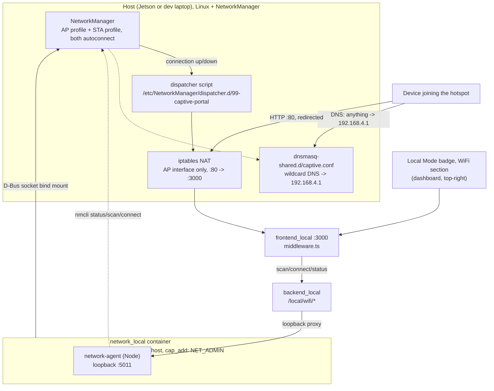

# WiFi ホットスポット + クライアント

<RoleBadge role="technician" />

オプションのローカルモード機能: ユニットは、オペレーターが参加できるように独自の WiFi ホットスポットを実行し、
HTTP ページ (キャプティブ ポータル、
空港やカフェで使用されているのと同じメカニズム)、2 番目の無線が利用可能な場合は、無線として接続を維持します。
インターネット/クラウド同期フォールバックのために WiFi **クライアント**を別のネットワークに接続します。両方の無線の状態が表示されます
[ローカルモードバッジ](/ja/development/data-sync#the-local-mode-badge)、同じバッジ、同じ
ドロップダウンをクリックすると、オペレーターはそこから別のネットワークに接続できます。

完全にオプションです。以下のプロビジョニング手順を一度も実行しないユニットでも、依然としてまったく同じように動作します。
[ユニット設定](/ja/setup/unit-setup) で説明されています。バッジには「ホットスポット無線がありません」と表示されるだけで何も表示されません
それ以外は影響を受けます。

## なぜ無線機が 1 つではなく 2 つあるのか

|トポロジ |実現可能性 |
| --- | --- |
|ドングルはホットスポットを実行し、内蔵無線機は WiFi クライアントとして機能します。高い信頼性、チップセットのリスクなし。 AP とクライアントは物理的に別々の 2 つの無線で動作するため、「同時モード」の問題はまったくありません。2 つの独立した NetworkManager 接続プロファイルがあり、それぞれ `autoconnect: yes` が独自のインターフェイスにバインドされています。 |
| 1 つの無線で AP とクライアントの両方を同時に実行します (ドングルなし)。チップセットに応じて条件付き。ドライバーが 1 つの Wiphy 上で `{ AP, managed } <= 2` を含む有効な `iw list` インターフェイスの組み合わせを報告する場合にのみ機能します。保証されておらず、このプロジェクトが一般的に主張できることではありません。実際のハードウェアで確認してください。 |

::: info Windows doing both at once is not proof Linux will
通常の WiFi 接続と並行して Microsoft のモバイル ホットスポット機能を実行しているラップトップは、
Linux とはまったく異なるドライバー スタック (Windows が自動的に管理する仮想 WiFi アダプター)
`mac80211`/`nl80211` 同時 AP と管理対象の組み合わせ。 *ハードウェア* に関する合理的なヒントです。
基本的にそれができないわけではありませんが、そのための Linux ドライバーがあるかどうかについては何も述べていません。
同じチップがサポートするインターフェイスの組み合わせを報告します。実際のホストの `iw list` で確認してください。
:::

## 接続方法



ホットスポットの存在は Docker に依存しません**。 NetworkManager は両方の接続を実現します
起動時と、一致するデバイスがホットプラグされた瞬間に、プロファイルが自動的に作成されます。
有線イーサネット ケーブルは、`docker-manager.sh` の実行とはまったく関係なく、「正常に機能」します。
`network_local` はバッジのライブ ステータス/スキャンのみを提供し、オペレーターの明示的な操作を実行します。
「別のネットワークに接続する」リクエスト。プロビジョニングは、別個の 1 回限りのステップです (下記)。

::: info Why the container is not `privileged: true`
`network_local` には 2 つの異なるものが必要ですが、`msd700` がすでに使用している広範な許可も必要ありません
(`privileged: true` + ホスト ネットワーク。[Docker リファレンス](/ja/setup/docker-reference#network-mode-host) を参照)。
`nmcli` が **ホスト独自の** NetworkManager デーモンを制御する必要があるのは、バインド マウントされた D-Bus ソケットだけです
、クライアント自体がネットワーク インターフェイスに直接触れることはありません。 iptables ルールは異なります。
**host** ネットワーク名前空間で実行する必要があります。AP インターフェイスが実際に存在する場所だからです。
これが `network_mode: host` の目的です。 `cap_add: [NET_ADMIN]` はまさにそれをカバーしています。それ以上は何も説明しません。
:::

## プロビジョニング (ユニットごとに 1 回)

実際にホットスポットを作成するものはすべて、**Docker** の外に意図的に存在します。それは存続する必要があります。
`local_dev` がダウンしているため、ドングルがユニットに接続された瞬間に起動する必要があります。
`docker-manager.sh` は決して実行しないでください。

### 1. インターフェース名を見つけます。

これらはホストごとであり、リポジトリから推測することはできません。を実行するマシン上で、
ホットスポット:

```bash
nmcli device status        # look at the rows whose TYPE is wifi
```

Jetson は通常、`wlan0` (内蔵) および `wlan1` (USB ドングル) という名前を付けます。
`docker/.env` が付属します。 Ubuntu ラップトップでは、代わりに予測可能な名前 (`wlp2s0` など) が使用されるため、
想定するのではなく確認すると、NetworkManager はインターフェイスにバインドされたプロファイルを喜んで作成します。
存在せず、その理由を示すものは何もなく、単にアクティブ化されません。

### 2. 非シークレット値を設定する

`msd700_noetic/docker/.env` (最初の `docker-manager.sh up` の `.env.example` から作成、または
手動でコピーします):

```bash
NETWORK_AGENT_PORT_LOCAL=5011
AP_INTERFACE_LOCAL=wlan1          # from step 1: the radio that will BE the hotspot
STA_INTERFACE_LOCAL=wlan0         # from step 1: the radio that stays a client (blank if none)
AP_CONNECTION_NAME_LOCAL=msd700-hotspot
AP_SSID_LOCAL=MSD700-Unit01       # the name broadcast; blank generates one
```

### 3. プロビジョニング、パスワードをインラインで渡します

```bash
sudo apt install network-manager   # if nmcli is not already on the host
AP_PASSWORD_LOCAL='your-hotspot-password' ./setup.sh --provision-network
```

::: warning Do not put the hotspot password in `docker/.env`
そのファイルは **git によって追跡され、`msd700_noetic` のオリジンにプッシュされます**。そこにパスワードが書き込まれます。
リポジトリに公開されます。 (`.gitignore` には環境に関するコメント ヘッダーが含まれます
変数は存在しますが、その下のルールが欠落しているため、ファイルは実際には無視されませんでした。本物のMySQL
資格情報は同じギャップを通じてすでにコミットされています。これらはループバック専用であるため、
ダメージはありますが、WiFi キーはそうではありません。これはロボットのネットワークへの経路です。)

1 回限りのプロビジョニング実行のためにインラインで渡すと、問題が完全に回避され、費用もかかりません。
`setup.sh` は、環境内にすでに存在する変数をオーバーライドせずに `docker/.env` をソースします。
したがって、インライン値が優先されます。その後はパスワードを必要とすることはありません。NetworkManager はパスワードを保存します。
キー自体とその後の変更が反映されます
[ダッシュボードのバッジ メニュー](#changing-the-unit-s-own-hotspot)。パスワードが次の場所に存在する必要はありません
ファイル全然。

クライアント ネットワークを構成する場合は、`STA_SSID_LOCAL` / `STA_PASSWORD_LOCAL` にも同じことが当てはまります
最初から: 同じコマンドラインで渡すか、ダッシュボードからネットワークを追加するだけです
ユニットが起動したら。
:::

これはべき等です (再実行しても安全です。既存の接続プロファイルまたはインストールされたファイルはそのまま残されますが、
再作成されることはありません)、コンテナーは起動されません。それ:

1. `scripts/udev/` 内のすべての `*.rules` ファイルを `/etc/udev/rules.d/` (ホットスポット ルール) にインストールします
   さらに、インストールメカニズムはどちらの方法でも存在する必要があるため、すでに存在していた 2 つのルールは
   リポジトリ (`99-stm32-mcu.rules`、`99-realsense.rules`) にチェックインされましたが、そのインストール パスはありません
   これが存在するまでは所有していました。
2. AP 接続プロファイルを作成します (`nmcli connection add ... mode ap ipv4.methodshared)
   ipv4.addresses 192.168.4.1/24 ...`, `autoconnect: yes`)、およびクライアント プロファイルも
   `STA_INTERFACE_LOCAL`/`STA_SSID_LOCAL`が記入されています。
3. キャプティブ ポータル DNS 構成と NetworkManager ディスパッチャー スクリプトをインストールします。

後でクライアント ネットワークを追加または変更するには、ダッシュボード バッジのドロップダウンの WiFi セクションを使用します。
このステップを再実行する代わりに、プロビジョニングは意図的に既存のプロファイルに触れません。

## キャプティブ ポータル

**DNS.** NetworkManager 独自の `dnsmasq -shared` インスタンス (任意のインスタンスに対して自動的にスピンアップ)
`ipv4.method shared` 接続）には 1 つの追加の設定ファイルが渡されます。
`/etc/NetworkManager/dnsmasq-shared.d/captive.conf`、`address=/#/192.168.4.1`を含む、すべて
参加デバイスが要求するホスト名は、ホットスポット自体のアドレスに解決されます。

**リダイレクト。** AP インターフェイスのみを対象とした 1 つの iptables ルール:

```
iptables -t nat -A PREROUTING -i <ap-interface> -p tcp --dport 80 -j REDIRECT --to-port 3000
```

ホットスポットに関連付けられた NetworkManager ディスパッチャー スクリプトによって自動的に適用および削除されます。
コンテナのライフサイクルではなく、接続自体のアップ/ダウン。

::: danger HTTPS is never intercepted, and that is not a bug
TLS トラフィックをリダイレクトすると、証明書の検証が完全に中断されます。クライアントは強力なセキュリティを取得します。
サインイン プロンプトではなくエラーです。これはプロトコルの制約であり、すべての実際のキャプティブ ポータルと同じです。
に遭遇します。 「ネットワークへのサインイン」プロンプトを実際にトリガーするのは、各 OS 独自のプレーン HTTP です。
プローブであり、それらはすべて設計上プレーン HTTP です。特に、キャプティブ ポータルが
TLS に触れずにインターセプトします。

| OS |プローブ URL |期待 |
| --- | --- | --- |
| Apple (iOS/macOS) | `http://captive.apple.com/hotspot-detect.html` |リテラル文字列 "Success" |
|アンドロイド | `http://connectivitycheck.gstatic.com/generate_204` | HTTP204 |
| Windows (NCSI) | `http://www.msftconnecttest.com/connecttest.txt` | 「Microsoft Connect テスト」 |
| Windows (レガシー) | `http://www.msftncsi.com/ncsi.txt` | 「マイクロソフト NCSI」 |
| Firefox | `http://detectportal.firefox.com/success.txt` | "成功\n" |

`ROS-dashboard-next-ts/middleware.ts` は、それぞれの質問に対して、**別の** で答えます。
OS は、次の場合にのみ (Apple のダッシュボードへの 302、残りのページへのプレーン 200 ページ) を期待します。
`NEXT_PUBLIC_DEPLOYMENT_MODE=local`、ユニットの番号を入力するオペレーターを含む、他のすべてのリクエスト
実際のアドレスは直接、通常のダッシュボードにそのまま到達します。
:::

## ダッシュボードのバッジ

個別の WiFi バッジはありません。これは**内のセクションです**
[ローカル モード バッジ](/ja/development/data-sync#the-local-mode-badge) のドロップダウン (同期状態)。
バッジ行自体には WiFi **グリフ** のみがあり、州ごとに色分けされ、概要が記載されています。
(SSID、`hotspot only`、`no network`、`wifi unreachable`) をホバー ツールチップとして表示し、
SSID は印刷されたテキストではなくスクリーン リーダーのラベルであり、最大 32 バイトの任意の文字です。
バッジはナビゲーションバーの上に表示されるため、単語は 1 クリックで表示されます。エージェントは
赤いグリフ自体は到達不可能ではないため、セクションの先頭に到達不能であることも記載されています。
オペレーターがアクションを実行できるもの。

`GET /local/wifi/status` を 30 秒ごとにポーリングし、短い時間枠ではより高速に実行します。
アクションの後、セクションからではなく常にマウントされているバッジから、要約は次のようになります。
ドロップダウンが開かれたことがあるかどうかに関係なく、現在の状態になります。ネットワーク スキャンはその逆で、実行されます。
`nmcli` の再スキャンは無料ではなく、ほとんどのページビューがあるため、ドロップダウンが開く前ではなく開いたときに行われます。
決して開けないでください。

|エンドポイント |認証 |目的 |
| --- | --- | --- |
| `GET /local/wifi/status` |なし |ホットスポットの状態 (稼働中? SSID? クライアント数?)、クライアントの状態 (接続中? SSID? IP? インターネットに到達可能?) |
| `GET /local/wifi/scan` |なし |近くの SSID とセキュリティ タイプ、ドロップダウン |
| `GET /local/wifi/saved` |なし |既知のクライアント プロファイル |
| `GET /local/wifi/hotspot` |なし |このユニット自体のホットスポット SSID と最後の変更の結果。 **パスワードは決して返しません** |
| `POST /local/wifi/connect` |オペレーターセッション |クライアント無線を選択したネットワークに接続します。
| `POST /local/wifi/forget` |オペレーターセッション |保存されたクライアント プロファイルを削除する |
| `POST /local/wifi/hotspot` |オペレーターセッション |本機自身のホットスポット SSID および/またはパスワードを変更する |

変化するルートには、他の `/api/*` ルートとは異なり、同じオペレータ セッションが必要です。
`/local/status`/`/local/sync`、同期ダウンされていないユニットであるため認証されないままになります。
アカウントにはまだログインできる人がいません。ネットワークに接続する (およびパスワードを渡す) ことは、
同期タイムスタンプを読み取るよりもはるかに機密性の高いアクションであるため、同じものは取得されません
ログイン前例外。

## ユニット自体のホットスポットを変更する

バッジのドロップダウンの WiFi セクションでは、ホットスポットの名前を変更し、新しいパスワードを設定できます。 2
使用する前に動作を知っておく価値があります。

::: danger Saving disconnects every device on the hotspot, including yours
これは避けられないことであり、荒削りではありません。ホットスポットはダッシュボードに機能するものであるため、
変更は、変更によって破壊されるまさに接続を介して到着します。新しい SSID (または
新しいキー) により、関連付けられているすべてのデバイスが削除され、どのデバイスも OS に自動再接続されなくなります。
未知のネットワーク、またはパスワードが機能しなくなったネットワークのいずれかです。

API は、それに対抗するのではなく、それを中心に構築されています。 `POST /local/wifi/hotspot` を検証します
すぐに、再接続先の SSID を含む **202 Accepted** と応答し、*そのときのみ* が適用されます。
約 1.5 秒後に変更されます。これをインラインで適用すると、応答中に TCP 接続が切断され、
ブラウザはクラッシュからそれを判断できませんが、オペレータには変更に対するネットワーク エラーが表示されます。
実際には成功しましたが、どのネットワークを探せばよいのかわかりませんでした。最初に答えると UI に表示されます
まだ接続が残っている間に「`<new name>` に再接続してください」と言うことができます。

したがって、応答は *承認* を意味し、決して *成功* しませんでした。実際に何が起こったのかを報じているのは、
`GET /local/wifi/hotspot` の `last_change` フィールド。オペレーターが再参加した後に読み取られます。
:::

::: info A change that cannot activate is rolled back automatically
ここでの高価な障害は、唯一のアクセス パスが独自のホットスポットであるヘッドレス ロボットです。
アクティブ化されなくなったプロファイル: 誰もそのプロファイルにアクセスして元に戻すことができないため、物理的に誰かが必要になります
機械で。したがって、以前の SSID とキーが最初にキャプチャされ、新しい設定が失敗した場合は、
起動すると、`last_change.rolled_back` が設定されて復元および再アクティブ化されるため、再接続が行われます。
オペレータは、ロールバックされた変更と送信されなかった変更を区別できます。そうでない場合、2 つは見分けられます。
どちらの場合も、目の前にあるネットワークが最初のネットワークであるため、同じです。
:::

**検証** (フォームだけでなくエージェントで強制): SSID は 1 ～ 32 **オクテット**、名前は
非ラテン文字は文字数が示すよりも早く制限に達し、WPA-PSK パスワードが制限されます。
8 ～ 63 文字です。制御文字は削除されるのではなく拒否されます。これは、静かにサニタイズされるためです。
オペレータは、入力した名前と異なるネットワークを探すことになります。何も触れられていない
検証に合格するまでは、値が間違っていることがユニットのホットスポットを失う原因になることはありません。

**パスワードがブラウザに送信されることはありません。** すでにホットスポットにアクセスしている人は誰でもそれを知っています (パスワードを入力した)
に乗る）ので、それを返しても何も起こりませんが、それをプレーンな HTTP 応答本文に入れて渡します
*クライアント側* ネットワークからダッシュボードにアクセスする、それを知らない人。フォームは尋ねます
新しいパスワードの場合、空白は「現在のパスワードを保持する」ものとして扱われます。

::: warning `docker/.env` is a seed, not the source of truth
`AP_SSID_LOCAL` / `AP_PASSWORD_LOCAL` は `setup.sh --provision-network` によって **のみ** 読み取られます。
プロファイルがまだ存在しない場合。ダッシュボードから変更を加えた後、NetworkManager
プロファイルには権限があり、これら 2 つのキーは古いです。それは無害です、再実行します
`--provision-network` は既存のプロファイルを意図的に上書きすることはありませんが、読み取らないでください。
ユニットの現在のホットスポット名を学習することを期待しています。 `nmcli -g 802-11-wireless.ssid 接続の表示
msd700-hotspot` が正直な答えです。
:::

クライアント側のインターネット到達可能性 (`full` / `limited` / `portal` / `none`) は、から直接読み取られます。
`nmcli networking connectivity`、NetworkManager 独自の定期接続プローブ、ここには何もありません
2番目のものを実装します。

## トラブルシューティング

|症状 |考えられる原因 |修正 |
| --- | --- | --- |
|バッジ メニューには「ホットスポット: ホットスポット ラジオなし」と表示されます。 `AP_INTERFACE_LOCAL` が空であるか、`--provision-network` が実行されていません。 `docker/.env` を入力して `./setup.sh --provision-network` を実行します。
|バッジに WiFi のグリフがまったくありません |どちらの無線も存在せず、AP も STA インターフェイスもないため、報告するものは何もありません。 WiFi なしで構築されたユニットで期待されます。それ以外の場合は、インターフェイスについて `nmcli device` を確認してください。
| `--provision-network` が「nmcli が見つかりません」で失敗します。 NetworkManager がホストにインストールされていません。 `sudo apt install network-manager` |
| `--provision-network` は失敗します。「AP_PASSWORD_LOCAL が設定されていません」パスワードが欠落しているか、8 文字未満です | `docker/.env` に 8 文字以上のパスワードを設定し、 | を再実行します。
|ホットスポットは再起動後に存続しません。プロビジョニングが実行されなかったか、接続プロファイルの `autoconnect` が手動で無効になりました。 `nmcli connection show msd700-hotspot`、`autoconnect: yes` を確認してください。プロファイルがまったく存在しない場合は、`--provision-network` を再実行します。
|デバイスがホットスポットに参加しますが、キャプティブ ポータル プロンプトが表示されません。 OS がこの SSID に対する以前の「インターネット OK」の結果をキャッシュしているか、企業/管理対象デバイスでキャプティブ ポータル検出が無効になっている可能性があります。クライアント デバイス上のネットワークを忘れて、再度接続します。デバイスのキャプティブ ポータル検出設定を確認してください。
|ホットスポットは起動していますが、WiFi のアイコンが赤で、メニューに「このユニットでは WiFi サービスに到達できません」と表示されます。 `network_local` が実行されていないか、`backend_local` がそれに到達できません。 `docker compose ps` `network_local` の場合;両方のサービスで `NETWORK_AGENT_PORT_LOCAL` が一致することを確認します。
| `nmcli device wifi connect` は役に立たない理由でバッジを取得できませんでした | nmcli 自身の stderr は、言い換えられるのではなく、そのまま渡されます。理由テキストを直接読んで、間違ったパスワード、範囲外、拒否されたパスワードを区別します。
|プロビジョニング後に既存のローカル サービス (バックエンド、メディア、MySQL) にアクセスできなくなる | iptables ルールのスコープが AP インターフェイスに正しく設定されていませんでした。リダイレクト ルールのターゲットは `<ap-interface>` のみをチェックし、クライアント インターフェイスやループバックはチェックしないでください: `sudo iptables -t nat -L PREROUTING -n` |
|ホットスポット名/パスワードを変更しましたが、古いネットワークが依然としてブロードキャストされています。変更はアクティブ化できず、自動的にロールバックされました。古いネットワークに再接続し、ダッシュボードを再度開き、`GET /local/wifi/hotspot` から `last_change.reason` を読み取ります。
|ホットスポットを変更しましたが、現在は何もブロードキャストされません |変更 ** とそのロールバック ** の両方が失敗しました。物理的なアクセスが必要な 1 つのケースです。 `ROLLBACK ALSO FAILED` については `docker logs msd700_network_local` を確認してください。 `nmcli connection up msd700-hotspot` を使用してマシンで回復します。
| `docker/.env` は、ユニットが実際にブロードキャストするものとは異なる SSID を表示します。ダッシュボード側の変更後に予想される: `.env` のみシード プロビジョニング | `nmcli -g 802-11-wireless.ssid connection show msd700-hotspot` | を使用してライブ値を読み取ります。

## 関連

- [ユニット セットアップ](/ja/setup/unit-setup): この機能が上に置かれるベースのローカル モード インストール
- [Docker リファレンス § network_mode: host](/ja/setup/docker-reference#network-mode-host): なぜいくつかの
  サービスはホストのネットワーク名前空間を共有します
- [データ同期 § ローカル モード バッジ](/ja/development/data-sync#the-local-mode-badge): このバッジ
  セクションは内部に存在し、その上に同期状態が表示されます
- [アーキテクチャ § 信頼ドメイン](/ja/development/architecture#trust-domains): なぜ `/local/wifi/connect`
  `/local/status` はオペレーターセッションを必要としません