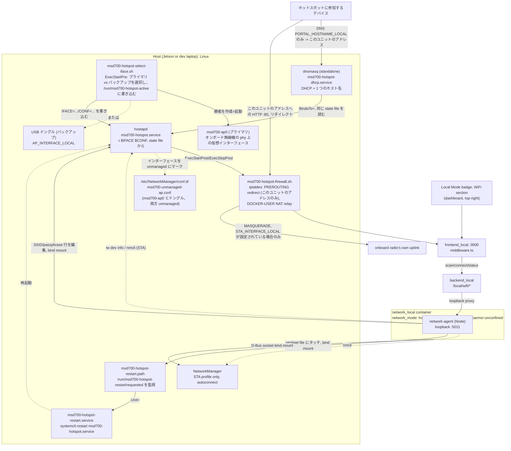

# Wi-Fi ホットスポット + クライアント

<RoleBadge role="technician" />

すべてのユニットのローカルモードセットアップ([ユニットセットアップ](/ja/setup/unit-setup) ステップ 6)
の標準的な一部です。ユニットは、オペレーターが参加できるよう独自の WiFi ホットスポットを実行し、
`http://mymsd.jp` で到達可能で、ハードウェアが対応していればまったく同じ無線機上で、インターネット
/クラウド同期のフォールバックとして別のネットワークへの通常の WiFi **クライアント**接続も維持し
ます。ホットスポットが起動するたびに、`msd700-hotspot-select-iface.sh` が 2 つの経路のどちらかを
選択します。

- **プライマリ**: オンボード無線機自身の phy 上に作成される仮想 AP インターフェース
  (`msd700-ap0`)。通常のクライアント(STA)接続と並行して動作します。MediaTek MT7922 系のカードは、
  1 つの物理無線機でこの STA+AP 同時モードをサポートしています。[MT7922 Wi-Fi セットアップ](/ja/setup/wifi-mt7922)
  を参照してください。
- **バックアップ**: USB WiFi ドングル。プライマリ経路がその起動時に利用できない場合(別のオンボード
  カード、ドライバの不具合、組み合わせ非対応)に自動的に起動します。プライマリ経路が機能するハード
  ウェアではまったく不要です。

両方の無線機の状態は [ローカルモードバッジ](/ja/development/data-sync#the-local-mode-badge)
の同じバッジ、同じドロップダウンに表示され、オペレーターはそこから別のネットワークに接続できます。

以下のプロビジョニング手順を一度も実行していないユニットも、それ以外の点では
[ユニットセットアップ](/ja/setup/unit-setup) が説明するとおりに動作します。バッジは単に「ホットスポット
無線機なし」と報告するだけで、他には何も影響しません。

## セットアップの流れ

新しいユニットではこの順序で進めてください。ほとんどのユニットはステップ 2 と 3 だけで済みます。

1. **まずオンボード無線機を立ち上げる、これがプライマリ経路です。** MediaTek MT7922 であれば、まず
   ファームウェアを修正してください。[MT7922 Wi-Fi セットアップ](/ja/setup/wifi-mt7922) を参照して
   ください。Tegra カーネルでは、このカードがファームウェア未検出エラーを報告し、NetworkManager に
   まったく現れないことがあり、その結果、本来使うべき同時オンボード経路の代わりに、下記のバックアップ
   ドングルへ黙って切り替わってしまいます。オンボード無線機が既に問題なく現れている場合
   (`nmcli device status`)、ここで修正すべきことは何もありません。
2. [ホットスポットをプロビジョニングする](#ホットスポットのプロビジョニング-ユニットごとに一度)
   (`./setup.sh --provision-network`)。その独自のプリフライトがオンボード無線機を確認し、プライマ
   リ経路を実行できない場合は警告を出しつつ、設定されていれば自動的にドングルへフォールバックします。
3. [動作を検証する](#動作を検証する)。
4. **(任意)[バックアップドングルのドライバをインストールする](#ドングルドライバのインストール)**、
   ステップ 2 のプリフライトがオンボード無線機はプライマリ経路を実行できないと報告した場合、または
   意図的な冗長化のためだけに行います。プライマリ経路が既に機能しているハードウェアではまったく不要
   です。

対話的でユニットごとに異なる(SSID、パスワード)のはステップ 2 だけです。それ以外は一度限りのハード
ウェア立ち上げ作業で、ハードウェア自体が変わった場合にのみやり直します。

## プライマリ無線機とバックアップドングル

MediaTek MT7922 系のカードは、同じ物理無線機上で WiFi クライアント(STA)として動作しながら、同時に
アクセスポイント(AP)をブロードキャストできます。`msd700-hotspot-select-iface.sh` は、ホットスポット
が起動するたびに STA インターフェースと同じ phy 上に仮想インターフェース(`msd700-ap0`)を作成しま
す。仮想インターフェースはリブートを生き延びないため、一度だけ作成しておくということはできません。
この機能を実際にドライバがサポートしていることを確認するのが、この機種で `{ managed, AP } <= 2` を
報告する `iw phy <phy> info` の「valid interface combinations」で、`--provision-network` はプロビ
ジョニング時にまさにこれを確認します。

::: warning 古いハードウェアや交換したハードウェアは自動的にフォールバックするが、それを黙っては行わない
このプロジェクトの以前のオンボード無線機である Realtek RTL8822CE は、クライアント*か*AP のどちらか
にしかなれない**1 つの物理無線機**で、同時に両方にはなれません。これはドライバの制限ではなくハード
ウェア自体の制約です。`iw phy` は正確に 1 つの `phy` を示し、1 つの無線機は一度に 1 つのチャンネル
にしか同調できません。`setup.sh --provision-network` のプリフライトはこれを見つけ次第すぐに強く警告
します。「なぜホットスポットはいつもドングル上で動いているのか」と後になって発見されるままにはしま
せん。
:::

| 経路 | いつ使われるか | 実現可能性 |
| --- | --- | --- |
| **プライマリ**: オンボード無線機上の仮想 AP | ホットスポットが起動するたびに、オンボード無線機(`STA_INTERFACE_LOCAL`)が対応するインターフェース組み合わせを報告する限り | このプロジェクトで検証済みの MT7922 系ハードウェアでは信頼度が高い。何も挿す必要がない。 |
| **バックアップ**: USB ドングル(`AP_INTERFACE_LOCAL`) | プライマリ経路がその起動時に利用できない場合(カードがない、ドライバ/ファームウェアが壊れている、組み合わせ非対応、または RTL8822CE 系の無線機)にのみ自動的に | 信頼度が高く、チップセットのリスクなし。AP とクライアントは物理的に分離した 2 つの無線機に存在するため、「同時モード」の問題はそもそも発生しない。ドングルが挿さっていてそのドライバがインストールされている必要がある。[ドングルドライバのインストール](#ドングルドライバのインストール)を参照。 |

::: info Windows が両方同時に行えることは、特定の Linux ドライバもそうできる証拠にはならない
Microsoft の Mobile Hotspot 機能を通常の WiFi 接続と並行して実行しているラップトップは、Linux の
`mac80211`/`nl80211` の AP と managed の同時実行構成とはまったく異なるドライバスタック(Windows 自身
が管理する仮想 WiFi アダプタ)を使用しています。これは*ハードウェア*が根本的に不可能というわけでは
ないという合理的なヒントではありますが、特定の Linux ドライバ自身のインターフェース組み合わせに
ついては何も語っていません。実機の `iw phy <phy> info` で確認してください。これはまさに
`--provision-network` のプリフライトが既に自動的に行っていることです。
:::

**このプロジェクトで検証済みのバックアップドングルハードウェア**: TP-Link TL-WN722N v2/v3、Realtek
**RTL8188EUS** チップセット(USB ID `2357:010c`)。同じチップセットの RTL8188EUS ベースのドングルで
あれば同じドライバで動作するはずです。同一チップセットの他の USB ID については
`scripts/install-wifi-dongle-driver.sh` 内の `KNOWN_IDS` を参照してください。このチップセット用の
ドライバは Jetson のカーネルに標準では一切同梱されていません(ツリー内の `rtl8xxxu` も、ツリー外
モジュールも)。DKMS 経由でソースからビルドする必要があります。詳しくは下記の
[ドングルドライバのインストール](#ドングルドライバのインストール)を参照してください。

## どのように結線されているか



ホットスポットの存在は Docker に**依存しません**。`hostapd` と `dnsmasq` は、それ自身の systemd
サービスとして動作し、ブート時に起動され、`docker-manager.sh` が一度でも実行されたかどうかとは無関係
です。有線 Ethernet ケーブルが「ただ動く」のと同じ感覚です。`network_local` はバッジ向けのライブ状態
/スキャンを提供し、オペレーターの明示的な「別のネットワークに接続する」というリクエスト(クライアント
側のみ)を実行するだけです。ホットスポット自体のプロビジョニングは、別個の、一度限りのステップです
(以下)。

### なぜ NetworkManager 自体の AP モードではなく hostapd なのか

NetworkManager は自身で AP モードの接続を作成できます(`nmcli connection add ...
802-11-wireless.mode ap`)。これは内部的には `wpa_supplicant` によって駆動されます。それがこのプロ
ジェクトの当初の設計でしたが、RTL8188EUS ドングルでは**毎回ハングします**。NM のアクティベーション
は約 25 秒後に必ず `"Hotspot network creation took too long"` / `reason 'supplicant-timeout'` で失敗
していました。

同じインターフェースに対して `hostapd -dd` を直接実行して診断したところ、AP は 1 秒未満で立ち上が
り(`AP-ENABLED`)、完全に機能しました。ドライバは確かに AP モードをサポートしていますが、その
`NL80211_CMD_START_AP` の完了イベントは、`wpa_supplicant` の内部 AP コードが期待する順序とは異なる
順序で到着します(hostapd のデバッグログに `Ignored unknown event (cmd=15)` として現れ、これは AP が
他の手段で既に起動した*後に*記録されています)。`wpa_supplicant` の softAP パスはそのイベントを待って
いるように見えますが、`hostapd` はそれをブロックせず、そのまま進みます。

修正方法: `hostapd` を独自の systemd サービスとして直接実行し、NetworkManager にはそのインターフェ
ースに一切触れないよう指示する(`conf.d` の drop-in での `unmanaged-devices`)ことで、両者が決して
奪い合わないようにします。プライマリとバックアップの両方のインターフェースで一貫してこの hostapd
方式が使われます。STA 側(クライアントとして参加するアップストリームネットワーク)にはこのような
問題はなく、通常の NM 接続プロファイルをそのまま利用します。

### コンポーネント

| コンポーネント | 動作内容 | ライフサイクル |
| --- | --- | --- |
| `msd700-hotspot-select-iface.sh` | `ExecStartPre`: オンボード無線機が対応していればプライマリの仮想 AP(`msd700-ap0`)を作成・起動し、そうでなければバックアップのドングルインターフェースを起動する。勝者(`IFACE`、`CONF`)を `/run/msd700-hotspot-active` に書き込む | `msd700-hotspot.service` の `ExecStartPre` によって毎回の起動時に実行(仮想インターフェースはリブートを生き延びない) |
| `msd700-hotspot.service` | 勝者となったインターフェースに静的 IP `192.168.4.1/24` を割り当て、`hostapd -i $IFACE $CONF` を実行し、`msd700-hotspot-firewall.sh apply`/`teardown` を呼び出す | systemd、ブート時に有効化、`Restart=on-failure` |
| `msd700-hotspot-firewall.sh` | このユニット自身のアドレス宛のポート 80 に限定してダッシュボードへリダイレクト(キャプティブポータルではなく、それ以外のポート 80 トラフィックはそのまま素通り)し、加えてインターネットリレー用の NAT(`DOCKER-USER` チェーン、`STA_INTERFACE_LOCAL` が設定されている場合のみ) | 上記サービスの `ExecStartPost`/`ExecStopPost` から呼ばれる、冪等(チェックしてから実行) |
| `msd700-hotspot-dhcp.service` | アクティブなインターフェースに対して専用の `dnsmasq` インスタンスを実行: DHCP サーバー(`192.168.4.10`-`192.168.4.200`)+ `PORTAL_HOSTNAME_LOCAL` をこのユニットのアドレスに解決 | systemd、`BindsTo=msd700-hotspot.service` |
| `/etc/hostapd/hostapd-msd700-primary.conf` / `-backup.conf` | 同じ SSID/パスワードをインターフェースごとに 2 回レンダリング。どちらの無線機が実際に応答しても、クライアントには 1 つの同じアイデンティティに見える | `--provision-network` によってレンダリング、`chmod 0600` |
| `/etc/NetworkManager/conf.d/msd700-unmanaged-ap.conf` | `msd700-ap0` にもドングルのインターフェースにも決して触れないよう NM に指示する | 再起動時に NetworkManager が読み込む |
| `/etc/polkit-1/rules.d/50-msd700-network-manager.rules` | `org.freedesktop.NetworkManager.*` アクションを無条件に許可し、`network_local` の `nmcli` 呼び出し(スキャン、接続、削除)がコンテナには決して応答できない対話的な polkit プロンプトなしに動作するようにする | 再起動時に `polkit` が読み込む |
| `msd700-hotspot-restart.path` / `-restart.service` | `network_local` が持つホストの systemd への唯一の経路: `network_local` が hostapd の設定を編集した後にタッチする sentinel file を監視し、`systemctl restart msd700-hotspot.service` を実行する。意図的に狭く絞られており、このただ 1 つの再起動しかトリガーできない | systemd、`path` ユニットはブート時に有効化、`service` はそれからのみトリガーされる |
| `/etc/tmpfiles.d/msd700-hotspot.conf` | `/run/msd700-hotspot-active`(ファイル)と `/run/msd700-hotspot-restart/`(ディレクトリ)が、Docker がどちらかの上に stray なディレクトリを bind mount してしまう前に、毎回のブートで正しい種類として存在することを保証する | ブート時に `systemd-tmpfiles` が適用し、`--provision-network` 実行時にも即座に適用される |
| NM 接続プロファイル(オンボード無線機のみ) | オペレーターの WiFi への通常のクライアント接続 | 通常どおり NetworkManager が管理、`autoconnect: yes` |

ホットスポット側の両方の systemd サービスは `Restart=on-failure` であるため、アクティブなインター
フェースの喪失と回復、バックアップドングルの抜き差し、あるいはオンボード無線機のドライバが不具合
から回復した場合でも、手動での介入なしにホットスポットが自動的に戻ってきます。

::: info なぜ `network_local` は `privileged: true` ではないのか
`network_local` が必要とするのはいくつかの明確な事柄だけで、そのいずれも `msd700` が既に使っている
広範な許可(`privileged: true` + host network、[Docker コマンドリファレンス](/ja/setup/docker-reference#network-mode-host)
を参照)ではありません。バインドマウントされた D-Bus ソケットにより、`nmcli` は STA 側について**ホスト
自身**の NetworkManager デーモンを制御できます。クライアント自体がネットワークインターフェースに
直接触れることはありません。`cap_add: [NET_ADMIN]` に `network_mode: host` を加えたものは、AP のステ
ータス読み取り(`iw dev <iface> info`)に必要です。AP インターフェースはホストのネットワーク名前空間
に存在するためです。`security_opt: apparmor:unconfined` は分かりにくい部分です。Docker のデフォルト
apparmor プロファイルは、ソケットがバインドマウントされ `NET_ADMIN` が付与されていても、コンテナ内
部からの D-Bus メソッド呼び出しを拒否します。`nmcli` の最初の `Hello()` 呼び出しは、NetworkManager
自身の D-Bus ポリシーが参照される前に `AccessDenied` になってしまいます。このコンテナの唯一の仕事は
そのバス経由でホストの NetworkManager と話すことなので、デフォルトプロファイルのルールと一つ一つ
戦うのではなく、unconfined で実行しています。

さらに 3 つの bind mount があり、いずれもソケットではなく普通のファイル/ディレクトリです:
`/run/msd700-hotspot-active`(読み取り専用、このブートで実際に勝ったインターフェース)、
`/etc/hostapd`(読み書き可能、`setHotspot()` がここの設定ファイルを直接編集する)、
`/run/msd700-hotspot-restart`(読み書き可能、`setHotspot()` が `msd700-hotspot-restart.path` の
監視する sentinel file にタッチする場所、[ユニット自身のホットスポットを変更する](#ユニット自身のホットスポットを変更する)
を参照)。
:::

## ドングルドライバのインストール

**バックアップ**経路のためだけに必要です。オンボード無線機がプライマリ(AP+STA 同時)経路を実行でき
ない場合、または意図的な冗長化のためのいずれかです。プライマリ経路が機能するハードウェアでは
まったく不要です。ユニットごとに一度、プロビジョニングの前に実行します。

```bash
./scripts/install-wifi-dongle-driver.sh
```

- `dkms`、カーネルヘッダー、C ツールチェーンが不足していればインストールします。
- ドライバのソース([aircrack-ng/rtl8188eus](https://github.com/aircrack-ng/rtl8188eus))を
  `/usr/src/` にクローンします。
- 一度限りの `insmod` ではなく、**DKMS** 経由でビルド・インストールします。これは重要です。DKMS は、
  この Jetson が今後起動するあらゆるカーネルに対してモジュールを自動的に再ビルドするため、`apt` に
  よるカーネルアップグレードが、手動ビルドの場合のようにドングルを黙って壊してしまうことがありませ
  ん。
- モジュールをロードし、2 つ目の WiFi インターフェースが現れるのを待ちます。

フラグ: `--check`(状態確認のみ、変更なし)、`--remove`(アンインストール)。

::: info このステップは自動的に実行されることもある
`setup.sh --provision-network`(下記)は、既知の RTL8188EUS ドングルを検出し(同じ `KNOWN_IDS`
リストに対する `lsusb`)、そのドライバがまだロードされていなければ、続行前にこのスクリプトを自動的
に実行します。ビルド出力を確認したい場合や、何も変更せずに `--check` で状態だけ見たい場合は、事前に
手動で実行しておくのも依然として有用です。
:::

## ホットスポットのプロビジョニング(ユニットごとに一度)

以下のすべては、意図的に**Docker の外**に存在します。これは `local_dev` が停止していても存続する
必要があり、また `docker-manager.sh` を一度も実行したことがないユニットにドングルを挿した瞬間に
立ち上がる必要があるためです。

### 1. (任意)バックアップドングルを挿す

オンボード無線機がプライマリ(AP+STA 同時)経路を実行できない場合、または意図的な冗長化のためだけに
必要です。詳しくは上記の[プライマリ無線機とバックアップドングル](#プライマリ無線機とバックアップドングル)
を参照してください。プライマリ経路が既に機能しているハードウェアでは、このステップは完全に不要
です。

事前に `docker/.env` に手動で設定する必要のあるものはありません。検証済みの USB WiFi ドングルを挿し
て、以下のプロビジョニングに進んでください。パスワードやその他すべての設定は、その時点で対話的に
尋ねられます。

`nmcli` がまだホストにない場合:

```bash
sudo apt install network-manager
```

### 2. プロビジョニングする

対話型ターミナル(キーボードの前にいる人間、パイプや非 TTY セッションではない)から実行します。

```bash
./setup.sh --provision-network
```

create-next-app スタイルで、すべての設定項目(インターフェース名、SSID、ホットスポットのパスワード)
を順に案内し、自動検出済みまたは現在の値を `[default]` として表示します。Enter を押せば受け入れ、
新しい値を入力することもできます。それぞれのプロンプトは役割を明示的に述べます。
`Backup hotspot interface (USB dongle...)` と `Uplink Wi-Fi interface (onboard radio -- also backs
the primary hotspot)` のように表示されるため、入力中にどちらの無線機が何を担うのか曖昧になることは
ありません。ホットスポットのパスワードは確認のため 2 回入力し、STA 側で入力した上流 WiFi のパスワード
とともに、意図的に `docker/.env` やディスク上の他のいかなるファイルにも**決して**書き込まれません。
NetworkManager は STA キー自体を保存し、hostapd 自身の設定ファイル
(`/etc/hostapd/hostapd-msd700-primary.conf`、ドングルが設定されていれば
`hostapd-msd700-backup.conf` も、いずれも `chmod 0600`)が AP のキーを保存します。同じ SSID/パスワード
が両方にレンダリングされるため、どちらの無線機が応答してもクライアントには 1 つの同じアイデンティ
ティに見えます。それ以外のすべての回答(インターフェース名、SSID)は `docker/.env` に書き戻される
ため、再実行時や、ファイルをざっと見た人間にも実際の値が見えます。詳しくは下記の
[設定リファレンス](#設定リファレンスdocker-env)を参照してください。

::: info 無人・スクリプトによるプロビジョニング
TTY がない場合、または `MSD700_NONINTERACTIVE=1` の場合、上記のプロンプトは完全にスキップされ、
`docker/.env`(存在しない場合は初回実行時に `docker/.env.example` から作成される)と環境変数がその
まま使用されるため、自動化も引き続き機能します。

```bash
AP_PASSWORD_LOCAL='your-hotspot-password' ./setup.sh --provision-network
```

`docker/.env` は**git で追跡されている**ため、実際のパスワードは示したとおりコマンドラインに置く
べきであり、決してこのファイルにコミットしてはいけません。`setup.sh` は `docker/.env` を、環境に
既に存在する変数を上書きせずに source するため、インラインの値が優先されます。
:::

いずれにせよ、事前に手動でインターフェース名を調べる必要はありません。この 1 つのコマンドは:

1. **udev ルールをインストールします。** `scripts/udev/` 内のすべての `*.rules` ファイル(WiFi 用
   だけでなく)。リポジトリに既にあった STM32 と RealSense のルールも、これができるまでは独自の
   インストール経路を持っていませんでした。
2. **PolicyKit ルール**(`/etc/polkit-1/rules.d/50-msd700-network-manager.rules`)をインストール
   し、`network_local` の `nmcli` 呼び出しが対話的な認証プロンプトでハングしないようにします。
3. **バックアップインターフェースを自動検出します**: 既知の RTL8188EUS ドングルが挿されているが
   `AP_INTERFACE_LOCAL` が空の場合、必要であればまずそのドライバをインストールし(上記参照)、次に
   `8188eu` カーネルドライバに所有されているものを `/sys/class/net/*/device/driver` を辿って探しま
   す。これは決定論的で、MAC アドレスや挿入順序に依存しません。
4. **オンボード(プライマリ)インターフェースを自動検出します**: 他に存在する WiFi デバイスが正確に
   1 つだけあれば、それを使用します。検出された両方の値は `docker/.env` に書き戻されるため、以降の
   実行や、ファイルをざっと見た人間にも実際の値が見えます。曖昧なケース(例えばオンボード無線機が
   2 つある場合)は人間が明示的に設定するよう残されます。
5. **オンボード無線機のプライマリ経路の準備状況を確認します。** `STA_INTERFACE_LOCAL` が設定されて
   いるのにそのインターフェースがまったく現れない場合、一度限りの修正(`sudo apt-get install -y
   linux-firmware` を実行し、udev を再トリガー)を試み、それで不十分なら警告してバックアップドング
   ルに留まります。まさにこの失敗モードを手動で修正するのが
   [MT7922 Wi-Fi セットアップ](/ja/setup/wifi-mt7922) で、自動での試みがうまくいかない場合に対応
   します。インターフェースは存在するが `iw phy` がそのインターフェース組み合わせで AP サポートを
   報告しない場合は、プライマリ経路が今後も常にドングルへフォールバックし続けることを警告します。
   これはドライバ/ハードウェアの制限であり、このスクリプトで修正できるものではありません。
6. **`hostapd` をインストールします**(未インストールの場合)。このプロジェクトが NM 自身の AP モード
   をやめる前から残っていた `msd700-hotspot` という名前の NetworkManager 接続プロファイルを削除し、
   `msd700-ap0` とドングルの両方をカバーする
   `/etc/NetworkManager/conf.d/msd700-unmanaged-ap.conf` を書き込みます(hostapd がどちらかの
   インターフェースを取得する*前に* NetworkManager を再起動し、NM がまだそれを保持したままになら
   ないようにします)。
7. **レンダリングしてインストールします**: `hostapd-msd700-primary.conf`(常に)と
   `hostapd-msd700-backup.conf`(ドングルのインターフェースが設定されている場合のみ)、
   `/etc/dnsmasq-msd700-hotspot.conf`、`/usr/local/sbin/msd700-hotspot-firewall.sh`、
   `/usr/local/sbin/msd700-hotspot-select-iface.sh`、および 2 つの systemd ユニットファイルを配置し、
   `msd700-hotspot.service` と `msd700-hotspot-dhcp.service` を有効化して**再起動**します(既に稼働
   中のサービスに対しては no-op になり、変更された設定が実際には再適用されないまま残ってしまう
   `enable --now` ではありません)。
8. **STA クライアントプロファイルを作成します**。`STA_INTERFACE_LOCAL`/`STA_SSID_LOCAL` が入力され
   ている場合に行われ、その名前のプロファイルが既に存在する場合はそのままにされます。

このコマンドの再実行は常に安全です。すべてのステップは冪等であり、実際に変更が必要なものにのみ
触れます。後でクライアントネットワークを追加・変更するには、このステップを再実行するのではなく、
ダッシュボードバッジのドロップダウンの WiFi セクションを使用してください。プロビジョニングは既存の
STA プロファイルには意図的に一切触れません。

### なぜこれは `docker-manager.sh build`/`up` に組み込まれていないのか

検討した上で意図的に却下されました。`docker-manager.sh` は現在、`sudo` をまったく必要としません
(コンテナのビルドと実行に必要なのは `docker` グループのメンバーシップだけです)。ホットスポットの
プロビジョニングには `apt install`、`systemctl`、`/etc/` への書き込みが必要です。これを組み込んで
しまうと、ホットスポット用ハードウェアが一切ない開発用ラップトップで `--simulator` を実行している
場合を含め、あらゆる `docker-manager.sh build` が、これまで一度も必要としなかった `sudo` パスワード
を突然要求し始める可能性があります。2 つのコマンドを分離しておくことで、その驚きを通常のケースから
遠ざけています。

## ダッシュボードのリダイレクト

**2026-09-01 以降、意図的にキャプティブポータルではなくなりました。** この機能の以前のバージョンは、
iOS/macOS、Android、Windows、Ubuntu/GNOME、Firefox がそれぞれ「このネットワークはキャプティブポー
タルの背後にあるか」を検出するために問い合わせる特定のホスト名(`captive.apple.com`、
`connectivitycheck.gstatic.com` など)を乗っ取り、そのすべてをホットスポット自身のアドレスへ向けて
いました。これは技術的には「Sign in to WiFi」プロンプトを生み出しましたが、同時にそれらの OS の接続
チェックのそれぞれが、期待していた「本物のインターネットがある」という答えの代わりにダッシュボード
を受け取ってしまうことも意味していました。その結果 OS は、実際にはその背後のオンボードアップリンク
のリレーがずっと機能していたにもかかわらず、ネットワークには機能するインターネットが**ない**と判断
してしまい(フラグを立て、Android ではモバイルデータにフォールバックしていました)。ポータル自身が、
実際には機能していた自分の接続を隠してしまっていたのです。

**現在の動作**: `/etc/dnsmasq-msd700-hotspot.conf`(`docker/networkmanager/dnsmasq-hotspot.conf.tmpl`
からレンダリングされる)は、ちょうど 1 つのホスト名、`PORTAL_HOSTNAME_LOCAL`(デフォルト `mymsd.jp`)
とそのサブドメインだけを、このユニット自身のアドレスに解決します。各 OS 自身の接続チェック用ドメイン
を含む、それ以外のすべてのホスト名は、この dnsmasq 自身の上流リゾルバ(`/etc/resolv.conf`、通常は
systemd-resolved で、オンボードアップリンクが渡してきた DNS を問い合わせます)にフォールスルーする
ため、それらのチェックは本物のインターネットを見ることになり、アップリンクがトラフィックをリレー
していれば正常にパスします。実際上の結果の 1 つとして、機能するアップリンクがあれば、ほとんどの OS
は今や正しく「サインインすべきものは何もない」と判断し、**「Sign in to WiFi」プロンプトをそもそも
まったく表示しません**。オペレーターは、ポップアップを待つのではなく `http://mymsd.jp` に直接ナビ
ゲートすることでダッシュボードに到達します。

**リダイレクトはホスト名単位ではなく、アドレス単位です。** `msd700-hotspot-firewall.sh` は次を
インストールします。

```
iptables -t nat -A PREROUTING -i <ap-interface> -d <ap-address> -p tcp --dport 80 -j REDIRECT --to-port <dashboard-port>
```

変わったのはこの `-d <ap-address>` 節です。このユニット自身のホットスポット IP 宛に実際にアドレス
指定された平文 HTTP トラフィックだけがダッシュボードへリダイレクトされます。それ以外へのポート 80、
すなわちクライアントの通常のブラウジング(そのサイトの実際の IP に解決されたもの)はそのまま素通り
します。これは、インターフェース全体を対象にしていた以前の一律リダイレクトとは異なります。HTTPS
(ポート 443)はこのルールの前後を問わず一切触れられません。そのため、オンボードのアップリンクが
それをリレーしている限り、通常の HTTPS 経由のブラウジングは影響を受けません。この変更より前に
プロビジョニングされたユニットは、その `nat` テーブルに古い一律リダイレクトルールをまだ持っています。
`apply` と `teardown` はどちらも明示的にそれを探して削除するため
(`drop_legacy_blanket_redirect`)、再プロビジョニングされたユニットが両方を同時に実行してしまう
ことはありません。今ではもう到達しないホスト名に応答していた `ROS-dashboard-next-ts/middleware.ts`
の古い OS 別キャプティブポータルプローブ処理も、これに合わせて削除されました。

`msd700-hotspot.service` の `ExecStartPost`/`ExecStopPost` によって自動的に適用・削除され、
コンテナのライフサイクルや NetworkManager のディスパッチャスクリプトではなく、hostapd 自身の起動/
停止に紐づいています。

**インターネットリレー。** `STA_INTERFACE_LOCAL` が設定されている場合のみ、
`msd700-hotspot-firewall.sh` は以下も追加します。

- `MASQUERADE` ルール(`192.168.4.0/24` をオンボード無線機経由で外に出す)で、戻りトラフィックが
  クライアントのプライベートなホットスポットアドレスへ戻る経路を持てるようにします。
- Docker の **`DOCKER-USER`** チェーンに対する 2 つの `ACCEPT` ルール(`FORWARD` に直接ではなく)。
  これは、Docker が `FORWARD` のデフォルトポリシーを `DROP` に設定し、そこに自身のチェーンを所有し
  ているためですが、Docker 自身のドキュメントは `DOCKER-USER` を、挿入・フラッシュ・その他の変更を
  決して行わないと保証している唯一のチェーンとして挙げています。そのため、これらのルールは
  `docker-manager.sh` が Docker やコンテナを再起動しても存続しますが、`FORWARD` に直接追加された
  ルールはそうはなりません。

**セキュリティに関する注記:** ホットスポットに接続した人は誰でも、そのユニット自身のインターネット
接続に相乗りします。ホットスポットのパスワードが意図したオペレーター以外の人々にまで届く可能性が
ある場所にユニットを配備する場合は考慮する価値があります。

## ダッシュボードのバッジ

独立した WiFi バッジはありません。これは[ローカルモードバッジ](/ja/development/data-sync#the-local-mode-badge)
のドロップダウンの**内部にあるセクション**で、同期状態の下に位置します。バッジ自体の行には WiFi の
**グリフ**だけがあり、状態によって色分けされ、サマリー(SSID、`hotspot only`、`no network`、
`wifi unreachable`)は印字されたテキストではなく、ホバーツールチップとスクリーンリーダー用のラベル
として持たされています。SSID は最大 32 バイトの任意の文字列であり、バッジはナビバー上に乗っている
ため、その言葉はクリック 1 回先に置くのがふさわしいのです。エージェントが到達不能であることも、
セクションの上部に言葉で明示されています。赤いグリフだけでは、オペレーターが何をすべきか分からない
ためです。

::: info バックアップドングルだけでなく、実際に勝ったインターフェースを読み取る
`network-agent` の `getApInfo()`(`ros-web-ui/source/dependencies/network-agent/wifi_control.js`)
は、まず `/run/msd700-hotspot-active`(`msd700-hotspot-select-iface.sh` が書き込む、そのブートで
勝ったのがプライマリ `msd700-ap0` かバックアップドングルかを示すファイル)からどのインターフェース
を問い合わせるか決定し、そのファイルが存在しない場合(未プロビジョニングのユニット、あるいは
ホットスポット基盤が一切ない開発/シミュレーター用ホスト)にのみ `AP_INTERFACE_LOCAL` のドングルに
フォールバックします。ドングルをまったく設定せず、プライマリ経路だけでホットスポットを運用してい
るユニットでも、これによってバッジがそれを見えるようになっています。
:::

これはセクションからではなく、常にマウントされているバッジから、30 秒ごとに `GET /local/wifi/status`
をポーリングします(アクション後の短い期間はより高頻度になります)。これにより、ドロップダウンが一度
も開かれていなくてもサマリーは最新の状態を保ちます。ネットワークスキャンはその逆です。ドロップダウン
が開かれたときにのみ実行され、それより前には行われません。`nmcli` の再スキャンは無料ではなく、ほとん
どのページ表示ではドロップダウンが一度も開かれないためです。

| エンドポイント | 認証 | 目的 |
| --- | --- | --- |
| `GET /local/wifi/status` | なし | ホットスポットの状態(稼働中か? SSID は? クライアント数、`iw dev <ap-iface> info` / `station dump` で読み取り)、クライアントの状態(接続中か? SSID は? IP は? `nmcli networking connectivity` によるインターネット到達可否) |
| `GET /local/wifi/scan` | なし | 周辺の SSID とセキュリティ種別。ドロップダウン用。**このユニット自身のホットスポットは除外される**(下記参照) |
| `GET /local/wifi/saved` | なし | 既知のクライアントプロファイル |
| `GET /local/wifi/hotspot` | なし | このユニット自身のホットスポットの SSID と、直近の変更の結果。**パスワードは決して返さない** |
| `POST /local/wifi/connect` | オペレーターセッション | クライアント無線機を選択したネットワークに接続する |
| `POST /local/wifi/forget` | オペレーターセッション | 保存済みのクライアントプロファイルを削除する |
| `POST /local/wifi/hotspot` | オペレーターセッション | このユニット自身のホットスポットの SSID やパスワードを変更する |

状態を変更するルートは、`/local/status`/`/local/sync` とは異なり、他のすべての `/api/*` ルートと
同じオペレーターセッションを要求します。`/local/status`/`/local/sync` が未認証のままなのは、まだ
アカウントが同期されていないユニットにはログインできる相手が誰もいないためです。ネットワークに接続
すること(そしてパスワードを渡すこと)は、同期タイムスタンプを読み取るよりも意味的にはるかに機微な
操作であるため、同じログイン前の例外は適用されません。

### ユニット自身のホットスポットはスキャン結果に決して現れない

2 つの無線機を持つユニットは、一方がホットスポットをブロードキャストしている間、もう一方の無線機
でスキャンを行うため、自身のホットスポットはその結果の中でも十分に強い電波を持つネットワークとして
現れ、多くの場合最強、したがってリストの先頭に現れます。オペレーターはほぼ常にそのホットスポットを
**経由して**そのリストを読んでいるため、それを選ぶことはユニットに自分自身へ参加するよう指示するこ
とになります。クライアント無線機はわずか数センチ先の AP に関連付けられ、ホットスポットは再設定中に
オペレーターを切断し、ページはどこにも通じないネットワーク上で再読み込みされ、画面上で見るからに
とるべき行動は同じ項目をもう一度選ぶことになってしまいます。2026-09-10 以降、`scan()` はそれを除外
し、`connect()` は `own_hotspot` として即座に拒否します(パネルでは、なぜ最強のネットワークが避ける
べきものなのかを説明する文として表示されます)。リストをフィルタリングするだけでは、このループを
起こりにくくするだけです。ホットスポットの名前変更をまたいで保持された古いドロップダウンや、手入力
された SSID は、依然として `connect()` に到達してしまいます。

除外すべき SSID は 2 箇所から読み取られます。どちらか一方しか利用できない場合があるためです。
`iw dev <ap-iface> info` は、実際に今電波として出ているものを、それを設置したのが `hostapd` であれ
NetworkManager であれ報告します。そして NM プロファイルの `802-11-wireless.ssid` は、AP が再起動の
途中で一時的にダウンしている間でも、設定されている内容を報告します。どちらの照会もソフトに失敗しま
す。自分自身の SSID が分からないことのコストは 1 つのエントリがフィルタされないだけで、スキャン全体
に影響することは決してありません。

## ユニット自身のホットスポットを変更する

バッジのドロップダウンの WiFi セクションは、ホットスポットの名前変更と新しいパスワードの設定を意図
したものです。

::: info NetworkManager プロファイルではなく、hostapd の設定ファイルを直接編集する
`network-agent` の `setHotspot()`(`ros-web-ui/source/dependencies/network-agent/wifi_control.js`)
は、存在する `hostapd-msd700-primary.conf` と `hostapd-msd700-backup.conf` の両方(あれば)の
`ssid=`/`wpa_passphrase=` 行をその場で編集し(どちらの無線機が応答してもクライアントには 1 つの
同じアイデンティティに見えるよう両方に同じ値を書く)、それから再起動を要求します。このコンテナは
ホストの systemd への直接の経路を持ちません(バインドマウントされた D-Bus ソケット経由で到達する
NetworkManager とは異なります)。そのため再起動は間接的に要求されます: ホスト側の systemd path
ユニット(`msd700-hotspot-restart.path`、`--provision-network` によってインストールされる)が
監視する sentinel file にタッチし、そのユニットが自身で `systemctl restart
msd700-hotspot.service` を実行します。同期的な「再起動完了」の合図が返ってこないため、
`setHotspot()` は固定の sleep に頼るのではなく、その後最大 15 秒間、実際の無線状態をポーリングし
ます。
:::

使用前に知っておく価値のある 2 つの挙動があり、どちらも既に API の形状に反映されています。

::: danger 保存すると、あなた自身のものを含め、ホットスポット上のすべてのデバイスが切断される
これは避けられないものであり、粗さの問題ではありません。ホットスポットこそがダッシュボードを配信
しているものであり、それを変更するリクエストは、まさにその変更によって破壊される接続を通じて到着
します。新しい SSID(または新しいキー)で AP を再起動すると、関連付けられていたすべてのデバイスが
切断され、それらのいずれも自動的に再参加することはありません。それらの OS にとって、これは今や
未知のネットワークか、パスワードがもう機能しないネットワークになります。

この API はそれに逆らうのではなく、それを前提に設計されています。`POST /local/wifi/hotspot` は
即座に検証を行い、再接続すべき SSID を伴う **202 Accepted** を返し、それから*初めて*変更を適用しま
す。インラインで適用すると、応答の途中で TCP 接続が破壊されてしまい、ブラウザはそれをクラッシュと
区別できません。オペレーターは、実際には成功した変更に対してネットワークエラーを目にすることにな
り、どのネットワークを探せばよいか分からなくなります。先に応答することで、UI はまだ伝える手段のある
接続を持っている間に「`<新しい名前>` に再接続してください」と伝えることができます。

その結果、この応答は*受理された*ことを意味するだけで、決して*成功した*ことを意味しません。実際に
何が起きたかは、オペレーターが再参加した後に読み取られる `GET /local/wifi/hotspot` の `last_change`
フィールドで報告されます。
:::

::: info 有効化できなかった変更は自動的にロールバックされるよう設計されている
ここで発生し得る高くつく失敗は、唯一のアクセス経路が自分自身のホットスポットであるヘッドレスな
ロボットが、もはや有効化できない設定のまま取り残されることです。誰もそれを元に戻すためにアクセス
できず、物理的にその機械の前にいる誰かが必要になります。現在の実装は、まず以前の SSID とキーを
キャプチャしておき、新しい設定が有効化に失敗した場合はそれらを復元・再有効化し、`last_change.rolled_back`
を設定します。これにより、再接続してきたオペレーターは、ロールバックされた変更なのか、そもそも
一度も送信されなかった変更なのかを区別できます。そうしないと両者は見分けがつきません。どちらの場合
も、目の前にあるネットワークは彼らが開始した時と同じものだからです。ここでの「有効化に失敗」とは、
同期的な再起動結果が得られないため(上記参照)、何らかのコマンドのエラーではなく、ポーリングした
無線状態が 15 秒のウィンドウ内に期待した SSID を一度も示さなかったことを意味します。
:::

**検証**(フォームだけでなくエージェント側でも強制されます): SSID は 1〜32 **オクテット**で、非
ラテン文字のスクリプトの名前は、文字数から想像されるよりも早く上限に達します。WPA-PSK のパスワード
は 8〜63 文字です。制御文字は取り除かれるのではなく拒否されます。黙って除去してしまうと、オペレー
ターは自分が入力したのとは違う名前のネットワークを探し回ることになるからです。検証が通るまで何も
変更されないため、不正な値がユニットのホットスポットを失わせる原因になることは決してありません。

**パスワードは決してブラウザに送信されません。** 既にホットスポットに接続している人は誰でもそれを
知っています(接続するために入力したので)。そのため返しても何の得もない一方、平文 HTTP の応答本体に
それを載せてしまうと、それを知らない*クライアント側*ネットワークからダッシュボードに到達できる誰
にでも渡してしまうことになります。フォームは新しいパスワードを尋ね、空欄は「現在のものを維持する」
として扱います。

::: warning `docker/.env` は種(シード)であって、正しさの拠り所(source of truth)ではない
`AP_PASSWORD_LOCAL` は `setup.sh --provision-network` によってのみ、しかもフォールバックとしてのみ
読み取られます。すでに存在するどの hostapd 設定からも(まず `hostapd-msd700-primary.conf`、次に
`-backup.conf`)ライブのパスフレーズが先に読み戻されるため、再実行しても、git で追跡されている
`docker/.env` から黙ってリセットされることなく、稼働中のユニットの現在のパスワードが維持されます。
CLI からホットスポットを変更するには、`docker/.env` を編集してプロビジョニングを再実行し、尋ねられ
たらパスワードプロンプトに新しい値を答えてください(あるいは非対話的に
`AP_PASSWORD_LOCAL=... ./setup.sh --provision-network`)。もしくは、上記のダッシュボード側の経路を
そのまま使ってください。ブロードキャストされている SSID についての誠実でライブな答えは
`iw dev <ap-interface> info` です。
:::

クライアント側のインターネット到達可否(`full` / `limited` / `portal` / `none`)は、NetworkManager
自身の定期的な接続性プローブである `nmcli networking connectivity` からそのまま読み取られており、
ここで 2 つ目のプローブが実装されているわけではありません。

## 設定リファレンス(`docker/.env`)

| 変数 | 意味 | デフォルト |
| --- | --- | --- |
| `AP_INTERFACE_LOCAL` | **バックアップ**ドングルのインターフェース名 | `--provision-network` 実行時に自動検出 |
| `STA_INTERFACE_LOCAL` | オンボード無線機のインターフェース名、**プライマリ**ホットスポット経路も担う | `--provision-network` 実行時に自動検出 |
| `AP_SSID_LOCAL` | ホットスポットのブロードキャスト名 | 空欄の場合は `MSD700-<hostname suffix>` |
| `AP_PASSWORD_LOCAL` | ホットスポットの WPA2 パスワード(8 文字以上、プロビジョニングが AP を作成するために必須) | `docker/.env.example` では意図的に空欄 |
| `AP_CONNECTION_NAME_LOCAL` | レガシー。プロビジョニング中に、この名前で残っている hostapd 移行前の NetworkManager プロファイルをクリーンアップするためだけに使用される | `msd700-hotspot` |
| `PORTAL_HOSTNAME_LOCAL` | dnsmasq がこのユニット自身のアドレスに解決するホスト名。ファイアウォールがダッシュボードへリダイレクトする唯一のアドレス | `mymsd.jp` |
| `NETWORK_AGENT_PORT_LOCAL` | `network_local` のループバック API が待ち受けるポート | `5011` |
| `STA_SSID_LOCAL` / `STA_PASSWORD_LOCAL` | 任意: 初回プロビジョニング時にクライアントとして自動参加するアップストリームネットワーク | 空(後でダッシュボードの WiFi ドロップダウンから追加する方が推奨) |
| `LOCAL_IP` | ダッシュボードのフロントエンドビルドが指す IP | `192.168.4.1`(ホットスポットの静的 IP と一致) |

## 動作を検証する

```bash
# サービスは起動しているか?
systemctl status msd700-hotspot.service msd700-hotspot-dhcp.service

# どちらの経路が勝ったか、プライマリ(msd700-ap0)かバックアップ(ドングル)か?
cat /run/msd700-hotspot-active

# 本当に AP モードでブロードキャストしているか?(上記ファイルの IFACE を使う)
iw dev <IFACE> info                      # type AP と表示されるはず

# NetworkManager は正しく関与していないか?
nmcli device status                      # msd700-ap0 および/またはドングルが "unmanaged" と表示されるはず

# ダッシュボードのホスト名がこのユニットに解決されるか?
dig +short @192.168.4.1 mymsd.jp                # 192.168.4.1 と表示されるはず

# それ以外は本当に解決されているか(STA_INTERFACE_LOCAL が設定されている場合のみ意味がある)?
dig +short @192.168.4.1 github.com              # 192.168.4.1 ではなく、本物の GitHub の IP が表示されるはず

# NAT + リレールールは存在するか?
sudo iptables -t nat -L POSTROUTING -n | grep 192.168.4.0
sudo iptables -L DOCKER-USER -n
```

別のデバイスから: SSID に接続し、`http://mymsd.jp`(あるいはポート 80 の生のホットスポットアドレス。
`FRONTEND_PORT_LOCAL` を参照)にナビゲートしてください。機能するアップリンクがあれば、ほとんどの
OS は「Sign in to WiFi」プロンプトを自動的には**表示しません**。この挙動は意図的に取り除かれました。
[ダッシュボードのリダイレクト](#ダッシュボードのリダイレクト)を参照してください。
`STA_INTERFACE_LOCAL` が設定されていれば、それ以外はすべて通常どおり閲覧できるはずです。

## トラブルシューティング

**`lsusb` にドングルが表示されない、または `nmcli device status` に 2 つ目の WiFi デバイスが表示さ
れない**
ドライバがまだインストール/ロードされていません。`./scripts/install-wifi-dongle-driver.sh --check`
を実行して何が不足しているか確認してください。

**ビルドが成功した直後でも、`install-wifi-dongle-driver.sh` がモジュールはロードされていないと報告
する**
一度リトライしてください。`dkms install` 自身の `depmod` と、その直後の `modprobe` の間に既知の
競合状態があります。スクリプトは既に内部でこれを自動的にリトライします(5 回試行)。それでも失敗
する場合は `sudo dmesg | tail -40` を確認してください。

**ホットスポットがブロードキャストされない / `iw dev` が `AP` ではなく `type managed` と表示する**
`journalctl -u msd700-hotspot.service` を確認してください。その最初の行は
`msd700-hotspot-select-iface.sh` 自身の判断ログです(どの経路を試し、そのとき失敗した場合はなぜか)。
アクティベーションの失敗が繰り返し表示される場合は、NetworkManager が実際に勝者となったインター
フェースを解放したか確認してください(`nmcli device status` は `disconnected` や `connecting` では
なく `unmanaged` と表示するはずです)。別のドングルに交換した後、間違ったインターフェース名を指した
ままの古い `/etc/NetworkManager/conf.d/msd700-unmanaged-ap.conf` が典型的な原因です。

**オンボード無線機がプライマリ経路をサポートしているはずなのに、ホットスポットが常にバックアップ
ドングルで動いている**
`iw phy <phy> info`(オンボード無線機の phy、`/sys/class/net/<sta-iface>/phy80211/name` から取得)
を実行し、「valid interface combinations」に `{ managed, AP } <= 2` があるか確認してください。ない
場合、これは `setup.sh` がプロビジョニング時に既に検出して警告したドライバ/ハードウェアの制限であ
り、ここでこれ以上デバッグするものではありません。あるのにプライマリ経路が依然として選ばれない場合
は、`journalctl -u msd700-hotspot.service` で、その起動時になぜ `try_primary` が失敗したかについて
の `msd700-hotspot-select-iface.sh` 自身のログを確認してください。

**`--provision-network` のプリフライトが、オンボード無線機のドライバ/ファームウェアの準備ができて
いないと警告する**
これはまさに [MT7922 Wi-Fi セットアップ](/ja/setup/wifi-mt7922) が手動で修正する失敗です。プロビ
ジョニング時の自動 `apt-get install -y linux-firmware` の試みは、このプロジェクトの Tegra カーネル
では常に十分とは限りません。ドングルが設定されていれば、その間ホットスポットはバックアップドングル
で動作し続けます。

**`--provision-network` が "nmcli not found" で失敗する**
NetworkManager がホストにインストールされていません。`sudo apt install network-manager` してくだ
さい。

**`--provision-network` が "AP_PASSWORD_LOCAL is not set" で失敗する**
非対話実行(TTY なし、または `MSD700_NONINTERACTIVE=1`)でのみ発生します。パスワードが未設定か、
8 文字未満です。`docker/.env` に 8 文字以上のパスワードを設定するか、`AP_PASSWORD_LOCAL` をインラ
インで渡してから再実行してください。対話実行の場合は代わりに直接パスワードを尋ねられ、短すぎたり
一致しなかったりした場合は再度尋ねられます。

**クライアントはホットスポットに接続できるが、IP を取得できない**
`systemctl status msd700-hotspot-dhcp.service` と `journalctl -u msd700-hotspot-dhcp.service` を
確認してください。`/etc/dnsmasq-msd700-hotspot.conf` に正しい `interface=` 行があるか確認してくだ
さい(現在の `docker/.env` から再レンダリングするには `./setup.sh --provision-network` を再実行)。

**クライアントは `http://mymsd.jp` に到達できるが、他は何も読み込まれない**
おそらく `docker/.env` の `STA_INTERFACE_LOCAL` が空です。それは AP 専用モードであり、設計上ダッシ
ュボードのみが利用可能です(リレーするオンボードのアップリンクがない)。設定すべきであれば
`nmcli device status` で確認し、設定してから `./setup.sh --provision-network` を再実行してくださ
い。

**`STA_INTERFACE_LOCAL` は設定されているが、クライアントに依然としてインターネットがない**
NAT ルールが実際に存在するか確認してください(上記の[動作を検証する](#動作を検証する)を参照)。
再プロビジョニング後もルールがない場合は、`msd700-hotspot.service` が実際に(単に `enable` された
だけでなく)**再起動**されたことを確認してください(プロビジョニングのステップ 7 を参照)。また
`net.ipv4.ip_forward` が `1` であることを確認してください(`sysctl net.ipv4.ip_forward`)。それでも
だめな場合は、オンボード無線機自体が実際にインターネットに接続できているか確認してください
(`ping -I <STA_INTERFACE_LOCAL> 8.8.8.8`)。リレーは、その無線機自身の接続先へ転送するだけです。

**プロビジョニング後、既存のローカルサービス(バックエンド、メディア、MySQL)に到達できなくなる**
iptables のリダイレクトルールが正しくスコープされていません。`/run/msd700-hotspot-active` の勝者
インターフェースと、このユニット自身のアドレス(`-d`)だけを対象としており、クライアントインター
フェース、ループバック、`0.0.0.0/0` を対象にしていないか確認してください:
`sudo iptables -t nat -L PREROUTING -n`。

**バッジのメニューが "Hotspot: no hotspot radio" と表示するが、ホットスポット自体は実際には稼働して
いる**
`/run/msd700-hotspot-active` が実際に `network_local` にマウントされているか確認してください
(`docker compose exec network_local cat /run/msd700-hotspot-active` が、ホスト上の
`cat /run/msd700-hotspot-active` と一致するはずです)。コンテナ内で空またはファイルなしと表示され
る場合、このユニットではまだ compose の bind mount が配線されていません。上記の
[ダッシュボードのバッジ](#ダッシュボードのバッジ)を参照してください。マウントが正しくファイルも
一致する場合、`--provision-network` が一度も実行されていない、あるいは `AP_INTERFACE_LOCAL`/
`STA_INTERFACE_LOCAL` の両方が本当に空である可能性があります。`docker/.env` を入力し、
`./setup.sh --provision-network` を実行してください。

**バッジに WiFi のグリフがまったく表示されない**
どちらの無線機も存在せず、AP インターフェースも STA インターフェースもないため、報告するものが
何もありません。WiFi なしでビルドされたユニットでは想定内です。そうでない場合は `nmcli device` /
`lsusb` でインターフェースを確認してください。

**ホットスポットは稼働しているが、WiFi のグリフが赤く、メニューが "WiFi service unreachable on this
unit" と表示する**
`network_local` が実行されていないか、`backend_local` がそれに到達できません。`network_local` に
ついて `docker compose ps` を確認し、`NETWORK_AGENT_PORT_LOCAL` が両方のサービスで一致しているか
確認してください。

**バッジからの `nmcli device wifi connect` が役に立たない理由で失敗する**
nmcli 自身の stderr が、言い換えられることなくそのまま渡されています。理由のテキストを直接読んで
ください。パスワード間違い、範囲外、拒否のいずれかが区別されています。

**ダッシュボードからホットスポットの名前/パスワードを変更すると `not_provisioned` と表示される**
`hostapd-msd700-primary.conf` も `-backup.conf` もまだ存在しないか、`network_local` がそれらを
読み取れません([どのように結線されているか](#どのように結線されているか)の `/etc/hostapd` の
bind mount が実際に存在するか確認してください: `docker compose exec network_local ls -l
/etc/hostapd`)。`--provision-network` が一度も実行されていない可能性があります。

**ダッシュボードからホットスポットの名前/パスワードを変更するとタイムアウトする / 確定しない**
`setHotspot()` は sentinel file にタッチして、無線が新しい SSID をブロードキャストして戻ってくる
のを最大 15 秒待ちます。上記の[ユニット自身のホットスポットを変更する](#ユニット自身のホットスポットを変更する)
を参照してください。ホスト上で `systemctl status msd700-hotspot-restart.path
msd700-hotspot-restart.service` を確認し、`/run/msd700-hotspot-restart` が `network_local` に
読み書き可能でマウントされているか確認し、`journalctl -u msd700-hotspot-restart.service` で実際
に再起動が実行されたか確認してください。

## 関連項目

- [MT7922 Wi-Fi セットアップ](/ja/setup/wifi-mt7922): 上記の[セットアップの流れ](#セットアップの流れ)の
  ステップ 1。このカードはこのプロジェクトのプライマリ無線機で、ドングルを必要としません
- [ユニットセットアップ](/ja/setup/unit-setup): この機能が基盤とするローカルモードの基本インストール
- [Docker コマンドリファレンス § network_mode: host](/ja/setup/docker-reference#network-mode-host):
  一部のサービスがホストのネットワーク名前空間を共有する理由
- [データ同期 § ローカルモードバッジ](/ja/development/data-sync#the-local-mode-badge): このセクション
  が存在するバッジと、その上に表示される同期状態
- [アーキテクチャ § 信頼ドメイン](/ja/development/architecture#trust-domains): `/local/wifi/connect`
  がオペレーターセッションを必要とし、`/local/status` は必要としない理由
