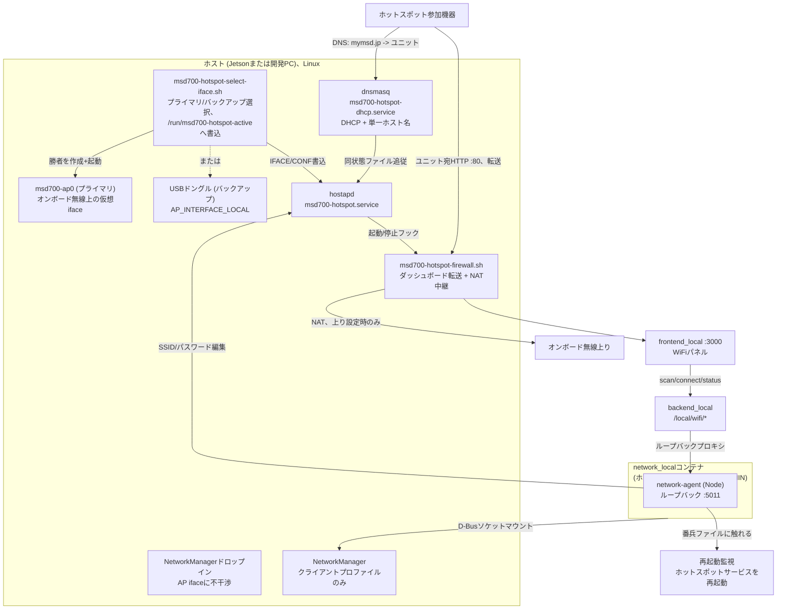

# WiFiホットスポット+クライアント

<RoleBadge role="technician" />

全ユニットのローカル構築の一部です([ユニット構築](/ja/setup/unit-setup) Step 6):ユニットはオペレーター参加用の自前WiFiホットスポット(`http://mymsd.jp`)を運用し、ハードが許せば同無線で他ネットワークへの通常WiFi**クライアント**接続を維持してインターネットとクラウド同期に使います。

ホットスポット起動毎に選択スクリプトが2経路の1つを選びます:

- **プライマリ**: オンボード無線上の仮想AP (`msd700-ap0`)。先に実ドライバーのAP+クライアント対応を確認します。[MT7922](/ja/setup/wifi-mt7922)含む。
- **バックアップ**: 設定済みUSBドングル。プライマリのインターフェース選択失敗時のみ試行します。hostapd失敗後のフェイルオーバーではありません。下の制限参照。

初回ユニットスタック起動前にプロビジョニングします。ホットスポットなしでも`network_local`は`/run/msd700-hotspot-active`をバインドマウントします。そのファイルがない状態でDocker起動するとフォルダが代わりに作られ、後のプロビジョニングを阻害します。

## セットアップの流れ

新規ユニットではこの順序です。多くはStep 2と3のみ必要です:

1. **先にオンボード無線を上げる。** MT7922ならファームウェア修正([MT7922 Wi-Fi設定](/ja/setup/wifi-mt7922)):TegraカーネルではNetworkManagerに不可視のまま、黙ってドングル経路に押しやられます。オンボード無線が`nmcli device status`に出ていれば修正不要です。
2. [ホットスポットのプロビジョニング](#ホットスポットのプロビジョニング-ユニット毎に一度)(`./setup.sh --provision-network`)。プリフライトがオンボード無線を確認し、設定済みなら自動でドングルにフォールバックします。
3. [動作確認](#動作確認)。
4. **(任意)[予備ドングルドライバーの導入](#ドングルドライバーの導入)。** Step 2のプリフライトがオンボード無線のプライマリ不可と言った場合、または意図的な冗長用のみです。プライマリ動作箇所では不要です。

対話的でユニット別なのはStep 2のみ(SSID、パスワード)。他は一度きりのハードウェア立上げで、ハード変更時のみ再実施です。

## プライマリ無線と予備ドングル

プライマリ経路はオンボード無線でクライアント+AP同時動作します。実ドライバーの`iw phy <phy> info`全出力を確認します:対応種別・上限・チャンネル上限です。phyが1つでも共有チャンネルの同時クライアント+APは否定できません。チップ名だけでは何も証明しません。プロビジョニングの確認は"valid interface combinations"付近の`AP`有無のみで、完全な組合せではありません。

::: warning 選択は動作可否の判定ではありません
セレクターは`msd700-ap0`を作成/起動し、勝者を状態ファイルに書きます。組合せ検証もhostapd放送待ちもしません。バックアップは選択失敗時のみ試行します。後のhostapd/チャンネル失敗は同プライマリを永久リトライし、ドングルへフェイルオーバーしません。両経路は2.4 GHzチャンネル6固定で、変化するクライアント上りとの同期はありません。有線/コンソールの復旧手段を保持します。
:::

| 経路 | 使用時 | 条件 |
| --- | --- | --- |
| **プライマリ**: オンボード無線上の仮想AP | 毎起動時に先に試行、`STA_INTERFACE_LOCAL`のphy | 動作するクライアント+AP/チャンネル上限のドライバー/ファームウェア。リンクアップだけでは放送を証明しません |
| **バックアップ**: USBドングル(`AP_INTERFACE_LOCAL`) | プライマリのインターフェース選択失敗時に試行 | 動作するAP対応ドングル+ドライバー。hostapd失敗後のフェイルオーバーではありません |

::: info WindowsホットスポットはLinuxドライバーの証明になりません
Windowsは独自仮想アダプタースタックでAP+クライアント動作し、Linux `mac80211`同時使用と無関係です。*ハード*可能のヒントにはなりますが、自ドライバーの対応組合せは何も語りません。実機の`iw phy <phy> info`を読んでください。
:::

**検証済み予備ドングル**: TP-Link TL-WN722N v2/v3、Realtek **RTL8188EUS** (USB `2357:010c`)。同チップの他ドングルも同ドライバーで動作するはずです。`scripts/install-wifi-dongle-driver.sh`の`KNOWN_IDS`参照。旧構築はDKMSドライバー必須でした。自カーネルのモジュールとAP対応を確認してから判断します。

## 全体構成



ホットスポットはDocker非依存です。`hostapd`+`dnsmasq`はsystemdサービスとして起動し、`docker-manager.sh`の有無に関わらず起動時に上がります。`network_local`はダッシュボードの状態/スキャン/クライアント操作とホットスポット名変更・再起動要求を提供します。ダッシュボード自体はローカルDockerスタック稼働が必要です。

### hostapdを使う理由 (NetworkManager APモードでなく)

NetworkManager自前のAPモードはRTL8188EUSドングルで毎回ハングします(~25秒後`supplicant-timeout`)。`hostapd`直接実行は同インターフェースを1秒未満で上げます:ドライバーはAPモード対応ですが、完了イベントの到着順がNetworkManagerのAP経路の期待と合いません。そこで`hostapd`を独自systemdサービスで動かし、NetworkManagerにはAPインターフェース不干渉(unmanagedドロップイン)を指示します。クライアント側は通常NMプロファイルのままです。

### 構成要素

| 要素 | 内容 |
| --- | --- |
| `msd700-hotspot-select-iface.sh` | 起動フック:オンボード無線可ならプライマリ仮想APを上げ、不可なら予備ドングル。勝者(`IFACE`、`CONF`)を`/run/msd700-hotspot-active`へ書込 |
| `msd700-hotspot.service` | 勝者インターフェースに`192.168.4.1/24`付与、`hostapd`実行、ファイアウォール適用/撤去。起動時有効、`Restart=on-failure` |
| `msd700-hotspot-firewall.sh` | ユニット自アドレス宛ポート80をダッシュボードへ転送(キャプティブポータルではなく他ポート80は通過)+上りあり時のインターネットNAT中継 |
| `msd700-hotspot-dhcp.service` | 専用`dnsmasq`:DHCP (`192.168.4.10`-`192.168.4.200`)+`PORTAL_HOSTNAME_LOCAL`をユニットに解決。APサービスに紐付き |
| `/etc/hostapd/hostapd-msd700-primary.conf` / `-backup.conf` | 同SSID/パスワードを2面描画(インターフェース毎)。クライアントはどちらでも同一に見えます。モード`0600` |
| `/etc/NetworkManager/conf.d/msd700-unmanaged-ap.conf` | `msd700-ap0`とドングルにNM不干渉 |
| `/etc/polkit-1/rules.d/50-msd700-network-manager.rules` | `network_local`の`nmcli`が対話認証なしで動くよう許可 |
| `msd700-hotspot-restart.path` / `.service` | `network_local`からホストsystemdへの唯一の線:番兵ファイル接触でホットスポットサービス再起動のみ実行 |
| `/etc/tmpfiles.d/msd700-hotspot.conf` | 起動時に欠落状態ファイル/dir作成。型違いパスの修復はしません |
| NM接続プロファイル (オンボードのみ) | オペレーターWiFiへの通常クライアント接続、`autoconnect: yes` |

復旧はベストエフォートです:両サービスは失敗時再起動しますが、AP単独再起動後にDHCPは自力で戻りません。ホットプラグやSSID/パスワード変更後はDHCP/DNSを別途確認します。

`network_local`は`privileged`ではありません。バインドマウントD-Busソケット越しにホストNetworkManagerを制御します(AP状態読取に`NET_ADMIN`+ホストネットワーク、D-Bus呼出はDocker既定プロファイルで遮られるため`apparmor:unconfined`)。`/run/msd700-hotspot-active`(読取専用)、`/etc/hostapd`(書込可、名変更用)、`/run/msd700-hotspot-restart`(書込可、再起動要求用)もバインドマウントします。

## ドングルドライバーの導入

**バックアップ**経路用のみ:オンボード無線のクライアント+AP不可時、または意図的冗長用です。ユニット毎に一度きり、プロビジョニング前に:

```bash
./scripts/install-wifi-dongle-driver.sh
```

- `dkms`・カーネルヘッダー・ツールチェーンを欠落時導入。
- [aircrack-ng/rtl8188eus](https://github.com/aircrack-ng/rtl8188eus)を`/usr/src/`へクローン。
- **DKMS**でビルド(ヘッダー+適合ソースがあればカーネル再構築後も残存。カーネル更新後はDKMS状態を確認)。
- モジュール読込後、2つ目のWiFiインターフェース出現を待機。

フラグ: `--check`(確認のみ)、`--remove`(削除)。

`setup.sh --provision-network`の自動導入は`AP_INTERFACE_LOCAL`空かつ`lsusb`一致`2357:010c`時のみです。他の対応USB IDはインストーラーを明示実行します。

## ホットスポットのプロビジョニング (ユニット毎に一度)

以下は全て意図的に**Docker外**にあります:`local_dev`停止時も残り、`docker-manager.sh`未実行ユニットでも上がる必要があります。

### 1. (任意)予備ドングルを挿す

オンボード無線のプライマリ不可時、または冗長用のみです:[上記](#プライマリ無線と予備ドングル)。プライマリ動作箇所は完全省略します。

`docker/.env`への事前設定は不要です。検証済みドングルを挿して下のプロビジョニングへ進みます。全て対話的に聞かれます。

ホストに`nmcli`がなければ:

```bash
sudo apt install network-manager
```

### 2. プロビジョニング

対話端末から(パイプ・非TTY不可):

```bash
./setup.sh --provision-network
```

インターフェース名とSSIDを聞きます(検出済み既定付き)。パスワード入力は非表示で、設定済みなら`[keep current]`表示、中身は出ません。新ホットスポットパスワードは2回入力します。パスワードは`docker/.env`に**書き戻されません**:クライアント鍵はNetworkManagerプロファイルへ、AP鍵はhostapd設定(`/etc/hostapd/hostapd-msd700-primary.conf`とドングルあり時は`-backup.conf`、`chmod 0600`)へ入ります。両者に同SSID/パスワードのためクライアントはどちらでも同一に見えます。他の回答(インターフェース名、SSID)は`docker/.env`に保存されます。

::: info 無人プロビジョニング
TTYなし(または`MSD700_NONINTERACTIVE=1`)ではプロンプトを省略します。`docker/.env`は直接sourceされるため継承環境より優先され、既存hostapdパスワードがさらに優先されます。インラインパスワードはシェル履歴に漏れる場合があり、上書きも不確実です。非表示の対話入力を使ってください。安全な無人パスワードローテーションは未解決です。
:::

インターフェース名の事前調査は不要です。この1コマンドが:

1. **udevルール導入**(全`scripts/udev/*.rules`、STM32+RealSense含む)。
2. **PolicyKitルール導入**で`network_local`の`nmcli`が認証待ちで固まらないようにします。
3. **バックアップ検出**:USB `2357:010c`存在かつ`AP_INTERFACE_LOCAL`空なら必要に応じドライバー導入後、`8188eu`カーネルドライバーでインターフェース特定(MAC/挿順非依存)。
4. **オンボード検出**:ちょうど1つある*他*のWiFi機器です。両値を`docker/.env`に書き戻します。曖昧な場合(オンボード2基)は手動設定に残します。
5. **プライマリ可否確認**:STAインターフェース設定済み・不在なら一度だけ`apt-get install -y linux-firmware`+udev再発火、不可なら警告してドングル待機([MT7922 Wi-Fi設定](/ja/setup/wifi-mt7922)が手修正する正にその故障)。存在するが`iw phy`組合せにAPなしならプライマリ継続フォールバックを警告。ドライバー/ハード上限でありここでは直せません。
6. **欠落時`hostapd`導入**、hostapd以前の残存`msd700-hotspot` NMプロファイル削除、両AP用NM unmanagedドロップイン書込(hostapd取得*前*にNM再起動)。
7. **両hostapd設定**・dnsmasq設定・ファイアウォール+選択スクリプト・両systemdユニットを描画導入し、有効化して**再起動**(実行中サービスに無効な`enable --now`でなく)します。
8. **クライアントプロファイル作成**(上りインターフェース/SSID設定時)。同名既存は不変です。

再プロビジョニングはhostapd設定を書き換え、NM/AP/DHCPを再起動し、オペレーター切断の可能性があります。続けてVelodyneネットワーク設定も再実行します。変更中WiFiでなくローカルコンソールか有線アクセスを使います。既存クライアントプロファイルは不変です。クライアント網変更はダッシュボードから行います。

ホスト要件: `nmcli`、`iw`、`dnsmasq`、`iptables`、systemd、udev、polkit。当経路はhostapd欠落時は導入しますが**dnsmasqやiwは導入しません**。先に確認します。

### `docker-manager.sh build`/`up`に含めない理由

ホスト網プロビジョニングはパッケージ・`/etc/`・systemdに触れる破壊的操作であり、コンテナビルドと別物です。(`up`も`--no-autostart`なしではsudoで起動時自動起動を導入します。)

## ダッシュボードのリダイレクト

**意図的にキャプティブポータルではありません。** 旧版は各OSの接続確認ホスト名を乗っ取り、各OSが当該網にインターネット**なし**と判断しました(Androidはモバイルデータに逃げ)、動作中の上りを自ら隠しました。現在:

- `dnsmasq`はちょうど1つのホスト名`PORTAL_HOSTNAME_LOCAL`(既定`mymsd.jp`)とサブドメインのみをユニットに解決します。他は各OS自前の接続確認含め実解決のため、上り動作時は多くのOSが「WiFiにサインイン」表示を**出しません**。`http://mymsd.jp`に直接開きます(または素のホットスポットアドレス)。
- ファイアウォールはユニット自ホットスポットIP**宛**の素HTTPのみダッシュボードへ転送します。他ポート80閲覧と全HTTPSは素通しです。本変更前の provisioning ユニットは旧 blanket ルール残存の場合があり、再 provisioning で除去されます。

hostapd上下に連動して自動適用/撤去され、コンテナ非依存です。

**インターネット中継。** `STA_INTERFACE_LOCAL`設定時のみ、ファイアウォールスクリプトは`MASQUERADE`(`192.168.4.0/24`をオンボード無線へ出す)とDockerの**`DOCKER-USER`**チェインへの`ACCEPT`(Dockerが決して触れないと約束する唯一のチェインのため、コンテナ再起動後も残存)を追加します。

**注意:** ホットスポット参加者はユニットのインターネット接続に相乗りします。配備先でホットスポットパスワードを知り得る範囲を検討します。

## ダッシュボードのバッジ

独立WiFiバッジはありません。WiFiは**[Local Modeバッジ](/ja/development/data-sync#the-local-mode-badge)**ドロップダウン内の**一区画**です。バッジ行は**グリフ**のみで状態色付けし、概要(SSID、`hotspot only`、`no network`、`wifi unreachable`)は印刷文でなくホバーツールチップです。エージェント到達不能も区画冒頭に文で明記します。

エージェントは*勝者*インターフェースを`/run/msd700-hotspot-active`から読みます(当起動の勝者プライマリ`msd700-ap0`か予備ドングル)。欠落時のみ`AP_INTERFACE_LOCAL`ドングルに後退します。ドングルなしプライマリ専用ユニットでバッジがホットスポットを見るのはこのおかげです。

状態は常駐バッジから`GET /local/wifi/status`を30秒ごとに問い合わせます(操作直後は短期間だけ頻繁にします)。スキャンはドロップダウン展開時のみ実行します(`nmcli`再スキャンは無料ではありません)。

| エンドポイント | 認証 | 用途 |
| --- | --- | --- |
| `GET /local/wifi/status` | なし | ホットスポット状態(起動? SSID? クライアント数)+クライアント状態(接続? SSID? IP? インターネット?) |
| `GET /local/wifi/scan` | なし | 周辺SSID+方式、ドロップダウン用。**自ホットスポット除外**(下記) |
| `GET /local/wifi/saved` | なし | 既知クライアントプロファイル |
| `GET /local/wifi/hotspot` | なし | 自ホットスポットSSID+最終変更結果。**パスワード返却なし** |
| `POST /local/wifi/connect` | なし | 選択クライアント網へ参加 |
| `POST /local/wifi/disconnect` | なし | クライアント網から離脱 |
| `POST /local/wifi/forget` | なし | 保存クライアントプロファイル削除 |
| `POST /local/wifi/hotspot` | なし | 自ホットスポットSSID/パスワード変更 |

::: warning これらの経路にログイン保護はありません
ローカル経路にオペレーター認証はありません。エージェントはループバック束縛ですが、バックエンドはログイン確認なしにブラウザ要求を中継します。信頼できない網に晒さないでください。
:::

### 自ホットスポットはスキャンに出ません

ホットスポット放送中にクライアント無線でスキャンすると自ホットスポットが最上位(最強)に出ます。選択はユニット自身への参加を意味します:再設定中にホットスポットがオペレーターを落とし、ページは切れた接続で再読込され、つい再選択してしまいます。そこで`scan()`は除外し`connect()`は明示的に拒否します(`own_hotspot`、説明文として表示)。除外SSIDは実際の無線(`iw dev <ap-iface> info`)とNMプロファイル由来で、両方とも失敗時は無視されます。再起動中のAP停止中は一時的に漏れる場合があります。

## 自ホットスポットの変更

バッジドロップダウンのWiFi区画でホットスポット名変更と新パスワード設定をします。エージェントは存在するhostapd設定の`ssid=`/`wpa_passphrase=`行を直接書換え(両者に同値)、間接的に再起動要求します:ホストsystemdのpathユニットが監視する番兵ファイルに触れ、`systemctl restart msd700-hotspot.service`が実行されます。同期の「再起動完了」信号がないため、固定の待ち時間でなく最大15秒の無線状態の問い合わせで確認します。

::: danger 保存はホットスポット参加者全員を切断します。自分含む
不可避です:ダッシュボードは変更が破壊する接続越しに届きます。新SSID/鍵でのAP再起動は全機器を落とし、自動再参加しません(OSには未知網か誤パスワードに見えます)。

そこで`POST /local/wifi/hotspot`は検証後、再接続先SSID付きで**202 Accepted**応答し、*その後*適用します。先に応答することで接続あるうちに「`<新名>`に再接続」と言えます。応答は*受理*であり*成功*ではありません:再参加後に`GET /local/wifi/hotspot`の`last_change`を読んでください。
:::

::: warning ベストエフォートのロールバックであり接続検証ではありません
失敗時エージェントは旧SSID/鍵を戻して再有効化します(`last_change.rolled_back`で巻戻しと未送信を区別)。「失敗」とは15秒以内に期待SSIDが出ない意味で、コマンドエラーではありません。新パスワード・DHCP・DNS・再接続は検証しません。ロールバック自体も失敗し得ます。`last_change`はメモリ上でエージェント再起動で消えます。
:::

**検証**(フォームでなくエージェント内):SSID 1〜32**オクテット**(非ラテン名は文字数より早く上限到達)、WPA-PSKパスワード8〜63文字。制御文字は除去でなく拒否します。検証通過まで何も触らないため、不正値でホットスポットは死にません。

**パスワードはブラウザに送りません。** 参加者は既に知っています(入る時に入力済み)。素HTTP応答で返すと*クライアント側*網から来た部外者に渡します。フォームは新パスワードを聞き、空は「現状維持」意味です。

::: warning `docker/.env`は種であり真実ではありません
プロビジョニングは`docker/.env`を読んだ後、プライマリ・バックアップ・レガシーhostapd設定の順で live パスワードを優先します。非表示プロンプトかダッシュボードで変更し、環境上書きでは変えません。パスワードと違い live SSIDは provisioning に回収され*ません*:ダッシュボード改名は後の陳腐`AP_SSID_LOCAL`からの再 provisioning で戻る場合があります。プロンプトで放送SSID(`iw dev <ap-interface> info`)を確認します。
:::

クライアント側到達性(`full` / `limited` / `portal` / `none`)は`nmcli networking connectivity`直読です。第二の probe 実装はありません。

## 設定リファレンス (`docker/.env`)

| 変数 | 意味 | 既定 |
| --- | --- | --- |
| `AP_INTERFACE_LOCAL` | **予備**ドングルIF | `--provision-network`時自動検出 |
| `STA_INTERFACE_LOCAL` | オンボード無線IF。**プライマリ**ホットスポットも担当 | `--provision-network`時自動検出 |
| `AP_SSID_LOCAL` | ホットスポット放送名 | 空なら`MSD700-<hostname suffix>` |
| `AP_PASSWORD_LOCAL` | ホットスポットWPA2パスワード(8文字以上、AP作成に必須) | 意図的に`.env.example`では空 |
| `AP_CONNECTION_NAME_LOCAL` | レガシー:hostapd以前の残存NMプロファイル掃除のみ | `msd700-hotspot` |
| `PORTAL_HOSTNAME_LOCAL` | dnsmasqがユニットに解決するホスト名。ファイアウォール転送の唯一のアドレス | `mymsd.jp` |
| `NETWORK_AGENT_PORT_LOCAL` | `network_local`のループバックAPIポート | `5011` |
| `STA_SSID_LOCAL` / `STA_PASSWORD_LOCAL` | 任意:初回 provisioning 時自動参加の上流網 | 空(後でダッシュボードから追加) |
| `LOCAL_IP` | 表示ダッシュボードアドレス+フロントエンドビルド予備。ホットスポット固定アドレスは`192.168.4.1`のまま | `192.168.4.1` |

## 動作確認

```bash
# サービス稼働?
systemctl status msd700-hotspot.service msd700-hotspot-dhcp.service

# 勝者はどちら、プライマリ (msd700-ap0)かバックアップ (ドングル)か?
cat /run/msd700-hotspot-active

# APモードで放送中? (上ファイルのIFACEを使用)
iw dev <IFACE> info                      # type APと出るはず

# NetworkManagerは正しく不干渉?
nmcli device status                      # msd700-ap0/ドングルは"unmanaged"のはず

# ダッシュボードホスト名は当ユニットに解決?
dig +short @192.168.4.1 mymsd.jp                # 192.168.4.1と出るはず

# 他は実解決か (`STA_INTERFACE_LOCAL`設定時のみ有意)?
dig +short @192.168.4.1 github.com              # 192.168.4.1でない実IPが出るはず

# NAT+中継ルールあり?
sudo iptables -t nat -L POSTROUTING -n | grep 192.168.4.0
sudo iptables -L DOCKER-USER -n
```

別機器から:SSID参加後`http://mymsd.jp`を開きます(または素のホットスポットアドレス)。上り動作時は多くのOSが「WiFiにサインイン」表示を**出しません**。意図的撤去です([上記](#ダッシュボードのリダイレクト))。`STA_INTERFACE_LOCAL`設定時、他の閲覧は正常なはずです。

## トラブル対処

**ドングルが`lsusb`にない、または`nmcli device status`に2つ目WiFiがない**
`lsusb`欠落=USB/電源/接続問題でありドライバー問題ではありません。USBあり・IFなしならドライバー確認(`./scripts/install-wifi-dongle-driver.sh --check`)とカーネルログです。

**ビルド成功直後にモジュール未読込と出る**
一度再試行します:`dkms install`の`depmod`と`modprobe`の既知競合です。スクリプト内部で既に再試行済み(5回)。継続失敗は`sudo dmesg | tail -40`です。

**ホットスポットが放送しない / `iw dev`が`AP`でなく`type managed`**
`journalctl -u msd700-hotspot.service`の先頭はセレクター自身の判断ログです(どちらの経路か、なぜ後退したか)。繰返し起動失敗:NMが勝者IFを解放したか確認(`nmcli device status`は`unmanaged`のはず)。ドングル交換後の誤IF名 unmanaged 設定残存が定番原因です。

**オンボード無線がプライマリ可能なはずなのに常に予備ドングル運用**
オンボードphyの`iw phy <phy> info`全出力を読みます(managed+AP・総IF・チャンネル上限)。次に`journalctl -u msd700-hotspot.service`です。選択と放送は別段階・別エラーです。

**プリフライトがオンボード無線のドライバー/ファームウェア未 ready と警告**
[MT7922 Wi-Fi設定](/ja/setup/wifi-mt7922)の手修正対象そのものです。 provisioning 中の自動`apt-get install -y linux-firmware`は当Tegraカーネルに不十分な場合があります。設定済みなら予備ドングルでホットスポット継続します。

**`--provision-network`失敗 "nmcli not found"**
`sudo apt install network-manager`です。

**`--provision-network`失敗 "AP_PASSWORD_LOCAL is not set"**
対話再実行し非表示プロンプトで新パスワード入力します。追跡`docker/.env`へのコミットやシェル履歴記載は禁止です。1〜32バイトSSIDと制御文字なし8〜63文字WPA2パスフレーズを使います( provisioning は長さのみ確認。残りはエージェント検証)。

**クライアント参加もIPなし**
`systemctl status msd700-hotspot-dhcp.service`+`journalctl -u msd700-hotspot-dhcp.service`です。dnsmasqのIFは設定ファイルの`interface=`行でなくサービス起動行の`/run/msd700-hotspot-active`由来です。状態ファイルと実際起動IFの一致を確認します。設定陳腐なら`./setup.sh --provision-network`再実行です。

**`http://mymsd.jp`届くが他が読めない**
`docker/.env`の`STA_INTERFACE_LOCAL`空の可能性:AP単独モードであり設計上ダッシュボード専用です。設定すべきなら`nmcli device status`確認・設定・再 provisioning です。

**`STA_INTERFACE_LOCAL`設定済みもクライアントにネットなし**
NATルール存在を確認([上記](#動作確認))。再 provisioning 後欠落:ホットスポットサービスが実際に**再起動**されたか(有効化のみでなく)、`sysctl net.ipv4.ip_forward`が`1`か、オンボード無線自体にネットがあるか(`ping -I <STA_INTERFACE_LOCAL> 8.8.8.8`)です。

**provisioning 後ローカルサービス (バックエンド、メディア、MySQL)到達不能**
転送ルールの範囲誤りです。`/run/msd700-hotspot-active`の勝者IFのみ・自アドレスのみ(`-d`)を対象にし、ループバックや`0.0.0.0/0`決して不可です:`sudo iptables -t nat -L PREROUTING -n`。

**ホットスポット起動中なのにバッジ "Hotspot: no hotspot radio"**
`/run/msd700-hotspot-active`が`network_local`にマウント済みか確認(`docker compose exec network_local cat /run/msd700-hotspot-active`がホストと一致すべき)。内部空=バインドマウント未配線です。マウント正常=`--provision-network`未実行か両IF変数が真に空です。

**バッジにWiFiグリフ皆無**
両無線なし:APなし・クライアントIFなし・報告なしです。WiFiなし構築では想定内です。他は`nmcli device` / `lsusb`を確認します。

**ホットスポット起動中もグリフ赤 "WiFi service unreachable on this unit"**
`network_local`停止か`backend_local`到達不能です。`network_local`の`docker compose ps`を確認。`NETWORK_AGENT_PORT_LOCAL`が両サービス一致を確認します。

**バッジの`nmcli device wifi connect`失敗で理由不親切**
nmcli標準エラー素通しです。直接読みます:誤パスワード/圏外/拒否を区別します。

**ダッシュボードのホットスポット変更で`not_provisioned`**
両hostapd設定がまだないか`network_local`が読めません(`/etc/hostapd`バインドマウント確認:`docker compose exec network_local ls -l /etc/hostapd`)。`--provision-network`未実行です。

**ダッシュボードのホットスポット変更がタイムアウト/確認なし**
`setHotspot()`は番兵ファイルに触れて新SSID空中出現を最大15秒待ちます([上記](#自ホットスポットの変更))。ホストの`systemctl status msd700-hotspot-restart.path msd700-hotspot-restart.service`、`network_local`への`/run/msd700-hotspot-restart`書込可マウント、`journalctl -u msd700-hotspot-restart.service`を確認します。

## 関連

- [MT7922 Wi-Fi設定](/ja/setup/wifi-mt7922):上記[流れ](#セットアップの流れ)のStep 1、実機の確定MT7922ファームウェア問題のみ対象
- [ユニット構築](/ja/setup/unit-setup):本機能が載るベースのローカルモード導入
- [Dockerリファレンス](/ja/setup/docker-reference#network-mode-host):一部サービスがホスト網共有の理由
- [データ同期: Local Modeバッジ](/ja/development/data-sync#the-local-mode-badge):本区画が属するバッジ
- [アーキテクチャ: 信頼境界](/ja/development/architecture#trust-domains):`/local/*`経路の信頼設計(変更系WiFi経路のオペレーターセッションミドルウェアは設計済み未装着。上記警告参照)
