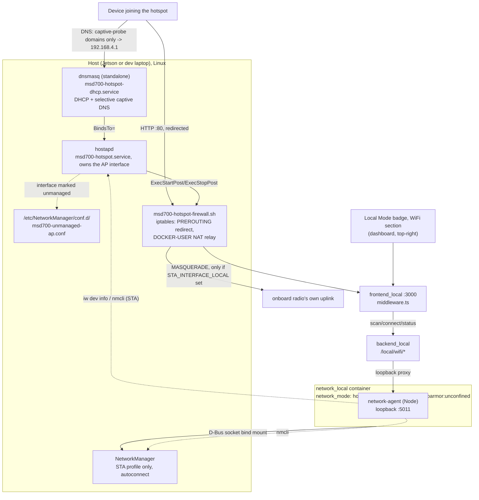

# Wi-Fi ホットスポット + クライアント

<RoleBadge role="technician" />

すべてのユニットのローカルモードセットアップ([ユニットセットアップ](/ja/setup/unit-setup) ステップ 6)
の標準的な一部です。ユニットは、オペレーターが参加できるよう独自の WiFi ホットスポットを実行し、
オペレーターが何らかの HTTP ページを開いた瞬間に自動的にそのダッシュボードへ捕捉され(キャプティブ
ポータル。空港やカフェが使うのと同じ仕組みです)、また、2 つ目の無線機が利用可能であれば、
インターネット/クラウド同期のフォールバックとして別のネットワークに WiFi **クライアント**として接続
し続けます。両方の無線機の状態は [ローカルモードバッジ](/ja/development/data-sync#the-local-mode-badge)
の同じバッジ、同じドロップダウンに表示され、オペレーターはそこから別のネットワークに接続できます。

以下のプロビジョニング手順を一度も実行していないユニットも、それ以外の点では
[ユニットセットアップ](/ja/setup/unit-setup) が説明するとおりに動作します。バッジは単に「ホットスポット
無線機なし」と報告するだけで、他には何も影響しません。

## なぜ無線機が 1 つではなく 2 つ必要なのか

Jetson のオンボード WiFi(このプロジェクトのハードウェアでは Realtek RTL8822CE)は**1 つの物理
無線機**です。これはネットワークにクライアント(STA)として参加する*か*、ホットスポット(AP)を
ブロードキャストする*か*のどちらかしかできず、同時に両方はできません。これはドライバの制限ではなく
ハードウェア自体の制約です。`iw phy` はオンボードカードについて正確に 1 つの `phy` を示し、1 つの
無線機は一度に 1 つのチャンネルにしか同調できません。

::: info MediaTek MT7922 を搭載したユニットの場合
一部のユニットはRTL8822CEの代わりにMT7922カードを搭載しています。Tegraカーネルでは、ドライバーは
存在するのにファームウェアが見つからないエラーで起動しないことがあります。ハードウェア故障と判断
する前に、[MT7922 Wi-Fiセットアップ](/ja/setup/wifi-mt7922)でその具体的な修正方法を確認してください。
:::

| トポロジー | 実現可能性 |
| --- | --- |
| ドングルがホットスポットを実行し、内蔵無線機は WiFi クライアントのまま | 信頼度が高く、チップセットのリスクなし。AP とクライアントは物理的に分離した 2 つの無線機に存在するため、「同時モード」の問題はそもそも発生しない。独立した 2 つのプロセス(ドングル上の hostapd、オンボード無線機上の NetworkManager)がそれぞれ自身のインターフェースに紐づく。 |
| 1 つの無線機が AP とクライアントの両方を同時に処理する(ドングルなし) | チップセット次第。ドライバが 1 つの wiphy 上で `{ AP, managed } <= 2` を含む有効な `iw list` インターフェース組み合わせを報告する場合にのみ機能する。保証はなく、このプロジェクトが一般論として断言できるものでもない。実機で確認すること。 |

::: info Windows が両方同時に行えることは Linux もそうできる証拠にはならない
Microsoft の Mobile Hotspot 機能を通常の WiFi 接続と並行して実行しているラップトップは、Linux の
`mac80211`/`nl80211` の AP と managed の同時実行構成とはまったく異なるドライバスタック(Windows 自身
が管理する仮想 WiFi アダプタ)を使用しています。これは*ハードウェア*が根本的に不可能というわけでは
ないという合理的なヒントではありますが、同じチップ向けの Linux ドライバがそれをサポートするインター
フェース組み合わせを報告するかどうかについては何も語っていません。実機の `iw list` で確認してくだ
さい。
:::

**このプロジェクトで検証済みのハードウェア**: TP-Link TL-WN722N v2/v3、Realtek **RTL8188EUS** チッ
プセット(USB ID `2357:010c`)。同じチップセットの RTL8188EUS ベースのドングルであれば同じドライバ
で動作するはずです。同一チップセットの他の USB ID については `scripts/install-wifi-dongle-driver.sh`
内の `KNOWN_IDS` を参照してください。このチップセット用のドライバは Jetson のカーネルに標準では
一切同梱されていません(ツリー内の `rtl8xxxu` も、ツリー外モジュールも)。DKMS 経由でソースから
ビルドする必要があります。詳しくは下記の[ドングルドライバのインストール](#installing-the-dongle-driver)
を参照してください。

## どのように結線されているか



ホットスポットの存在は Docker に**依存しません**。`hostapd` と `dnsmasq` は、それ自身の systemd
サービスとして動作し、ブート時に起動され、`docker-manager.sh` が一度でも実行されたかどうかとは無関係
です。有線 Ethernet ケーブルが「ただ動く」のと同じ感覚です。`network_local` はバッジ向けのライブ状態
/スキャンを提供し、オペレーターの明示的な「別のネットワークに接続する」というリクエスト(クライアント
側のみ)を実行するだけです。ホットスポット自体のプロビジョニングは、別個の、一度限りのステップです
(以下)。

### なぜ NetworkManager 自体の AP モードではなく hostapd なのか

NetworkManager は自身で AP モードの接続を作成できます(`nmcli connection add ...
802-11-wireless.mode ap`)。これは内部的には `wpa_supplicant` によって駆動されます。それがこのプロ
ジェクトの当初の設計でしたが、RTL8188EUS ドングルでは**毎回ハングします**。NM のアクティベーション
は約 25 秒後に必ず `"Hotspot network creation took too long"` / `reason 'supplicant-timeout'` で失敗
していました。

同じインターフェースに対して `hostapd -dd` を直接実行して診断したところ、AP は 1 秒未満で立ち上が
り(`AP-ENABLED`)、完全に機能しました。ドライバは確かに AP モードをサポートしていますが、その
`NL80211_CMD_START_AP` の完了イベントは、`wpa_supplicant` の内部 AP コードが期待する順序とは異なる
順序で到着します(hostapd のデバッグログに `Ignored unknown event (cmd=15)` として現れ、これは AP が
他の手段で既に起動した*後に*記録されています)。`wpa_supplicant` の softAP パスはそのイベントを待って
いるように見えますが、`hostapd` はそれをブロックせず、そのまま進みます。

修正方法: `hostapd` を独自の systemd サービスとして直接実行し、NetworkManager にはそのインターフェ
ースに一切触れないよう指示する(`conf.d` の drop-in での `unmanaged-devices`)ことで、両者が決して
奪い合わないようにします。STA 側(クライアントとして参加するアップストリームネットワーク)にはこの
ような問題はなく、通常の NM 接続プロファイルをそのまま利用します。

### コンポーネント

| コンポーネント | 動作内容 | ライフサイクル |
| --- | --- | --- |
| `msd700-hotspot.service` | 静的 IP `192.168.4.1/24` を割り当て、`hostapd -i <ap-iface> /etc/hostapd/hostapd-msd700.conf` を実行し、`msd700-hotspot-firewall.sh apply`/`teardown` を呼び出す | systemd、ブート時に有効化、`Restart=on-failure` |
| `msd700-hotspot-firewall.sh` | キャプティブポータルの HTTP リダイレクト(AP インターフェースのポート 80、常時)に加え、インターネットリレー用の NAT(`DOCKER-USER` チェーン、`STA_INTERFACE_LOCAL` が設定されている場合のみ) | 上記サービスの `ExecStartPost`/`ExecStopPost` から呼ばれる、冪等(チェックしてから実行) |
| `msd700-hotspot-dhcp.service` | 専用の `dnsmasq` インスタンスを実行: DHCP サーバー(`192.168.4.10`-`192.168.4.200`)+ 選択的なキャプティブポータル DNS | systemd、`BindsTo=msd700-hotspot.service` |
| `/etc/NetworkManager/conf.d/msd700-unmanaged-ap.conf` | ドングルのインターフェースに決して触れないよう NM に指示する | 再起動時に NetworkManager が読み込む |
| `/etc/polkit-1/rules.d/50-msd700-network-manager.rules` | `org.freedesktop.NetworkManager.*` アクションを無条件に許可し、`network_local` の `nmcli` 呼び出し(スキャン、接続、削除)がコンテナには決して応答できない対話的な polkit プロンプトなしに動作するようにする | 再起動時に `polkit` が読み込む |
| NM 接続プロファイル(オンボード無線機のみ) | オペレーターの WiFi への通常のクライアント接続 | 通常どおり NetworkManager が管理、`autoconnect: yes` |

ホットスポット側の両方の systemd サービスは `Restart=on-failure` であるため、ユニットが稼働中に*
同じ*ドングルを抜き差ししても自動的に復旧します(インターフェース名は物理ドングルごとに MAC アドレス
から導出され安定しています)。

::: info なぜ `network_local` は `privileged: true` ではないのか
`network_local` が必要とするのはいくつかの明確な事柄だけで、そのいずれも `msd700` が既に使っている
広範な許可(`privileged: true` + host network、[Docker コマンドリファレンス](/ja/setup/docker-reference#network-mode-host)
を参照)ではありません。バインドマウントされた D-Bus ソケットにより、`nmcli` は STA 側について**ホスト
自身**の NetworkManager デーモンを制御できます。クライアント自体がネットワークインターフェースに
直接触れることはありません。`cap_add: [NET_ADMIN]` に `network_mode: host` を加えたものは、AP のステ
ータス読み取り(`iw dev <iface> info`)に必要です。AP インターフェースはホストのネットワーク名前空間
に存在するためです。`security_opt: apparmor:unconfined` は分かりにくい部分です。Docker のデフォルト
apparmor プロファイルは、ソケットがバインドマウントされ `NET_ADMIN` が付与されていても、コンテナ内
部からの D-Bus メソッド呼び出しを拒否します。`nmcli` の最初の `Hello()` 呼び出しは、NetworkManager
自身の D-Bus ポリシーが参照される前に `AccessDenied` になってしまいます。このコンテナの唯一の仕事は
そのバス経由でホストの NetworkManager と話すことなので、デフォルトプロファイルのルールと一つ一つ
戦うのではなく、unconfined で実行しています。
:::

## ドングルドライバのインストール

ユニットごとに一度、プロビジョニングの前に実行します。

```bash
./scripts/install-wifi-dongle-driver.sh
```

- `dkms`、カーネルヘッダー、C ツールチェーンが不足していればインストールします。
- ドライバのソース([aircrack-ng/rtl8188eus](https://github.com/aircrack-ng/rtl8188eus))を
  `/usr/src/` にクローンします。
- 一度限りの `insmod` ではなく、**DKMS** 経由でビルド・インストールします。これは重要です。DKMS は、
  この Jetson が今後起動するあらゆるカーネルに対してモジュールを自動的に再ビルドするため、`apt` に
  よるカーネルアップグレードが、手動ビルドの場合のようにドングルを黙って壊してしまうことがありませ
  ん。
- モジュールをロードし、2 つ目の WiFi インターフェースが現れるのを待ちます。

フラグ: `--check`(状態確認のみ、変更なし)、`--remove`(アンインストール)。

::: info このステップは自動的に実行されることもある
`setup.sh --provision-network`(下記)は、既知の RTL8188EUS ドングルを検出し(同じ `KNOWN_IDS`
リストに対する `lsusb`)、そのドライバがまだロードされていなければ、続行前にこのスクリプトを自動的
に実行します。ビルド出力を確認したい場合や、何も変更せずに `--check` で状態だけ見たい場合は、事前に
手動で実行しておくのも依然として有用です。
:::

## ホットスポットのプロビジョニング(ユニットごとに一度)

以下のすべては、意図的に**Docker の外**に存在します。これは `local_dev` が停止していても存続する
必要があり、また `docker-manager.sh` を一度も実行したことがないユニットにドングルを挿した瞬間に
立ち上がる必要があるためです。

### 1. ドングルを挿す

事前に `docker/.env` に手動で設定する必要のあるものはありません。検証済みの USB WiFi ドングルを挿し
て、以下のプロビジョニングに進んでください。パスワードやその他すべての設定は、その時点で対話的に
尋ねられます。

`nmcli` がまだホストにない場合:

```bash
sudo apt install network-manager
```

### 2. プロビジョニングする

対話型ターミナル(キーボードの前にいる人間、パイプや非 TTY セッションではない)から実行します。

```bash
./setup.sh --provision-network
```

create-next-app スタイルで、すべての設定項目(インターフェース名、SSID、ホットスポットのパスワード)
を順に案内し、自動検出済みまたは現在の値を `[default]` として表示します。Enter を押せば受け入れ、
新しい値を入力することもできます。ホットスポットのパスワードは確認のため 2 回入力し、STA 側で入力
した上流 WiFi のパスワードとともに、意図的に `docker/.env` やディスク上の他のいかなるファイルにも
**決して**書き込まれません。NetworkManager は STA キー自体を保存し、hostapd 自身の設定ファイル
(`/etc/hostapd/hostapd-msd700.conf`、`chmod 0600`)が AP のキーを保存します。それ以外のすべての回答
(インターフェース名、SSID)は `docker/.env` に書き戻されるため、再実行時や、ファイルをざっと見た人間
にも実際の値が見えます。詳しくは下記の[設定リファレンス](#configuration-reference-docker-env)を参照
してください。

::: info 無人・スクリプトによるプロビジョニング
TTY がない場合、または `MSD700_NONINTERACTIVE=1` の場合、上記のプロンプトは完全にスキップされ、
`docker/.env`(存在しない場合は初回実行時に `docker/.env.example` から作成される)と環境変数がその
まま使用されるため、自動化も引き続き機能します。

```bash
AP_PASSWORD_LOCAL='your-hotspot-password' ./setup.sh --provision-network
```

`docker/.env` は**git で追跡されている**ため、実際のパスワードは示したとおりコマンドラインに置く
べきであり、決してこのファイルにコミットしてはいけません。`setup.sh` は `docker/.env` を、環境に
既に存在する変数を上書きせずに source するため、インラインの値が優先されます。
:::

いずれにせよ、事前に手動でインターフェース名を調べる必要はありません。この 1 つのコマンドは:

1. **udev ルールをインストールします。** `scripts/udev/` 内のすべての `*.rules` ファイル(WiFi 用
   だけでなく)。リポジトリに既にあった STM32 と RealSense のルールも、これができるまでは独自の
   インストール経路を持っていませんでした。
2. **PolicyKit ルール**(`/etc/polkit-1/rules.d/50-msd700-network-manager.rules`)をインストール
   し、`network_local` の `nmcli` 呼び出しが対話的な認証プロンプトでハングしないようにします。
3. **AP インターフェースを自動検出します**: 既知の RTL8188EUS ドングルが挿されているが
   `AP_INTERFACE_LOCAL` が空の場合、必要であればまずそのドライバをインストールし(上記参照)、次に
   `8188eu` カーネルドライバに所有されているものを `/sys/class/net/*/device/driver` を辿って探しま
   す。これは決定論的で、MAC アドレスや挿入順序に依存しません。
4. **STA インターフェースを自動検出します**: 他に存在する WiFi デバイスが正確に 1 つだけあれば、
   それを使用します。検出された両方の値は `docker/.env` に書き戻されるため、以降の実行や、ファイル
   をざっと見た人間にも実際の値が見えます。曖昧なケース(例えばオンボード無線機が 2 つある場合)は
   人間が明示的に設定するよう残されます。
5. **`hostapd` をインストールします**(未インストールの場合)。このプロジェクトが NM 自身の AP モード
   をやめる前から残っていた `msd700-hotspot` という名前の NetworkManager 接続プロファイルを削除し、
   `/etc/NetworkManager/conf.d/msd700-unmanaged-ap.conf` を書き込みます(hostapd がそのインターフェ
   ースを取得する*前に* NetworkManager を再起動し、NM がまだそれを保持したままにならないようにしま
   す)。
6. **レンダリングしてインストールします**: `/etc/hostapd/hostapd-msd700.conf`、
   `/etc/dnsmasq-msd700-hotspot.conf`、`/usr/local/sbin/msd700-hotspot-firewall.sh`、および 2 つの
   systemd ユニットファイルを配置し、`msd700-hotspot.service` と `msd700-hotspot-dhcp.service` を
   有効化して**再起動**します(既に稼働中のサービスに対しては no-op になり、変更された設定が実際
   には再適用されないまま残ってしまう `enable --now` ではありません)。
7. **STA クライアントプロファイルを作成します**。`STA_INTERFACE_LOCAL`/`STA_SSID_LOCAL` が入力され
   ている場合に行われ、その名前のプロファイルが既に存在する場合はそのままにされます。

このコマンドの再実行は常に安全です。すべてのステップは冪等であり、実際に変更が必要なものにのみ
触れます。後でクライアントネットワークを追加・変更するには、このステップを再実行するのではなく、
ダッシュボードバッジのドロップダウンの WiFi セクションを使用してください。プロビジョニングは既存の
STA プロファイルには意図的に一切触れません。

### なぜこれは `docker-manager.sh build`/`up` に組み込まれていないのか

検討した上で意図的に却下されました。`docker-manager.sh` は現在、`sudo` をまったく必要としません
(コンテナのビルドと実行に必要なのは `docker` グループのメンバーシップだけです)。ホットスポットの
プロビジョニングには `apt install`、`systemctl`、`/etc/` への書き込みが必要です。これを組み込んで
しまうと、ホットスポット用ハードウェアが一切ない開発用ラップトップで `--simulator` を実行している
場合を含め、あらゆる `docker-manager.sh build` が、これまで一度も必要としなかった `sudo` パスワード
を突然要求し始める可能性があります。2 つのコマンドを分離しておくことで、その驚きを通常のケースから
遠ざけています。

## キャプティブポータル

**DNS は選択的であり、ワイルドカードではありません。** `/etc/dnsmasq-msd700-hotspot.conf`
(`docker/networkmanager/dnsmasq-hotspot.conf.tmpl` からレンダリングされる)は、iOS/macOS、Android、
Windows、Ubuntu/GNOME、Firefox がそれぞれ「このネットワークはキャプティブポータルの背後にあるか」を
検出するために問い合わせる特定のホスト名(`captive.apple.com`、`connectivitycheck.gstatic.com`、
`www.msftconnecttest.com`、`detectportal.firefox.com`、`nmcheck.gnome.org`、その他多数。完全な一覧
はテンプレートを参照)だけを `192.168.4.1` に解決します。それ以外のすべてのホスト名は、この dnsmasq
自身の上流リゾルバ(`/etc/resolv.conf`、通常は systemd-resolved で、オンボード無線機自身の上流ネッ
トワークが渡してきた DNS を問い合わせます)にフォールスルーします。これは、*すべての*ホスト名を
ユニット自身のアドレスにワイルドカードしていたこの機能の以前のバージョンを置き換えたものです。
ワイルドカードは、`STA_INTERFACE_LOCAL` が設定されていない**AP 専用ユニット**では今も実質的に同じ
挙動になります(DNS が何を言おうと、どのみちリレーする先がないため)。しかし、オンボードのアップ
リンクが存在すれば、実際のドメインを実際のアドレスに解決することが、以下の NAT リレーを通じて HTTPS
(ポート 443)トラフィックをそのまま素通りさせることを可能にします。

**リダイレクトはホスト名単位ではなく、インターフェース単位です。** `msd700-hotspot-firewall.sh` は
1 つの iptables ルールをインストールします。

```
iptables -t nat -A PREROUTING -i <ap-interface> -p tcp --dport 80 -j REDIRECT --to-port <captive-port>
```

これは、AP インターフェースに到着した**すべて**の平文 HTTP(ポート 80)リクエストを、宛先ホスト名
に関係なくダッシュボードへリダイレクトします。iptables はインターフェースとポートに基づいて動作し、
クライアントが既に解決した DNS の回答には基づきません。これは、キャプティブポータルのプローブ自体
にとっては意図的な動作です(それらの DNS は既に上記で `192.168.4.1` に誘導されているため、いずれに
せよここに着地します)が、同時に、無関係な何らかのサイトへのクライアントの平文 HTTP リクエスト(その
サイトの実際の IP に解決されたもの)も、実際にそのサイトに到達する代わりにここへリダイレクトされて
しまうことを意味します。`ROS-dashboard-next-ts/middleware.ts` はこのケースを明示的に処理していま
す。各 OS の特定のプローブ用のホスト+パスには、その OS が期待するものとは*異なる*応答を返し(Apple
には 302、それ以外には平文の 200 ページ。ただし `NEXT_PUBLIC_DEPLOYMENT_MODE=local` のときのみ)、
それらのプローブのいずれでもない外部ホスト名に対しては、プロキシしようとするのではなく、ダッシュ
ボード自身の正規アドレスへ 302 リダイレクトします。HTTPS トラフィックはこのルールにまったく触れま
せん(`--dport 80` だけがリダイレクトされます)。そのため、オンボードのアップリンクがそれをリレー
している限り、通常の HTTPS 経由のブラウジングは影響を受けません。

`msd700-hotspot.service` の `ExecStartPost`/`ExecStopPost` によって自動的に適用・削除され、
コンテナのライフサイクルや NetworkManager のディスパッチャスクリプトではなく、hostapd 自身の起動/
停止に紐づいています。

::: danger HTTPS は決してインターセプトされません。これはバグではありません
TLS トラフィックをリダイレクトすると、証明書の検証が完全に壊れてしまいます。クライアントはサイン
インのプロンプトではなく、深刻なセキュリティエラーを受け取ります。これはプロトコル上の制約であり、
実在するすべてのキャプティブポータルが直面するのと同じものです。実際に「Sign in to network」プロ
ンプトを引き起こすのは、各 OS 自身の平文 HTTP プローブです。

| OS | プローブ URL | 期待する応答 |
| --- | --- | --- |
| Apple (iOS/macOS) | `http://captive.apple.com/hotspot-detect.html` | 文字列 "Success" そのもの |
| Android | `http://connectivitycheck.gstatic.com/generate_204` | HTTP 204 |
| Windows (NCSI) | `http://www.msftconnecttest.com/connecttest.txt` | "Microsoft Connect Test" |
| Windows (legacy) | `http://www.msftncsi.com/ncsi.txt` | "Microsoft NCSI" |
| Firefox | `http://detectportal.firefox.com/success.txt` | "success\n" |
| Ubuntu/GNOME (NetworkManager) | `http://connectivity-check.ubuntu.com/` , `http://nmcheck.gnome.org/` | 空でない 200 ボディ |
:::

**インターネットリレー。** `STA_INTERFACE_LOCAL` が設定されている場合のみ、
`msd700-hotspot-firewall.sh` は以下も追加します。

- `MASQUERADE` ルール(`192.168.4.0/24` をオンボード無線機経由で外に出す)で、戻りトラフィックが
  クライアントのプライベートなホットスポットアドレスへ戻る経路を持てるようにします。
- Docker の **`DOCKER-USER`** チェーンに対する 2 つの `ACCEPT` ルール(`FORWARD` に直接ではなく)。
  これは、Docker が `FORWARD` のデフォルトポリシーを `DROP` に設定し、そこに自身のチェーンを所有し
  ているためですが、Docker 自身のドキュメントは `DOCKER-USER` を、挿入・フラッシュ・その他の変更を
  決して行わないと保証している唯一のチェーンとして挙げています。そのため、これらのルールは
  `docker-manager.sh` が Docker やコンテナを再起動しても存続しますが、`FORWARD` に直接追加された
  ルールはそうはなりません。

**セキュリティに関する注記:** ホットスポットに接続した人は誰でも、そのユニット自身のインターネット
接続に相乗りします。ホットスポットのパスワードが意図したオペレーター以外の人々にまで届く可能性が
ある場所にユニットを配備する場合は考慮する価値があります。

## ダッシュボードのバッジ

独立した WiFi バッジはありません。これは[ローカルモードバッジ](/ja/development/data-sync#the-local-mode-badge)
のドロップダウンの**内部にあるセクション**で、同期状態の下に位置します。バッジ自体の行には WiFi の
**グリフ**だけがあり、状態によって色分けされ、サマリー(SSID、`hotspot only`、`no network`、
`wifi unreachable`)は印字されたテキストではなく、ホバーツールチップとスクリーンリーダー用のラベル
として持たされています。SSID は最大 32 バイトの任意の文字列であり、バッジはナビバー上に乗っている
ため、その言葉はクリック 1 回先に置くのがふさわしいのです。エージェントが到達不能であることも、
セクションの上部に言葉で明示されています。赤いグリフだけでは、オペレーターが何をすべきか分からない
ためです。

これはセクションからではなく、常にマウントされているバッジから、30 秒ごとに `GET /local/wifi/status`
をポーリングします(アクション後の短い期間はより高頻度になります)。これにより、ドロップダウンが一度
も開かれていなくてもサマリーは最新の状態を保ちます。ネットワークスキャンはその逆です。ドロップダウン
が開かれたときにのみ実行され、それより前には行われません。`nmcli` の再スキャンは無料ではなく、ほとん
どのページ表示ではドロップダウンが一度も開かれないためです。

| エンドポイント | 認証 | 目的 |
| --- | --- | --- |
| `GET /local/wifi/status` | なし | ホットスポットの状態(稼働中か? SSID は? クライアント数、`iw dev <ap-iface> info` / `station dump` で読み取り)、クライアントの状態(接続中か? SSID は? IP は? `nmcli networking connectivity` によるインターネット到達可否) |
| `GET /local/wifi/scan` | なし | 周辺の SSID とセキュリティ種別。ドロップダウン用。**このユニット自身のホットスポットは除外される**(下記参照) |
| `GET /local/wifi/saved` | なし | 既知のクライアントプロファイル |
| `GET /local/wifi/hotspot` | なし | このユニット自身のホットスポットの SSID と、直近の変更の結果。**パスワードは決して返さない** |
| `POST /local/wifi/connect` | オペレーターセッション | クライアント無線機を選択したネットワークに接続する |
| `POST /local/wifi/forget` | オペレーターセッション | 保存済みのクライアントプロファイルを削除する |
| `POST /local/wifi/hotspot` | オペレーターセッション | このユニット自身のホットスポットの SSID やパスワードを変更する |

状態を変更するルートは、`/local/status`/`/local/sync` とは異なり、他のすべての `/api/*` ルートと
同じオペレーターセッションを要求します。`/local/status`/`/local/sync` が未認証のままなのは、まだ
アカウントが同期されていないユニットにはログインできる相手が誰もいないためです。ネットワークに接続
すること(そしてパスワードを渡すこと)は、同期タイムスタンプを読み取るよりも意味的にはるかに機微な
操作であるため、同じログイン前の例外は適用されません。

### ユニット自身のホットスポットはスキャン結果に決して現れない

2 つの無線機を持つユニットは、一方がホットスポットをブロードキャストしている間、もう一方の無線機
でスキャンを行うため、自身のホットスポットはその結果の中でも十分に強い電波を持つネットワークとして
現れ、多くの場合最強、したがってリストの先頭に現れます。オペレーターはほぼ常にそのホットスポットを
**経由して**そのリストを読んでいるため、それを選ぶことはユニットに自分自身へ参加するよう指示するこ
とになります。クライアント無線機はわずか数センチ先の AP に関連付けられ、ホットスポットは再設定中に
オペレーターを切断し、ページはどこにも通じないネットワーク上で再読み込みされ、画面上で見るからに
とるべき行動は同じ項目をもう一度選ぶことになってしまいます。2026-09-10 以降、`scan()` はそれを除外
し、`connect()` は `own_hotspot` として即座に拒否します(パネルでは、なぜ最強のネットワークが避ける
べきものなのかを説明する文として表示されます)。リストをフィルタリングするだけでは、このループを
起こりにくくするだけです。ホットスポットの名前変更をまたいで保持された古いドロップダウンや、手入力
された SSID は、依然として `connect()` に到達してしまいます。

除外すべき SSID は 2 箇所から読み取られます。どちらか一方しか利用できない場合があるためです。
`iw dev <ap-iface> info` は、実際に今電波として出ているものを、それを設置したのが `hostapd` であれ
NetworkManager であれ報告します。そして NM プロファイルの `802-11-wireless.ssid` は、AP が再起動の
途中で一時的にダウンしている間でも、設定されている内容を報告します。どちらの照会もソフトに失敗しま
す。自分自身の SSID が分からないことのコストは 1 つのエントリがフィルタされないだけで、スキャン全体
に影響することは決してありません。

## ユニット自身のホットスポットを変更する

バッジのドロップダウンの WiFi セクションは、ホットスポットの名前変更と新しいパスワードの設定を意図
したものです。

::: danger hostapd への移行後、現在は壊れています
`network-agent` の `setHotspot()`(`ros-web-ui/source/dependencies/network-agent/wifi_control.js`)
は依然として、AP 側を `nmcli connection modify msd700-hotspot ...` / `nmcli connection down`/`up
msd700-hotspot` という NetworkManager プロファイルとして読み書きしています。上記のプロビジョニン
グは、その名前のプロファイルが存在する場合、それを明示的に**削除**します。AP インターフェースは今
や NM に*管理されておらず*、`hostapd` が `msd700-hotspot.service` を通じて直接それを所有していま
す。現在のアーキテクチャでプロビジョニングされたどのユニットにも、`setHotspot()` が読み取れる
`msd700-hotspot` 接続は存在しないため、何らかの変更を試みる前に即座に `not_provisioned` で失敗し
ます。ステータスの読み取り(`GET /local/wifi/hotspot`、`GET /local/wifi/status`)は影響を受けません。
`getApInfo()` は `iw` を使ってインターフェースを直接読み取るよう更新されましたが、*書き込み*パスだ
けが移植されていません。これを修正するには、もはや存在しない NetworkManager プロファイルに触れる
のではなく、`/etc/hostapd/hostapd-msd700.conf`(SSID/`wpa_passphrase`)を編集し `systemctl restart
msd700-hotspot.service` するよう `setHotspot()` を書き直す必要があります。まだ実施されていません。
:::

修正された後、使用前に知っておく価値のある 2 つの挙動があり、どちらも既に API の形状に反映されて
います。

::: danger 保存すると、あなた自身のものを含め、ホットスポット上のすべてのデバイスが切断される
これは避けられないものであり、粗さの問題ではありません。ホットスポットこそがダッシュボードを配信
しているものであり、それを変更するリクエストは、まさにその変更によって破壊される接続を通じて到着
します。新しい SSID(または新しいキー)で AP を再起動すると、関連付けられていたすべてのデバイスが
切断され、それらのいずれも自動的に再参加することはありません。それらの OS にとって、これは今や
未知のネットワークか、パスワードがもう機能しないネットワークになります。

この API はそれに逆らうのではなく、それを前提に設計されています。`POST /local/wifi/hotspot` は
即座に検証を行い、再接続すべき SSID を伴う **202 Accepted** を返し、それから*初めて*変更を適用しま
す。インラインで適用すると、応答の途中で TCP 接続が破壊されてしまい、ブラウザはそれをクラッシュと
区別できません。オペレーターは、実際には成功した変更に対してネットワークエラーを目にすることにな
り、どのネットワークを探せばよいか分からなくなります。先に応答することで、UI はまだ伝える手段のある
接続を持っている間に「`<新しい名前>` に再接続してください」と伝えることができます。

その結果、この応答は*受理された*ことを意味するだけで、決して*成功した*ことを意味しません。実際に
何が起きたかは、オペレーターが再参加した後に読み取られる `GET /local/wifi/hotspot` の `last_change`
フィールドで報告されます。
:::

::: info 有効化できなかった変更は自動的にロールバックされるよう設計されている
ここで発生し得る高くつく失敗は、唯一のアクセス経路が自分自身のホットスポットであるヘッドレスな
ロボットが、もはや有効化できない設定のまま取り残されることです。誰もそれを元に戻すためにアクセス
できず、物理的にその機械の前にいる誰かが必要になります。現在の実装は、まず以前の SSID とキーを
キャプチャしておき、新しい設定が有効化に失敗した場合はそれらを復元・再有効化し、`last_change.rolled_back`
を設定します。これにより、再接続してきたオペレーターは、ロールバックされた変更なのか、そもそも
一度も送信されなかった変更なのかを区別できます。そうしないと両者は見分けがつきません。どちらの場合
も、目の前にあるネットワークは彼らが開始した時と同じものだからです。このロジックは依然として削除
された NetworkManager プロファイルを対象としているため(上記参照)、修正の残り部分と一緒に、
hostapd の設定ファイルの編集/復元へ移行させる必要があります。
:::

**検証**(フォームだけでなくエージェント側でも強制されます): SSID は 1〜32 **オクテット**で、非
ラテン文字のスクリプトの名前は、文字数から想像されるよりも早く上限に達します。WPA-PSK のパスワード
は 8〜63 文字です。制御文字は取り除かれるのではなく拒否されます。黙って除去してしまうと、オペレー
ターは自分が入力したのとは違う名前のネットワークを探し回ることになるからです。検証が通るまで何も
変更されないため、不正な値がユニットのホットスポットを失わせる原因になることは決してありません。

**パスワードは決してブラウザに送信されません。** 既にホットスポットに接続している人は誰でもそれを
知っています(接続するために入力したので)。そのため返しても何の得もない一方、平文 HTTP の応答本体に
それを載せてしまうと、それを知らない*クライアント側*ネットワークからダッシュボードに到達できる誰
にでも渡してしまうことになります。フォームは新しいパスワードを尋ね、空欄は「現在のものを維持する」
として扱います。

::: warning `docker/.env` は種(シード)であって、正しさの拠り所(source of truth)ではない
`AP_SSID_LOCAL` / `AP_PASSWORD_LOCAL` は `setup.sh --provision-network` によって**のみ**読み取られ、
それも `/etc/hostapd/hostapd-msd700.conf` がまだ存在しないとき(事実上、最初のプロビジョニング実行
時のみ)に限られます。それ以降は `/etc/hostapd/hostapd-msd700.conf` が正となり、この 2 つのキーは
古いままになります。`--provision-network` を再実行すると、同じファイルが `docker/.env` から再度
レンダリングされます。そのため、CLI からホットスポットを変更するには `docker/.env` を編集してプロ
ビジョニングを再実行するか、上記のダッシュボード側の修正を待ってください。ブロードキャストされて
いる SSID についての誠実でライブな答えは `iw dev <ap-interface> info` です。
:::

クライアント側のインターネット到達可否(`full` / `limited` / `portal` / `none`)は、NetworkManager
自身の定期的な接続性プローブである `nmcli networking connectivity` からそのまま読み取られており、
ここで 2 つ目のプローブが実装されているわけではありません。

## 設定リファレンス(`docker/.env`)

| 変数 | 意味 | デフォルト |
| --- | --- | --- |
| `AP_INTERFACE_LOCAL` | ドングルのインターフェース名 | `--provision-network` 実行時に自動検出 |
| `STA_INTERFACE_LOCAL` | オンボード無線機のインターフェース名 | `--provision-network` 実行時に自動検出 |
| `AP_SSID_LOCAL` | ホットスポットのブロードキャスト名 | 空欄の場合は `MSD700-<hostname suffix>` |
| `AP_PASSWORD_LOCAL` | ホットスポットの WPA2 パスワード(8 文字以上、プロビジョニングが AP を作成するために必須) | `docker/.env.example` では意図的に空欄 |
| `AP_CONNECTION_NAME_LOCAL` | レガシー。プロビジョニング中に、この名前で残っている hostapd 移行前の NetworkManager プロファイルをクリーンアップするためだけに使用される | `msd700-hotspot` |
| `NETWORK_AGENT_PORT_LOCAL` | `network_local` のループバック API が待ち受けるポート | `5011` |
| `STA_SSID_LOCAL` / `STA_PASSWORD_LOCAL` | 任意: 初回プロビジョニング時にクライアントとして自動参加するアップストリームネットワーク | 空(後でダッシュボードの WiFi ドロップダウンから追加する方が推奨) |
| `LOCAL_IP` | ダッシュボードのフロントエンドビルドが指す IP | `192.168.4.1`(ホットスポットの静的 IP と一致) |

## 動作を検証する

```bash
# Services running?
systemctl status msd700-hotspot.service msd700-hotspot-dhcp.service

# Actually in AP mode, broadcasting?
iw dev <AP_INTERFACE_LOCAL> info        # should show: type AP

# NetworkManager correctly staying out of the way?
nmcli device status                      # dongle should show "unmanaged"

# Captive-portal domains still redirected?
dig +short @192.168.4.1 captive.apple.com       # should print 192.168.4.1

# Everything else resolving for real (only meaningful if STA_INTERFACE_LOCAL is set)?
dig +short @192.168.4.1 github.com              # should print a real GitHub IP, not 192.168.4.1

# NAT + relay rules present?
sudo iptables -t nat -L POSTROUTING -n | grep 192.168.4.0
sudo iptables -L DOCKER-USER -n
```

別のデバイスから: SSID に接続すると、OS 自身の「Sign in to WiFi」プロンプトが表示され、
`http://192.168.4.1:3000`(またはポート 80 のリダイレクト先。`FRONTEND_PORT_LOCAL` を参照)に着地
するはずです。`STA_INTERFACE_LOCAL` が設定されていれば、それ以外はすべて通常どおり閲覧できるはずで
す。

## トラブルシューティング

**`lsusb` にドングルが表示されない、または `nmcli device status` に 2 つ目の WiFi デバイスが表示さ
れない**
ドライバがまだインストール/ロードされていません。`./scripts/install-wifi-dongle-driver.sh --check`
を実行して何が不足しているか確認してください。

**ビルドが成功した直後でも、`install-wifi-dongle-driver.sh` がモジュールはロードされていないと報告
する**
一度リトライしてください。`dkms install` 自身の `depmod` と、その直後の `modprobe` の間に既知の
競合状態があります。スクリプトは既に内部でこれを自動的にリトライします(5 回試行)。それでも失敗
する場合は `sudo dmesg | tail -40` を確認してください。

**ホットスポットがブロードキャストされない / `iw dev` が `AP` ではなく `type managed` と表示する**
`journalctl -u msd700-hotspot.service` を確認してください。アクティベーションの失敗が繰り返し表示
される場合は、NetworkManager が実際にそのインターフェースを解放したか確認してください
(`nmcli device status` は `disconnected` や `connecting` ではなく `unmanaged` と表示するはずです)。
別のドングルに交換した後、間違ったインターフェース名を指したままの古い
`/etc/NetworkManager/conf.d/msd700-unmanaged-ap.conf` が典型的な原因です。

**`--provision-network` が "nmcli not found" で失敗する**
NetworkManager がホストにインストールされていません。`sudo apt install network-manager` してくだ
さい。

**`--provision-network` が "AP_PASSWORD_LOCAL is not set" で失敗する**
非対話実行(TTY なし、または `MSD700_NONINTERACTIVE=1`)でのみ発生します。パスワードが未設定か、
8 文字未満です。`docker/.env` に 8 文字以上のパスワードを設定するか、`AP_PASSWORD_LOCAL` をインラ
インで渡してから再実行してください。対話実行の場合は代わりに直接パスワードを尋ねられ、短すぎたり
一致しなかったりした場合は再度尋ねられます。

**クライアントはホットスポットに接続できるが、IP を取得できない**
`systemctl status msd700-hotspot-dhcp.service` と `journalctl -u msd700-hotspot-dhcp.service` を
確認してください。`/etc/dnsmasq-msd700-hotspot.conf` に正しい `interface=` 行があるか確認してくだ
さい(現在の `docker/.env` から再レンダリングするには `./setup.sh --provision-network` を再実行)。

**クライアントが「Sign in to WiFi」プロンプトを受け取りダッシュボードには到達できるが、他は何も読
み込まれない**
おそらく `docker/.env` の `STA_INTERFACE_LOCAL` が空です。それは AP 専用モードであり、設計上ダッシ
ュボードのみが利用可能です(リレーするオンボードのアップリンクがない)。設定すべきであれば
`nmcli device status` で確認し、設定してから `./setup.sh --provision-network` を再実行してくださ
い。

**`STA_INTERFACE_LOCAL` は設定されているが、クライアントに依然としてインターネットがない**
NAT ルールが実際に存在するか確認してください(上記の[動作を検証する](#verifying-it-works)を参照)。
再プロビジョニング後もルールがない場合は、`msd700-hotspot.service` が実際に(単に `enable` された
だけでなく)**再起動**されたことを確認してください(プロビジョニングのステップ 6 を参照)。また
`net.ipv4.ip_forward` が `1` であることを確認してください(`sysctl net.ipv4.ip_forward`)。それでも
だめな場合は、オンボード無線機自体が実際にインターネットに接続できているか確認してください
(`ping -I <STA_INTERFACE_LOCAL> 8.8.8.8`)。リレーは、その無線機自身の接続先へ転送するだけです。

**プロビジョニング後、既存のローカルサービス(バックエンド、メディア、MySQL)に到達できなくなる**
iptables のリダイレクトルールが AP インターフェースに正しくスコープされていません。
`<ap-interface>` だけを対象としており、クライアントインターフェースやループバックを対象にしていな
いか確認してください: `sudo iptables -t nat -L PREROUTING -n`。

**バッジのメニューが "Hotspot: no hotspot radio" と表示する**
`AP_INTERFACE_LOCAL` が空か、`--provision-network` が一度も実行されていません。`docker/.env` を
入力し、`./setup.sh --provision-network` を実行してください。

**バッジに WiFi のグリフがまったく表示されない**
どちらの無線機も存在せず、AP インターフェースも STA インターフェースもないため、報告するものが
何もありません。WiFi なしでビルドされたユニットでは想定内です。そうでない場合は `nmcli device` /
`lsusb` でインターフェースを確認してください。

**ホットスポットは稼働しているが、WiFi のグリフが赤く、メニューが "WiFi service unreachable on this
unit" と表示する**
`network_local` が実行されていないか、`backend_local` がそれに到達できません。`network_local` に
ついて `docker compose ps` を確認し、`NETWORK_AGENT_PORT_LOCAL` が両方のサービスで一致しているか
確認してください。

**バッジからの `nmcli device wifi connect` が役に立たない理由で失敗する**
nmcli 自身の stderr が、言い換えられることなくそのまま渡されています。理由のテキストを直接読んで
ください。パスワード間違い、範囲外、拒否のいずれかが区別されています。

**ダッシュボードからホットスポットの名前/パスワードを変更しても何も起きない / `not_provisioned`
と表示される**
既知のバグです。上記の[ユニット自身のホットスポットを変更する](#changing-the-unit-s-own-hotspot)
を参照してください。`setHotspot()` は hostapd への移行に対応して更新されていません。今のところは、
代わりに `docker/.env` の `AP_SSID_LOCAL`/`AP_PASSWORD_LOCAL` を変更して `--provision-network` を
再実行してください(hostapd の設定ファイルがまだ存在しない場合にのみ機能します。そのセクション下の
警告を参照)。

## 関連項目

- [ユニットセットアップ](/ja/setup/unit-setup): この機能が基盤とするローカルモードの基本インストール
- [Docker コマンドリファレンス § network_mode: host](/ja/setup/docker-reference#network-mode-host):
  一部のサービスがホストのネットワーク名前空間を共有する理由
- [データ同期 § ローカルモードバッジ](/ja/development/data-sync#the-local-mode-badge): このセクション
  が存在するバッジと、その上に表示される同期状態
- [アーキテクチャ § 信頼ドメイン](/ja/development/architecture#trust-domains): `/local/wifi/connect`
  がオペレーターセッションを必要とし、`/local/status` は必要としない理由
