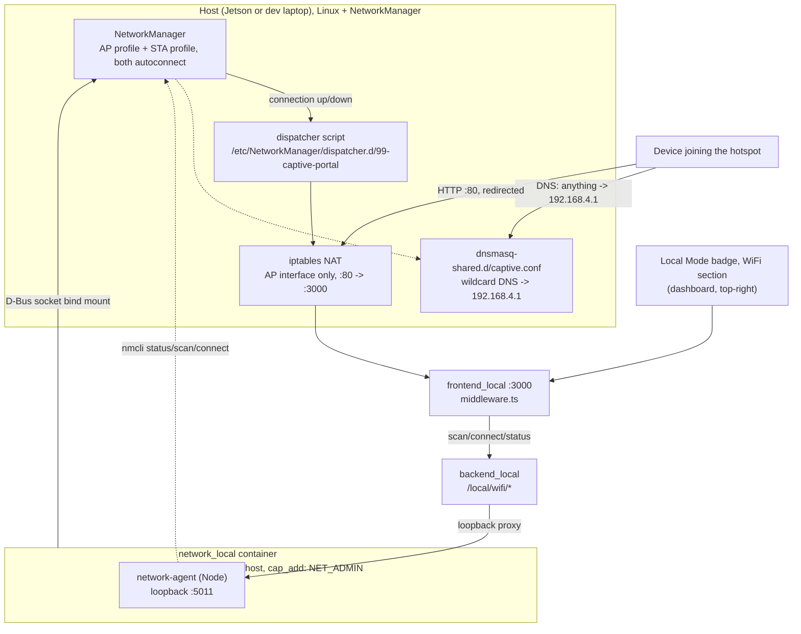

# WiFi Hotspot + Client

<RoleBadge role="technician" />

An optional local-mode feature: the Unit runs its own WiFi hotspot for an operator to join, gets
automatically captured into its dashboard the moment they open any HTTP page (a captive portal, the
same mechanism airports and cafes use), and, if a second radio is available, stays connected as a
WiFi **client** to another network for internet/cloud-sync fallback. Both radios' state is shown on
the [Local Mode badge](/ja/development/data-sync#the-local-mode-badge), the same badge, the same
dropdown, and an operator can connect to a different network from there.

Entirely optional. A unit that never runs the provisioning step below still works exactly as
[Unit Setup](/ja/setup/unit-setup) describes; the badge just reports "no hotspot radio" and nothing
else is affected.

## Why two radios, not one

| Topology | Feasibility |
| --- | --- |
| A dongle runs the hotspot, the built-in radio stays a WiFi client | High confidence, no chipset risk. AP and client live on two physically separate radios, so there is no "concurrent mode" question at all, two independent NetworkManager connection profiles, each `autoconnect: yes`, each bound to its own interface. |
| One radio does both AP and client at once (no dongle) | Conditional on the chipset. Only works if the driver reports a valid `iw list` interface combination including `{ AP, managed } <= 2` on one wiphy. Not guaranteed, and not something this project can assert in general, check it on the actual hardware. |

::: info Windows doing both at once is not proof Linux will
A laptop running Microsoft's Mobile Hotspot feature alongside a normal WiFi connection uses a
completely different driver stack (a virtual WiFi adapter Windows manages itself) from Linux's
`mac80211`/`nl80211` concurrent-AP-and-managed combination. It is a reasonable hint the *hardware*
is not fundamentally incapable of it, but it says nothing about whether the Linux driver for that
same chip reports a supporting interface combination. Verify with `iw list` on the actual host.
:::

## How it is wired together



The hotspot's existence does **not** depend on Docker. NetworkManager brings both connection
profiles up on its own, at boot and the instant a matching device is hot-plugged, the same way a
wired Ethernet cable "just works", entirely independent of `docker-manager.sh` ever having run.
`network_local` only serves live status/scan for the badge and carries out an operator's explicit
"connect to a different network" request; provisioning is a separate, one-time step (below).

::: info Why the container is not `privileged: true`
`network_local` needs two distinct things, and neither is the broad grant `msd700` already uses
(`privileged: true` + host network, see [Docker Reference](/ja/setup/docker-reference#network-mode-host)).
A bind-mounted D-Bus socket is all `nmcli` needs to control the **host's own** NetworkManager daemon
,  the client itself never touches a network interface directly. The iptables rule is different: it
has to run in the **host** network namespace, because that is where the AP interface actually lives,
which is what `network_mode: host` is for. `cap_add: [NET_ADMIN]` covers exactly that, nothing more.
:::

## Provisioning (once per unit)

Everything that actually creates the hotspot lives **outside Docker**, on purpose: it has to survive
`local_dev` being down, and it has to come up the instant a dongle is plugged into a unit that has
never run `docker-manager.sh` at all.

### 1. Find the interface names

These are per-host and cannot be guessed from the repository. On the machine that will run the
hotspot:

```bash
nmcli device status        # look at the rows whose TYPE is wifi
```

A Jetson normally names them `wlan0` (built-in) and `wlan1` (USB dongle), which is what
`docker/.env` ships with. An Ubuntu laptop uses predictable names instead (`wlp2s0` and similar), so
check rather than assume, NetworkManager will happily create a profile bound to an interface that
does not exist, and it then simply never activates, with nothing pointing at why.

### 2. Set the non-secret values

In `msd700_noetic/docker/.env` (created from `.env.example` on the first `docker-manager.sh up`, or
copy it by hand):

```bash
NETWORK_AGENT_PORT_LOCAL=5011
AP_INTERFACE_LOCAL=wlan1          # from step 1: the radio that will BE the hotspot
STA_INTERFACE_LOCAL=wlan0         # from step 1: the radio that stays a client (blank if none)
AP_CONNECTION_NAME_LOCAL=msd700-hotspot
AP_SSID_LOCAL=MSD700-Unit01       # the name broadcast; blank generates one
```

### 3. Provision, passing the password inline

```bash
sudo apt install network-manager   # if nmcli is not already on the host
AP_PASSWORD_LOCAL='your-hotspot-password' ./setup.sh --provision-network
```

::: warning Do not put the hotspot password in `docker/.env`
That file is **tracked by git and pushed to origin** in `msd700_noetic`, a password written there
is published to the repository. (The `.gitignore` carries a comment header for environment
variables, but the rule under it is missing, so the file was never actually ignored. Real MySQL
credentials are already committed through the same gap; they are loopback-only, which limits the
damage, but a WiFi key is not, it is the way onto the robot's network.)

Passing it inline for the one-time provisioning run avoids the problem entirely, and costs nothing:
`setup.sh` sources `docker/.env` without overriding variables already present in the environment,
so an inline value wins. Nothing needs the password afterwards either, NetworkManager stores the
key itself, and later changes go through
[the dashboard's badge menu](#changing-the-unit-s-own-hotspot). The password never has to live in a
file at all.

The same applies to `STA_SSID_LOCAL` / `STA_PASSWORD_LOCAL` if you want a client network configured
from the start: pass them on the same command line, or simply add the network from the dashboard
once the unit is up.
:::

This is idempotent (safe to re-run; an existing connection profile or installed file is left alone,
never recreated) and does not start any container. It:

1. Installs every `*.rules` file in `scripts/udev/` into `/etc/udev/rules.d/`, the hotspot rule
   plus, since the install mechanism has to exist either way, the two rules that were already
   checked into the repo (`99-stm32-mcu.rules`, `99-realsense.rules`) with no install path of their
   own until this existed.
2. Creates the AP connection profile (`nmcli connection add ... mode ap ipv4.method shared
   ipv4.addresses 192.168.4.1/24 ...`, `autoconnect: yes`), and a client profile too if
   `STA_INTERFACE_LOCAL`/`STA_SSID_LOCAL` are filled in.
3. Installs the captive-portal DNS config and the NetworkManager dispatcher script.

To add or change a client network afterward, use the WiFi section of the dashboard badge's dropdown
instead of re-running this step, provisioning intentionally never touches an existing profile.

## The captive portal

**DNS.** NetworkManager's own `dnsmasq -shared` instance (spun up automatically for any
`ipv4.method shared` connection) is handed one extra config file,
`/etc/NetworkManager/dnsmasq-shared.d/captive.conf`, containing `address=/#/192.168.4.1`, every
hostname a joined device asks for resolves to the hotspot's own address.

**Redirect.** One iptables rule, scoped to the AP interface only:

```
iptables -t nat -A PREROUTING -i <ap-interface> -p tcp --dport 80 -j REDIRECT --to-port 3000
```

Applied and removed automatically by the NetworkManager dispatcher script, tied to the hotspot
connection's own up/down, not to any container's lifecycle.

::: danger HTTPS is never intercepted, and that is not a bug
Redirecting TLS traffic breaks certificate validation outright: the client gets a hard security
error, not a sign-in prompt. This is a protocol constraint, the same one every real captive portal
runs into. What actually triggers the "Sign in to network" prompt is each OS's own plain-HTTP
probe, and every one of them is plain HTTP by design, specifically so a captive portal can
intercept it without ever touching TLS:

| OS | Probe URL | Expects |
| --- | --- | --- |
| Apple (iOS/macOS) | `http://captive.apple.com/hotspot-detect.html` | the literal string "Success" |
| Android | `http://connectivitycheck.gstatic.com/generate_204` | HTTP 204 |
| Windows (NCSI) | `http://www.msftconnecttest.com/connecttest.txt` | "Microsoft Connect Test" |
| Windows (legacy) | `http://www.msftncsi.com/ncsi.txt` | "Microsoft NCSI" |
| Firefox | `http://detectportal.firefox.com/success.txt` | "success\n" |

`ROS-dashboard-next-ts/middleware.ts` answers each of these with something **other** than what the
OS expects (a 302 to the dashboard for Apple, a plain 200 page for the rest) only when
`NEXT_PUBLIC_DEPLOYMENT_MODE=local`, every other request, including the operator typing the unit's
real address directly, reaches the normal dashboard untouched.
:::

## The dashboard badge

There is no separate WiFi badge. This is a **section inside** the
[Local Mode badge](/ja/development/data-sync#the-local-mode-badge)'s dropdown, under the sync state.
On the badge line itself there is only a WiFi **glyph**, coloured by state and carrying the summary
(an SSID, `hotspot only`, `no network`, `wifi unreachable`) as its hover tooltip and its
screen-reader label rather than as printed text, an SSID is up to 32 bytes of arbitrary characters
and the badge sits over the navbar, so the words belong one click away instead. The agent being
unreachable is also stated in words at the top of the section, since a red glyph on its own is not
something an operator can act on.

It polls `GET /local/wifi/status` every 30 seconds, faster for a short window
after an action, from the always-mounted badge rather than from the section, so the summary is
current whether or not the dropdown has ever been opened. The network scan is the opposite: it runs
when the dropdown opens and not before, because `nmcli`'s rescan is not free and most page-views
never open it.

| Endpoint | Auth | Purpose |
| --- | --- | --- |
| `GET /local/wifi/status` | none | Hotspot state (up? SSID? client count?), client state (connected? SSID? IP? internet reachable?) |
| `GET /local/wifi/scan` | none | Nearby SSIDs and security type, for the dropdown |
| `GET /local/wifi/saved` | none | Known client profiles |
| `GET /local/wifi/hotspot` | none | This unit's own hotspot SSID and the outcome of the last change. **Never returns the password** |
| `POST /local/wifi/connect` | operator session | Connect the client radio to a chosen network |
| `POST /local/wifi/forget` | operator session | Remove a saved client profile |
| `POST /local/wifi/hotspot` | operator session | Change this unit's own hotspot SSID and/or password |

The mutating routes require the same operator session every other `/api/*` route does, unlike
`/local/status`/`/local/sync`, which stay unauthenticated because a unit with no synced-down
accounts yet has nobody who could log in. Connecting to a network (and handing over a password) is
a meaningfully more sensitive action than reading a sync timestamp, so it does not get the same
pre-login exception.

## Changing the unit's own hotspot

The WiFi section of the badge's dropdown can rename the hotspot and set a new password. Two
behaviours are worth knowing before using it.

::: danger Saving disconnects every device on the hotspot, including yours
This is unavoidable, not a rough edge: the hotspot is what serves the dashboard, so the request to
change it arrives over the very connection the change destroys. Republishing under a new SSID (or a
new key) drops every associated device, and none of them will auto-rejoin, to their OS this is now
either an unknown network or one whose password no longer works.

The API is built around that rather than against it. `POST /local/wifi/hotspot` validates
immediately, answers **202 Accepted** carrying the SSID to reconnect to, and only *then* applies the
change ~1.5 seconds later. Applying it inline would tear down the TCP connection mid-response, and a
browser cannot tell that from a crash, the operator would see a network error for a change that
actually succeeded, with no idea which network to look for. Answering first is what lets the UI say
"reconnect to `<new name>`" while it still has a connection to say it on.

Consequently the response means *accepted*, never *succeeded*. What actually happened is reported by
`GET /local/wifi/hotspot`'s `last_change` field, read after the operator has rejoined.
:::

::: info A change that cannot activate is rolled back automatically
The expensive failure here is a headless robot whose only access path is its own hotspot, left with
a profile that no longer activates: nobody can reach it to undo that, so it needs someone physically
at the machine. So the previous SSID and key are captured first, and if the new settings fail to
come up, they are restored and reactivated, with `last_change.rolled_back` set so a reconnecting
operator can tell a rolled-back change from one that was never submitted, otherwise the two look
identical, since in both cases the network in front of them is the one they started with.
:::

**Validation** (enforced in the agent, not just the form): SSID is 1 to 32 **octets**, a name in a
non-Latin script hits the limit sooner than its character count suggests, and the WPA-PSK password
is 8 to 63 characters. Control characters are rejected rather than stripped, since quietly sanitising
one leaves the operator hunting for a network whose name is not what they typed. Nothing is touched
until validation passes, so a bad value can never be the reason a unit loses its hotspot.

**The password is never sent to the browser.** Anyone already on the hotspot knows it (they typed it
to get on), so returning it buys nothing, while putting it in a plain-HTTP response body hands it to
anyone reaching the dashboard from the *client-side* network, who does not know it. The form asks
for a new password and treats blank as "keep the current one".

::: warning `docker/.env` is a seed, not the source of truth
`AP_SSID_LOCAL` / `AP_PASSWORD_LOCAL` are read **only** by `setup.sh --provision-network`, and only
when the profile does not already exist. After a change made from the dashboard, the NetworkManager
profile is authoritative and those two keys are stale. That is harmless, re-running
`--provision-network` deliberately never overwrites an existing profile, but do not read them
expecting to learn the unit's current hotspot name. `nmcli -g 802-11-wireless.ssid connection show
msd700-hotspot` is the honest answer.
:::

Client-side internet reachability (`full` / `limited` / `portal` / `none`) is read straight from
`nmcli networking connectivity`, NetworkManager's own periodic connectivity probe, nothing here
implements a second one.

## Troubleshooting

| Symptom | Likely cause | Fix |
| --- | --- | --- |
| Badge menu says "Hotspot: no hotspot radio" | `AP_INTERFACE_LOCAL` is empty, or `--provision-network` was never run | Fill in `docker/.env` and run `./setup.sh --provision-network` |
| No WiFi glyph on the badge at all | Neither radio is present, with no AP and no STA interface there is nothing to report | Expected on a unit built without WiFi; otherwise check `nmcli device` for the interfaces |
| `--provision-network` fails with "nmcli not found" | NetworkManager is not installed on the host | `sudo apt install network-manager` |
| `--provision-network` fails, "AP_PASSWORD_LOCAL is not set" | Password missing or under 8 characters | Set an 8+ character password in `docker/.env`, re-run |
| Hotspot does not survive a reboot | Provisioning was never run, or the connection profile's `autoconnect` was manually disabled | `nmcli connection show msd700-hotspot`, check `autoconnect: yes`; re-run `--provision-network` if the profile does not exist at all |
| A device joins the hotspot but gets no captive-portal prompt | The OS may cache a previous "internet OK" result for this SSID, or a corporate/managed device has captive-portal detection disabled | Forget the network on the client device and rejoin; check the device's captive-portal-detection setting |
| Hotspot up, but the WiFi glyph is red and the menu says "WiFi service unreachable on this unit" | `network_local` is not running, or `backend_local` cannot reach it | `docker compose ps` for `network_local`; confirm `NETWORK_AGENT_PORT_LOCAL` matches on both services |
| `nmcli device wifi connect` fails from the badge with an unhelpful reason | nmcli's own stderr is passed through verbatim rather than reworded | Read the reason text directly, it distinguishes wrong password from out-of-range from refused |
| Existing local services (backend, media, MySQL) become unreachable after provisioning | The iptables rule was not scoped correctly to the AP interface | Check the redirect rule targets only `<ap-interface>`, never the client interface or loopback: `sudo iptables -t nat -L PREROUTING -n` |
| Changed the hotspot name/password, and the old network is still the one being broadcast | The change failed to activate and was rolled back automatically | Reconnect on the old network, reopen the dashboard, and read `last_change.reason` from `GET /local/wifi/hotspot` |
| Changed the hotspot and now nothing is broadcast at all | Both the change **and** its rollback failed, the one case that needs physical access | Check `docker logs msd700_network_local` for `ROLLBACK ALSO FAILED`; recover at the machine with `nmcli connection up msd700-hotspot` |
| `docker/.env` shows a different SSID than the unit actually broadcasts | Expected after any dashboard-side change: `.env` only seeds provisioning | Read the live value with `nmcli -g 802-11-wireless.ssid connection show msd700-hotspot` |

## Related

- [Unit Setup](/ja/setup/unit-setup): the base local-mode installation this feature sits on top of
- [Docker Reference § network_mode: host](/ja/setup/docker-reference#network-mode-host): why some
  services share the host's network namespace
- [Data Sync § The Local Mode badge](/ja/development/data-sync#the-local-mode-badge): the badge this
  section lives inside, and the sync state shown above it
- [Architecture § Trust domains](/ja/development/architecture#trust-domains): why `/local/wifi/connect`
  needs an operator session and `/local/status` does not
