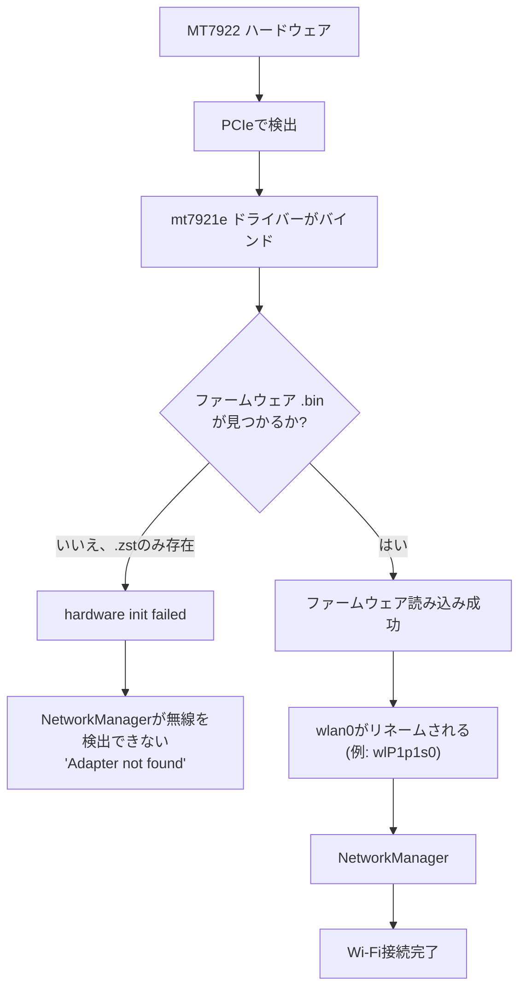

# MediaTek MT7922 Wi-Fiセットアップ(Tegraカーネル)

<RoleBadge role="technician" />

これは [Wi-Fi ホットスポット + クライアントのセットアップの流れ](/ja/setup/wifi-hotspot#セットアップの流れ)
の**ステップ 1** です。まずここでオンボード無線機のファームウェアを修正してから、戻ってホットスポット
のプロビジョニングに進んでください。

**MediaTek MT7922 系のカードは、このプロジェクトのプライマリなオンボード無線機です**: 通常の WiFi
クライアントであることに加えて、同じ物理無線機上でホットスポットのアクセスポイントを同時に運用でき
るため([プライマリ無線機とバックアップドングル](/ja/setup/wifi-hotspot#プライマリ無線機とバックアップドングル)
を参照)、USB ドングルは不要です。より古い Realtek RTL8822CE で構築されたユニットはその同時モードを
サポートしておらず、ホットスポットには常にバックアップドングルが必要です。その経路については
[Wi-Fi ホットスポット + クライアント](/ja/setup/wifi-hotspot)を参照してください。

Tegraカーネルでは、In-treeドライバー`mt7921e`自体は存在しますが、Ubuntuがインストールするファーム
ウェアパッケージが圧縮形式`.zst`のファームウェアファイルしか提供しない一方で、特定のカーネルビルド
は未圧縮の通常形式を要求することがあります。その結果、カードは検出されるもののまったく起動せず、
ホットスポットは本来使うべきプライマリ経路の代わりに、(たまたま設定されていれば)バックアップドン
グルへ黙って切り替わってしまいます。

## 検証済み環境

| コンポーネント | 値 |
| --- | --- |
| OS | Ubuntu 24.04.4 LTS |
| アーキテクチャ | arm64 |
| カーネル | `6.8.12-1021-tegra` |
| Wi-Fiカード | MediaTek MT7922 |
| PCI ID | `14c3:0616` |
| ドライバー | `mt7921e` |

::: warning カーネル固有の回避策であり、万能な修正ではありません
これは本プロジェクトで確認された、Ubuntu 24.04・カーネル`6.8.12-1021-tegra`に固有の対処法です。
より新しいmainlineまたはUbuntuのカーネルでは、読み込み時に`.zst`ファームウェアを自動的に展開する
場合があり、その場合は本ガイドの手動展開は不要です。修正を適用する前に、必ず
[ステップ1](#_1-ハードウェアとドライバーの確認)と[ステップ2](#_2-mt7922ファームウェアの確認)を行い、
実際に症状が発生しているかを確認してください。
:::

## 1. ハードウェアとドライバーの確認

```bash
lspci -nnk | grep -A3 -iE 'network|wireless'
```

期待される出力:

```
MEDIATEK Corp. MT7922 802.11ax PCI Express Wireless Network Adapter [14c3:0616]
Kernel driver in use: mt7921e
Kernel modules: mt7921e
```

`mt7921e`がすでに表示され正常に動作している場合は、サードパーティ製ドライバーを導入しないでください。
In-treeドライバーは正しく、問題があるとすればファームウェア側であり、ドライバー側ではありません。

::: warning カード自体がここにまったく現れない場合、または`mt7921e`がこのシステムのドライバーではない場合
本ガイドが扱うファームウェアの問題よりも稀な、2 つの異なる故障です。

- **カードが `lspci` にまったく現れない。** 実際に装着されているか確認してください
  (`lspci | grep -i network` は*何らかの*無線デバイスを表示するはずです)。何もまったく表示されない
  場合、これはハードウェアの問題であり(カードを挿し直す、物理的な接続を確認する)、以下のどの手順
  でも修正できません。
- **カードは表示されているが、`Kernel driver in use` の行がない、または別のドライバーになっている。**
  このカーネルにモジュール自体が存在するか確認します。

  ```bash
  modinfo mt7921e
  ```

  `mt7921e`は、下記の本プロジェクトの検証済み環境では L4T(Tegra)カーネルパッケージに同梱されて
  おり、バックアップドングルのドライバーとは異なり、別途ビルドやダウンロードする必要はありません。
  `modinfo`が`ERROR: Module mt7921e not found`と報告する場合、実行中のカーネルのモジュールツリー
  自体にそれが欠けているということであり、ファームウェアの問題ではなくカーネルのパッケージングの
  問題です。

  ```bash
  uname -r
  sudo apt install --reinstall "linux-modules-$(uname -r)"
  ```

  このカーネルビルド向けにそのパッケージが存在しない場合、このユニットが書き込まれた L4T/JetPack
  イメージ自体にそのモジュールが欠けているということであり、ハードウェアの問題と同様に扱ってくだ
  さい。本ガイドの何かではなく、L4T BSP の再フラッシュまたはアップグレードが修正方法です。
:::

## 2. MT7922ファームウェアの確認

```bash
ls -l /lib/firmware/mediatek/ | grep -i MT7922
```

本ガイドの元になったケースでは、ディレクトリには圧縮ファイルしか存在していませんでした。

```
WIFI_RAM_CODE_MT7922_1.bin.zst
WIFI_MT7922_patch_mcu_1_1_hdr.bin.zst
```

しかしカーネルは未圧縮の名前を要求していました。

```
WIFI_RAM_CODE_MT7922_1.bin
WIFI_MT7922_patch_mcu_1_1_hdr.bin
```

次のコマンドで確認します。

```bash
sudo dmesg | grep -iE 'mt792|firmware'
```

症状となるエラーは次のようなものです。

```
Direct firmware load for mediatek/WIFI_RAM_CODE_MT7922_1.bin failed with error -2
Direct firmware load for mediatek/WIFI_MT7922_patch_mcu_1_1_hdr.bin failed with error -2
mt7921e ... hardware init failed
```

`error -2`は`ENOENT`です。カーネルはその正確な名前のファイルを見つけられず、このカーネルビルドでは
`.zst`を自動的に展開しません。

::: warning `/lib/firmware/mediatek/` が存在しない場合、または `.bin` も `.zst` も存在しない場合
上記の不一致とは異なり、これはファームウェアパッケージ自体が一度もインストールされていないという
ことを意味します。間違った形式でインストールされているだけではありません。

```bash
sudo apt update
sudo apt install --reinstall linux-firmware
ls -l /lib/firmware/mediatek/ | grep -i MT7922
```

`linux-firmware`はこれらのファイルを提供するパッケージです。`./setup.sh --provision-network`は、
オンボード無線機のインターフェースが一度も現れないことに気づいた際、プリフライトとしてまさにこの
再インストールを既に自動的に試みます。[Wi-Fi ホットスポット + クライアント § ホットスポットの
プロビジョニング](/ja/setup/wifi-hotspot#ホットスポットのプロビジョニング-ユニットごとに一度)を
参照してください。自動での試みが既に実行されていて、それでもインターフェースが現れない場合、手動
で再実行してもほとんど役に立ちません。上記のコマンドで実際に `/lib/firmware/mediatek/` に何が
入ったかを確認してください。ファイルが `.zst` として返ってくる場合(このプロジェクトのカーネルでは
よくあるケースです)、それらを展開するために下記のステップ 3 と 4 に進んでください。ディレクトリが
それでも空のままであるか、パッケージのインストール自体が失敗する場合、それはこのカード固有の問題
というより、壊れている、または不完全な Ubuntu のパッケージキャッシュ/ミラーを示しています。
`apt-cache policy linux-firmware` と普通の `sudo apt update` が、次に確認すべき通常の手段です。
:::

## 3. `zstd`が利用可能か確認する

```bash
which zstd
```

存在しない場合:

```bash
sudo apt update
sudo apt install zstd
```

## 4. `.zst`ファームウェアを`.bin`に展開する

```bash
cd /lib/firmware/mediatek

sudo zstd -d -f WIFI_RAM_CODE_MT7922_1.bin.zst \
    -o WIFI_RAM_CODE_MT7922_1.bin

sudo zstd -d -f WIFI_MT7922_patch_mcu_1_1_hdr.bin.zst \
    -o WIFI_MT7922_patch_mcu_1_1_hdr.bin
```

両方の形式が並んで存在することを確認します。

```bash
ls -lh /lib/firmware/mediatek/*MT7922*
```

期待される出力:

```
WIFI_RAM_CODE_MT7922_1.bin
WIFI_RAM_CODE_MT7922_1.bin.zst
WIFI_MT7922_patch_mcu_1_1_hdr.bin
WIFI_MT7922_patch_mcu_1_1_hdr.bin.zst
```

::: info `.zst`ファイルは削除しないでください
元のファイルは削除しないでください。この手順は展開済みの`.bin`コピーを隣に追加するだけであり、
元の`.zst`ファイルは(`dpkg`の検証や将来のパッケージ更新など)何かがその存在を前提としている場合に
備えてそのまま残しておきます。
:::

## 5. ドライバーの再読み込み

再起動は不要です。

```bash
sudo modprobe -r mt7921e
sudo modprobe mt7921e
```

続いて確認します。

```bash
sudo dmesg | grep -iE 'mt792|firmware' | tail -50
```

成功していれば、これまでのファームウェアエラーは消え、代わりに次のような行が表示されます。

```
ASIC revision: 79220010
HW/SW Version: ...
WM Firmware Version: ...
wlP1p1s0: renamed from wlan0
```

## 6. NetworkManagerの確認

```bash
nmcli device
```

期待される出力:

```
wlP1p1s0   wifi   connected   eduroam
```

インターフェース名は必ずしも`wlP1p1s0`である必要はありません。これはシステムのpredictable network
interface namingに依存するため、マシンによって異なることがあります。

## 診断



## 次のユニット向けのワンショットセットアップ

同じ状態(MT7922、`.zst`ファームウェアが存在、カーネルが`.bin`を要求)にある別のマシンでは、
これがすべての修正内容です。

```bash
sudo apt update
sudo apt install zstd

cd /lib/firmware/mediatek

sudo zstd -d -f WIFI_RAM_CODE_MT7922_1.bin.zst \
    -o WIFI_RAM_CODE_MT7922_1.bin

sudo zstd -d -f WIFI_MT7922_patch_mcu_1_1_hdr.bin.zst \
    -o WIFI_MT7922_patch_mcu_1_1_hdr.bin

sudo modprobe -r mt7921e
sudo modprobe mt7921e

nmcli device
```

## 関連ページ

- [Wi-Fi ホットスポット + クライアント § セットアップの流れ](/ja/setup/wifi-hotspot#セットアップの流れ):
  このページの後はここに進み、ステップ 2 と 3(ホットスポットのプロビジョニング、検証)を行います。
  ステップ 4(バックアップドングル)は任意です。
- [Wi-Fi ホットスポット + クライアント § プライマリ無線機とバックアップドングル](/ja/setup/wifi-hotspot#プライマリ無線機とバックアップドングル):
  なぜこのカードにドングルが不要なのか、そして何がまだそれを必要とするのか。
- [トラブルシューティング](/ja/setup/troubleshooting): 技術者向けの一般的な診断手順。
