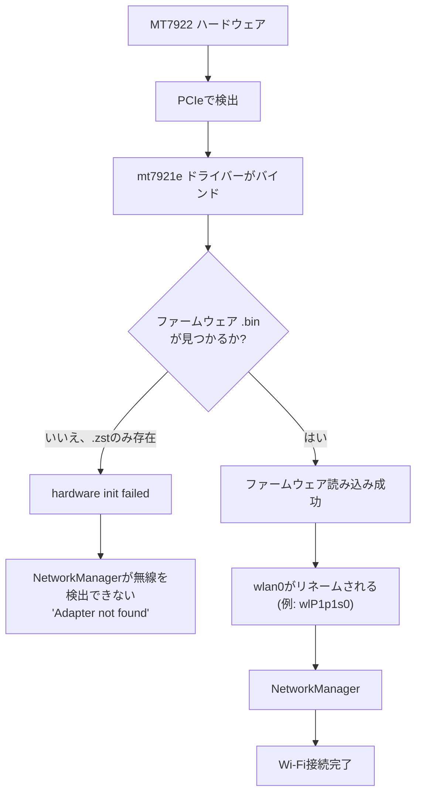

# MediaTek MT7922 Wi-Fiセットアップ(Tegraカーネル)

<RoleBadge role="technician" />

これは [Wi-Fi ホットスポット + クライアントのセットアップの流れ](/ja/setup/wifi-hotspot#セットアップの流れ)
の**ステップ 1** です。まずここでオンボード無線機のファームウェアを修正してから、戻ってドングル
ドライバのインストールとホットスポットのプロビジョニングに進んでください。

一部のユニットでは、本プロジェクトの標準搭載であるRealtek RTL8822CE(標準構成については
[Wi-Fi ホットスポット & クライアント](/ja/setup/wifi-hotspot)を参照)の代わりに、**MediaTek MT7922**
Wi-Fiカードを搭載・後付けする場合があります。TegraカーネルではIn-treeドライバー`mt7921e`自体は存在
しますが、Ubuntuがインストールするファームウェアパッケージが圧縮形式`.zst`のファームウェアファイル
しか提供しない一方で、特定のカーネルビルドは未圧縮の通常形式を要求することがあります。その結果、
カードは検出されるもののまったく起動しません。

## 検証済み環境

| コンポーネント | 値 |
| --- | --- |
| OS | Ubuntu 24.04.4 LTS |
| アーキテクチャ | arm64 |
| カーネル | `6.8.12-1021-tegra` |
| Wi-Fiカード | MediaTek MT7922 |
| PCI ID | `14c3:0616` |
| ドライバー | `mt7921e` |

::: warning カーネル固有の回避策であり、万能な修正ではありません
これは本プロジェクトで確認された、Ubuntu 24.04・カーネル`6.8.12-1021-tegra`に固有の対処法です。
より新しいmainlineまたはUbuntuのカーネルでは、読み込み時に`.zst`ファームウェアを自動的に展開する
場合があり、その場合は本ガイドの手動展開は不要です。修正を適用する前に、必ず
[ステップ1](#_1-ハードウェアとドライバーの確認)と[ステップ2](#_2-mt7922ファームウェアの確認)を行い、
実際に症状が発生しているかを確認してください。
:::

## 1. ハードウェアとドライバーの確認

```bash
lspci -nnk | grep -A3 -iE 'network|wireless'
```

期待される出力:

```
MEDIATEK Corp. MT7922 802.11ax PCI Express Wireless Network Adapter [14c3:0616]
Kernel driver in use: mt7921e
Kernel modules: mt7921e
```

`mt7921e`がすでに表示され正常に動作している場合は、サードパーティ製ドライバーを導入しないでください。
In-treeドライバーは正しく、問題があるとすればファームウェア側であり、ドライバー側ではありません。

## 2. MT7922ファームウェアの確認

```bash
ls -l /lib/firmware/mediatek/ | grep -i MT7922
```

本ガイドの元になったケースでは、ディレクトリには圧縮ファイルしか存在していませんでした。

```
WIFI_RAM_CODE_MT7922_1.bin.zst
WIFI_MT7922_patch_mcu_1_1_hdr.bin.zst
```

しかしカーネルは未圧縮の名前を要求していました。

```
WIFI_RAM_CODE_MT7922_1.bin
WIFI_MT7922_patch_mcu_1_1_hdr.bin
```

次のコマンドで確認します。

```bash
sudo dmesg | grep -iE 'mt792|firmware'
```

症状となるエラーは次のようなものです。

```
Direct firmware load for mediatek/WIFI_RAM_CODE_MT7922_1.bin failed with error -2
Direct firmware load for mediatek/WIFI_MT7922_patch_mcu_1_1_hdr.bin failed with error -2
mt7921e ... hardware init failed
```

`error -2`は`ENOENT`です。カーネルはその正確な名前のファイルを見つけられず、このカーネルビルドでは
`.zst`を自動的に展開しません。

## 3. `zstd`が利用可能か確認する

```bash
which zstd
```

存在しない場合:

```bash
sudo apt update
sudo apt install zstd
```

## 4. `.zst`ファームウェアを`.bin`に展開する

```bash
cd /lib/firmware/mediatek

sudo zstd -d -f WIFI_RAM_CODE_MT7922_1.bin.zst \
    -o WIFI_RAM_CODE_MT7922_1.bin

sudo zstd -d -f WIFI_MT7922_patch_mcu_1_1_hdr.bin.zst \
    -o WIFI_MT7922_patch_mcu_1_1_hdr.bin
```

両方の形式が並んで存在することを確認します。

```bash
ls -lh /lib/firmware/mediatek/*MT7922*
```

期待される出力:

```
WIFI_RAM_CODE_MT7922_1.bin
WIFI_RAM_CODE_MT7922_1.bin.zst
WIFI_MT7922_patch_mcu_1_1_hdr.bin
WIFI_MT7922_patch_mcu_1_1_hdr.bin.zst
```

::: info `.zst`ファイルは削除しないでください
元のファイルは削除しないでください。この手順は展開済みの`.bin`コピーを隣に追加するだけであり、
元の`.zst`ファイルは(`dpkg`の検証や将来のパッケージ更新など)何かがその存在を前提としている場合に
備えてそのまま残しておきます。
:::

## 5. ドライバーの再読み込み

再起動は不要です。

```bash
sudo modprobe -r mt7921e
sudo modprobe mt7921e
```

続いて確認します。

```bash
sudo dmesg | grep -iE 'mt792|firmware' | tail -50
```

成功していれば、これまでのファームウェアエラーは消え、代わりに次のような行が表示されます。

```
ASIC revision: 79220010
HW/SW Version: ...
WM Firmware Version: ...
wlP1p1s0: renamed from wlan0
```

## 6. NetworkManagerの確認

```bash
nmcli device
```

期待される出力:

```
wlP1p1s0   wifi   connected   eduroam
```

インターフェース名は必ずしも`wlP1p1s0`である必要はありません。これはシステムのpredictable network
interface namingに依存するため、マシンによって異なることがあります。

## 診断



## 次のユニット向けのワンショットセットアップ

同じ状態(MT7922、`.zst`ファームウェアが存在、カーネルが`.bin`を要求)にある別のマシンでは、
これがすべての修正内容です。

```bash
sudo apt update
sudo apt install zstd

cd /lib/firmware/mediatek

sudo zstd -d -f WIFI_RAM_CODE_MT7922_1.bin.zst \
    -o WIFI_RAM_CODE_MT7922_1.bin

sudo zstd -d -f WIFI_MT7922_patch_mcu_1_1_hdr.bin.zst \
    -o WIFI_MT7922_patch_mcu_1_1_hdr.bin

sudo modprobe -r mt7921e
sudo modprobe mt7921e

nmcli device
```

## 関連ページ

- [Wi-Fi ホットスポット + クライアント § セットアップの流れ](/ja/setup/wifi-hotspot#セットアップの流れ):
  このページの後はここに進み、ステップ 2 から 4(ドングルドライバ、ホットスポットのプロビジョニング、
  検証)を行います。
- [Wi-Fi ホットスポット & クライアント](/ja/setup/wifi-hotspot): 本プロジェクトの標準搭載無線
  (RTL8822CE)と、このカードの代替となるドングル方式のホットスポット構成について。
- [トラブルシューティング](/ja/setup/troubleshooting): 技術者向けの一般的な診断手順。
