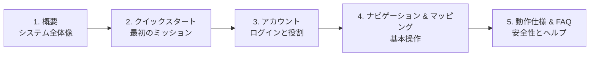

# ROS Web UI ユーザーガイド

<RoleBadge role="user" />

**MSD700 オペレーター向けユーザーガイド**へようこそ。本ドキュメントは、Webダッシュボードを使ってMSD700自律ロボットの操作、マッピング、監視を行うフリートオペレーター、研究者、フィールド技術者を対象としています。プログラミングやロボティクスの知識は一切必要ありません。

## MSD700 について

**MSD700** は、産業環境における自律的なマッピングとナビゲーションのために**Nakayama Iron Works Ltd.** が設計・製造した自律移動ロボットです。

**ROS Web UI** ダッシュボードは、MSD700 プラットフォームのオペレーター向けインターフェースであり、**ITB de Labo** が開発しています。このWebベースの操作センターにより、Webブラウザを持つあらゆるデバイスからロボットの動作を監視・指示・管理できます。

## できること

ROS Web UI では、以下のことが可能です。

- **マップ作成**。新しいエリアでロボットを走行させ、デジタルフロアプランを自動生成
- **ナビゲーション**。マップ上の任意の場所をクリックすると、障害物を回避しながらその場所へロボットを送る
- **エリアカバレッジ**。ゾーンを描画し、部屋や通路全体を体系的に清掃・巡回するよう指示
- **ライブ監視**。超低遅延のストリーミングでロボットのカメラ映像をリアルタイムに視聴
- **ルート管理**。よく使う経路を保存し、複数をつなげて自動ミッションのプレイリストを作成
- **フリート管理**。管理者であれば、複数のロボット、オペレーター、レンタルプロファイルを一括管理
- **オフライン運用**。インターネットなしでロボットのローカルWi-Fiに直接接続し、ダッシュボード全機能を利用

## 本ガイドの使い方

以下の各セクションでは、開発者向けではなく日常利用者向けに、各機能をステップバイステップで解説しています。MSD700が初めての方は **概要** と **クイックスタートガイド** から始めてください。すでにプラットフォームに慣れている方は、必要な機能へ直接進んでください。

<LinkCards>
  <LinkCard icon="📖" title="概要" details="MSD700プラットフォーム、ハードウェアの能力、クラウドアーキテクチャについて学びます。" link="/ja/user-guide/introduction" />
  <LinkCard icon="🚀" title="クイックスタートガイド" details="ログイン、ロボットの選択、最初のミッション実行までのステップバイステップの手順です。" link="/ja/user-guide/quick-start" />
  <LinkCard icon="👥" title="アカウントとアクセス" details="ログイン、アカウント作成、オペレーターと管理者の権限の違いを理解する。" link="/ja/user-guide/accounts" />
  <LinkCard icon="🧭" title="ナビゲーション" details="ジョイスティックによる手動操作、地点への送信、Autopilot ミッション。" link="/ja/user-guide/navigation" />
  <LinkCard icon="🗺️" title="マッピング" details="ロボットをエリア内で走行させて新しいマップを作成。再生・一時停止・保存。" link="/ja/user-guide/mapping" />
  <LinkCard icon="🗄️" title="マップとデータベース" details="保存済みマップの表示、検索、名前変更、削除。" link="/ja/user-guide/database" />
  <LinkCard icon="📍" title="ルートとカバレッジ" details="地点間ルートの保存と、体系的な清掃のためのエリア描画。" link="/ja/user-guide/routes-coverage" />
  <LinkCard icon="📷" title="ライブカメラ" details="どこからでもロボットの視点をリアルタイムに確認。" link="/ja/user-guide/camera" />
  <LinkCard icon="🤖" title="ロボットの動作仕様" details="セーフティウォッチドッグ、操作リース、オートパイロットの持続性、セッション復旧について理解します。" link="/ja/user-guide/behavior" />
  <LinkCard icon="🛠️" title="管理コンソール" details="フリート管理者向け:オペレーターの追加、レンタル管理、フリート状況の監視。" link="/ja/user-guide/admin-console" />
  <LinkCard icon="❓" title="よくある質問 (FAQ)" details="バッテリー、マップ、接続に関する一般的な運用上の質問への回答です。" link="/ja/user-guide/faq" />
  <LinkCard icon="🩹" title="トラブルシューティング" details="映像のフリーズやゴール中断など、よくあるオペレーターの症状に対する迅速な解決策です。" link="/ja/user-guide/troubleshooting" />
</LinkCards>

## 推奨される読む順序

1. **[概要](/ja/user-guide/introduction)**。プラットフォーム、ハードウェア、クラウドアーキテクチャを理解する
2. **[クイックスタートガイド](/ja/user-guide/quick-start)**。数分でログインし最初のミッションを実行する
3. **[アカウントとアクセス](/ja/user-guide/accounts)**。ログインを設定し、オペレーターと管理者の役割を理解する
4. **[ナビゲーション](/ja/user-guide/navigation)**。ロボットの操作方法を学ぶ
5. **[マッピング](/ja/user-guide/mapping)**。最初のマップを作成する
6. **[マップとデータベース](/ja/user-guide/database)**。保存済みマップを管理する
7. **[ルートとカバレッジ](/ja/user-guide/routes-coverage)**。自動ミッションを計画する
8. **[ライブカメラ](/ja/user-guide/camera)**。ロボットを遠隔監視する
9. **[ロボットの動作仕様](/ja/user-guide/behavior)**。安全一時停止、リース、オートパイロットを理解する
10. **[管理コンソール](/ja/user-guide/admin-console)**。(フリート管理者のみ)オペレーターとユニットを管理する

## システム要件

- **対応ブラウザ**: Google Chrome(推奨)またはMicrosoft Edge。
- **デスクトップのみ**: ノートPCまたはデスクトップPCで、ウィンドウサイズは最低1366 x 768で使用してください。スマートフォンやタブレットは全画面の通知でブロックされ、小さなデスクトップウィンドウはブロック表示で覆われます。中途半端に表示された操作バーで実機を操作させないための仕様です。
- **ネットワーク**: クラウドダッシュボード(`msd.nglobal.jp`)へのインターネットアクセス、またはフィールドでロボットをオフライン運用する際のローカルWi-Fi接続。

## お困りの場合

- 各ガイド末尾の**トラブルシューティング**セクション、または専用の[トラブルシューティング](/ja/user-guide/troubleshooting)ページを確認してください
- [よくある質問(FAQ)](/ja/user-guide/faq) を参照してください
- システム管理者、または ITB de Labo サポートにお問い合わせください

---

**MSD700** は **Nakayama Iron Works Ltd.** の製品です
**ROS Web UI** は **ITB de Labo** が開発しています
