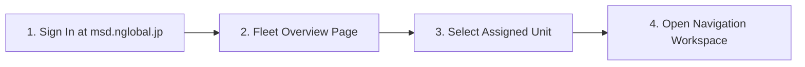
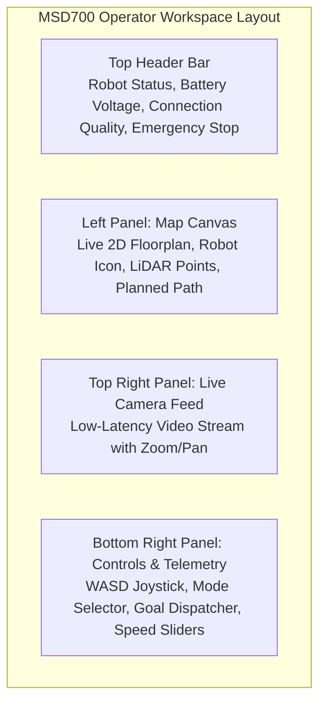
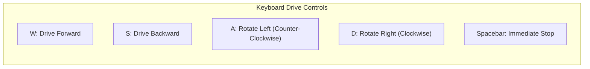
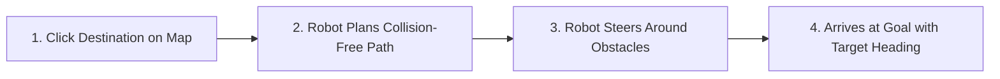

# クイックスタートガイド

<RoleBadge role="user" />

本ガイドでは、MSD700ダッシュボードへのログイン、割り当てられたロボットユニットの制御権取得、マップの読み込み、最初のナビゲーションミッションの実行までの流れを説明します。

## 事前準備

開始する前に、以下を確認してください。
1. ダッシュボード上の有効なユーザーアカウントを持っていること。
2. 管理者によって、少なくとも1台のロボットがアカウントに割り当てられていること。
3. ノートPCまたはデスクトップPC上のGoogle ChromeまたはMicrosoft Edge。

---

## ステップ1: ダッシュボードにログイン

1. ブラウザを開き、`https://msd.nglobal.jp` にアクセスします。
2. ユーザー名とパスワードを入力し、**Sign In** をクリックします。

---

## ステップ2: ロボットユニットを選択

ログイン後、**Fleet Dashboard** にレンタルプロファイルへ割り当てられたすべてのロボットが表示されます。

| ステータスバッジ | 意味 | 実行可能な操作 |
| --- | --- | --- |
| <Badge type="tip" text="Online" /> | ロボットはアクティブで接続済み、コマンド受付可能です。 | ユニットカードをクリックしてダッシュボードを開きます。 |
| <Badge type="warning" text="In Use" /> | 他のオペレーターがアクティブに接続中です。 | 閲覧モードでユニットを開くか、制御権の引き継ぎをリクエストできます。 |
| <Badge type="danger" text="Offline" /> | ロボットの電源が切れているか、ネットワークから切断されています。 | ユニットが再接続するのを待つか、ハードウェアの電源を確認してください。 |

**Online** 状態のロボットカードをクリックすると、その制御ワークスペースに入ります。

---

## ステップ3: オペレーターワークスペースを理解する

オペレーターインターフェースは3つの主要な操作パネルに分かれています。

---

## ステップ4: マップを読み込む

1. 左パネルのヘッダーで **Select Map** ドロップダウンをクリックします。
2. リストから事前に記録済みのマップを選択します(例: `Warehouse_Floor_1`)。
3. 2D床図がキャンバスにレンダリングされ、ロボットの現在位置(方向矢印付きの青い円形アイコン)も表示されます。

::: tip 利用できるマップがない場合
ドロップダウンにマップが存在しない場合は、[マッピング](/ja/user-guide/mapping)を参照して最初のマップを作成してください。
:::

---

## ステップ5: 手動走行(テレオペレーション)

キーボードまたは画面上の仮想ジョイスティックを使ってロボットを手動で操作できます。

### テレオペレーション操作:
- **直進速度スライダー**: 最大前進速度を調整します(デフォルト: `0.20 m/s`、範囲: `0.05`〜`0.40 m/s`)。
- **角速度スライダー**: 回転速度を調整します(デフォルト: `0.40 rad/s`)。
- **仮想ジョイスティック**: 画面上のジョイスティックハンドルをクリックし、目的の方向にドラッグします。

---

## ステップ6: ナビゲーションゴールを送信する(地点間移動)

ロボットを目標地点へ自律的に移動させるには、以下を行います。

1. キャンバスツールバーの **Navigate Goal** ボタンをクリックします。
2. マップ上で目的の目標地点をクリックします。
3. 外側にクリック&ドラッグして目標の向きの矢印を設定し、離します。
4. ロボットは衝突のないグローバル経路(青い線)を計算し、目標地点まで自律的にナビゲートします。

---

## ステップ7: 緊急停止(E-Stop)

**Emergency Stop** ボタンは、すべてのページの右上に目立つ形で配置されています。

- **E-Stopの作動**: 赤い **Emergency Stop** ボタンをクリックする(または `Escape` キーを押す)と、ロボットは即座にブレーキをかけ、すべての自律ルーチンを停止します。
- **E-Stopの解除**: 安全上の問題を解決した後、**Resume Operations** をクリックしてモーター電源を復帰させます。

---

## 次のステップ

- [ルートとカバレッジ](/ja/user-guide/routes-coverage)で体系的なエリアカバレッジの実行方法を学びましょう。
- [ロボットの動作仕様](/ja/user-guide/behavior)で安全タイマーとオートパイロットについて理解しましょう。
