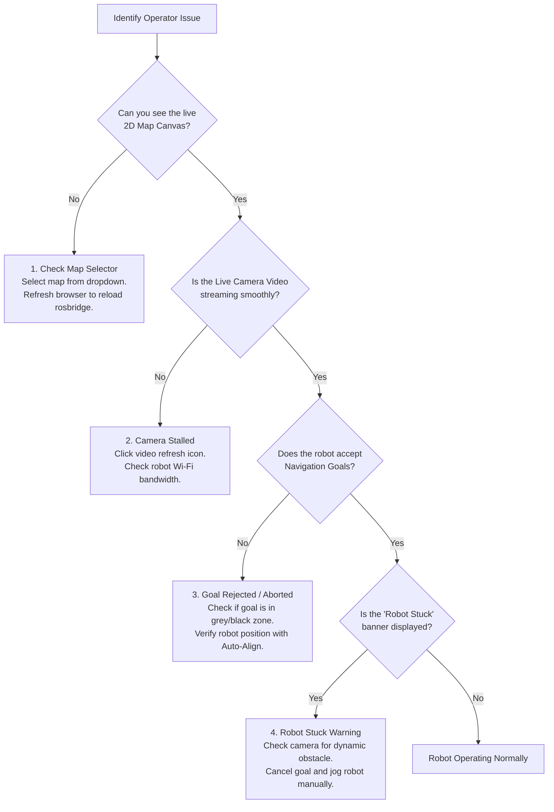

# オペレーター向けトラブルシューティングガイド

<RoleBadge role="user" />

本ガイドは、WebダッシュボードからMSD700ロボットを操作する際によく発生する運用上の症状に対する迅速な解決策を提供します。

::: info 役割分担
トラブル対処3ページは症状を役割で分担します:当ページがオペレーター対処(マップ選択、再読込、再試行)、[セットアップのトラブル対処](/ja/setup/troubleshooting)が技術者対処、[開発者向け診断](/ja/development/troubleshooting-guide)が根本原因を担当します。端末が必要な修正はそちら側の仕事であり、ここからリンクします。
:::

::: tip 技術的またはハードウェアの診断について
低レベルのサーバーエラー、Dockerコンテナのログ、ROSドライバーの診断については、[技術者向けトラブルシューティングガイド](/ja/setup/troubleshooting)または[開発者向け診断](/ja/development/troubleshooting-guide)を参照してください。
:::

## オペレーター診断フローチャート

---

## よくある問題と解決策

### 1. マップキャンバスが空白、または読み込みスピナーが終わらない
- **症状**: ナビゲーションページは開くものの、中央エリアが暗いグレーの画面のままで、スピナーが回り続けます。
- **考えられる原因**:
  - このユニットに対してアクティブなマップが選択されていません。
  - `rosbridge` へのブラウザWebSocket接続が一時的に中断されました。
- **オペレーターが行う操作**:
  1. 左上の **Select Map** ドロップダウンを確認します。「No Map Loaded」と表示されている場合はクリックして施設のマップを選択します。
  2. マップは選択済みだが空白のままの場合は、ブラウザタブをリロードします(`Ctrl + F5` または `Cmd + Shift + R`)。
  3. ヘッダーのユニットステータスバッジが **Online**(緑)と表示されていることを確認します。

---

### 2. ライブカメラ映像がフリーズまたは真っ黒になる
- **症状**: カメラウィンドウにフリーズしたフレーム、回転するホイール、または黒い矩形が表示されます。
- **考えられる原因**:
  - ロボットとサーバー間のWi-Fiリンクでの一時的なパケットロス。
  - ブラウザがWebRTCのICEネゴシエーションをブロックしています。
- **オペレーターが行う操作**:
  1. カメラヘッダーにある小さな **Refresh Stream** アイコンをクリックします。
  2. Chromeを使用している場合は、ブラウザ設定でハードウェアアクセラレーションが有効になっていることを確認します。
  3. インターネットのないローカル施設ネットワークで運用している場合は、ロボットのローカルWi-Fiに接続し、`http://<unit-ip>:3000` にアクセスしていることを確認します。

---

### 3. ナビゲーションゴールが中断される / ロボットが動こうとしない
- **症状**: 2D Nav Goalを設定するかルートを開始しても、ロボットがビープ音を鳴らし、ステータスが直ちに `On Progress` から `Idle` または `Goal Aborted` に戻ります。
- **考えられる原因**:
  - 目的地点が黒い壁の内側、障害物の内側、または致死インフレーションバッファ内(壁から0.575 m以内)にあります。
  - ロボットがマップに対する自己位置推定座標を失っています。
- **オペレーターが行う操作**:
  1. 壁や柱から十分に離れた、広く開けた空きスペース(明るいグレーの領域)にゴールを設定します。
  2. ツールバーの **Auto Align** ボタンをクリックし、ロボットのLiDARスキャンを静的マップと再同期させます。
  3. Auto-Alignが失敗する場合は、ロボットを手動で0.5メートル前進させてからAuto-Alignを再実行します。

---

### 4. 「Robot Stuck」バナーが消えない
- **症状**: キャンバス上部にアンバー色のバナーで「Robot Stuck: Recovery in Progress」と表示されます。
- **考えられる原因**:
  - 人、フォークリフト、または新しく置かれた箱が計画された走行経路を塞いでいます。
  - ロボットが1.15メートルより狭い通路でエリアカバレッジ清掃を試みています。
- **オペレーターが行う操作**:
  1. ライブカメラ映像とキャンバス上の赤いLiDARドットを確認し、近くに物理的な障害物がないか調べます。
  2. 一時的な物体によって経路が塞がれている場合は10秒待ちます。ローカルプランナーは経路が開き次第、自動的に障害物を回避します。
  3. ロボットが詰まりを解消できない場合は、**Pause / Cancel Goal** をクリックし、**Manual Drive** に切り替え、再開する前にロボットを開けた床スペースへジョグ操作で移動させます。

---

### 5. 制御権がロックされている: 「In Use by Another Operator」
- **症状**: ロボットを開くと、すべての操作ボタンが無効化され「In Use」バナーが表示されます。
- **考えられる原因**:
  - 組織内の別のオペレーターアカウントが現在このユニットを操作中です。
  - 同じロボットにログインした状態の別のタブまたはノートPCを開いたままにしています。
- **オペレーターが行う操作**:
  1. バナーに別の同僚の名前が表示されている場合は、制御権をリクエストする前にその同僚と調整してください。
  2. 自分自身の別のセッションを示すダイアログが表示された場合(例: 古いタブから)、**Take over control** をクリックします。以前のセッションは目に見える形で終了し、制御権がアクティブなウィンドウへ移行します。

---

### 6. 緊急停止が作動中
- **症状**: ダッシュボードに「Emergency Stop Activated」ページが表示され、すべての動作がロックされます。
- **考えられる原因**:
  - オペレーターが画面上のE-Stopボタンをクリックしました。
- **オペレーターが行う操作**:
  1. 物理的なロボット周辺環境が完全に安全であることを確認します。
  2. ロボットを再起動し、**Go to LOGIN page** ボタンから再度ログインして運用を再開します。

---

### 7. 操作中にログインページに戻される
- **症状**: 操作の途中で、ダッシュボードが突然ログイン画面に戻ります。
- **考えられる原因**: ログインセッションの有効期限が切れたか、サーバーへの接続がタイムアウトしました。
- **オペレーターが行う操作**:
  1. 再度ログインしてください。ダッシュボードがロボットに現在の動作を問い合わせて操作を復元します([ロボットの動作仕様](/ja/user-guide/behavior)を参照)。ロボット本体が一時停止またはシャットダウンしていない限り、内容が失われることはありません。

### 8. スマートフォン/タブレットで真っ白になる、または「Desktop Only」の表示が出る
- **症状**: モバイルデバイスではダッシュボードが描画されないか、デスクトップのウィンドウにブロック表示が重なります。
- **考えられる原因**: ダッシュボードはデスクトップサイズのブラウザウィンドウのみをサポートしています。中途半端に表示された操作バーで実機を操作できないよう、小さなウィンドウは意図的にブロックされます。
- **オペレーターが行う操作**:
  1. ChromeまたはEdgeが使えるノートPCまたはデスクトップPCに切り替えてください。
  2. デスクトップでこの表示が出た場合は、表示が消えるまでウィンドウを最大化してください(最低1366 x 768)。

---

## エスカレーションパス

上記の手順で問題が解決しない場合:
1. 現地の**フィールド技術者**に連絡し、物理ハードウェアの電源とセンサーを点検してもらいます。
2. ロボットのULID(ダッシュボードヘッダーに表示、例: `01JZ8P9WZ...`)を技術者に伝えます。
3. 技術者を[技術者向けトラブルシューティングガイド](/ja/setup/troubleshooting)へ案内します。
