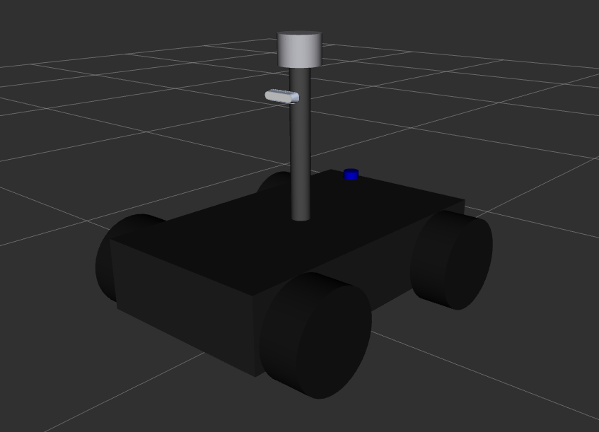
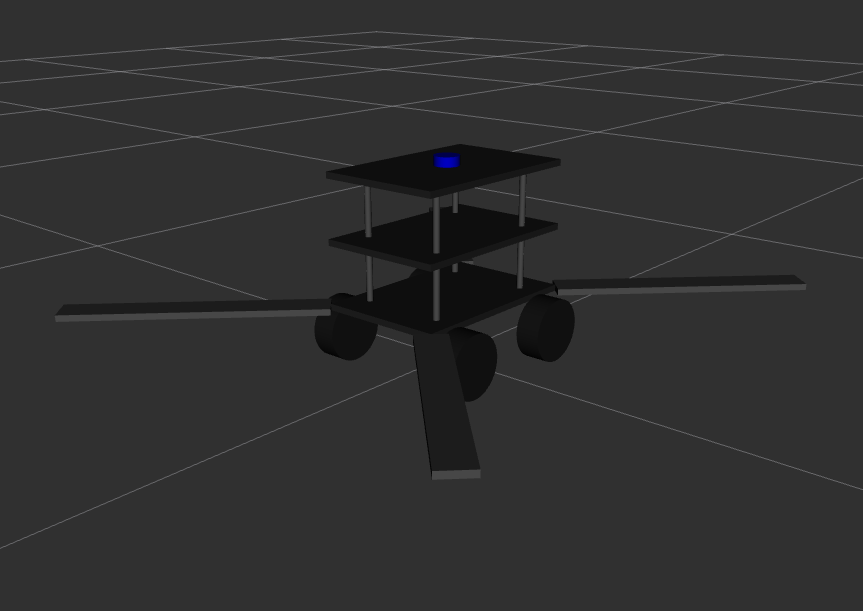

# Simulation Setup

This guide will guide you to set up the Gazebo Simulation to test, tune, and develop the msd_system.

## The Simulation Bringup

```bash
ros2 launch msd_sim msd_sim.launch.py
```

This starts the default world (`yayat_gudang.sdf`) with the default robot (`msd700_robot.urdf.xacro`).

| Argument | Default | What it sets |
| - | - | - |
| `world_file` | `yayat_gudang.sdf` | The world to load. See [World](#_1-world). |
| `xacro_file` | `msd700_robot.urdf.xacro` | The robot model. See [Robot](#_2-robot). |
| `xacro_config` | `enable_2d_lidar:=false enable_3d_lidar:=true` | Options passed to the robot model. See [Robot](#_2-robot). |
| `spawn_x`, `spawn_y`, `spawn_z` | `0.0`, `0.0`, `0.5` | Where the robot appears, in meters. |
| `use_teleop` | `false` | Opens a keyboard window to drive the robot. See [Keyboard control](#_3-keyboard-control). |
| `teleop_params_file` | `msd_teleop/config/keyboard.yaml` | Parameters for the robot's keyboard control. |
| `use_target` | `false` | Spawns target objects. See [Simulated targets](#_4-simulated-targets-optional). |
| `target_objects_file` | `msd_sim/config/target_objects.yaml` | Which targets to spawn. |
| `target_params_file` | `msd_sim/config/target_params.yaml` | Keyboard and UWB settings for the targets. |

## 1. Choose the World

Set `world_file` to one of the bundled worlds:

| File | Description |
| - | - |
| `empty_world.sdf` | Empty world with a flat ground plane |
| `yayat_world.sdf` | Ground plane with a few scattered obstacles |
| `yayat_gudang.sdf` | Warehouse interior with shelves |
| `cave_qual.sdf` | Large DARPA SubT-style cave circuit |
| `terrain_3d.sdf` | Heightmap terrain with two box obstacles |
| `uneven_terrain.sdf` | Uneven terrain with wavy surface, valley, and obstacles |

```bash
ros2 launch msd_sim msd_sim.launch.py world_file:=uneven_terrain.sdf spawn_z:=1.0
```

### Using your own world

If you want to add your own world, either:
- Use absolute path to your SDF file: `world_file:=/home/me/worlds/my_world.sdf`
- Copy the SDF file into `msd_sim/worlds/` and pass `world_file:=my_world.sdf`.

## 2. Spawning your Robot

Set `xacro_file` to choose the robot model:

| Robot | `xacro_file` | Preview |
| - | - | - |
| MSD700 Robot | `msd700_robot.urdf.xacro` (default) |  |
| MSD700 Prototype Robot | `msd700_prototype_robot.urdf.xacro` |  |

To use your own model, pass the absolute path to its xacro file.

### Robot options (`xacro_config`)

`xacro_config` passes options to the robot model, such as which sensors it has. Put multiple options inside quotes, separated by spaces:

```bash
ros2 launch msd_sim msd_sim.launch.py \
  xacro_config:="enable_3d_lidar:=true lidar_3d_model:=livox_mid360 enable_gps:=false"
```

Sensor options for `msd700_robot.urdf.xacro`:

| Option | Default | Values |
| - | - | - |
| `enable_2d_lidar` | `false` | `true` / `false` |
| `enable_3d_lidar` | `true` | `true` / `false` |
| `lidar_3d_model` | `velodyne_vlp16` | `velodyne_vlp16` / `livox_mid360` |
| `enable_depth_camera` | `true` | `true` / `false` |
| `camera_model` | `realsense_d435i` | `realsense_d435i` / `zed_x_wide` |
| `enable_gps` | `true` | `true` / `false` |
| `enable_imu` | `true` | `true` / `false` |

Each sensor's mounting position can also be changed with `<sensor>_xyz` (meters) and `<sensor>_rpy` (radians), for example `lidar_3d_xyz:="0 0 0.5"`. The full list of options, including body and wheel dimensions, is at the top of each xacro file in `msd_description/urdf/`.

## 3. Keyboard control (Optional)

With `use_teleop:=true`, an `xterm` window titled **Robot teleop** opens. Keep that window focused and use the keys it shows to drive the robot.

## 4. Simulated targets (Optional)

You can spawn objects into the world for the robot to use as targets. Turn them on with `use_target:=true`:

```bash
ros2 launch msd_sim msd_sim.launch.py use_target:=true
```

Targets are configured in two files. To change them, copy the defaults, edit your copies, and pass their paths:

```bash
ros2 launch msd_sim msd_sim.launch.py use_target:=true \
  target_objects_file:=/path/to/my_targets.yaml \
  target_params_file:=/path/to/my_target_params.yaml
```

### Target objects

`target_objects_file` lists which targets to spawn, and which one carries the simulated UWB tag.

```yaml
targets:
  - name: target_ball_1
    type: ball
    pose: [3.0, 0.0, 3.0]
    motion: keyboard

uwb:
  enabled: true
  tag_target: target_ball_1
```

| Field | Description |
| - | - |
| `name` | Unique name for the target. |
| `type` | Model to spawn. Currently only `ball`. |
| `pose` | Spawn position `[x, y, z]` in meters. |
| `yaw` | Optional. Spawn heading in radians. Default `0.0`. |
| `motion` | `static` (doesn't move) or `keyboard` (opens an `xterm` window titled **Target: \<name\>** to drive it). Default `static`. |
| `uwb.enabled` | Simulate a UWB tag on one target. |
| `uwb.tag_target` | Which target carries the tag. Must match one of the `name`s above. |

To add more targets, add more items under `targets`.

### Target parameters

`target_params_file` holds the settings for the target keyboard control and the UWB simulation.

```yaml
/**:
  ros__parameters:
    stamped: false
    speed: 2.0
    turn: 1.0

target_uwb_sim_node:
  ros__parameters:
    world_name: "msd_world"
    robot_model_name: "msd700_robot"
    publish_rate_hz: 10.0
    noise:
      range_stddev: 0.05
      bearing_stddev: 0.02
      dropout_probability: 0.0
```

| Parameter | Description |
| - | - |
| `speed`, `turn` | Keyboard driving speed and turn rate for targets. |
| `world_name` | Must match the `<world name="...">` in the world's SDF file. |
| `robot_model_name` | Name of the robot in Gazebo. The launch file spawns it as `msd700_robot`. |
| `publish_rate_hz` | How often the UWB reading is published. |
| `noise.range_stddev` | Noise added to the measured distance (meters). |
| `noise.bearing_stddev` | Noise added to the measured bearing (radians). |
| `noise.dropout_probability` | Chance (0 to 1) that a reading is dropped. |

The simulated UWB readings are published on `uwb/raw`.
