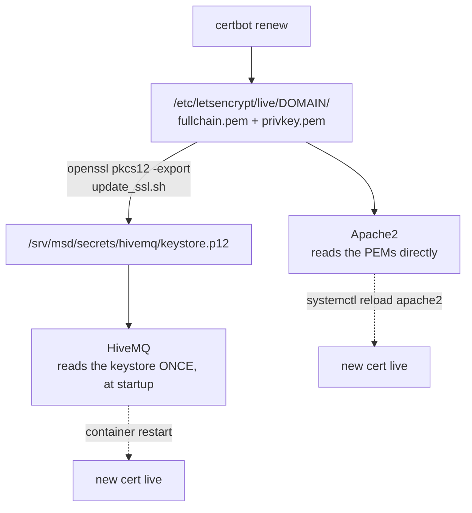

# Maintenance

<RoleBadge role="technician" />

Routine care for a deployed MSD700 system. Each task says which machine it runs on. For what the Docker commands do, see [Docker Reference](/setup/docker-reference).

## Routine checklist

| Task | How often | Where | Notes |
| --- | --- | --- | --- |
| Rotate the JWT keyring | Every few months, or right after a suspected leak | Server | [Rotating secrets](#rotating-secrets) |
| Renew the TLS certificate | Before expiry | Server | [Certificates](#certificates). Plain `certbot renew` does **not** update HiveMQ |
| Check the fleet relay runs | Now and then | Server | `docker ps --filter name=unit_relays`. In fleet mode (default) one stopped relay drops the whole fleet |
| Prune expired keys | After a rotation's grace window | Server | `./scripts/secrets.sh prune --dev` |
| Check Docker disk use | Monthly | Both | `docker system df`, then prune images/build cache |
| Check the TURN relay | After any network/router change | Server | [The TURN relay](#the-turn-relay) |
| Update the software | As releases land | Both | [Updating](#updating) |
| Check ROS log size | Only by hand if a unit misbehaves | Unit | A janitor handles it automatically ([below](#log-housekeeping)) |

## Log housekeeping

The robot container runs a janitor that caps ROS logs at 512 MB, checked every 60 seconds. Above the limit it truncates the biggest files first. It watches the log folder **inside the container** (`ROS_LOG_DIR`, else `$ROS_HOME/log`, else `$HOME/.ros/log`).

From the **unit host**, look at the real launcher session (use `msd700-simulator` for simulation):

```bash
docker exec -it msd700 tmux attach -t robot_services
tail -F src/ros-web-ui/logs/log_janitor.log   # from the msd700_noetic folder
```

Two more log systems, separate from ROS logs:

- Launcher logs under `src/ros-web-ui/logs/`: five 10 MB files per service when `rotatelogs` exists, unbounded `tee` otherwise.
- Docker stdout/stderr: every unit service caps at 20 MB x 3. On the server, only `coturn` sets that cap; other services use daemon defaults.

`ROS_LOG_CAP_MB` and `ROS_LOG_SWEEP_SECONDS` configure the inner launcher only. Setting them on the host or in `docker/.env` does nothing. The janitor truncates largest-first by real block usage (never deletes — ROS holds the fd open) and never trusts `stat` sizes (sparse-file trap); ~96% of the tree is usually `rosout.log`.

## `ros_doctor.sh`: reading its output

`scripts/ros_doctor.sh` is read-only. Run it inside the backend container when the dashboard has status but no live topics:

- `OK master answers` — a ROS master responds at all.
- `stamped as '<role>' owned by <host>` — `/msd700/stack_role` + `/msd700/stack_host`; tells you whose master you are actually talking to.
- `none: every node advertises a host this machine can resolve` — no foreign nodes. Anything else names nodes registered from hosts this machine cannot reach (the forwarded-port hijack).
- `listening on 9090` vs `nothing listening on 9090. Dashboards get no live topics at all.` — is rosbridge up.
- `no rosbridge node on this master (evicted by a duplicate name, or never started)` — the bridge lost its name registration.

## `deploy_certs.sh`: safe copy, explicit overwrite

Run from `ros-web-ui/`. Default copies `Certificates/mqtt` and `Certificates/sql` into the backend/mqtt source trees with `cp -n` — **never overwrites**. Only `--force` overwrites. Do not confuse it with `update_ssl.sh` (renews Let's Encrypt + rebuilds the HiveMQ keystore).

## Rotating secrets

::: info Why rotate instead of replace?
One shared secret means replacing it logs out every operator and robot at once. The keyring signs new tokens with the new key while still **accepting** the old one for a grace window (48 hours default). Rotation is invisible to anyone already connected.
:::

The dev backend, media, and signalling services mount the **dev** keyring. From `ros-web-ui`, using the same secrets folder as Compose:

```bash
./scripts/secrets.sh status --dev
./scripts/secrets.sh rotate --dev
```

After the grace window:

```bash
./scripts/secrets.sh prune --dev
```

Without `--dev` you touch `jwt_keyring.json`, which production does not mount. Production has no keyring mount; creating a prod keyring alone configures nothing. The unit's local services use the separate `JWT_SECRET` in the unit's `docker/.env`.

Key files are read once at process start. After rotating, recreate the three dev consumers so they load the same new file (a plain restart inside the container is not enough):

```bash
docker compose --profile server_dev up -d --no-deps --force-recreate nakayama_cloud_dev nakayama_media_dev nakayama_signalling_dev
```

This restarts the dev fleet relay too, briefly interrupting dev units. Tokens stay valid through the grace window, but sockets still drop during recreation.

## Certificates

Apache reads the Let's Encrypt PEM files directly. HiveMQ reads a **separately generated** PKCS#12 keystore. Renewing the PEMs never updates HiveMQ by itself.



| Consumer | Picks up renewal by | Automatic? |
| --- | --- | --- |
| Apache | reload after PEM renewal | Depends on the host's certbot setup |
| HiveMQ | rebuild the keystore, then restart the broker | No. `update_ssl.sh` does not restart anything |

```bash
sudo ./source/dependencies/ssl_update/update_ssl.sh   # renew + rebuild the keystore
docker compose --profile server_dev  up -d --no-deps --force-recreate hivemq_dev
docker compose --profile server_prod up -d --no-deps --force-recreate hivemq   # maintenance window!
```

::: danger Restarting a broker interrupts every unit on it
Losing operator pings for over 10 seconds can raise `/emergency_pause`. Schedule either broker's restart around active operations, not just production ones. Both profiles share the **same keystore file**, so renewal is never dev-isolated.
:::

`update_ssl.sh` is fixed to `msd.nglobal.jp` and `/srv/msd/secrets/hivemq/keystore.p12`. Its export password must match the broker config. Never print it in diagnostics. Check served expiry separately for HTTPS and MQTT before and after.

## The TURN relay

`coturn` is **production-only**. Full reasoning: [Docker Reference](/setup/docker-reference#coturn-the-production-only-service).

```bash
docker compose --profile turn up -d coturn      # start/restart just the relay
docker compose logs -f coturn                   # watch allocations
docker compose --profile turn stop coturn       # stop just the relay
```

After changing `.env`, apply with `up -d coturn` (a plain `restart` keeps the old environment).

| What changed | What to do |
| --- | --- |
| Host LAN address | Update `TURN_LISTENING_IP` + `TURN_EXTERNAL_IP`, restart relay, re-check router forward |
| Public IP | Update the public half of `TURN_EXTERNAL_IP`, restart relay |
| `TURN_USER` / `TURN_PASSWORD` | Restart relay, update the unit's `camera_client` env (`TURN_USERNAME`/`TURN_CREDENTIAL`), rebuild cloud dashboard images (the bundle bakes the same credential) |
| Router/firewall | Re-confirm UDP+TCP 3478 and the UDP relay range reach `TURN_LISTENING_IP` |

::: info Symptom to recognize
Camera works on the same LAN, never outside it. That is the relay, not the camera: signalling succeeded, the media path did not.
:::

## Backups

| Data | Where | How |
| --- | --- | --- |
| Maps, routes, areas, playlists | MySQL + map files under `/srv/msd/media/map` | Admin console **profile backup**: one `.tar.gz` per profile, restore is additive |
| One unit's data (hardware swap, per-unit archive) | Same sources, one unit | Backup `scope` column archives a single unit |
| JWT keyring / TLS keystore | `/srv/msd/secrets` | Not in app backups; back up at filesystem level |

::: warning
Backup files go to `/srv/msd/media/backup` (`/srv/msd/media/backup_dev` for dev). If that folder is missing or not writable by the app user, backups fail (see [Troubleshooting](/setup/troubleshooting)).
:::

## Updating

### Server

```bash
git pull
docker compose --profile server_dev  build && docker compose --profile server_dev  up -d   # test first
docker compose --profile server_prod build && docker compose --profile server_prod up -d
```

Recreating the backend restarts the existing `unit_relays` container (fleet mode default). No manual relay step needed, but every unit's data plane blips briefly and recovers alone. A missing relay is never created by the backend; only Compose creates it.

Legacy mode (`UNIT_CONTAINERS_ENABLED=true`): running `rosweb_unit_*` containers are adopted on startup, but their ROS nodes are not re-registered against a new master. List one environment only before touching anything (prod names end `_nakayama`, dev `_nakayama_dev`):

```bash
docker ps --filter "name=rosweb_unit_" --format '{{.Names}}' | grep '_nakayama_dev$'
```

### Unit

```bash
git pull
# src/ holds plain clones, not submodules: pull each separately
for d in src/*/; do git -C "$d" pull; done
git -C src/msd700_robot submodule update --init --recursive
```

Then rebuild/restart during a maintenance window, keeping the unit's `--dev` / `--simulator` flags:

- **Robot container** bind-mounts `src/`: Python and launch edits apply on the next launcher run, no rebuild. C++ changes, messages, and new packages need a catkin build (`up --build`); plain `up` skips the build if `devel/setup.bash` exists.
- **Local server stack** copies source into its images: use `local-build` then `up` for those edits.
- A running robot container keeps its old image after `build`. Plan a `down` + matching `up -d` (same flags) to replace it. This interrupts robot and local services; add `--no-autostart` if you do not want to change boot behavior.

No separate firmware path here for the Arduino motor controller; that is a manual re-flash.

## Disk housekeeping

```bash
docker system df                 # what uses space
docker image prune -a            # images no container uses
docker builder prune             # build cache
docker volume ls                 # look BEFORE removing anything
```

::: danger Never `docker compose down -v` casually
`-v` deletes named volumes, including `ros_webui_hivemq_data_prod` (retained messages, client sessions, queued QoS>0 messages). To clean a broker, delete that one volume by name, on purpose.
:::

## Related

- [Docker Reference](/setup/docker-reference): what every command above does
- [Troubleshooting](/setup/troubleshooting): when maintenance finds a problem
- [System Setup](/setup/system-setup): topology reference
