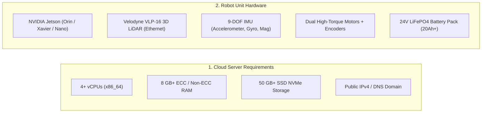
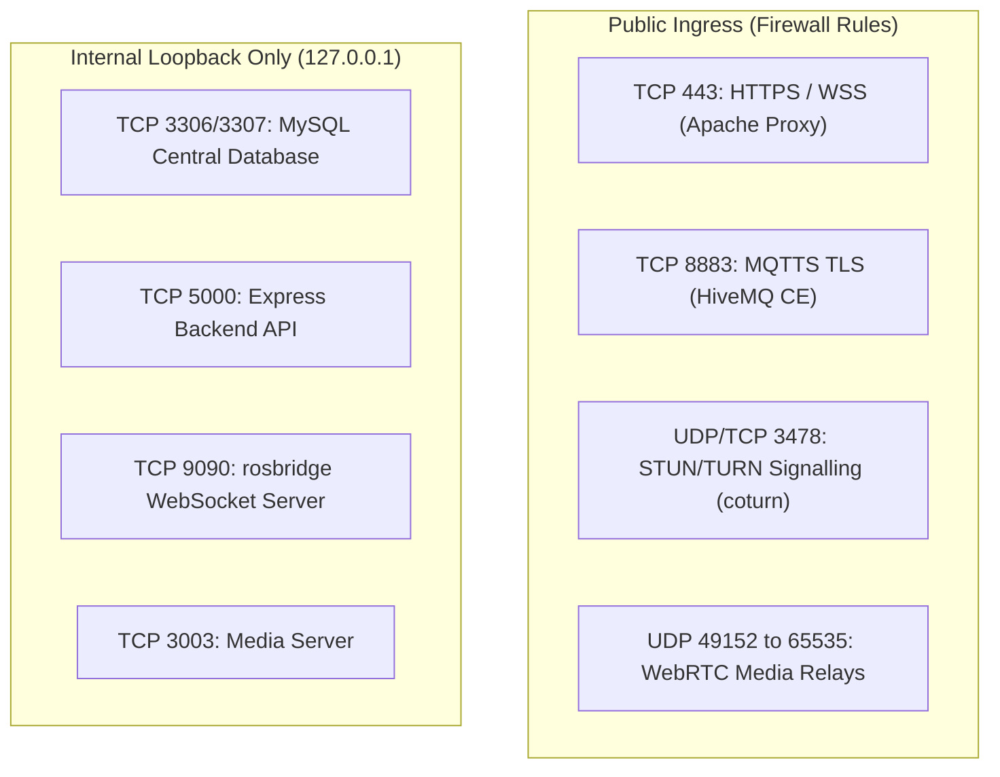

# Prerequisites

<RoleBadge role="technician" />

This document details the hardware specifications, operating system requirements, networking rules, and software dependencies needed before deploying the **MSD700 Server** or **MSD700 Physical Robot Units**.

## System Sizing and Hardware Specifications

### 1. Server Hardware Specifications (Cloud Host)

| Component | Minimum Specification | Recommended Production |
| --- | --- | --- |
| **Processor** | 2 vCPUs (x86_64 / amd64) | 4 to 8 vCPUs |
| **System Memory** | 4 GB RAM | 8 to 16 GB RAM |
| **Disk Storage** | 30 GB SSD | 100 GB NVMe (for map archives and media logs) |
| **Network Ingress** | Static Public IPv4 with Port 443, 8883 forwarded | 100 Mbps+ Full Duplex link |

### 2. Physical Robot Unit Specifications (Jetson SBC)

| Component | Hardware Specification | Purpose |
| --- | --- | --- |
| **Single-Board Computer** | NVIDIA Jetson (JetPack 5.x / 6.x) | Runs ROS Noetic runtime in Docker, sensor fusion, and local web stack. |
| **Primary 3D LiDAR** | Velodyne VLP-16 (16 Channels, Ethernet) | 360-degree environmental mapping and 100 m range obstacle detection. |
| **State IMU** | 9-DOF MEMS Sensor (I2C/UART) | Fused with wheel odometry via Madgwick filter for high-rate orientation. |
| **Motor Microcontroller** | Arduino / Teensy Embedded Controller | Executes closed-loop PID velocity control and encoder tick interrupts. |
| **Chassis & Drive** | Differential Drive with 4 Swivel Casters | 0.90 x 0.70 m physical chassis footprint; 2.5 m/s maximum design speed. |
| **Power Stage** | 24V LiFePO4 Battery Pack | 4 to 6 hours continuous autonomous operation; hardware E-Stop relay. |

---

## Network Firewall and Port Matrix

Ensure network routers and security groups allow the following traffic:

| Port | Protocol | Scope | Service | Required For |
| --- | --- | --- | --- | --- |
| **`443`** | TCP | Public | Apache2 Reverse Proxy | Web dashboard HTTPS, REST API, and rosbridge WebSocket streams. |
| **`8883`** | TCP | Public | HiveMQ TLS Broker | Encrypted MQTT command and telemetry bridge connecting robots to the cloud. |
| **`3478`** | UDP + TCP | Public | coturn TURN Server | WebRTC camera video traversal when peer-to-peer NAT punch is blocked. |
| **`49152 - 65535`** | UDP | Public | coturn Dynamic Media Range | WebRTC video payload relaying across symmetric NATs. |
| **`3307`** | TCP | Localhost | MySQL Production DB | Central relational store for accounts, maps, routes, and rental profiles. |
| **`5000`** | TCP | Localhost | Express Backend API | Internal REST API and Docker container orchestrator. |
| **`9090`** | TCP | Localhost | rosbridge WebSocket | High-frequency ROS topic deserializer feeding web canvases. |

---

## Host Operating System & Dependencies

### For the Cloud Server:
1. **Operating System**: Ubuntu 22.04 LTS or Ubuntu 24.04 LTS (x86_64).
2. **Docker Engine**: Docker CE 20.10+ with Compose Plugin (`docker compose` v2).
3. **Web Server**: Apache 2.4+ (`a2enmod ssl proxy proxy_http proxy_wstunnel headers rewrite alias`).
4. **SSL Certificates**: Certbot installed for automatic Let's Encrypt renewal.

### For the Physical Jetson Unit:
1. **Operating System**: Ubuntu 20.04 / 22.04 LTS (JetPack 5.x / 6.x on ARM64).
2. **Docker Engine**: Docker CE with `network_mode: host` support.
3. **USB Device Rules**: `udev` rules granting non-root access to `/dev/ttyUSB*` (motor controller).
4. **Static IP Configuration**: Static IP `192.168.103.100` configured on the dedicated LiDAR Ethernet port (`end0`).

---

## Safety Checklist

::: danger Safety First
1. **Keep E-Stop Reachable**: Before running motor tests, verify that the physical Emergency Stop mushroom button is within immediate physical reach.
2. **Elevate Chassis for First Power-Up**: During initial firmware bringup and motor direction tests, place the robot chassis on wooden blocks so drive wheels spin freely without touching the floor.
3. **LiDAR Eye Safety**: The Velodyne VLP-16 is a Class 1 eye-safe laser device ($905\text{ nm}$ wavelength); avoid placing optical magnifying lenses directly in front of active optics.
:::

## Next Step

- Proceed to [Server Setup](/setup/server-setup) to deploy the cloud backend.
- Or proceed directly to [Unit Setup](/setup/unit-setup) if the server is already active.
