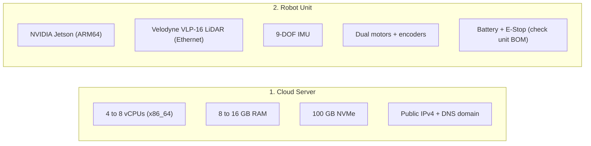
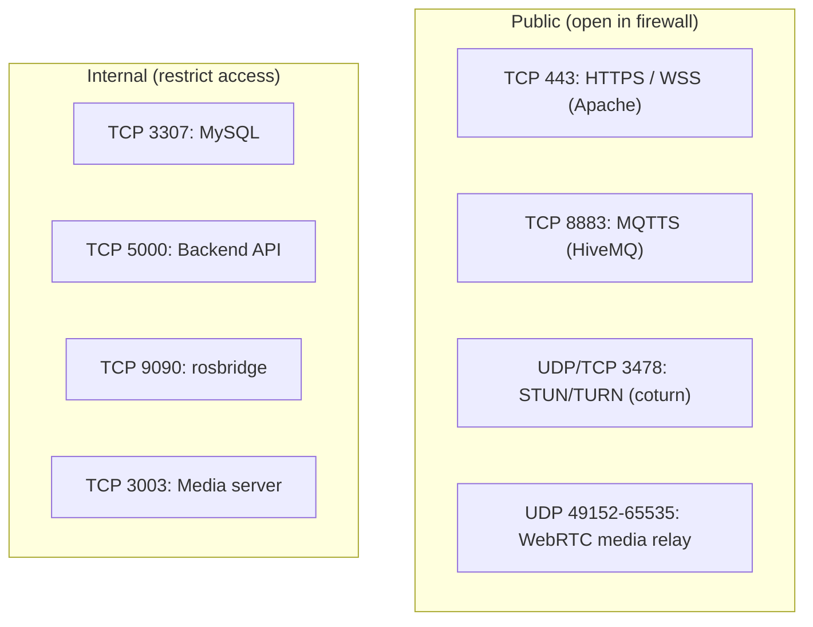

# Prerequisites

<RoleBadge role="technician" />

Hardware, OS, network ports, and software you need **before** installing the MSD700 Server or robot Units.

## Hardware



### 1. Cloud server

| Component | Minimum | Recommended |
| --- | --- | --- |
| **CPU** | 2 vCPUs (x86_64) | 4 to 8 vCPUs |
| **RAM** | 4 GB | 8 to 16 GB |
| **Disk** | 30 GB SSD | 100 GB NVMe (map archives, media logs) |
| **Network** | Static public IPv4, ports 443 + 8883 forwarded | 100 Mbps+ full duplex |

### 2. Robot unit (Jetson)

| Component | What you need |
| --- | --- |
| **Computer** | NVIDIA Jetson (ARM64) with a BSP/kernel matching that exact model |
| **LiDAR** | Velodyne VLP-16 over Ethernet. Host `192.168.103.100/24`, sensor `192.168.103.231`, UDP `2368` |
| **IMU** | Unit IMU for orientation filtering and odometry fusion |
| **Motors** | STM32 controller, exposed as `/dev/stm32` (needs udev rules, below) |
| **Power** | Battery, protection, and E-Stop: check against the unit BOM |

---

## Firewall ports

Open the **public** ports below. Everything else must stay behind the firewall, reachable only from trusted networks.



| Port | Protocol | Scope | Service |
| --- | --- | --- | --- |
| **`443`** | TCP | Public | Apache reverse proxy (dashboard, API, rosbridge, signalling) |
| **`8883`** | TCP | Public | HiveMQ broker (robots connect here) |
| **`3478`** | UDP + TCP | Public | coturn TURN server (camera video through NAT) |
| **`49152-65535`** | UDP | Public | coturn media relay range (narrow it in `.env` if you like) |
| **`3307`** | TCP | Internal only | MySQL production database |
| **`5000`** | TCP | Internal only | Backend API |
| **`9090`** | TCP | Internal only | rosbridge WebSocket |
| **`3003`** | TCP | Internal only | Media server |
| **`3001` / `3002`** | TCP | Internal only | Signalling server (WS / HTTP) |

::: warning MySQL and the backend are not loopback-only by themselves
Compose publishes MySQL without a loopback bind, and the backend listens on all interfaces. The firewall is what keeps them internal. Verify it on the host.
:::

Dev ports are shifted: MySQL `3308`, backend `5001`, rosbridge `9091`, MQTT `8884`, signalling `4001`/`4002`, media `4003`. TURN stays production-only.

On the **unit**, operator laptops on the LAN need dashboard `3000`, backend `5002`, rosbridge `9090`, media `3003`, signalling `3001`, and MQTT WebSocket `9001`. The robot's own roscore is `11321` (or `11322` with `--dev`), not the cloud's `11311`/`11312`.

---

## Operating system and dependencies

### Cloud server

1. **OS**: Ubuntu 22.04 or 24.04 LTS (x86_64).
2. **Docker**: Docker CE 20.10+ with the Compose plugin (`docker compose` v2).
3. **Apache**: 2.4+ with `ssl proxy proxy_http proxy_wstunnel headers rewrite alias`.
4. **Certbot**: for Let's Encrypt certificates.

### Jetson unit

1. **OS**: ARM64 Ubuntu with a BSP for that exact Jetson model.
2. **Docker**: Docker CE + Compose v2.
3. **udev rules**: for the `/dev/stm32` motor controller and RealSense USB (installed by `setup.sh`, see [Unit Setup](/setup/unit-setup)).
4. **LiDAR link**: dedicated Ethernet, normally host `192.168.103.100/24` and sensor `192.168.103.231`. The interface name is auto-detected; override with `VELODYNE_IFACE` if needed.
5. **Hotspot tools**: NetworkManager, `iw`, `dnsmasq`, `iptables`, systemd, udev, polkit. Install before the first start; see [WiFi Hotspot](/setup/wifi-hotspot).

---

## Install Docker on Ubuntu

Use Docker's official apt repo on both server and Jetson. The `docker.io` package in Ubuntu's repos is old and often lacks the Compose plugin.

```bash
# 1. Remove conflicting packages
for pkg in docker.io docker-doc docker-compose docker-compose-v2 podman-docker containerd runc; do
  sudo apt-get remove -y $pkg
done

# 2. Add Docker's official key
sudo apt-get update
sudo apt-get install -y ca-certificates curl
sudo install -m 0755 -d /etc/apt/keyrings
sudo curl -fsSL https://download.docker.com/linux/ubuntu/gpg -o /etc/apt/keyrings/docker.asc
sudo chmod a+r /etc/apt/keyrings/docker.asc

# 3. Add the Docker apt repo
echo \
  "deb [arch=$(dpkg --print-architecture) signed-by=/etc/apt/keyrings/docker.asc] https://download.docker.com/linux/ubuntu \
  $(. /etc/os-release && echo "$VERSION_CODENAME") stable" | \
  sudo tee /etc/apt/sources.list.d/docker.list > /dev/null
sudo apt-get update

# 4. Install Docker + Compose plugin
sudo apt-get install -y docker-ce docker-ce-cli containerd.io docker-buildx-plugin docker-compose-plugin

# 5. Test it
sudo docker run hello-world
```

Works on both `amd64` and `arm64` (the repo line picks the architecture automatically).

### Run Docker without `sudo`

```bash
sudo usermod -aG docker $USER
newgrp docker
docker run hello-world
```

::: warning Log out and back in if it still asks for `sudo`
`newgrp docker` only fixes the current shell. Other shells and SSH sessions need a full logout/login.
:::

### Start Docker on boot

```bash
sudo systemctl enable docker.service
sudo systemctl enable containerd.service
```

---

## Safety checklist

::: danger Safety first
1. **Keep the E-Stop close.** Before any motor test, make sure the red mushroom button is within arm's reach.
2. **Lift the chassis for the first power-up.** Put the robot on blocks so the wheels spin freely during motor direction tests.
3. **LiDAR lasers.** The Velodyne VLP-16 is Class 1 eye-safe. Still, never put magnifying optics in front of it while it runs.
:::

## Next step

- [Server Setup](/setup/server-setup): deploy the cloud backend.
- [Unit Setup](/setup/unit-setup): set up the robot (if the server already runs).
