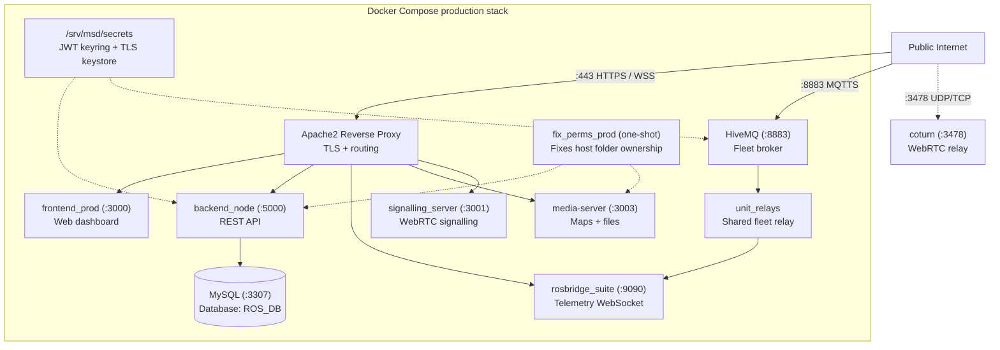
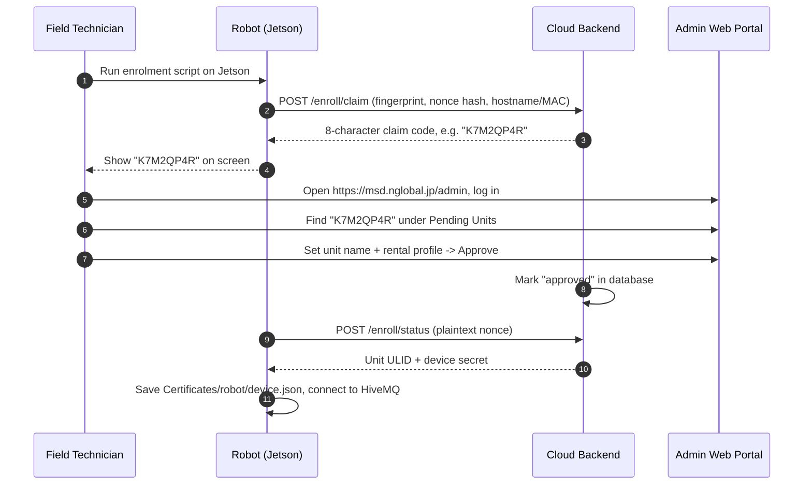
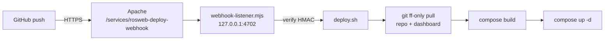

# Server Setup

<RoleBadge role="technician" />

How to deploy the **MSD700 Cloud Server and Web Dashboard**.

Finish [Prerequisites](/setup/prerequisites) first.

::: info Production first
This page deploys **production**. Dev mode and extras are in [Advanced Configurations](#advanced-configurations) at the bottom.
:::

## System topology



::: warning Fleet mode is the default
One shared `unit_relays` container serves the whole fleet. Per-unit `rosweb_unit_*` containers exist only in legacy mode (`UNIT_CONTAINERS_ENABLED=true`). Never run `server_prod` and `server_dev` together on one host. `coturn` is production-only. MySQL (`3307`) and the backend listen on all interfaces, so keep them behind the firewall (see [Prerequisites](/setup/prerequisites)).
:::

## Folder layout

```
~/ (e.g. /home/ubuntu)
└── ros-web-ui/                      # Server repo (branch: v2)
    ├── docker-compose.yml
    ├── .env                         # Per-host config, TRACKED in git (see Step 4)
    ├── Docker/
    │   ├── Dockerfile               # Server image (copies ./source in, no bind-mount)
    │   ├── hivemq/config.xml        # Broker config, one file for prod + dev
    │   └── coturn/turnserver.conf   # Shared TURN policy (addresses stay in .env)
    ├── scripts/
    │   └── secrets.sh               # JWT keyring tool
    └── source/
        └── dependencies/
            ├── ROS-dashboard-backend/
            ├── ROS-dashboard-next-ts/  # Frontend (nested clone, branch v2, gitignored)
            ├── media-server/
            ├── signalling_server/
            ├── aws_mqtt/               # MQTT bridge + fleet relay helpers
            ├── topic2string/
            ├── network-agent/
            ├── shared/
            └── ssl_update/
                └── update_ssl.sh       # Certbot renew + HiveMQ keystore builder
```

The frontend is a separate git checkout inside `source/dependencies/ROS-dashboard-next-ts` (it has its own `.git`, ignored by the parent). The Docker image bakes `./source` in with `COPY`, so after editing app code you must **rebuild**, a restart is not enough.

---

## Setup steps

Do these 6 steps in order.

### Step 1: Clone the repos

```bash
# 1. Main server repo, branch v2
git clone -b v2 git@github.com:itbdelaboprogramming/ros-web-ui.git ~/ros-web-ui

# 2. Frontend repo, into dependencies, branch v2
git clone -b v2 git@github.com:itbdelaboprogramming/ROS-dashboard-next-ts.git \
  ~/ros-web-ui/source/dependencies/ROS-dashboard-next-ts
```

::: tip Why inside dependencies?
The Dockerfile builds the frontend from inside the `ros-web-ui` build context. That path is gitignored by the parent repo.
:::

---

### Step 2: Create the secrets

Secrets live in `/srv/msd/secrets/`, outside containers, so they survive rebuilds.

```bash
cd ~/ros-web-ui
sudo mkdir -p /srv/msd/secrets
./scripts/secrets.sh init     # creates jwt_keyring.json, never overwrites
./scripts/secrets.sh status   # check it (output hides secret values)
```

`--dev` uses a separate `jwt_keyring.dev.json` for the dev stack. Coming from an old `JWT_SECRET`? Use `init --seed-legacy <old-secret>`.

---

### Step 3: Build the HiveMQ keystore

HiveMQ needs a PKCS#12 keystore made from the Let's Encrypt certificate.

```bash
cd ~/ros-web-ui
sudo ./source/dependencies/ssl_update/update_ssl.sh
```

This runs `certbot renew`, then writes `/srv/msd/secrets/hivemq/keystore.p12` (owner `1001`, mode `600`). Notes:

- The script is fixed to domain `msd.nglobal.jp` and that path. The export password must match `Docker/hivemq/config.xml`.
- One keystore file serves **both** prod and dev brokers.
- HiveMQ reads it once at startup, so **restart the broker** afterward, in a maintenance window. Restarting drops MQTT fleet-wide and can trigger the 10-second watchdog (`/emergency_pause`).
- Plain `certbot renew` alone does **not** update HiveMQ. See [Maintenance](/setup/maintenance#certificates).

---

### Step 4: Write `.env`

```bash
cd ~/ros-web-ui
nano .env
```

```ini
# Map storage on this host
MAPS_FOLDER=/home/ubuntu/ros_maps

# Host user + docker group IDs (find with: id -u; id -g; getent group docker | cut -d: -f3)
USER_UID=1001
USER_GID=1001
DOCKER_GID=998

# Release an idle operator's unit claim after 30 min
UNIT_IDLE_TIMEOUT_MS=1800000

# Database (set strong passwords before first start)
MYSQL_ROOT_PASSWORD=SetYourStrongRootPasswordHere
MYSQL_DATABASE=ROS_DB
MYSQL_USER=itbdelabo
MYSQL_PASSWORD=SetYourStrongUserPasswordHere

# MQTT broker
MQTT_BROKER_TYPE=nakayama
NAKAYAMA_HOST=msd.nglobal.jp
HIVEMQ_KEYSTORE=/srv/msd/secrets/hivemq/keystore.p12
HIVEMQ_UID=1001

# Production ports
MYSQL_PORT_PROD=3307
BACKEND_PORT_PROD=5000
ROSBRIDGE_PORT_PROD=9090
MEDIA_SERVER_PORT_PROD=3003
SIGNALLING_PORT_WS_PROD=3001
SIGNALLING_PORT_HTTP_PROD=3002
HIVE_MQTT_TLS_PORT_PROD=8883
FRONTEND_PORT_PROD=3000

# Development ports (separate stack, same host)
MYSQL_PORT_DEV=3308
BACKEND_PORT_DEV=5001
ROSBRIDGE_PORT_DEV=9091
MEDIA_SERVER_PORT_DEV=4003
SIGNALLING_PORT_WS_DEV=4001
SIGNALLING_PORT_HTTP_DEV=4002
HIVE_MQTT_TLS_PORT_DEV=8884
FRONTEND_PORT_DEV=3100

# Public address baked into the dashboard at build time
SERVER_PUBLIC_IP=118.22.31.252

# TURN relay (production-only; all four required at container start)
TURN_LISTENING_IP=192.168.100.14
TURN_EXTERNAL_IP=118.22.31.252/192.168.100.14
TURN_USER=msd700
TURN_PASSWORD=SetYourStrongTurnPasswordHere
```

::: warning `.env` is tracked in git and differs per host
`DOCKER_GID`, `MAPS_FOLDER`, `TURN_*`, `SERVER_PUBLIC_IP`, and passwords describe **this machine**, not the project. A `git pull` can overwrite them and a commit can leak them. Check them per host, never copy one host's file to another. Changing `FRONTEND_PORT_PROD` also means editing the Apache catch-all. Rotating TURN credentials needs a relay restart plus rebuilds (see [Maintenance](/setup/maintenance#the-turn-relay)).
:::

---

### Step 5: Start production containers

```bash
cd ~/ros-web-ui

# fix_perms_prod runs first automatically; nothing starts without a profile
docker compose --profile server_prod up -d

# Check everything is Up or healthy (fix_perms_* normally exits 0)
docker compose --profile server_prod ps
```

After pulling code that changes app source or Dockerfiles, rebuild: `up -d --build` (the image does not bind-mount `source/`). Prod `up` also starts `coturn`. Full flag reference: [Docker Reference](/setup/docker-reference).

---

### Step 6: Configure Apache

Apache ends TLS on port 443 and routes traffic to the containers.

```bash
sudo a2enmod ssl proxy proxy_http proxy_wstunnel headers rewrite alias
sudo systemctl restart apache2
```

Edit `/etc/apache2/sites-available/000-default-le-ssl.conf`:

```apache
<IfModule mod_ssl.c>
<VirtualHost *:443>
    ServerName msd.nglobal.jp
    ServerAdmin webmaster@localhost
    DocumentRoot /var/www/html

    ErrorLog ${APACHE_LOG_DIR}/error.log
    CustomLog ${APACHE_LOG_DIR}/access.log combined

    ProxyAddHeaders On

    # 1. WebRTC signalling (WebSocket)
    ProxyPass /services/signalling ws://localhost:3001
    ProxyPassReverse /services/signalling ws://localhost:3001

    # 2. Media server (maps, images)
    ProxyPass /services/media http://localhost:3003
    ProxyPassReverse /services/media http://localhost:3003

    # 3. Backend REST API
    ProxyPass /services/rosbackend http://localhost:5000
    ProxyPassReverse /services/rosbackend http://localhost:5000

    # 4. rosbridge WebSocket
    <Location /services/rosbridge>
        ProxyPass ws://localhost:9090 timeout=86400 keepalive=On flushpackets=on
        ProxyPassReverse ws://localhost:9090
        RequestHeader set Host "localhost:9090"
    </Location>

    # 5. Docs site (exclusion must stay ABOVE the catch-all)
    ProxyPass /itbdelabo/docs !
    Alias /itbdelabo/docs /home/itbdelabo/ITBdeLabo/V2/msd700_documentation/docs/.vitepress/dist

    <Directory /home/itbdelabo/ITBdeLabo/V2/msd700_documentation/docs/.vitepress/dist>
        Options -Indexes -MultiViews +FollowSymLinks
        AllowOverride None
        Require all granted
        DirectoryIndex index.html

        RewriteEngine On
        RewriteCond %{REQUEST_FILENAME} !-f
        RewriteCond %{REQUEST_FILENAME} !-d
        RewriteCond %{REQUEST_FILENAME}.html -f
        RewriteRule ^ %{REQUEST_FILENAME}.html [L]

        ErrorDocument 404 /itbdelabo/docs/404.html
    </Directory>

    # 6. Dashboard frontend (catch-all, MUST BE LAST)
    ProxyPass / http://localhost:3000/
    ProxyPassReverse / http://localhost:3000/

    SSLCertificateFile /etc/letsencrypt/live/msd.nglobal.jp/fullchain.pem
    SSLCertificateKeyFile /etc/letsencrypt/live/msd.nglobal.jp/privkey.pem
    Include /etc/letsencrypt/options-ssl-apache.conf
</VirtualHost>
</IfModule>
```

The live host has extra blocks not shown here (MQTT WebSocket, webhook, legacy docs, a Basic Auth gate on `/development/`). Rule of thumb: keep `ProxyPass /` last, keep every `ProxyPass ... !` exclusion above it.

| Path | Target | Notes |
| --- | --- | --- |
| `/services/signalling` | `ws://localhost:3001` | WebRTC signalling WS |
| `/services/media` | `http://localhost:3003` | Map assets |
| `/services/rosbackend` | `http://localhost:5000` | REST API |
| `/services/rosbridge` | `ws://localhost:9090` | `timeout=86400 keepalive=On flushpackets=on`, `Host: localhost:9090` |
| `/services/msd700-webhook` | `localhost:4701/webhook` | Docs deploy hook (in `apache-snippet.conf`, not the main block) |
| `/services/rosweb-deploy-webhook` | `localhost:4702/webhook` | ros-web-ui auto-deploy hook, see [Auto-deploy](#auto-deploy-on-push) |
| `/itbdelabo/docs` | exclusion + `Alias` to `dist/` | Must stay above the catch-all |
| `/` | `http://localhost:3000/` | Dashboard frontend, **must be last** |

HiveMQ notes: one `config.xml` serves prod and dev; plaintext `1883` is container-internal only; TLS `8883` in-container for both, host-mapped 8883 prod / 8884 dev (don't "fix" the dev port in the XML). Client auth NONE — TLS is transport/server identity only; the keystore at `/opt/hivemq/conf/keystore.p12` is rebuilt by `update_ssl.sh` and needs a broker restart. Control-center HTTP `8080` exists for the healthcheck.

coturn notes: `realm=msd.nglobal.jp`, `lt-cred-mech` (the old no-auth config granted Allocate with no credentials — closed). Credentials, ports, and `external-ip` come as container **flags** from compose (coturn expands no env), not the conf file. No TURN-over-TLS/5349 by design; `no-cli`, no TCP relay, LAN/loopback/multicast denied peers. Dev shares the prod relay.

```bash
sudo apache2ctl configtest
sudo systemctl reload apache2
```

---

## Registering units (enrolment)

Once the server runs, robots can register:



1. Log in at `https://msd.nglobal.jp/admin`.
2. Under **Pending Units**, find the 8-character code shown on the robot.
3. Pick an active **Rental Profile**, name the unit, click **Approve**.
4. The robot finishes enrolment and appears in the fleet dashboard.

---

## Advanced configurations

<details>
<summary><b>Development mode (`server_dev`)</b></summary>

An isolated dev stack on the same host:

```bash
cd ~/ros-web-ui
./scripts/secrets.sh init --dev
docker compose --profile server_dev up -d
```

Dev ports: MySQL `3308`, backend `5001`, HiveMQ `8884`, rosbridge `9091`, ROS master `11312` (prod `11311`), frontend `3100`, media `4003`, signalling `4001` WS / `4002` HTTP.

Dev uses the separate `jwt_keyring.dev.json` but the same keystore file as prod. `coturn` stays production-only.

</details>

<details id="auto-deploy-on-push">
<summary><b>Auto-deploy on push (GitHub webhook)</b></summary>

A push or merged PR rebuilds and re-ups the matching stack on its own:

| Branch | Checkout | Profile |
| --- | --- | --- |
| `main` | `~/ITBdeLabo/Production/ros-web-ui` | `server_prod` |
| `develop` | `~/ITBdeLabo/Development/ros-web-ui` | `server_dev` |

Pushes to `ros-web-ui` **and** `ROS-dashboard-next-ts` both trigger it, since the frontend is built from the nested dashboard clone. Other branches are ignored.



The listener answers GitHub with `202` right away and runs `deploy.sh` detached, so a long catkin + Next.js build never hits GitHub's 10 s webhook timeout.

Everything lives in `ros-web-ui/scripts/autodeploy/`:

| File | Purpose |
| --- | --- |
| `webhook-listener.mjs` | Webhook receiver (Node, no dependencies) |
| `deploy.sh` | git sync + build + up; can also be run by hand |
| `rosweb-autodeploy-webhook.service` | systemd unit |
| `apache-snippet.conf` | `ProxyPass` block for Apache |
| `webhook.env.example` | Config template (secret, port, paths) |
| `webhook.env` | Live config, **gitignored**, created by hand on the server |

Each checkout writes its own log to `logs/autodeploy/deploy.log` (gitignored).

**One-time setup** (the listener runs from the Production checkout, so the files must be on `main` first):

```bash
cd ~/ITBdeLabo/Production/ros-web-ui

# 1. Secret (gitignored)
cp scripts/autodeploy/webhook.env.example scripts/autodeploy/webhook.env
chmod 600 scripts/autodeploy/webhook.env
openssl rand -hex 32   # paste into WEBHOOK_SECRET=

# 2. Service
sudo cp scripts/autodeploy/rosweb-autodeploy-webhook.service /etc/systemd/system/
sudo systemctl daemon-reload
sudo systemctl enable --now rosweb-autodeploy-webhook
curl http://127.0.0.1:4702/health   # ok

# 3. Apache: add scripts/autodeploy/apache-snippet.conf above `ProxyPass /`
sudo apache2ctl configtest && sudo systemctl reload apache2
```

4. In **both** GitHub repos, go to Settings → Webhooks → Add webhook. Payload URL `https://msd.nglobal.jp/services/rosweb-deploy-webhook`, content type `application/json`, the same secret, push event only. The first delivery should be `200 pong`.

**Operating it:**

```bash
tail -f ~/ITBdeLabo/Production/ros-web-ui/logs/autodeploy/deploy.log   # or Development/
journalctl -u rosweb-autodeploy-webhook -f                            # incoming hooks

# Manual deploy from the matching checkout; FORCE=1 rebuilds with no new commits
FORCE=1 scripts/autodeploy/deploy.sh develop server_dev
```

A deploy **aborts without touching anything** when the checkout is on the wrong branch, has local edits to tracked files, or can't fast-forward. A failed `build` skips `up`, so the old containers keep running. Only one build runs at a time; pushes arriving mid-build queue and pick up the latest commit.

::: warning Never add `down` or `--remove-orphans`
Both checkouts are directories named `ros-web-ui`, so they share one compose project name. Each stack sees the other's containers as orphans, and `--remove-orphans` from dev deletes production.
:::

Things to know:

- Any change under `source/` recreates every app container in that profile (`nakayama_cloud*`, `unit_relays*`, `nakayama_media*`, `nakayama_signalling*` share one image), so connected robots drop briefly. `db`, `hivemq` and `coturn` are only recreated when their compose config changes. Per-unit `rosweb_unit_*` containers are left to `unit_manager.js`.
- The lock `/tmp/rosweb-autodeploy.lock` is shared by prod and dev; queued pushes wait up to 2 hours.
- A change to `deploy.sh` takes effect on the *next* deploy (the merge happens while the old script runs). Each checkout runs its own copy, so changes are exercised on develop first.
- A change to `webhook-listener.mjs` needs `sudo systemctl restart rosweb-autodeploy-webhook`. `KillMode=process` keeps a running build alive across the restart.
- git uses the `itbdelabo` user's SSH key (`~/.ssh`, no agent). A new or passphrase-protected key breaks `git fetch`.
- The nvm node path is hardcoded in the unit's `ExecStart` (same as `msd700-docs-webhook.service`); update it when node changes.
- `.env` is tracked and updated by the pull. Put host-specific values in the untracked `docker-compose.override.yml`.

| Symptom | Check |
| --- | --- |
| Delivery `401 bad signature` | GitHub secret differs from `WEBHOOK_SECRET`; restart the service after editing `webhook.env` |
| Delivery `502/503` | Listener down: `systemctl status rosweb-autodeploy-webhook` |
| Delivery `404` | Apache block missing or placed below `ProxyPass /` |
| Delivery `500 deploy script missing` | Target checkout has no `scripts/autodeploy/deploy.sh` yet |
| `200 ignored` | Normal for other branches, non-push events, or repos outside `ALLOWED_REPOS` |
| Log `ABORT: ... is on 'x', expected 'y'` | `git checkout <branch>` in that folder |
| Log `ABORT: ... has local changes` | `git status` there and clean up by hand |
| Log `Not possible to fast-forward` | Local commits or a force-push; reset to `origin/<branch>` by hand |
| Log `Permission denied (publickey)` | The `itbdelabo` SSH key can't reach GitHub |
| Build failed | Read the log above `deploy FAILED`; old containers keep running |

To test the listener without deploying, set `DRY_RUN=1` in `webhook.env`, restart the service and **Redeliver** from GitHub; `journalctl` shows `DRY_RUN: would run ...`.

</details>

<details>
<summary><b>Key rotation without logging everyone out</b></summary>

```bash
cd ~/ros-web-ui
./scripts/secrets.sh rotate --grace-hours 48  # old key stays valid 48h
./scripts/secrets.sh status
./scripts/secrets.sh prune                    # remove expired keys after the window
```

</details>

<details>
<summary><b>Manual HiveMQ keystore</b></summary>

Only if you cannot use `update_ssl.sh`:

```bash
sudo mkdir -p /srv/msd/secrets/hivemq
sudo openssl pkcs12 -export \
  -in   /etc/letsencrypt/live/msd.nglobal.jp/fullchain.pem \
  -inkey /etc/letsencrypt/live/msd.nglobal.jp/privkey.pem \
  -out  /srv/msd/secrets/hivemq/keystore.p12 \
  -name hivemq \
  -passout "pass:<must-match-Docker-hivemq-config.xml>"

sudo chown -R 1001:1001 /srv/msd/secrets/hivemq
sudo chmod 700 /srv/msd/secrets/hivemq
sudo chmod 600 /srv/msd/secrets/hivemq/keystore.p12
```

The password must match `Docker/hivemq/config.xml`. Restart the broker afterward.

</details>

---

## Health checks

```bash
# 1. Containers running?
docker compose --profile server_prod ps

# 2. Apache HTTPS ok?
curl -sI https://msd.nglobal.jp/ | head -n 1

# 3. Backend API answering?
curl -s https://msd.nglobal.jp/services/rosbackend/

# 4. MQTT broker listening?
sudo ss -lptn 'sport = :8883'

# 5. Fleet relay running?
docker ps --filter name=unit_relays
```

## Related

- [Unit Setup](/setup/unit-setup): set up the Jetson robot.
- [System Setup](/setup/system-setup): check server + unit together.
- [Docker Reference](/setup/docker-reference): containers in detail.
