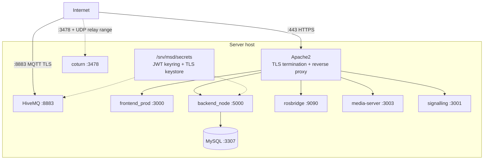

# Server Setup

<RoleBadge role="technician" />

How to install and configure the **MSD700 Server**, the cloud and dashboard half of the system.
Complete [Prerequisites](/setup/prerequisites) first. For what every Docker flag and compose
construct below is doing, see [Docker Reference](/setup/docker-reference).

::: info Why start with the Server?
A Unit can run fully offline once it has enrolled, but it cannot enrol *for the first time* without
somewhere to enrol against. Standing up the Server first means [Unit Setup](/setup/unit-setup) has
something to talk to on the first try, instead of failing at the very last step.
:::

## What you are building



Everything except Apache is a container, all defined in one `docker-compose.yml` inside the
`ros-web-ui` repository. Nothing is installed directly on the host except Docker, Apache and
certbot.

## 1. Clone the repository

```bash
git clone https://github.com/itbdelaboprogramming/ros-web-ui.git
cd ros-web-ui
```

The dashboard is a **separate repository**, cloned inside this one as the frontend build context:

```bash
git clone https://github.com/itbdelaboprogramming/ROS-dashboard-next-ts.git \
  source/dependencies/ROS-dashboard-next-ts
cd source/dependencies/ROS-dashboard-next-ts
git checkout v2
cd -
```

::: warning That clone must be on branch `v2`
The Dockerfile the frontend build needs exists only on `v2`. Branch `main` is the older line and
carries neither the Dockerfile nor the V2 app, so a clone left on `main` fails the build outright.
The nested clone is deliberately gitignored by `ros-web-ui`, so `git status` listing it as untracked
is git reporting a nested repository, not evidence that it is stray.
:::

## 2. Create the secrets

Two things live *outside* the Docker image on purpose: the JWT signing keyring and the HiveMQ TLS
keystore. Both are read from a fixed host path, `/srv/msd/secrets` by default (`SECRETS_DIR`).

### JWT signing keyring

```bash
./scripts/secrets.sh init            # production keyring  -> jwt_keyring.json
./scripts/secrets.sh init --dev      # dev keyring         -> jwt_keyring.dev.json
./scripts/secrets.sh status          # list keys and expiry, without printing values
```

| Command | Effect |
| --- | --- |
| `init` | Create the keyring if it does not exist. Never overwrites an existing one. |
| `status` | List keys, their state and expiry. Read only. |
| `rotate` | Mint a new active key; demote the current one to accepted for a grace window. |
| `prune` | Drop accepted keys whose grace window has passed. |

| Option | Applies to | Meaning |
| --- | --- | --- |
| `--dev` | all | Operate on `jwt_keyring.dev.json` instead of `jwt_keyring.json` |
| `--seed-legacy SECRET` | `init` | Add `SECRET` as an already-accepted key so tokens signed with the pre-keyring secret keep verifying during a cutover |
| `--legacy-days N` | `init` | Grace window for `--seed-legacy` (default 7) |
| `--grace-hours N` | `rotate` | Grace window for the demoted key (default 48) |

::: info Why a file instead of an environment variable
Two reasons. First, the Docker build copies the whole `source/` tree into the image, so anything in
an `.env` file *inside* that tree gets baked into the image: changing a secret would mean a rebuild.
A file mounted at container start avoids that entirely. Second, this is a **keyring**, not a single
secret. Rotating it demotes the old key to "still accepted for a grace window" instead of
invalidating every logged-in session and every connected robot at once.
:::

### HiveMQ TLS keystore

The broker needs a PKCS#12 keystore built from the domain's Let's Encrypt certificate. One keystore
serves **both** brokers; prod and dev mount the same file read-only.

```bash
sudo ./source/dependencies/ssl_update/update_ssl.sh
```

That script renews the certificate with certbot, exports
`/etc/letsencrypt/live/<domain>/{fullchain,privkey}.pem` into
`/srv/msd/secrets/hivemq/keystore.p12`, and fixes ownership and mode. Doing it by hand looks like
this:

```bash
sudo mkdir -p /srv/msd/secrets/hivemq
sudo openssl pkcs12 -export \
  -in   /etc/letsencrypt/live/msd.nglobal.jp/fullchain.pem \
  -inkey /etc/letsencrypt/live/msd.nglobal.jp/privkey.pem \
  -out  /srv/msd/secrets/hivemq/keystore.p12 \
  -name hivemq \
  -passout "pass:<the password in Docker/hivemq/config.xml>"

# The broker runs as uid 1001 and reads the 0600 key directly, so it has to BE the owner.
sudo chown -R 1001:1001 /srv/msd/secrets/hivemq
sudo chmod 700 /srv/msd/secrets/hivemq
sudo chmod 600 /srv/msd/secrets/hivemq/keystore.p12
```

::: warning A running broker keeps serving the OLD certificate
HiveMQ reads the keystore once, at startup. Restart it for a new certificate to take effect, and
mind that a **prod** restart cuts MQTT fleet-wide for around 14 seconds, which is longer than the
10 second ping watchdog and therefore trips `/emergency_pause` on every robot mid-operation. Do prod
in a maintenance window.

```bash
docker compose --profile server_dev  restart hivemq_dev
docker compose --profile server_prod restart hivemq      # maintenance window
```
:::

## 3. Configure `.env`

Create `.env` at the repository root, next to `docker-compose.yml`. There is no committed template,
because several values are per-host and a shared template is how a wrong one travels between
machines. This is the full set of keys the compose file reads.

```bash
# ── Paths and identity ─────────────────────────────────────────────────────────
# Must be the SAME value the Unit uses. A mismatch is the classic "map saving
# silently breaks": the backend writes to a path that exists only in its own container.
MAPS_FOLDER=/home/ubuntu/ros_maps

# Ownership of files the containers write on the host. PER-HOST.
USER_UID=1001
USER_GID=1001

# Host docker group gid: `getent group docker | cut -d: -f3`. PER-HOST.
# A wrong value makes the backend log "EACCES /var/run/docker.sock" and unit
# containers stop being auto-spawned.
DOCKER_GID=998

# How long an idle unit's container stays up before the reaper stops it (ms).
UNIT_IDLE_TIMEOUT_MS=1800000

# ── Database ───────────────────────────────────────────────────────────────────
MYSQL_ROOT_PASSWORD=<strong random>
MYSQL_DATABASE=ROS_DB
MYSQL_USER=itbdelabo
MYSQL_PASSWORD=<strong random>

# ── MQTT broker ────────────────────────────────────────────────────────────────
# Leave as "nakayama". Any other value, or an empty one, makes backend_node fall
# back to a local Mosquitto on 1883 that nothing on this host serves, and the only
# symptom is a repeating "ECONNREFUSED 127.0.0.1:1883".
MQTT_BROKER_TYPE=nakayama
NAKAYAMA_HOST=msd.nglobal.jp

# The keystore from step 2. HIVEMQ_UID must own that file and it must stay 0600.
# It is NOT the same as USER_UID above.
HIVEMQ_KEYSTORE=/srv/msd/secrets/hivemq/keystore.p12
HIVEMQ_UID=1001

# ── Production ports ───────────────────────────────────────────────────────────
MYSQL_PORT_PROD=3307
BACKEND_PORT_PROD=5000
MEDIA_SERVER_PORT_PROD=3003
SIGNALLING_PORT_WS_PROD=3001
SIGNALLING_PORT_HTTP_PROD=3002
HIVE_MQTT_TLS_PORT_PROD=8883
# Pinned to 3000 by Apache's catch-all. Changing it means editing the vhost too.
FRONTEND_PORT_PROD=3000

# ── Development ports (offset so both profiles can coexist) ────────────────────
MYSQL_PORT_DEV=3308
BACKEND_PORT_DEV=5001
MEDIA_SERVER_PORT_DEV=4003
SIGNALLING_PORT_WS_DEV=4001
SIGNALLING_PORT_HTTP_DEV=4002
HIVE_MQTT_TLS_PORT_DEV=8884
ROSBRIDGE_PORT_DEV=9091
FRONTEND_PORT_DEV=3100

# Public address of THIS server, baked into the DEV dashboard bundle at build time
# because those URLs resolve in the operator's browser, not in the container.
# Changing it means rebuilding frontend_dev, not restarting it.
SERVER_PUBLIC_IP=118.22.31.252

# ── TURN relay: see step 7. Production only. ───────────────────────────────────
TURN_LISTENING_IP=
TURN_EXTERNAL_IP=
TURN_USER=
TURN_PASSWORD=
```

Check what compose actually resolved before starting anything:

```bash
docker compose --profile server_prod config | less
```

::: danger `.env` is tracked between hosts; per-host values are not
`DOCKER_GID`, `USER_UID`, `USER_GID`, `MAPS_FOLDER` and the TURN addresses differ per machine. A
commit that sweeps a Jetson's values into this file is how the canvas turns grey and map saving
starts failing on the server, with nothing in any log pointing at a config change. Confirm those
five keys against the host you are on before the first `up`.
:::

## 4. Start the services

Pick one profile. `server_dev` is the safer first run: separate database, separate ports, separate
MQTT broker, so a mistake here cannot touch anything real.

```bash
docker compose --profile server_dev up -d
docker compose --profile server_dev ps        # everything Up or healthy?
docker compose --profile server_dev logs -f nakayama_cloud_dev
```

Once that works:

```bash
docker compose --profile server_prod up -d
```

::: info What actually starts, in order
A one-shot permissions fixer runs first (`fix_perms_prod` / `fix_perms_dev`): it creates and
`chown`s the maps, media and backup directories so the app containers, which run unprivileged, can
write to them. You never run it by hand; every app service waits on it with
`service_completed_successfully`. Then MySQL (which the backend waits on with `service_healthy`),
the HiveMQ broker, the backend plus rosbridge, the media server, the signalling server, the Next.js
dashboard, and in prod the TURN relay.
:::

::: warning Do not run both profiles at once unless the host can take it
They are designed to coexist, and that is how server-side changes get tested against a real broker
before touching production. But this is two full stacks including two MySQL instances and two JVMs.
If you are unsure, ask whoever runs the existing deployment before starting a second profile.
:::

## 5. Put Apache in front of it

Apache terminates HTTPS and reverse-proxies each service onto a clean public path, so the
dashboard's browser code never has to know a raw port.

### Enable the modules

```bash
sudo a2enmod ssl proxy proxy_http proxy_wstunnel headers rewrite alias
sudo systemctl restart apache2
```

`proxy_wstunnel` is the one people forget. Without it, `ProxyPass ws://...` silently falls back to
plain HTTP proxying and every WebSocket handshake fails.

### Get a certificate

```bash
sudo certbot --apache -d msd.nglobal.jp
```

This creates `/etc/apache2/sites-available/000-default-le-ssl.conf`. Everything below goes inside
that file's `<VirtualHost *:443>` block.

### The vhost block

```apache
<IfModule mod_ssl.c>
<VirtualHost *:443>
    ServerName msd.nglobal.jp
    ServerAdmin webmaster@localhost
    DocumentRoot /var/www/html

    ErrorLog  ${APACHE_LOG_DIR}/error.log
    CustomLog ${APACHE_LOG_DIR}/access.log combined

    # Forward X-Forwarded-For / X-Forwarded-Host to the backends. The enrolment
    # rate limiter and the connection log both read the client IP from these.
    ProxyAddHeaders On

    # ── WebRTC signalling (WebSocket) ────────────────────────────────────────
    ProxyPass        /services/signalling ws://localhost:3001
    ProxyPassReverse /services/signalling ws://localhost:3001

    # ── Media server (map images, uploads) ───────────────────────────────────
    ProxyPass        /services/media http://localhost:3003
    ProxyPassReverse /services/media http://localhost:3003

    # ── Backend API ──────────────────────────────────────────────────────────
    ProxyPass        /services/rosbackend http://localhost:5000
    ProxyPassReverse /services/rosbackend http://localhost:5000

    # ── rosbridge (WebSocket) ────────────────────────────────────────────────
    # rosbridge requires the Host header to INCLUDE the port, because it runs on a
    # non-standard one. Without the rewrite it rejects the handshake with
    # "missing port in HTTP Host header", which in the browser looks like the map
    # simply never loading. A <Location> block is used because RequestHeader
    # cannot be attached to a bare ProxyPass line.
    <Location /services/rosbridge>
        ProxyPass        ws://localhost:9090 timeout=86400 keepalive=On flushpackets=on
        ProxyPassReverse ws://localhost:9090
        RequestHeader set Host "localhost:9090"
    </Location>

    # ── Catch-all to the dashboard. MUST BE LAST. ────────────────────────────
    ProxyPass        / http://localhost:3000/
    ProxyPassReverse / http://localhost:3000/

    SSLCertificateFile    /etc/letsencrypt/live/msd.nglobal.jp/fullchain.pem
    SSLCertificateKeyFile /etc/letsencrypt/live/msd.nglobal.jp/privkey.pem
    Include /etc/letsencrypt/options-ssl-apache.conf
</VirtualHost>
</IfModule>
```

| Directive | Why it is there |
| --- | --- |
| `timeout=86400` | rosbridge connections are long-lived. Apache's default proxy timeout closes them mid-session. |
| `keepalive=On` | Sends TCP keepalives so an idle WebSocket is not dropped by an intermediate NAT. |
| `flushpackets=on` | Forwards each frame immediately instead of buffering, which matters for pose at 25 Hz. |
| `RequestHeader set Host` | The rosbridge handshake fix described above. |
| `ProxyAddHeaders On` | Preserves the real client IP for rate limiting and audit. |

::: danger Ordering rules that are not negotiable
**The catch-all `ProxyPass /` must come last.** Apache evaluates `ProxyPass` directives in file
order and takes the first match. Put the catch-all first and every `/services/...` path goes to the
dashboard instead.

**To serve anything locally, exclude it from the proxy first** with `ProxyPass /path !`. `mod_proxy`
hooks `translate_name` ahead of `mod_alias`, so without the exclusion the catch-all beats an `Alias`
no matter what order they appear in.
:::

### Serving static content alongside the proxy

If you also serve a static site off disk from this vhost, the pattern is exclusion, then `Alias`,
then a `<Directory>` block. This is what the documentation site itself uses:

```apache
    # 1. Exclude from the catch-all so Apache serves it locally.
    ProxyPass /itbdelabo/docs !

    # 2. Map the URL to a directory on disk.
    Alias /itbdelabo/docs /path/to/msd700_documentation/docs/.vitepress/dist

    # 3. Serve it.
    <Directory /path/to/msd700_documentation/docs/.vitepress/dist>
        Options -Indexes -MultiViews +FollowSymLinks
        AllowOverride None
        Require all granted
        DirectoryIndex index.html

        # Clean URLs: /setup/prerequisites must resolve to prerequisites.html
        RewriteEngine On
        RewriteCond %{REQUEST_FILENAME} !-f
        RewriteCond %{REQUEST_FILENAME} !-d
        RewriteCond %{REQUEST_FILENAME}.html -f
        RewriteRule ^ %{REQUEST_FILENAME}.html [L]

        ErrorDocument 404 /itbdelabo/docs/404.html

        <IfModule mod_headers.c>
            # HTML references hashed asset names and is rewritten every build.
            <FilesMatch "\.html$">
                Header set Cache-Control "no-cache"
            </FilesMatch>
        </IfModule>
    </Directory>
```

### Apply and check

```bash
sudo apache2ctl configtest      # Syntax OK
sudo systemctl reload apache2
```

## 6. The TURN relay (production only)

`coturn` relays WebRTC media when no direct peer-to-peer path exists. It runs in **production only**
and uses host networking. See [Docker Reference](/setup/docker-reference#coturn-the-production-only-service)
for why both of those are structural rather than stylistic.

### Configure it

Shared policy lives in `Docker/coturn/turnserver.conf`, which is tracked in git. Per-host addresses
are passed as flags from `.env`, because coturn expands no environment variables in its config file.

```bash
# ros-web-ui/.env
# This host's LAN address, the one the router forwards 3478 to (`ip -4 -o addr show`).
TURN_LISTENING_IP=192.168.100.14

# PUBLIC/PRIVATE. The private half must be EXACTLY the listening address above, or
# coturn ignores the mapping and goes back to advertising an unreachable private
# relay candidate.
TURN_EXTERNAL_IP=118.22.31.252/192.168.100.14

# Must match what the dashboard bundle sends, or every video call loses its relay.
TURN_USER=msd700
TURN_PASSWORD=<a long random string>

# Optional. Unset means coturn's own full 49152-65535 range, which is free here
# because host networking publishes nothing. Whatever this ends up being, the SAME
# range must be forwarded UDP through the router to TURN_LISTENING_IP.
# TURN_MIN_PORT=49152
# TURN_MAX_PORT=65535
```

::: warning If the relay advertises the wrong address, check `TURN_EXTERNAL_IP` first
coturn allocates on the address that received the `Allocate` request. On a host with several
addresses on one interface, that is the **primary** one, and that is the address the router must
forward 3478 to. Getting this wrong produces a camera feed that never appears, with no error
anywhere in the dashboard.
:::

### Router and firewall

| Protocol | Port | To |
| --- | --- | --- |
| UDP + TCP | `3478` | `TURN_LISTENING_IP` |
| UDP | `TURN_MIN_PORT`-`TURN_MAX_PORT` (default `49152-65535`) | `TURN_LISTENING_IP` |

### Start it

```bash
# Normally it comes up with the rest of production:
docker compose --profile server_prod up -d

# Start or restart JUST the relay, without touching anything else:
docker compose --profile turn up -d coturn

# Watch allocations. The config logs at `verbose` to stdout, capped at 3 x 20 MB.
docker compose logs -f coturn
```

The four required values are validated at container start, not by compose, so
`--profile server_dev up` never fails on a relay nobody asked to start. If any is missing you get:

```
FATAL: set TURN_LISTENING_IP, TURN_EXTERNAL_IP, TURN_USER and TURN_PASSWORD in ros-web-ui/.env
```

::: info Dev stacks share the production relay, on purpose
`server_dev` deliberately does not include `coturn`. There is one relay instance and it belongs to
prod. Sharing is safe because a relay holds no state and pairs nobody: peers find each other through
the signalling servers, and those **are** split (3001 prod, 4001 dev).
:::

::: danger Migrating off an apt/systemd coturn: order matters exactly once
Port 3478 is a single well-known port and the two cannot both hold it.

```bash
sudo systemctl disable --now coturn            # 1. free the port
docker compose --profile turn up -d coturn     # 2. prove the container works
docker compose logs -f coturn                  # 3. confirm it bound
docker compose --profile server_prod up -d     # 4. now it is just another prod service
```

Run a prod `up` while the systemd unit is still listening and the container fails to bind, then
`restart: always` retries forever: noisy, harmless, and a long way from its cause.
:::

## 7. Verify

```bash
docker compose --profile server_prod ps          # everything healthy or Up
docker compose logs -f nakayama_cloud            # backend; watch for MQTT errors
sudo ss -lptn 'sport = :3000'                    # dashboard is listening
sudo ss -lptn 'sport = :8883'                    # broker is listening
curl -sI https://msd.nglobal.jp/                 # 200 through Apache
curl -s  https://msd.nglobal.jp/services/rosbackend/ -o /dev/null -w '%{http_code}\n'
```

Then open your domain in a browser: you should reach the login page. A successful login with **no
units listed is expected at this point**. A unit only appears once one has enrolled (see
[Unit Setup](/setup/unit-setup)) and your account has been added to a rental profile that includes
it.

| Check | Failure means |
| --- | --- |
| `docker compose ps` all healthy | See [Docker Reference troubleshooting](/setup/docker-reference#troubleshooting-docker-itself) |
| Login page loads | Apache catch-all or `frontend_prod` |
| Login succeeds | Backend proxy path or the JWT keyring |
| `401` on `/services/rosbackend` with a valid token | Keyring not mounted, or the wrong one for this profile |
| Browser console shows a rosbridge handshake error | The `RequestHeader set Host` block is missing |

## Next step

Continue to [Unit Setup](/setup/unit-setup), then [System Setup](/setup/system-setup) to connect
them together. Keep [Docker Reference](/setup/docker-reference) open alongside both.

If something goes wrong, see [Troubleshooting](/setup/troubleshooting).
