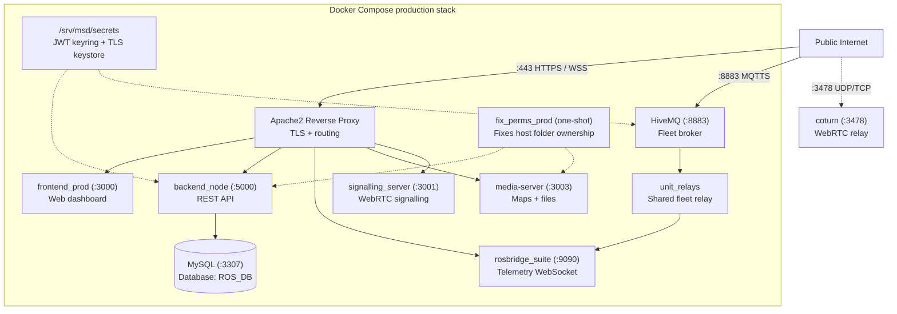
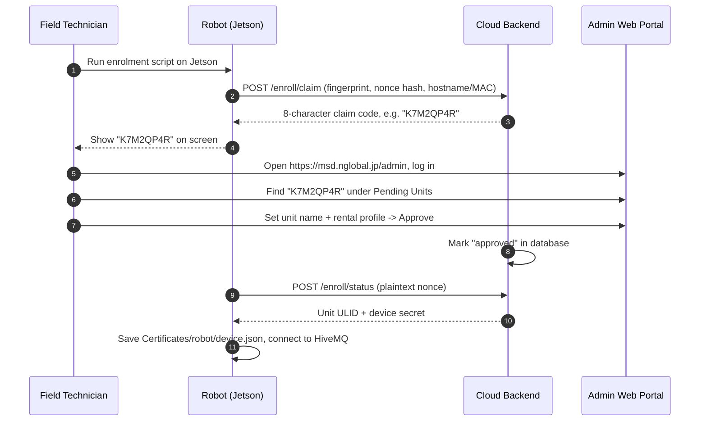

# Server Setup

<RoleBadge role="technician" />

How to deploy the **MSD700 Cloud Server and Web Dashboard**.

Finish [Prerequisites](/setup/prerequisites) first.

::: info Production first
This page deploys **production**. Dev mode and extras are in [Advanced Configurations](#advanced-configurations) at the bottom.
:::

## System topology



::: warning Fleet mode is the default
One shared `unit_relays` container serves the whole fleet. Per-unit `rosweb_unit_*` containers exist only in legacy mode (`UNIT_CONTAINERS_ENABLED=true`). Never run `server_prod` and `server_dev` together on one host. `coturn` is production-only. MySQL (`3307`) and the backend listen on all interfaces, so keep them behind the firewall (see [Prerequisites](/setup/prerequisites)).
:::

## Folder layout

```
~/ (e.g. /home/ubuntu)
└── ros-web-ui/                      # Server repo (branch: v2)
    ├── docker-compose.yml
    ├── .env                         # Per-host config, TRACKED in git (see Step 4)
    ├── Docker/
    │   ├── Dockerfile               # Server image (copies ./source in, no bind-mount)
    │   ├── hivemq/config.xml        # Broker config, one file for prod + dev
    │   └── coturn/turnserver.conf   # Shared TURN policy (addresses stay in .env)
    ├── scripts/
    │   └── secrets.sh               # JWT keyring tool
    └── source/
        └── dependencies/
            ├── ROS-dashboard-backend/
            ├── ROS-dashboard-next-ts/  # Frontend (nested clone, branch v2, gitignored)
            ├── media-server/
            ├── signalling_server/
            ├── aws_mqtt/               # MQTT bridge + fleet relay helpers
            ├── topic2string/
            ├── network-agent/
            ├── shared/
            └── ssl_update/
                └── update_ssl.sh       # Certbot renew + HiveMQ keystore builder
```

The frontend is a separate git checkout inside `source/dependencies/ROS-dashboard-next-ts` (it has its own `.git`, ignored by the parent). The Docker image bakes `./source` in with `COPY`, so after editing app code you must **rebuild**, a restart is not enough.

---

## Setup steps

Do these 6 steps in order.

### Step 1: Clone the repos

```bash
# 1. Main server repo, branch v2
git clone -b v2 git@github.com:itbdelaboprogramming/ros-web-ui.git ~/ros-web-ui

# 2. Frontend repo, into dependencies, branch v2
git clone -b v2 git@github.com:itbdelaboprogramming/ROS-dashboard-next-ts.git \
  ~/ros-web-ui/source/dependencies/ROS-dashboard-next-ts
```

::: tip Why inside dependencies?
The Dockerfile builds the frontend from inside the `ros-web-ui` build context. That path is gitignored by the parent repo.
:::

---

### Step 2: Create the secrets

Secrets live in `/srv/msd/secrets/`, outside containers, so they survive rebuilds.

```bash
cd ~/ros-web-ui
sudo mkdir -p /srv/msd/secrets
./scripts/secrets.sh init     # creates jwt_keyring.json, never overwrites
./scripts/secrets.sh status   # check it (output hides secret values)
```

`--dev` uses a separate `jwt_keyring.dev.json` for the dev stack. Coming from an old `JWT_SECRET`? Use `init --seed-legacy <old-secret>`.

---

### Step 3: Build the HiveMQ keystore

HiveMQ needs a PKCS#12 keystore made from the Let's Encrypt certificate.

```bash
cd ~/ros-web-ui
sudo ./source/dependencies/ssl_update/update_ssl.sh
```

This runs `certbot renew`, then writes `/srv/msd/secrets/hivemq/keystore.p12` (owner `1001`, mode `600`). Notes:

- The script is fixed to domain `msd.nglobal.jp` and that path. The export password must match `Docker/hivemq/config.xml`.
- One keystore file serves **both** prod and dev brokers.
- HiveMQ reads it once at startup, so **restart the broker** afterward, in a maintenance window. Restarting drops MQTT fleet-wide and can trigger the 10-second watchdog (`/emergency_pause`).
- Plain `certbot renew` alone does **not** update HiveMQ. See [Maintenance](/setup/maintenance#certificates).

---

### Step 4: Write `.env`

```bash
cd ~/ros-web-ui
nano .env
```

```ini
# Map storage on this host
MAPS_FOLDER=/home/ubuntu/ros_maps

# Host user + docker group IDs (find with: id -u; id -g; getent group docker | cut -d: -f3)
USER_UID=1001
USER_GID=1001
DOCKER_GID=998

# Release an idle operator's unit claim after 30 min
UNIT_IDLE_TIMEOUT_MS=1800000

# Database (set strong passwords before first start)
MYSQL_ROOT_PASSWORD=SetYourStrongRootPasswordHere
MYSQL_DATABASE=ROS_DB
MYSQL_USER=itbdelabo
MYSQL_PASSWORD=SetYourStrongUserPasswordHere

# MQTT broker
MQTT_BROKER_TYPE=nakayama
NAKAYAMA_HOST=msd.nglobal.jp
HIVEMQ_KEYSTORE=/srv/msd/secrets/hivemq/keystore.p12
HIVEMQ_UID=1001

# Production ports
MYSQL_PORT_PROD=3307
BACKEND_PORT_PROD=5000
ROSBRIDGE_PORT_PROD=9090
MEDIA_SERVER_PORT_PROD=3003
SIGNALLING_PORT_WS_PROD=3001
SIGNALLING_PORT_HTTP_PROD=3002
HIVE_MQTT_TLS_PORT_PROD=8883
FRONTEND_PORT_PROD=3000

# Development ports (separate stack, same host)
MYSQL_PORT_DEV=3308
BACKEND_PORT_DEV=5001
ROSBRIDGE_PORT_DEV=9091
MEDIA_SERVER_PORT_DEV=4003
SIGNALLING_PORT_WS_DEV=4001
SIGNALLING_PORT_HTTP_DEV=4002
HIVE_MQTT_TLS_PORT_DEV=8884
FRONTEND_PORT_DEV=3100

# Public address baked into the dashboard at build time
SERVER_PUBLIC_IP=118.22.31.252

# TURN relay (production-only; all four required at container start)
TURN_LISTENING_IP=192.168.100.14
TURN_EXTERNAL_IP=118.22.31.252/192.168.100.14
TURN_USER=msd700
TURN_PASSWORD=SetYourStrongTurnPasswordHere
```

::: warning `.env` is tracked in git and differs per host
`DOCKER_GID`, `MAPS_FOLDER`, `TURN_*`, `SERVER_PUBLIC_IP`, and passwords describe **this machine**, not the project. A `git pull` can overwrite them and a commit can leak them. Check them per host, never copy one host's file to another. Changing `FRONTEND_PORT_PROD` also means editing the Apache catch-all. Rotating TURN credentials needs a relay restart plus rebuilds (see [Maintenance](/setup/maintenance#the-turn-relay)).
:::

---

### Step 5: Start production containers

```bash
cd ~/ros-web-ui

# fix_perms_prod runs first automatically; nothing starts without a profile
docker compose --profile server_prod up -d

# Check everything is Up or healthy (fix_perms_* normally exits 0)
docker compose --profile server_prod ps
```

After pulling code that changes app source or Dockerfiles, rebuild: `up -d --build` (the image does not bind-mount `source/`). Prod `up` also starts `coturn`. Full flag reference: [Docker Reference](/setup/docker-reference).

---

### Step 6: Configure Apache

Apache ends TLS on port 443 and routes traffic to the containers.

```bash
sudo a2enmod ssl proxy proxy_http proxy_wstunnel headers rewrite alias
sudo systemctl restart apache2
```

Edit `/etc/apache2/sites-available/000-default-le-ssl.conf`:

```apache
<IfModule mod_ssl.c>
<VirtualHost *:443>
    ServerName msd.nglobal.jp
    ServerAdmin webmaster@localhost
    DocumentRoot /var/www/html

    ErrorLog ${APACHE_LOG_DIR}/error.log
    CustomLog ${APACHE_LOG_DIR}/access.log combined

    ProxyAddHeaders On

    # 1. WebRTC signalling (WebSocket)
    ProxyPass /services/signalling ws://localhost:3001
    ProxyPassReverse /services/signalling ws://localhost:3001

    # 2. Media server (maps, images)
    ProxyPass /services/media http://localhost:3003
    ProxyPassReverse /services/media http://localhost:3003

    # 3. Backend REST API
    ProxyPass /services/rosbackend http://localhost:5000
    ProxyPassReverse /services/rosbackend http://localhost:5000

    # 4. rosbridge WebSocket
    <Location /services/rosbridge>
        ProxyPass ws://localhost:9090 timeout=86400 keepalive=On flushpackets=on
        ProxyPassReverse ws://localhost:9090
        RequestHeader set Host "localhost:9090"
    </Location>

    # 5. Docs site (exclusion must stay ABOVE the catch-all)
    ProxyPass /itbdelabo/docs !
    Alias /itbdelabo/docs /home/itbdelabo/ITBdeLabo/V2/msd700_documentation/docs/.vitepress/dist

    <Directory /home/itbdelabo/ITBdeLabo/V2/msd700_documentation/docs/.vitepress/dist>
        Options -Indexes -MultiViews +FollowSymLinks
        AllowOverride None
        Require all granted
        DirectoryIndex index.html

        RewriteEngine On
        RewriteCond %{REQUEST_FILENAME} !-f
        RewriteCond %{REQUEST_FILENAME} !-d
        RewriteCond %{REQUEST_FILENAME}.html -f
        RewriteRule ^ %{REQUEST_FILENAME}.html [L]

        ErrorDocument 404 /itbdelabo/docs/404.html
    </Directory>

    # 6. Dashboard frontend (catch-all, MUST BE LAST)
    ProxyPass / http://localhost:3000/
    ProxyPassReverse / http://localhost:3000/

    SSLCertificateFile /etc/letsencrypt/live/msd.nglobal.jp/fullchain.pem
    SSLCertificateKeyFile /etc/letsencrypt/live/msd.nglobal.jp/privkey.pem
    Include /etc/letsencrypt/options-ssl-apache.conf
</VirtualHost>
</IfModule>
```

The live host has extra blocks not shown here (MQTT WebSocket, webhook, legacy docs, a Basic Auth gate on `/development/`). Rule of thumb: keep `ProxyPass /` last, keep every `ProxyPass ... !` exclusion above it.

```bash
sudo apache2ctl configtest
sudo systemctl reload apache2
```

---

## Registering units (enrolment)

Once the server runs, robots can register:



1. Log in at `https://msd.nglobal.jp/admin`.
2. Under **Pending Units**, find the 8-character code shown on the robot.
3. Pick an active **Rental Profile**, name the unit, click **Approve**.
4. The robot finishes enrolment and appears in the fleet dashboard.

---

## Advanced configurations

<details>
<summary><b>Development mode (`server_dev`)</b></summary>

An isolated dev stack on the same host:

```bash
cd ~/ros-web-ui
./scripts/secrets.sh init --dev
docker compose --profile server_dev up -d
```

Dev ports: MySQL `3308`, backend `5001`, HiveMQ `8884`, rosbridge `9091`, ROS master `11312` (prod `11311`), frontend `3100`, media `4003`, signalling `4001` WS / `4002` HTTP.

Dev uses the separate `jwt_keyring.dev.json` but the same keystore file as prod. `coturn` stays production-only.

</details>

<details>
<summary><b>Key rotation without logging everyone out</b></summary>

```bash
cd ~/ros-web-ui
./scripts/secrets.sh rotate --grace-hours 48  # old key stays valid 48h
./scripts/secrets.sh status
./scripts/secrets.sh prune                    # remove expired keys after the window
```

</details>

<details>
<summary><b>Manual HiveMQ keystore</b></summary>

Only if you cannot use `update_ssl.sh`:

```bash
sudo mkdir -p /srv/msd/secrets/hivemq
sudo openssl pkcs12 -export \
  -in   /etc/letsencrypt/live/msd.nglobal.jp/fullchain.pem \
  -inkey /etc/letsencrypt/live/msd.nglobal.jp/privkey.pem \
  -out  /srv/msd/secrets/hivemq/keystore.p12 \
  -name hivemq \
  -passout "pass:<must-match-Docker-hivemq-config.xml>"

sudo chown -R 1001:1001 /srv/msd/secrets/hivemq
sudo chmod 700 /srv/msd/secrets/hivemq
sudo chmod 600 /srv/msd/secrets/hivemq/keystore.p12
```

The password must match `Docker/hivemq/config.xml`. Restart the broker afterward.

</details>

---

## Health checks

```bash
# 1. Containers running?
docker compose --profile server_prod ps

# 2. Apache HTTPS ok?
curl -sI https://msd.nglobal.jp/ | head -n 1

# 3. Backend API answering?
curl -s https://msd.nglobal.jp/services/rosbackend/

# 4. MQTT broker listening?
sudo ss -lptn 'sport = :8883'

# 5. Fleet relay running?
docker ps --filter name=unit_relays
```

## Related

- [Unit Setup](/setup/unit-setup): set up the Jetson robot.
- [System Setup](/setup/system-setup): check server + unit together.
- [Docker Reference](/setup/docker-reference): containers in detail.
