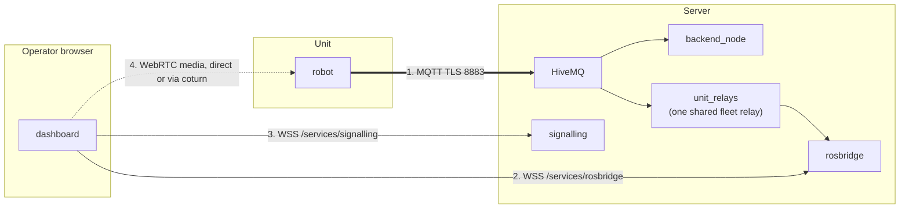

# System Setup

<RoleBadge role="technician" />

How to confirm a finished [Server](/setup/server-setup) and a finished [Unit](/setup/unit-setup) work together as one system. If you followed both pages and the unit enrolled, this page is mostly checks, not new setup.

## Overview

The unit and the server talk over channels that fail **independently**. Telling them apart is the whole skill here.



| # | Channel | Carries | When broken |
| --- | --- | --- | --- |
| 1 | MQTT | Commands, feedback, every stream | Unit shows **offline**. Nothing works |
| 2 | rosbridge | Browser subscription to cloud topics | Unit **online**, commands work, map blank |
| 3 | signalling | WebRTC negotiation | No video, everything else fine |
| 4 | WebRTC media | The camera image | Video works on LAN, never outside it: the TURN relay |

One more failure looks like #2: unit online, rosbridge connected, but the shared fleet relay (`unit_relays`) is down, so the cloud topics rosbridge reads do not exist. Same blank map, different cause. Check `docker ps --filter name=unit_relays`. (Per-unit `rosweb_unit_*` containers exist only in legacy mode with `UNIT_CONTAINERS_ENABLED=true`.)

## 1. Check the network path

| From | To | Port | Needed for |
| --- | --- | --- | --- |
| Unit | Server | `8883` TCP (prod) or `8884` (dev) | Everything. The only mandatory one |
| Browser | Server | `443` TCP | Dashboard, API, rosbridge, signalling |
| Browser | Server | `3478` UDP+TCP + relay range | WebRTC video with no direct path |

```bash
# From the unit: can it reach the broker?
nc -zv msd.nglobal.jp 8883

# Is the broker's certificate valid?
openssl s_client -connect msd.nglobal.jp:8883 -servername msd.nglobal.jp </dev/null 2>/dev/null \
  | openssl x509 -noout -subject -dates
```

::: warning An expired certificate fails silently
Dashboard WebSocket connections just never open, and browsers show only a generic network error. Check the certificate before debugging anything else. The MQTT certificate is a **separate file** from Apache's, built from the same PEM files: see [Maintenance](/setup/maintenance#certificates).
:::

::: info Production or dev?
`./scripts/docker-manager.sh up --dev` on the unit points enrolment and MQTT at the server's `server_dev` stack instead of `server_prod`: different port, different database, different fleet. Use it while testing; drop the flag for real deployment. A unit enrolled on dev is **not** registered on prod, and vice versa.
:::

## 2. Check the unit registered correctly

In the admin console, under **Registered Units**, find the unit you approved in [Unit Setup](/setup/unit-setup). Note its ULID.

```bash
# On the server. The shared fleet relay must be RUNNING for these topics to exist.
docker ps --filter "name=unit_relays"
docker exec -it ros_web_ui_v2_nakayama_ros bash -lc \
  'source /home/itbdelabo/ros-web-ui-ws/devel/setup.bash && rostopic list | grep unit_<ULID>'
```

Expect topics like `/unit_<ULID>/system_command`, `/unit_<ULID>/system_feedback`, `/unit_<ULID>/server/robot_pose`. Seeing nothing here, with no error elsewhere, is the most common silent symptom in this system.

You can also watch the broker directly. This tells "robot not publishing" apart from "cloud relays not running":

```bash
mosquitto_sub -h msd.nglobal.jp -p 8883 --capath /etc/ssl/certs \
  -t '/unit_<ULID>/#' -v | head -20
```

## 3. End-to-end checklist

Go down this list. Each item clears one channel from the diagram above.

- [ ] Server healthy: `docker compose --profile server_prod ps` shows every service `Up` or `healthy`
- [ ] Unit ROS graph healthy: `rosnode list` inside the unit container shows the bringup nodes
- [ ] Unit shows **online** in Registered Units (channel 1, MQTT)
- [ ] Shared fleet relay running: `docker ps --filter name=unit_relays`
- [ ] Opening the unit shows current position and a live map (channel 2, rosbridge)
- [ ] Camera feed visible **from outside the unit's LAN** (channels 3 and 4)
- [ ] W-A-S-D driving moves the robot, and the dashboard position follows
- [ ] A click-to-navigate goal is accepted and the robot drives there
- [ ] Emergency Stop, tested once, stops the robot at once
- [ ] Closing the browser mid-operation pauses the robot within ~2 seconds (cloud dashboard) or at once (local dashboard, whose 5 Hz heartbeat stops with the tab)

::: warning Do not skip the last four
A unit can look fully connected (online, video fine) while one command direction is broken. That only shows when something is asked to move. The disconnect test is the safety behavior: trigger it once on purpose, with clear space around the robot.
:::

## 4. Handover

When all checks pass, two things remain before giving the unit to an operator:

1. **Grant dashboard access.** In the admin console, add the operator's account to the rental profile containing this unit. An enrolled unit alone is not visible to any user: access is controlled through profiles, not through the unit.
2. **Point them at the [User Guide](/user-guide/).** It assumes exactly this state: installed, connected, access granted.

## Next step

- Set up a [Maintenance](/setup/maintenance) schedule for the new deployment.
- Keep [Troubleshooting](/setup/troubleshooting) handy.
