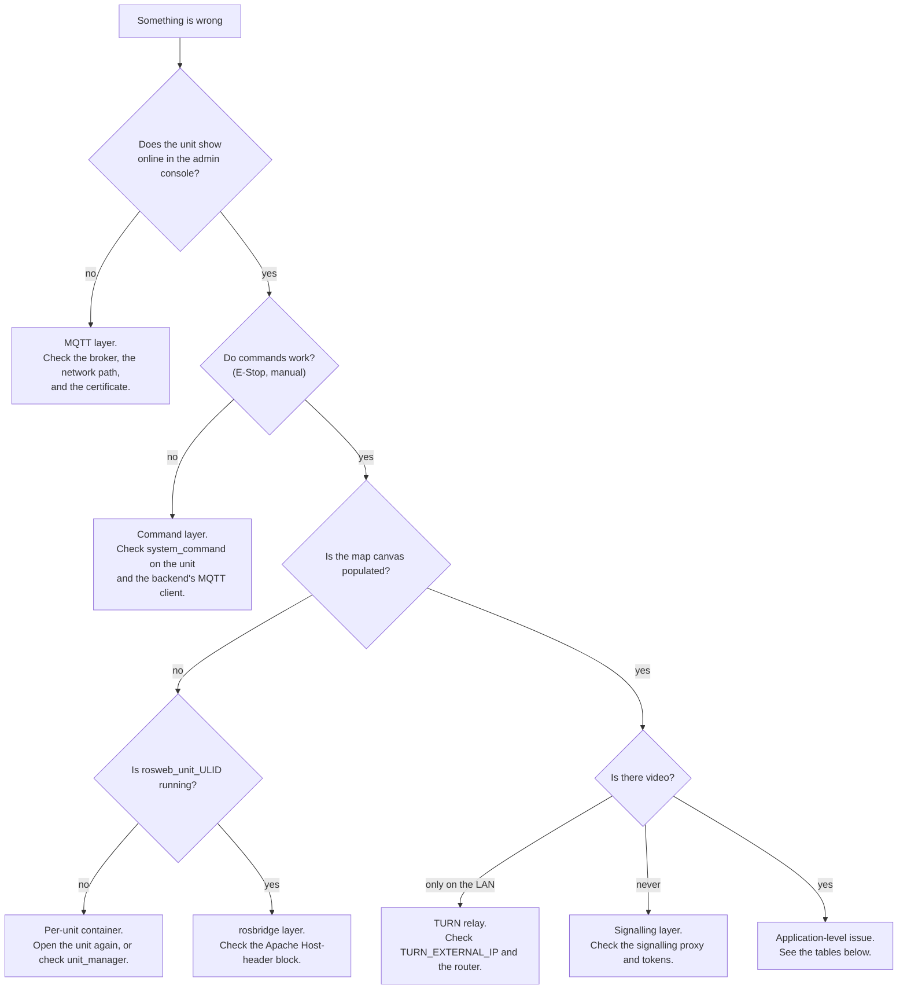

# Troubleshooting

<RoleBadge role="technician" />

Technical diagnostics for installation and deployment issues. For user-facing issues, see [Getting Started &gt; Troubleshooting](/getting-started/troubleshooting) instead.

## Start here: which layer is broken?

## Diagnostic checklist

Work through these in order: each one rules out an entire layer.

1. **Is the Server running?** `docker compose --profile server_prod ps`: every service should show
   `Up` or `healthy` ([Server Setup](/setup/server-setup#_7-verify)).
2. **Is the Unit's container running?** `./scripts/docker-manager.sh status` on the Unit.
3. **Did the Unit enrol successfully?** Check **Registered Units** in the admin console for its
   ULID, and that it shows online.
4. **Is the per-unit container running?** `docker ps --filter name=rosweb_unit_` on the Server.
5. **Is the network path open**, on the ports in
   [System Setup](/setup/system-setup#_1-confirm-the-network-path)?
6. **Check the logs**: `docker compose logs -f <service>` on the Server,
   `docker exec -it msd700 tmux attach -t robot_services` on the Unit (windows: `roscore`,
   `ros_webui`, `camera_client`, `switch_mode`, `log_janitor`).

## Common issues

| Symptom | Likely cause | Fix |
| --- | --- | --- |
| Robot starts, everything looks fine, but the dashboard shows nothing for it | The unit's ULID doesn't match what the dashboard/admin console has on record. This fails **silently**: ROS just publishes into a namespace nobody is subscribed to. | Confirm the id with `rostopic list \| grep unit_<ULID>` on the Server side, and cross-check against the admin console's Registered Units. If you ever set `UNIT_ID` by hand, make sure it's uppercase: the topic name is case-sensitive even though the ULID encoding isn't. |
| `docker: permission denied` on the Unit | Your user isn't (yet) in the `docker` group, or the group membership hasn't applied to this shell | `sudo usermod -aG docker $USER`, then log out and back in (or `newgrp docker` for the current shell) |
| RViz/Gazebo windows don't open | X11 forwarding isn't allowed from inside the container | `xhost +local:docker` on the host, before starting the container |
| `catkin_make`/`catkin build` fails inside the container | Usually a missing dependency, or `logs/` mounted over the workspace's own log directory (a uid mismatch: the host copy is owned by uid 2002, the in-container build user is 1000) | Re-run inside a shell (`./scripts/docker-manager.sh shell`) to see the real error; do not mount `logs/` over `/workspace/logs` |
| Backend fails to start with `Connection lost` right after `up` | The backend started before MySQL finished its health check, usually only visible when the workspace build was slow (cold cache) | It should retry automatically; if it doesn't, `docker compose up -d <backend service>` again once `docker compose ps` shows the DB as `healthy` |
| Profile backups fail to save | `/srv/msd/media/backup` (or `_dev`) doesn't exist yet, or isn't owned by the app's user | Bring up the one-shot permissions fixer explicitly: `docker compose up fix_perms_prod` (or `fix_perms_dev`), then check `ls -la /srv/msd/media/backup` |
| Simulator build fails at the first launch with `resource not found: gazebo_ros` | The image was built *without* `--simulator`: Gazebo isn't declared as a dependency by default, so a stock image doesn't have it | `./scripts/docker-manager.sh build --simulator`, then `up --simulator` |
| Map saving fails with a permission error, only on a dev laptop (not the real Jetson) | `USER_UID`/`USER_GID` in `docker/.env` still point at the Jetson's default (2002) instead of your own user | Set them to your own `id -u`/`id -g` |
| A container that already exists won't start cleanly | Leftover container/network state from a previous `down`/crash | `docker compose down --remove-orphans`, then bring it back up |
| Map canvas blank, but the unit is online and commands work | The per-unit container is not running, so the cloud-side relays rosbridge subscribes to do not exist | `docker ps --filter name=rosweb_unit_`. Re-open the unit in the dashboard; if it still does not appear, check `unit_manager` lines in the backend log |
| Browser console shows a rosbridge handshake failure | Apache is proxying rosbridge without the `Host` header rewrite, so rosbridge answers `missing port in HTTP Host header` | Add the `<Location /services/rosbridge>` block from [Server Setup](/setup/server-setup#the-vhost-block) |
| Every WebSocket path fails, HTTP paths are fine | `mod_proxy_wstunnel` is not enabled | `sudo a2enmod proxy_wstunnel && sudo systemctl restart apache2` |
| Camera feed works on the LAN, never from outside | The TURN relay is advertising an unreachable address, or its ports are not forwarded | Check `TURN_EXTERNAL_IP` and the router forward; see [Maintenance](/setup/maintenance#the-turn-relay) |
| The whole fleet drops offline at once with TLS errors | The HiveMQ keystore is serving an expired certificate. `certbot renew` alone does not update it | `sudo ./source/dependencies/ssl_update/update_ssl.sh`, then restart the broker in a maintenance window |
| `coturn` restarts in a loop and never binds | The apt/systemd `coturn` still holds port 3478 | `sudo systemctl disable --now coturn`, then start the container |
| Backend logs `ECONNREFUSED 127.0.0.1:1883` repeatedly | `MQTT_BROKER_TYPE` is unset or not `nakayama`, so the backend fell back to a local broker nothing serves | Set `MQTT_BROKER_TYPE=nakayama` in `.env` and recreate the backend |
| Backend logs `EACCES /var/run/docker.sock` and no unit containers appear | `DOCKER_GID` does not match this host's docker group | `getent group docker \| cut -d: -f3`, fix `.env`, recreate the backend |
| A new endpoint returns 404 on a unit whose source clearly has it | The unit's local server image is stale. Those services are **copied** into the image, not bind-mounted | `./scripts/docker-manager.sh local-build`, then `up` |
| Badge says image is out of date after editing local-mode source | Since 2026-08-13, `up` only warns (`[WARN] ... OUT OF DATE`) and keeps running the old image — it no longer rebuilds automatically, so bringing a unit online never requires internet | Rebuild deliberately: `./scripts/docker-manager.sh local-build` (or `build` for the robot image too), or `up --build` to do both and start in one command |

## Regressions worth knowing about

A couple of past incidents are worth recognizing on sight, since their symptoms don't obviously point
at their cause:

- **A unit that was working stops appearing after a code update, with a build that otherwise looks
  fine.** Check whether a `CATKIN_IGNORE` marker file accidentally got committed into a package
  that's the robot's *only* buildable copy. This has happened before (`robot_pose_publisher`) and
  silently aborts `navigation.launch` with no obvious error pointing at the real cause.
- **Navigation and mapping freeze completely, with TF errors mentioning "simulated time."** This is
  `/use_sim_time` stuck `true` on a roscore with no `/clock` publisher. Restarting the bringup alone
  does not fix it, because the stale value lives on the ROS master, not in any one node. This is a
  code-level bug, not a deployment mistake; escalate it rather than trying to work around it locally.

- **A robot that is plainly driving shows a "Robot Stuck" banner.** That has always turned out to be
  `idle_detector`'s own logic (a sticky anchor point, or a displacement threshold too large for slow
  motion), never the frontend. See
  [State and Behavior](/development/state-and-behavior#idle-and-stuck-arbitration).
- **A coverage run reports "Arrived" for an area that was obviously never swept.** A sweep that
  gives up after repeated failures still publishes `complete`. Recognise it by an `arrived` state
  next to an incomplete coverage overlay.
- **The robot continues an operation that was cancelled.** The area list is published on a **latched**
  topic, so cancelling does not clear it and the next coverage node to start picks the old areas up.
- **`skipped profile_units ...: parent row not present`, and only part of a unit's maps pull down
  (e.g. 7 of 30).** `sync_state` used to store only a timestamp watermark, not which rental profile
  it was scoped to. Re-renting a unit to a different tenant left an old watermark that silently
  filtered out rows that were new **to that profile** even though the unit had never received them.
  Fixed by also recording `last_pull_profile_id` and forcing a full re-pull whenever the handshake's
  profile disagrees with it — but any unit that already hit this needs
  `node scripts/migrate_sync.js --profile <name> --apply` before the fix takes effect. See
  [Data Sync § Watermarks are scoped to a rental profile](/development/data-sync#watermarks-are-scoped-to-a-rental-profile-not-just-a-clock).
- **Sync reports success, but rentals and every map under them never arrive.** `units` was, for a
  while, missing from the sync table registry even though `profile_units.unit_id` and
  `maps_data.unit_id` both foreign-key into it. A missing parent row was treated as ordinary skipped
  traffic — silently, with no error and no `skipped` count printed — so an entire branch of data
  could fail to sync while the round still reported `ok`. If a similarly-shaped silent gap shows up
  again, check `sync_tables.js`'s registry first, not the transport.
- **A map deleted on one side still takes up disk on the other, after its database row is already
  gone.** Tombstones used to remove only the database row; whichever side received the tombstone
  through sync (not the side that performed the original delete) never removed the `.pgm`/`.yaml`
  thumbnail files. Files that piled up before this was fixed do not clean themselves up retroactively
  and need a manual sweep.
- **A map transferred, swapped, or cleared from the cloud admin console never reaches the unit — or
  reappears after being cleared.** The admin transfer/swap/clear/restore endpoints used to write SQL
  directly instead of going through `sync_engine.js`, so they never recorded a tombstone the way an
  ordinary delete does. A clear looked, from the unit's side, exactly like nothing had happened, and
  its next push resurrected the "deleted" map in the cloud. Fixed by routing all of those through the
  same tombstone-writing path as a normal delete.
- **Never `HEX()` an id anywhere in the sync path.** `toBinary()` expects a raw `BINARY(16)` and
  rejects a 32-character hex string outright, because a ULID is 26 characters of Crockford base32,
  not 32 hex characters. `collectChanges needs a rental profile`, stuck at 15%, was exactly this: a
  profile lookup had been written with `HEX(pu.profile_id)` and every row using it failed to resolve.

If a symptom looks like one of these (plausible on the surface, but the checklist above does not
explain it), that is the signal to escalate rather than keep guessing.

## Escalation

If the checklist and the table above don't explain what you're seeing, or the issue turns out to be
a software/logic bug rather than a deployment mistake, escalate to the development team: see the
[Documentation](/development/) section, and include what step of the checklist first showed the
problem plus the relevant log output.
