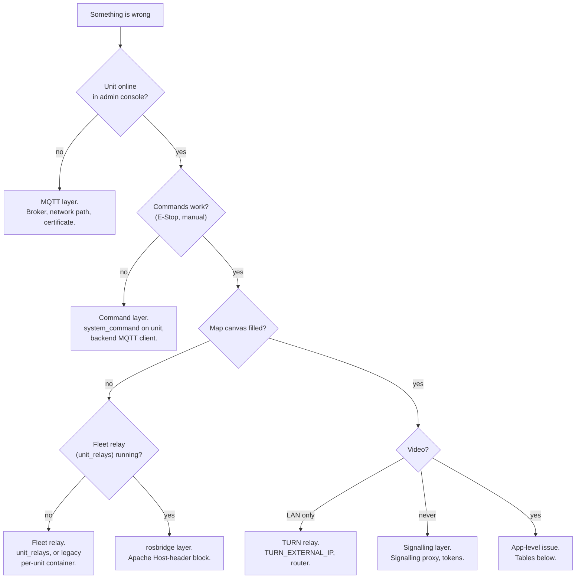

# Troubleshooting

<RoleBadge role="technician" />

Fixing installation and deployment problems. For user-facing issues, see [User Guide > Troubleshooting](/user-guide/troubleshooting) instead.

## Start here: which layer is broken?

## Diagnostic checklist

Pick the environment and machine first. The V2 checkout on the cloud server is not a physical unit; do not run robot launchers there to diagnose a Jetson. A running container alone proves nothing about its ROS nodes, MQTT bridge, or browser connection.

1. **Server stack running?** From `ros-web-ui`: `docker compose --profile server_prod ps` (or `server_dev` + `_dev` names for dev). Long-running services should be `Up`/`healthy`; `fix_perms_*` is a one-shot that normally exits `0`.
2. **Unit container running?** `./scripts/docker-manager.sh status` on the unit.
3. **Unit enrolled?** Find its ULID under **Registered Units** in the admin console, showing online.
4. **Fleet relay running?** `docker ps --filter name=unit_relays` on the server.
5. **Network path open?** Ports in [System Setup](/setup/system-setup#_1-check-the-network-path).
6. **Logs**: `docker compose logs -f <service>` on the server; `docker exec -it msd700 tmux attach -t robot_services` on the unit (windows: `roscore`, `ros_webui`, `camera_client`, `switch_mode`, `log_janitor`, `token_refresh`).

For read-only ROS checks, enter a **running** container with `docker exec` (the `shell` command can start a stopped one). Source its ROS workspace, then set the right master in every new shell: cloud prod `http://localhost:11311`, cloud dev `http://localhost:11312`, robot `http://localhost:11321`, robot `--dev` `http://localhost:11322`. `rosnode list`, `rostopic list`, and `rosparam get /use_sim_time` inspect without moving anything. Never diagnose by driving or toggling E-Stop. If traffic goes to the wrong process, check port owners with `ss -ltnp`, including accidental IDE port forwards.

::: warning Keep diagnostics secret-safe
Logs, launch output, `docker inspect`, and resolved Compose output can contain credentials. Redact passwords, tokens, device secrets, and auth headers before sharing. Use `config --quiet` / `config --services` instead of dumping full config.
:::

## Common issues

| Symptom | Likely cause | Fix |
| --- | --- | --- |
| Robot runs, dashboard shows nothing for it | Unit ULID mismatch: ROS publishes into a namespace nobody reads. Silent failure | `rostopic list \| grep unit_<ULID>` on the server side, compare with Registered Units. Hand-set `UNIT_ID` must be uppercase (topic names are case-sensitive) |
| `docker: permission denied` on unit | User not in `docker` group yet | `sudo usermod -aG docker $USER`, log out/in (or `newgrp docker` for this shell) |
| RViz/Gazebo windows won't open | X11 not allowed from container | `xhost +local:docker` on the host first |
| `catkin build` fails in container | Missing dependency, or duplicate `robot_pose_publisher` (vendored in ros-web-ui + submodule in msd700_robot) | Open a shell (`docker-manager.sh shell`) for the real error; check for a stray `CATKIN_IGNORE` |
| Backend `Connection lost` right after `up` | Backend raced MySQL before its healthcheck passed | `up -d <backend service>` again once `ps` shows the DB `healthy` |
| Profile backups fail to save | `/srv/msd/media/backup` (or `_dev`) missing or not writable by the app user | Run the permissions fixer: `docker compose --profile server_prod up fix_perms_prod` (or dev equivalent) |
| Simulator build fails with `resource not found: gazebo_ros` | Image built without `--simulator` | `docker-manager.sh build --simulator`, then `up --simulator` |
| Map save permission error, dev laptop only | `USER_UID`/`USER_GID` in `docker/.env` still point at the Jetson default | Set them to your own `id -u` / `id -g` (auto-detect only works when empty) |
| Old container won't start cleanly | Leftover state from a previous run | `down --remove-orphans` from that Compose file, then `up` again |
| Map blank, unit online, commands work | Fleet relay missing/unregistered, or downstream map/rosbridge issue | Check the `unit_relays[_dev]` container and its logs. Compose must create a missing relay; the manager only restarts existing ones. Do not start prod to fix dev. Legacy mode: matching `rosweb_unit_*` suffix instead |
| rosbridge handshake failure in browser console | Apache proxies rosbridge without the `Host` header rewrite | Add the `<Location /services/rosbridge>` block from [Server Setup](/setup/server-setup) |
| All WebSocket paths fail, HTTP fine | `mod_proxy_wstunnel` off | `sudo a2enmod proxy_wstunnel && sudo systemctl restart apache2` |
| Camera on LAN only, never outside | TURN advertises an unreachable address, or ports not forwarded | Check `TURN_EXTERNAL_IP` + router forward ([Maintenance](/setup/maintenance#the-turn-relay)) |
| Whole fleet offline at once, TLS errors | HiveMQ serves an expired certificate (`certbot renew` alone never updates it) | `sudo ./source/dependencies/ssl_update/update_ssl.sh`, restart broker in a maintenance window |
| `coturn` loops and never binds | apt/systemd `coturn` still holds port 3478 | `sudo systemctl disable --now coturn`, start the container |
| Backend logs `ECONNREFUSED 127.0.0.1:1883` | Old launch or override pointed MQTT at loopback; current server default is `nakayama` | Fix that service's config, recreate it scoped. (On a unit, `backend_local` intentionally uses loopback: check `mosquitto_local`) |
| Backend logs `EACCES /var/run/docker.sock` | `DOCKER_GID` mismatches the host's docker group | `getent group docker \| cut -d: -f3`, fix `.env`, recreate backend |
| New endpoint 404s on a unit that has it in source | Stale local server image (source is **copied** in, not bind-mounted) | `./scripts/docker-manager.sh local-build`, then `up` |
| Launcher warns a local image is out of date | Plain `up` reuses stale images by design | Rebuild with `local-build`, `build`, or `up --build`; a running robot keeps its old image until recreated |

## Known past bugs (recognize, then escalate)

These look like deployment mistakes but are code bugs. If the checklist above does not explain the symptom and it matches one of these, escalate to developers instead of guessing further:

- Unit worked, then vanished after a code update with a clean-looking build: a stray `CATKIN_IGNORE` in the only buildable copy of a package (happened with `robot_pose_publisher`).
- Navigation/mapping frozen with TF "simulated time" errors: `/use_sim_time` stuck `true` on a roscore with no `/clock` publisher. Restarting bringup alone never fixes it; the stale value lives on the ROS master.
- Dev unit logs its broker as `msd.nglobal.jp`: normal. Dev and prod share one machine, split by port (`8884` dev), and the TLS certificate names that host. Read the port.
- Dev/sim unit reboots as hardware-on-production: old `msd700.service` dropped the mode flags. Check `grep ExecStart /etc/systemd/system/msd700.service` and re-run `up` with the wanted flags.
- Map slow to appear from Database, or previous session's room flashes first: map-on-demand pieces missing on one half. Check `/unit_<ULID>/string/map_request` on the cloud side and `Map resend requested` in the robot's `map_compression_node` log.
- Coverage reports "Arrived" for a never-swept area, or WASD during coverage breaks the run: coverage-state bugs. Confirm in `path_coverage` logs, then escalate.
- Simulator geometry complaints that never reproduce: old sim used a small TurtleBot3 body in small worlds. Use `msd700_simulation msd700_warehouse_nav.launch` (real-size body, 14 x 21 m hall).
- Sync success but data missing, or maps reappearing after delete: sync-engine edge cases (watermark scope, tombstones, registry gaps). Check the sync status endpoint and escalate with logs.

## Escalation

If the checklist and tables do not explain it, or it smells like a software bug, escalate to developers: say which checklist step first failed, and attach the relevant (redacted) logs.
