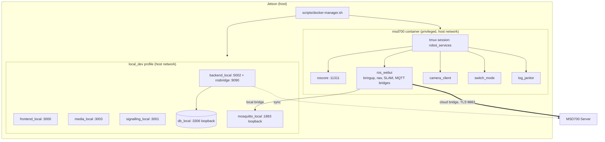
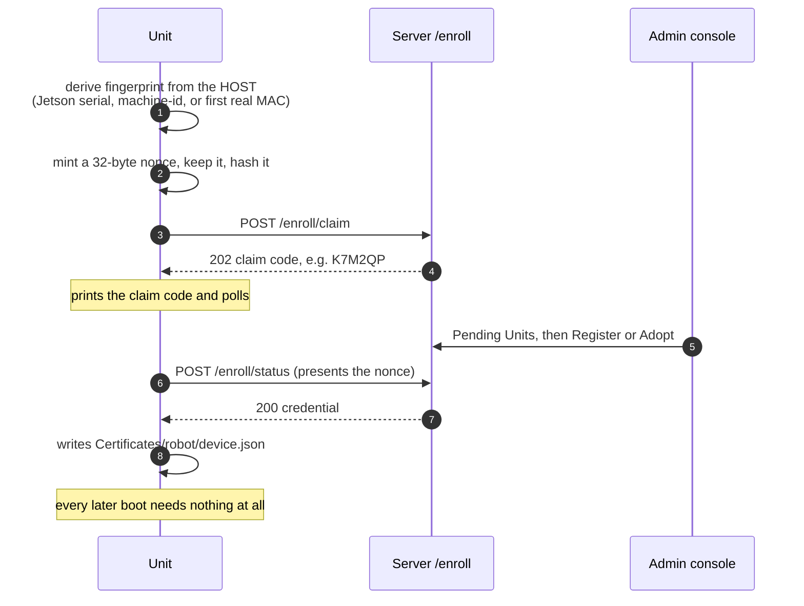

# Unit Setup

<RoleBadge role="technician" />

How to install and configure an **MSD700 Unit**, the physical robot. Complete
[Prerequisites](/setup/prerequisites) first, and have a running Server to enrol against (see
[Server Setup](/setup/server-setup)). Every flag used below is explained in full in
[Docker Reference](/setup/docker-reference#unit-docker-manager-sh).

::: info The short version
Clone the workspace, run one setup script, run one build, run one `up`. The robot enrols itself the
first time it starts; you do not type an id anywhere. Everything past this box is what those four
steps actually do, for when something does not go as expected.
:::

## What a Unit runs



Both MQTT bridges run unconditionally. A unit is simultaneously drivable from its own IP on the LAN
and from the cloud dashboard, and one lease on the robot arbitrates between them.

## 1. Clone the workspace

The robot's software lives across three repositories, wired together as one workspace by
`msd700_noetic`:

```bash
git clone --recursive https://github.com/itbdelaboprogramming/msd700_noetic.git
cd msd700_noetic
```

If you already cloned without `--recursive`:

```bash
git submodule update --init --recursive
```

::: info Why three repos and not one
`msd700_noetic/src/` holds `msd700_robot` (the ROS packages: navigation, mapping, hardware drivers),
`ros-web-ui` (the web-facing packages: MQTT bridge, camera streaming, the launch files that tie it
together), and `ROS-dashboard-next-ts` (the dashboard this unit serves on its own IP). They are
separate repositories because `ros-web-ui` and the dashboard are **shared with the Server side**: a
Unit and a Server both build from the same `ros-web-ui` source, just launched differently.
:::

## 2. One-time host setup

```bash
./setup.sh
```

This installs Docker if it is missing, adds your user to the `docker` group, installs `xhost`
(needed for GUI tools like RViz), and makes the project's scripts executable.

```bash
./setup.sh --check    # re-run the checks without installing anything
```

::: warning Log out and back in after the first run
If the script just added you to the `docker` group, group membership does not apply to your current
shell. Log out and back in, or run `newgrp docker` for this shell only.
:::

## 3. Review `docker/.env`

`docker-manager.sh` creates this from `docker/.env.example` on first run and generates this unit's
own random, loopback-only MySQL credentials by itself. There are only a handful of keys worth
reviewing:

```bash
# Maps folder on the host, shared with the msd700 container.
# Must match MAPS_FOLDER on the Server side.
MAPS_FOLDER_LOCAL=/home/ubuntu/ros_maps

# In-container user id, used by BOTH the robot image and the local Node services.
# Leave empty to detect from `id -u` / `id -g` (Jetson 2002, dev laptop 1000).
USER_UID=
USER_GID=

# Add the Gazebo stack to the robot image so --simulator works.
# Only for machines with no MSD700 attached: it costs over a GB, and changing it
# needs a rebuild.
WITH_SIMULATOR=false

# The IP an operator's browser uses to reach this unit. Baked into frontend_local's
# JS bundle at BUILD time, so changing it needs a rebuild, not a restart.
# Leave commented out to let docker-manager.sh detect the current address each run.
#LOCAL_IP=192.168.4.1

# Local ports. Browser-facing ones must be allowed by the unit's firewall;
# MySQL and MQTT are bound to 127.0.0.1 and need no rule.
FRONTEND_PORT_LOCAL=3000
BACKEND_PORT_LOCAL=5002
ROSBRIDGE_PORT_LOCAL=9090
MEDIA_SERVER_PORT_LOCAL=3003
SIGNALLING_PORT_WS_LOCAL=3001
MYSQL_PORT_LOCAL=3306
MOSQUITTO_PORT_LOCAL=1883

# Leave EMPTY. Unit identity comes from cloud enrolment; see step 5.
UNIT_ID=
```

::: warning `MYSQL_PASSWORD` is generated once, and only once
`docker-manager.sh` generates real credentials on first run and then never touches them again. The
one case it refuses to auto-fix: the placeholder `changeme` is still in `.env` **and**
`mysql_data_local/` is already populated. That means an earlier run initialised the database with
the placeholder baked into its data directory, and generating a new password would just make
`backend_local` unable to log in forever. The fix is deliberate: rotate MySQL's actual password, or
wipe `mysql_data_local/` to re-initialise (which destroys only this unit's local map cache, since it
re-syncs from the cloud).
:::

## 4. Build the Docker image

```bash
./scripts/docker-manager.sh build              # standard robot image, msd700:latest
./scripts/docker-manager.sh build --simulator  # Gazebo image, msd700-simulator:latest
./scripts/docker-manager.sh build-clean        # same, with --no-cache
```

::: info Why Docker instead of installing ROS on the Jetson directly
ROS Noetic only ships packages for Ubuntu 20.04, and this project targets Ubuntu 22/24 hosts (the
Jetson's own OS, and most developers' laptops). Docker sidesteps the mismatch entirely: the same
image runs identically everywhere, so "it built for me but not for you" is not a category of bug you
have to debug.
:::

## 5. Bring the robot up

```bash
# Real hardware, production cloud:
./scripts/docker-manager.sh up

# Same, but detached: the terminal is handed back once everything is running.
./scripts/docker-manager.sh up -d

# Gazebo simulator instead of real sensors:
./scripts/docker-manager.sh up --simulator

# Enrol against the DEV server instead of production:
./scripts/docker-manager.sh up --dev
```

| Flag | Effect |
| --- | --- |
| `--simulator`, `-s` | Use the Gazebo image and container, and boot in simulator mode |
| `--dev` | Which **cloud** is this unit's peer: dev instead of production. Moves MQTT to 8884, the ROS master to 11312, and enrolment to the dev backend. The unit's own service ports do not shift |
| `-d`, `--detach` | Return to the shell once every service is up |
| `--build` | Rebuild the image before starting |
| `--debug` | Verbose output. Type it in full: `-d` is the detach flag here |
| `--dry-run` | Print what would run without running it |

::: warning `up` holds your terminal by default
Ctrl-C stops everything, which matters on a flaky SSH session. Use `up -d` to let it detach once
services are confirmed running. Start-up itself still runs in the foreground either way, so the
build, the claim code and any failure are all on screen, and Ctrl-C **before** that point still
aborts and cleans up.
:::

### The unit enrols itself

The first `up` on a fresh unit enrols automatically. There is no id to type. Watch the terminal: it
prints a short **claim code**, then polls.



In the admin console on the Server:

1. Open the **Pending Units** tab. The claim code should appear within a few seconds.
2. Click **Register** for a brand-new unit, or **Adopt** to put this hardware onto an existing
   unit's ULID (hardware swap, or a unit whose cached identity was lost).

Once approved, the robot picks up its identity and finishes booting. No restart is required. From
then on every boot reads `ros-web-ui/Certificates/robot/device.json` and needs no approval, with or
without internet.

::: info Why a human approves it, instead of the robot picking an id
This is the one place a wrong guess would be dangerous rather than merely inconvenient: a fabricated
id lets *anything* claiming that id command a real robot. Requiring a human to approve a specific
claim code once is the cheapest check that closes that door without asking a technician to manage
credentials by hand on every boot. The nonce closes the other half: a fingerprint is not a secret,
so without it, approving a unit while its robot is switched off would leave a credential that anyone
able to spoof a MAC could collect first.
:::

::: danger `--unit_id` is rejected, not ignored
Typing it produces an error and exits. Identity is assigned entirely through the cloud admin console
now. If you have lost a unit's cached identity, use **Adopt** on its claim code rather than pinning
the id on the command line: that is exactly the recovery path this flag used to cover.
:::

### Useful environment overrides

| Variable | Default | When you need it |
| --- | --- | --- |
| `DEV_SERVER_HOST` | `118.22.31.252` | `--dev` against a different host, or `localhost` when running on it |
| `DEV_BACKEND_PORT` | `5001` | Non-standard dev backend port |
| `CLOUD_BASE_URL` | derived | Point a whole fleet at a different cloud without a code change |
| `ENROLL_CODE` | unset | Single-use voucher for a unit registered before its robot existed. Skips the pending pool |
| `DEVICE_FINGERPRINT` | derived from the host | Set explicitly to run more than one **simulated** robot on one machine, which would otherwise share a fingerprint and therefore one pending row |
| `ROS_LOG_CAP_MB` | `512` | Raise only when chasing something in `rosout.log`, with the disk budget for it |

```bash
DEV_SERVER_HOST=localhost ./scripts/docker-manager.sh up --simulator --dev
ENROLL_CODE=7KQ2M9 ./scripts/docker-manager.sh up
```

## 6. The unit's own dashboard (always on)

`up` also starts this unit's **entire own server stack**, listening on the unit's own IP, in
addition to talking to the cloud. This is not a mode you opt into.

| Service | Port | Reachable from |
| --- | --- | --- |
| Dashboard (Next.js) | `3000` | the LAN |
| Backend API | `5002` | the LAN |
| rosbridge | `9090` | the LAN |
| Media server | `3003` | the LAN |
| WebRTC signalling | `3001` (WS), `3002` (HTTP) | the LAN |
| MySQL | `3306` | `127.0.0.1` only |
| MQTT (Mosquitto) | `1883` | `127.0.0.1` only |

Open `http://<unit-ip>:3000` to reach it directly.

Every local service uses **host networking**, so Docker publishes nothing and what matters is the
unit's own firewall:

```bash
sudo ufw allow 3000/tcp   # dashboard
sudo ufw allow 5002/tcp   # backend API
sudo ufw allow 9090/tcp   # rosbridge
sudo ufw allow 3003/tcp   # media
sudo ufw allow 3001/tcp   # signalling WS
sudo ufw allow 3002/tcp   # signalling HTTP
# MySQL (3306) and Mosquitto (1883) are bound to loopback: no rule needed.
```

::: info Why a robot needs its own dashboard at all
Local is a **cache of the cloud**, not a silo. The unit keeps working with no internet: you can
drive it from its own IP with zero cloud dependency. But its *identity and accounts* still come from
the cloud enrolment in step 5. A unit that has never enrolled cannot start even locally; one that has
enrolled works from its cached identity regardless of the network. The cloud MQTT link also stays up
alongside the local one, so the unit remains visible on the cloud dashboard even while someone drives
it from the local one.
:::

::: warning A cloud-signed token is rejected by unit-local services
That is deliberate, and it is why `camera_client` fetches a credential from `/local/robot-token`
rather than reusing `token.cred`. If local-mode video never appears, this is the first thing to
check. See [Architecture](/development/architecture#trust-domains).
:::

### Managing the local stack on its own

```bash
./scripts/docker-manager.sh local-up      # start only the server stack, no robot bringup
./scripts/docker-manager.sh local-down    # stop only the server stack
./scripts/docker-manager.sh local-build   # force a rebuild of the local images
./scripts/docker-manager.sh local-logs    # tail its logs
./scripts/docker-manager.sh local-status  # compose ps for it
```

## 7. Verify

```bash
./scripts/docker-manager.sh status                   # container up?
./scripts/docker-manager.sh shell                    # shell inside the container
```

Inside the container:

```bash
rostopic list | grep unit_        # should show /unit_<ULID>/... topics
rosnode list                      # bringup nodes running
rostopic echo -n1 /robot_pose     # the robot knows where it is
```

Watching the individual services:

```bash
docker exec -it msd700 tmux attach -t robot_services
# Ctrl-b then d to detach without stopping anything.
# Windows: roscore, ros_webui, camera_client, switch_mode, log_janitor
```

From the Server side, check the admin console's **Registered Units** list: the unit you just
approved should show as online. See [System Setup](/setup/system-setup) for the full end-to-end
check.

## Stopping and restarting

```bash
./scripts/docker-manager.sh down     # stops the container AND this unit's local stack
./scripts/docker-manager.sh logs     # follow the container's logs
```

## Running it as a service

`up -d` is the form that belongs in a systemd unit, because start-up failures still surface and the
robot survives the terminal closing:

```ini
# /etc/systemd/system/msd700.service
[Unit]
Description=MSD700 robot stack
Requires=docker.service
After=docker.service network-online.target

[Service]
Type=oneshot
RemainAfterExit=yes
User=itbdelabo
WorkingDirectory=/home/itbdelabo/msd700_noetic
ExecStart=/home/itbdelabo/msd700_noetic/scripts/docker-manager.sh up -d
ExecStop=/home/itbdelabo/msd700_noetic/scripts/docker-manager.sh down
TimeoutStartSec=900

[Install]
WantedBy=multi-user.target
```

```bash
sudo systemctl daemon-reload
sudo systemctl enable --now msd700
```

`TimeoutStartSec` is generous on purpose: a cold `catkin_make` on a Jetson is slow, and the first run
of a never-enrolled unit waits for a human to approve its claim code.

## Next step

Continue to [System Setup](/setup/system-setup) to confirm Server and Unit are fully connected.

If something goes wrong, see [Troubleshooting](/setup/troubleshooting), and
[Docker Reference](/setup/docker-reference) for anything about the commands themselves.
