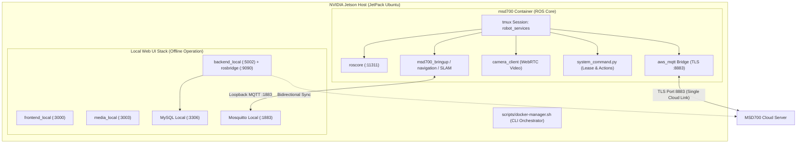

# Unit Setup

<RoleBadge role="technician" />

This guide provides step-by-step instructions for installing and configuring an **MSD700 Unit** (the physical robot running on an NVIDIA Jetson single-board computer).

Ensure that a running [MSD700 Server](/setup/server-setup) exists before proceeding.

::: info Production-First Architecture
This guide defaults to deploying a real hardware robot connecting to the **Production Cloud**. Simulation options (`--simulator`) and development cloud routing (`--dev`) are in the [Advanced Configurations](#advanced-configurations) section.
:::

## System Topology



## Directory Structure Overview

The Jetson workspace manages robot packages, web bridges, and onboard web UI as submodules:

```
~/msd700_noetic/                              # Main Jetson Orchestration Workspace
├── setup.sh                                  # Host Dependency Installer (Docker, xhost)
├── scripts/
│   └── docker-manager.sh                     # Core Lifecycle CLI (build, up, down, logs)
├── docker/
│   ├── Dockerfile                            # ROS 1 Noetic Desktop Full Container
│   ├── docker-compose.yml                    # Robot Container Definition
│   └── .env                                  # Local Environment Variables
└── src/                                      # Catkin Workspace Submodules
    ├── msd700_robot/                         # Navigation, EKF Control, Hardware Drivers
    ├── ros-web-ui/                           # Web Bridges, MQTT nodes, System Command
    └── ROS-dashboard-next-ts/                # Local Operator Web Dashboard
```

---

## Core Step-by-Step Setup

Follow these 5 steps in sequence to set up the physical robot.

### Step 1: Clone Workspace with Submodules

Clone `msd700_noetic` with `--recursive` so all submodules in `src/` are populated automatically:

```bash
git clone --recursive https://github.com/itbdelaboprogramming/msd700_noetic.git ~/msd700_noetic
cd ~/msd700_noetic
```

::: tip Cloned without `--recursive`?
If you already cloned without submodules, run:
```bash
git submodule update --init --recursive
```
:::

---

### Step 2: One-Time Host Setup

Run the host setup script to configure Docker group permissions and graphics forwarding:

```bash
cd ~/msd700_noetic
./setup.sh
```

::: warning Apply Group Permissions
If the script added your user to the `docker` group, log out and back in, or run:
```bash
newgrp docker
```
:::

---

### Step 3: Configure Environment (`docker/.env`)

Generate and review the local environment file:

```bash
cd ~/msd700_noetic
cp docker/.env.example docker/.env
nano docker/.env
```

Key environment settings:

```ini
# Storage path for map occupancy grids on the Jetson
MAPS_FOLDER_LOCAL=/home/ubuntu/ros_maps

# Cloud Server Hostname for MQTT and Sync
NAKAYAMA_HOST=msd.nglobal.jp
CLOUD_BASE_URL=https://msd.nglobal.jp/services

# Local Ports (Default settings)
FRONTEND_PORT_LOCAL=3000
BACKEND_PORT_LOCAL=5002
ROSBRIDGE_PORT_LOCAL=9090
MEDIA_SERVER_PORT_LOCAL=3003
SIGNALLING_PORT_WS_LOCAL=3001
MYSQL_PORT_LOCAL=3306

# Leave UNIT_ID empty; assigned automatically during enrolment
UNIT_ID=
```

---

### Step 4: Build Robot Docker Image

Build the ROS Noetic robot runtime container:

```bash
cd ~/msd700_noetic
./scripts/docker-manager.sh build
```

This builds the `msd700:latest` image containing ROS Noetic, navigation stacks, sensor drivers, and web bridges.

---

### Step 5: Start Robot and Complete Enrolment

Launch the robot stack in detached mode:

```bash
cd ~/msd700_noetic
./scripts/docker-manager.sh up -d
```

#### Automated Enrolment Flow:
1. On its very first launch, the robot contacts the cloud server and outputs a 6-character **Claim Code** (e.g. `K7M2QP`).
2. An administrator opens `https://msd.nglobal.jp/admin` and logs in.
3. Under **Pending Units**, locate the matching claim code, assign the unit to an active **Rental Profile**, and click **Approve**.
4. The robot receives its cryptographically signed credentials (`Certificates/robot/device.json`), binds to HiveMQ over TLS port 8883, and appears live on the fleet map.

---

## Operating the Unit Locally (Offline Mode)

When the robot operates in locations without internet connectivity, connect your laptop or tablet directly to the robot's local network (or robot Wi-Fi hotspot):

1. Open your browser and navigate to: `http://<jetson-ip>:3000`.
2. The local dashboard allows full teleoperation, SLAM mapping, route creation, and area coverage sweeps.
3. When internet connectivity is restored, all locally recorded maps automatically synchronize back to the central cloud server.

---

## Advanced Configurations

<details>
<summary><b>Simulation Mode (Gazebo Warehouse)</b></summary>

To test algorithms on a laptop without physical robot hardware:

1. Build the simulator-enabled image:
   ```bash
   ./scripts/docker-manager.sh build --simulator
   ```

2. Start the simulation stack:
   ```bash
   ./scripts/docker-manager.sh up --simulator -d
   ```

</details>

<details>
<summary><b>Development Cloud Routing (`--dev`)</b></summary>

To point the unit at a development cloud server instead of production:

```bash
./scripts/docker-manager.sh up --dev -d
```

This connects MQTT to dev port `8884` and synchronizes with the development database.

</details>

<details>
<summary><b>Host Networking Fixes for Non-Ubuntu/Arch Laptops</b></summary>

If running on Arch Linux or non-standard distributions:

1. **Hostname Resolution**:
   ```bash
   grep "$(hostname)" /etc/hosts || echo "127.0.0.1 $(hostname)" | sudo tee -a /etc/hosts
   ```

2. **Disable IPv6 Loopback Mapping**:
   ```bash
   sudo sed -i 's/^::1[[:space:]].*/::1 ip6-localhost ip6-loopback/' /etc/hosts
   ```

3. **Create Shared Maps Directory**:
   ```bash
   sudo mkdir -p /home/ubuntu/ros_maps
   sudo chown -R $(id -u):$(id -g) /home/ubuntu/ros_maps
   ```

</details>

---

## Verification & Diagnostics

Use these diagnostic commands to verify robot health:

```bash
# 1. View overall container and service status
./scripts/docker-manager.sh status

# 2. Attach to the ROS tmux session inside the container
./scripts/docker-manager.sh shell
tmux attach -t robot_services

# 3. View real-time container logs
./scripts/docker-manager.sh logs -f
```

## Related Documentation

- [Server Setup](/setup/server-setup): Cloud backend installation.
- [System Setup](/setup/system-setup): Sensor calibration and verification.
- [Docker Reference](/setup/docker-reference): Comprehensive CLI syntax reference.
