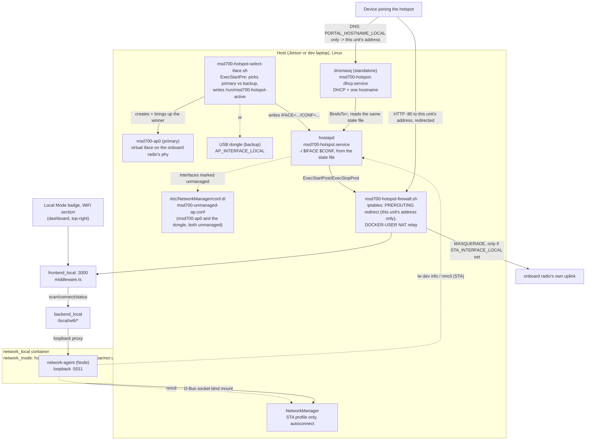

# WiFi Hotspot + Client

<RoleBadge role="technician" />

A standard part of every unit's local-mode setup ([Unit Setup](/setup/unit-setup) Step 6): the Unit
runs its own WiFi hotspot for an operator to join, reachable at `http://mymsd.jp`, and keeps a
normal WiFi **client** connection to another network for internet/cloud-sync fallback, on the very
same radio when the hardware supports it. At every hotspot start,
`msd700-hotspot-select-iface.sh` picks between two paths:

- **Primary**: a virtual AP interface (`msd700-ap0`) created on the onboard radio's own phy,
  alongside its normal client (STA) connection. MediaTek MT7922-class cards support this
  concurrent STA+AP mode on one physical radio, see [MT7922 Wi-Fi Setup](/setup/wifi-mt7922).
- **Backup**: a USB WiFi dongle, brought up automatically whenever the primary path isn't
  available this boot (a different onboard card, a driver regression, no combo support). Not
  required at all on hardware where the primary path works.

Both radios' state is shown on the [Local Mode badge](/development/data-sync#the-local-mode-badge),
the same badge, the same dropdown, and an operator can connect to a different network from there.

A unit that never runs the provisioning step below still works otherwise exactly as
[Unit Setup](/setup/unit-setup) describes; the badge just reports "no hotspot radio" and nothing
else is affected.

## Setup flow

Follow this order on a fresh unit, most units only need steps 2 and 3:

1. **Bring up the onboard radio first, it's the primary path.** If it's a MediaTek MT7922, fix its
   firmware, see [MT7922 Wi-Fi Setup](/setup/wifi-mt7922): on Tegra kernels the card can report a
   firmware-not-found error and never show up to NetworkManager at all, which silently sends the
   hotspot to the dongle backup below instead of the concurrent onboard path it's meant to use. If
   the onboard radio already shows up fine (`nmcli device status`), there is nothing to fix here.
2. [Provision the hotspot](#provisioning-the-hotspot-once-per-unit)
   (`./setup.sh --provision-network`). Its own preflight checks the onboard radio and warns if it
   can't run the primary path, falling back to a dongle automatically if one is configured.
3. [Verify it works](#verifying-it-works).
4. **(Optional) [Install a backup dongle driver](#installing-the-dongle-driver)**, only if step 2's
   preflight reported the onboard radio can't run the primary path, or as deliberate redundancy.
   Not needed at all on hardware where the primary path already works.

Only step 2 is interactive and unit-specific (SSID, password); the others are one-time hardware
bring-up, redone only if the hardware itself changes.

## Primary radio vs. backup dongle

MediaTek MT7922-class cards can run as a WiFi client (STA) and broadcast an access point (AP) at
the same time, on the same physical radio: `msd700-hotspot-select-iface.sh` creates a virtual
interface (`msd700-ap0`) on the same phy as the STA interface at every hotspot start, virtual
interfaces don't survive a reboot, so it can't just be created once. `iw phy <phy> info`'s "valid
interface combinations" reporting `{ managed, AP } <= 2` on this hardware is what confirms the
driver actually supports it, `--provision-network` checks exactly this at provisioning time.

::: warning Older or swapped hardware falls back automatically, but isn't silent about it
This project's earlier onboard radio, a Realtek RTL8822CE, is **one physical radio** that can be a
client *or* an AP, never both at once, this is the hardware, not a driver limitation: `iw phy` shows
exactly one `phy`, and one radio can only be tuned to one channel at a time. `setup.sh
--provision-network`'s preflight warns loudly the moment it sees this, rather than leaving it to be
discovered later as "why is the hotspot always on the dongle?".
:::

| Path | When it's used | Feasibility |
| --- | --- | --- |
| **Primary**: virtual AP on the onboard radio | Every hotspot start, whenever the onboard radio (`STA_INTERFACE_LOCAL`) reports a supporting interface combination | High confidence on MT7922-class hardware, validated on this project. Nothing to plug in. |
| **Backup**: USB dongle (`AP_INTERFACE_LOCAL`) | Automatically, only when the primary path isn't available this boot (card missing, driver/firmware broken, no combo support, or an RTL8822CE-class radio) | High confidence, no chipset risk, AP and client live on two physically separate radios so there is no "concurrent mode" question at all. Requires a dongle plugged in with its driver installed, see [Installing the dongle driver](#installing-the-dongle-driver). |

::: info Windows doing both at once is not proof any given Linux driver will
A laptop running Microsoft's Mobile Hotspot feature alongside a normal WiFi connection uses a
completely different driver stack (a virtual WiFi adapter Windows manages itself) from Linux's
`mac80211`/`nl80211` concurrent-AP-and-managed combination. It is a reasonable hint the *hardware*
is not fundamentally incapable of it, but it says nothing about a specific Linux driver's own
interface combinations. Verify with `iw phy <phy> info` on the actual host, exactly what
`--provision-network`'s preflight already does automatically.
:::

**Backup dongle hardware validated on this project**: TP-Link TL-WN722N v2/v3, Realtek
**RTL8188EUS** chipset (USB ID `2357:010c`). Any RTL8188EUS-based dongle should work with the same
driver, see `KNOWN_IDS` in `scripts/install-wifi-dongle-driver.sh` for other USB IDs of the same
chipset. No driver for this chipset ships with the Jetson's kernel out of the box (neither the
in-tree `rtl8xxxu` nor an out-of-tree module), it has to be built from source via DKMS, see
[Installing the dongle driver](#installing-the-dongle-driver) below.

## How it is wired together



The hotspot's existence does **not** depend on Docker. `hostapd` and `dnsmasq` run as their own
systemd services, brought up at boot and independent of `docker-manager.sh` ever having run, the
same way a wired Ethernet cable "just works". `network_local` only serves live status/scan for the
badge and carries out an operator's explicit "connect to a different network" request (client side
only); provisioning the hotspot itself is a separate, one-time step (below).

### Why hostapd, not NetworkManager's own AP mode

NetworkManager can create AP-mode connections itself (`nmcli connection add ... 802-11-wireless.mode
ap`), driven internally by `wpa_supplicant`. That was the original design here, but on the
RTL8188EUS dongle it **hangs every time**: NM's activation always failed after roughly 25 seconds
with `"Hotspot network creation took too long"` / `reason 'supplicant-timeout'`.

Diagnosed by running `hostapd -dd` directly against the same interface: the AP came up in under a
second (`AP-ENABLED`), fully functional. The driver does support AP mode, but its
`NL80211_CMD_START_AP` completion event arrives out of the order `wpa_supplicant`'s internal AP code
expects (visible in the hostapd debug log as `Ignored unknown event (cmd=15)`, logged *after* the AP
had already started through other means). `wpa_supplicant`'s softAP path apparently waits on that
event; `hostapd` doesn't block on it and just proceeds.

The fix: run `hostapd` directly as its own systemd service, and tell NetworkManager to leave the
interface alone entirely (`unmanaged-devices` in a `conf.d` drop-in) so the two never fight over it.
The STA side (an upstream network to join as a client) has no such problem and still goes through a
normal NM connection profile.

### Components

| Component | What it does | Lifecycle |
| --- | --- | --- |
| `msd700-hotspot-select-iface.sh` | `ExecStartPre`: creates/brings up the primary virtual AP (`msd700-ap0`) if the onboard radio supports it, else brings up the backup dongle interface; writes the winner (`IFACE`, `CONF`) to `/run/msd700-hotspot-active` | Run by `msd700-hotspot.service`'s `ExecStartPre`, every start (virtual interfaces don't survive reboot) |
| `msd700-hotspot.service` | Assigns the static IP `192.168.4.1/24` to whichever interface won, runs `hostapd -i $IFACE $CONF`, calls `msd700-hotspot-firewall.sh apply`/`teardown` | systemd, enabled at boot, `Restart=on-failure` |
| `msd700-hotspot-firewall.sh` | HTTP redirect to the dashboard, scoped to port 80 aimed at this unit's own address only (not a captive portal, other port-80 traffic passes straight through) plus internet-relay NAT (`DOCKER-USER` chain, only when `STA_INTERFACE_LOCAL` is set) | Called from the service above's `ExecStartPost`/`ExecStopPost`, idempotent (check-then-act) |
| `msd700-hotspot-dhcp.service` | Runs a dedicated `dnsmasq` instance against whichever interface is active: DHCP server (`192.168.4.10`-`192.168.4.200`) + resolves `PORTAL_HOSTNAME_LOCAL` to this unit's address | systemd, `BindsTo=msd700-hotspot.service` |
| `/etc/hostapd/hostapd-msd700-primary.conf` / `-backup.conf` | Same SSID/password rendered twice, once per interface, so clients see one identity regardless of which radio actually answers | Rendered by `--provision-network`, `chmod 0600` |
| `/etc/NetworkManager/conf.d/msd700-unmanaged-ap.conf` | Tells NM to never touch `msd700-ap0` or the dongle's interface | Read by NetworkManager on restart |
| `/etc/polkit-1/rules.d/50-msd700-network-manager.rules` | Grants `org.freedesktop.NetworkManager.*` actions unconditionally, so `network_local`'s `nmcli` calls (scan, connect, forget) work without an interactive polkit prompt the container can never answer | Read by `polkit` on restart |
| NM connection profile (onboard radio only) | Normal client connection to the operator's WiFi | Managed by NetworkManager as usual, `autoconnect: yes` |

Both hotspot-side systemd services `Restart=on-failure`, so losing and regaining the active
interface, unplugging and replugging the backup dongle, or the onboard radio's driver recovering
from a fault, brings the hotspot back on its own without manual intervention.

::: info Why `network_local` is not `privileged: true`
`network_local` needs a few distinct things, none of them the broad grant `msd700` already uses
(`privileged: true` + host network, see [Docker Reference](/setup/docker-reference#network-mode-host)).
A bind-mounted D-Bus socket is what lets `nmcli` control the **host's own** NetworkManager daemon for
the STA side; the client itself never touches a network interface directly. `cap_add: [NET_ADMIN]`
plus `network_mode: host` is what the AP-status read (`iw dev <iface> info`) needs, since the AP
interface lives in the host's network namespace. `security_opt: apparmor:unconfined` is the
non-obvious one: Docker's default apparmor profile denies D-Bus method calls from inside the
container even with the socket bind-mounted and `NET_ADMIN` granted, `nmcli`'s initial `Hello()` to
the bus gets an `AccessDenied` before NetworkManager's own D-Bus policy is ever consulted. The
container's only job is talking to the host's NetworkManager over that bus, so it runs unconfined
rather than fighting the default profile rule by rule.
:::

## Installing the dongle driver

Only needed for the **backup** path, either because the onboard radio can't run the primary
(concurrent AP+STA) path, or as deliberate redundancy, not required at all on hardware where the
primary path works. One-time, per unit, before provisioning:

```bash
./scripts/install-wifi-dongle-driver.sh
```

- Installs `dkms`, kernel headers, and a C toolchain if missing.
- Clones the driver source ([aircrack-ng/rtl8188eus](https://github.com/aircrack-ng/rtl8188eus)) to
  `/usr/src/`.
- Builds and installs it via **DKMS**, not a one-off `insmod`. This matters: DKMS automatically
  rebuilds the module against every future kernel this Jetson boots, so an `apt` kernel upgrade
  doesn't silently kill the dongle the way a manual build would.
- Loads the module and waits for the second WiFi interface to appear.

Flags: `--check` (verify status only, no changes), `--remove` (uninstall).

::: info This step can also run itself
`setup.sh --provision-network` (below) detects a known RTL8188EUS dongle (`lsusb` against the same
`KNOWN_IDS` list) and, if its driver isn't loaded yet, runs this script automatically before
continuing. Running it by hand first is still useful to see the build output, or to `--check`
status without changing anything.
:::

## Provisioning the hotspot (once per unit)

Everything below lives **outside Docker** on purpose: it has to survive `local_dev` being down, and
it has to come up the instant a dongle is plugged into a unit that has never run
`docker-manager.sh` at all.

### 1. (Optional) Plug in a backup dongle

Only needed if the onboard radio can't run the primary (concurrent AP+STA) path, or for deliberate
redundancy, see [Primary radio vs. backup dongle](#primary-radio-vs-backup-dongle) above. Skip this
step entirely on hardware where the primary path already works.

Nothing needs to be set in `docker/.env` by hand first, plug in the validated USB WiFi dongle and
move on to provisioning below; the password and every other setting are asked for interactively at
that point.

If `nmcli` is not already on the host:

```bash
sudo apt install network-manager
```

### 2. Provision

Run from an interactive terminal (a human at the keyboard, not a piped or non-TTY session):

```bash
./setup.sh --provision-network
```

create-next-app style, it walks through every setting, interface names, SSID, and hotspot password,
showing the auto-detected or current value as a `[default]`, press Enter to accept it or type a new
one. Every prompt states the role explicitly, `Backup hotspot interface (USB dongle...)` and
`Uplink Wi-Fi interface (onboard radio -- also backs the primary hotspot)`, so which radio does what
is never ambiguous while typing. The hotspot password is typed twice to confirm and, along with any
upstream WiFi password entered for the STA side, is deliberately **never** written to `docker/.env`
or any other file on disk, NetworkManager stores the STA key itself and hostapd's own config files
(`/etc/hostapd/hostapd-msd700-primary.conf` and, if a dongle is configured,
`hostapd-msd700-backup.conf`, both `chmod 0600`) store the AP one, the same SSID/password rendered
into both so clients see one identity regardless of which radio answers. Every other answer
(interface names, SSID) is saved back to `docker/.env` so a re-run, or a human skimming the file,
sees the real values, see [Configuration reference](#configuration-reference-docker-env) below.

::: info Unattended / scripted provisioning
Without a TTY, or with `MSD700_NONINTERACTIVE=1`, the prompts above are skipped entirely and
`docker/.env` (created from `docker/.env.example` on first run if it doesn't exist yet) plus the
environment are taken as-is instead, so automation still works:

```bash
AP_PASSWORD_LOCAL='your-hotspot-password' ./setup.sh --provision-network
```

`docker/.env` is **tracked by git**, so a real password belongs on the command line as shown, never
committed to the file, `setup.sh` sources `docker/.env` without overriding variables already present
in the environment, so an inline value wins.
:::

No need to look up interface names by hand first either way. This one command:

1. **Installs udev rules.** Every `*.rules` file in `scripts/udev/`, not just the WiFi one, the
   STM32 and RealSense rules already in the repo had no install path of their own until this
   existed.
2. **Installs a PolicyKit rule** (`/etc/polkit-1/rules.d/50-msd700-network-manager.rules`) so
   `network_local`'s `nmcli` calls do not hang on an interactive auth prompt.
3. **Auto-detects the backup interface**: if a known RTL8188EUS dongle is plugged in but
   `AP_INTERFACE_LOCAL` is empty, installs its driver first (see above) if needed, then finds the
   interface by walking `/sys/class/net/*/device/driver` for whichever one is owned by the `8188eu`
   kernel driver, deterministic, independent of MAC address or plug order.
4. **Auto-detects the onboard (primary) interface**: whichever *other* WiFi device exists, if
   there's exactly one. Both detected values are written back into `docker/.env` so future runs,
   and a human skimming the file, see the real values. Ambiguous cases (e.g. two onboard radios)
   are left for a human to set explicitly.
5. **Checks the onboard radio's primary-path readiness.** If `STA_INTERFACE_LOCAL` is set but the
   interface doesn't show up at all, attempts a one-time fix (`sudo apt-get install -y
   linux-firmware`, then re-triggers udev), warning and staying on the dongle backup if that isn't
   enough, this exact failure mode is what [MT7922 Wi-Fi Setup](/setup/wifi-mt7922) fixes by hand
   when the automatic attempt doesn't. If the interface exists but `iw phy` doesn't report AP
   support in its interface combinations, warns that the primary path will keep falling back to the
   dongle, a driver/hardware limitation, not something this script can fix.
6. **Installs `hostapd`** if missing, deletes any leftover `msd700-hotspot` NetworkManager
   connection profile from before this project switched off NM's own AP mode, and writes
   `/etc/NetworkManager/conf.d/msd700-unmanaged-ap.conf` covering both `msd700-ap0` and the dongle
   interface (restarting NetworkManager *before* hostapd claims either one, so NM isn't still
   holding it).
7. **Renders and installs** `hostapd-msd700-primary.conf` (always) and `hostapd-msd700-backup.conf`
   (only if a dongle interface is configured), `/etc/dnsmasq-msd700-hotspot.conf`,
   `/usr/local/sbin/msd700-hotspot-firewall.sh`, `/usr/local/sbin/msd700-hotspot-select-iface.sh`,
   and the two systemd unit files, then enables and **restarts** (not `enable --now`, which is a
   no-op on an already-running service and would leave a changed config never actually re-applied)
   `msd700-hotspot.service` and `msd700-hotspot-dhcp.service`.
8. **Creates the STA client profile**, if `STA_INTERFACE_LOCAL`/`STA_SSID_LOCAL` are filled in,
   left alone if a profile of that name already exists.

Re-running this command is always safe: every step is idempotent and only touches what actually
needs to change. To add or change a client network afterward, use the WiFi section of the dashboard
badge's dropdown instead of re-running this step, provisioning intentionally never touches an
existing STA profile.

### Why this isn't folded into `docker-manager.sh build`/`up`

Considered and rejected on purpose. `docker-manager.sh` today never needs `sudo` at all (building
and running the containers only needs `docker` group membership). Provisioning the hotspot does,
`apt install`, `systemctl`, writing to `/etc/`. Folding it in would mean every `docker-manager.sh
build`, including on a dev laptop running `--simulator` with no hotspot hardware at all, could start
prompting for a `sudo` password it never needed before. Keeping the two commands separate keeps that
surprise out of the common case.

## The dashboard redirect

**Not a captive portal, on purpose, since 2026-09-01.** An earlier version of this feature hijacked
the specific hostnames iOS/macOS, Android, Windows, Ubuntu/GNOME, and Firefox each query to detect
"is this network behind a captive portal" (`captive.apple.com`, `connectivitycheck.gstatic.com`,
and others), pointing all of them at the hotspot's own address. That technically produced a "Sign
in to WiFi" prompt, but it also meant every one of those OS connectivity checks received the
dashboard instead of the "you have real internet" answer it expected, so the OS concluded the
network had **no** working internet (flagging it, and on Android falling back to mobile data), even
while the onboard uplink relay behind it had been working the whole time. The portal was hiding its
own working connection.

**What happens now**: `/etc/dnsmasq-msd700-hotspot.conf` (rendered from
`docker/networkmanager/dnsmasq-hotspot.conf.tmpl`) resolves exactly one hostname,
`PORTAL_HOSTNAME_LOCAL` (default `mymsd.jp`) and its subdomains, to this unit's own address. Every
other hostname, including every OS's own connectivity-check domain, falls through to this dnsmasq's
own upstream resolver (`/etc/resolv.conf`, normally systemd-resolved, asking whatever DNS the
onboard uplink handed out), so those checks see the real internet and pass normally once an uplink
is relaying traffic. One practical consequence: with a working uplink, most OSes now correctly
decide there is nothing to sign in to and **never show the "Sign in to WiFi" prompt at all**, an
operator reaches the dashboard by navigating to `http://mymsd.jp` directly (or the raw hotspot
address), not by waiting for a popup.

**The redirect is address-scoped, not hostname-scoped.** `msd700-hotspot-firewall.sh` installs:

```
iptables -t nat -A PREROUTING -i <ap-interface> -d <ap-address> -p tcp --dport 80 -j REDIRECT --to-port <dashboard-port>
```

The `-d <ap-address>` clause is what changed: only plain-HTTP traffic actually addressed to this
unit's own hotspot IP is redirected to the dashboard. Port 80 to anywhere else, a client's ordinary
browsing, resolved to that site's real IP, passes straight through untouched, unlike the old
blanket interface-wide redirect. HTTPS (port 443) was never touched by this rule either way, so
ordinary browsing over HTTPS is unaffected once an onboard uplink is relaying it. Units provisioned
before this change still carry the old blanket rule in their `nat` table; `apply` and `teardown`
both explicitly look for and remove it (`drop_legacy_blanket_redirect`) so a re-provisioned unit
never ends up running both at once.

::: warning `middleware.ts`'s OS-probe handling predates this and is now unreachable
`ROS-dashboard-next-ts/middleware.ts` still answers each OS's specific captive-portal probe
host+path (Apple, Android, Windows, Firefox, Ubuntu/GNOME) with a crafted response. Since those
hostnames are no longer resolved to this unit's address, only `PORTAL_HOSTNAME_LOCAL` is, a hotspot
client's DNS query for e.g. `captive.apple.com` now goes straight to the real internet through the
onboard uplink, and this code path is never reached in practice. Not yet cleaned up.
:::

Applied and removed automatically via `msd700-hotspot.service`'s `ExecStartPost`/`ExecStopPost`, tied
to hostapd's own up/down, not to any container's lifecycle or a NetworkManager dispatcher script.

**Internet relay.** Only when `STA_INTERFACE_LOCAL` is set, `msd700-hotspot-firewall.sh` also adds:

- A `MASQUERADE` rule (`192.168.4.0/24` out the onboard radio) so return traffic has a route back to
  a client's private hotspot address.
- Two `ACCEPT` rules in Docker's **`DOCKER-USER`** chain, not `FORWARD` directly, because Docker sets
  `FORWARD`'s default policy to `DROP` and owns its own chains there, but its own documentation names
  `DOCKER-USER` as the one chain it guarantees never to insert into, flush, or otherwise touch, so
  these rules survive `docker-manager.sh` restarting Docker or the containers, which rules added
  straight to `FORWARD` would not.

**Security note:** anyone who connects to the hotspot rides the unit's own internet connection.
Worth considering if a unit is deployed somewhere the hotspot password might reach people beyond the
intended operator.

## The dashboard badge

There is no separate WiFi badge. This is a **section inside** the
[Local Mode badge](/development/data-sync#the-local-mode-badge)'s dropdown, under the sync state.
On the badge line itself there is only a WiFi **glyph**, coloured by state and carrying the summary
(an SSID, `hotspot only`, `no network`, `wifi unreachable`) as its hover tooltip and its
screen-reader label rather than as printed text, an SSID is up to 32 bytes of arbitrary characters
and the badge sits over the navbar, so the words belong one click away instead. The agent being
unreachable is also stated in words at the top of the section, since a red glyph on its own is not
something an operator can act on.

::: danger Blind to the primary path on a unit with no dongle configured
`network-agent`'s `getApInfo()` (`ros-web-ui/source/dependencies/network-agent/wifi_control.js`)
reads a fixed `AP_INTERFACE` environment variable, sourced from `AP_INTERFACE_LOCAL`, the backup
dongle interface, not from `/run/msd700-hotspot-active`. On a unit running the hotspot entirely on
the primary path (no dongle configured at all), `AP_INTERFACE` is empty, `getApInfo('')` returns
`null` immediately, and the badge reports the hotspot as absent even while it is up and working on
`msd700-ap0`. Not yet updated for the primary/backup architecture. Reading client (STA) status is
unaffected, this only affects the AP side.
:::

It polls `GET /local/wifi/status` every 30 seconds, faster for a short window
after an action, from the always-mounted badge rather than from the section, so the summary is
current whether or not the dropdown has ever been opened. The network scan is the opposite: it runs
when the dropdown opens and not before, because `nmcli`'s rescan is not free and most page-views
never open it.

| Endpoint | Auth | Purpose |
| --- | --- | --- |
| `GET /local/wifi/status` | none | Hotspot state (up? SSID? client count, read via `iw dev <ap-iface> info` / `station dump`), client state (connected? SSID? IP? internet reachable, via `nmcli networking connectivity`?) |
| `GET /local/wifi/scan` | none | Nearby SSIDs and security type, for the dropdown. **Excludes this unit's own hotspot**, see below |
| `GET /local/wifi/saved` | none | Known client profiles |
| `GET /local/wifi/hotspot` | none | This unit's own hotspot SSID and the outcome of the last change. **Never returns the password** |
| `POST /local/wifi/connect` | operator session | Connect the client radio to a chosen network |
| `POST /local/wifi/forget` | operator session | Remove a saved client profile |
| `POST /local/wifi/hotspot` | operator session | Change this unit's own hotspot SSID and/or password |

The mutating routes require the same operator session every other `/api/*` route does, unlike
`/local/status`/`/local/sync`, which stay unauthenticated because a unit with no synced-down
accounts yet has nobody who could log in. Connecting to a network (and handing over a password) is
a meaningfully more sensitive action than reading a sync timestamp, so it does not get the same
pre-login exception.

### The unit's own hotspot never appears in the scan

A unit with two radios scans on the client one while the other broadcasts the hotspot, so its own
hotspot is a perfectly strong network in its own results, usually the strongest and therefore first
in the list. The operator is almost always reading that list **through** that hotspot, so picking it
tells the unit to join itself: the client radio associates with the AP a few centimetres away, the
hotspot drops the operator while it reconfigures, the page reloads onto a network that leads
nowhere, and the obvious thing to do on screen is to pick the same entry again. Since 2026-09-10
`scan()` drops it, and `connect()` refuses it outright with `own_hotspot` (rendered in the panel as
a sentence explaining why the strongest network is the one to avoid). Filtering the list alone would
only make the loop unlikely, a stale dropdown held across a hotspot rename, or a hand-typed SSID,
still reaches `connect()`.

The SSID to exclude is read from two places, because either can be the only one available.
`iw dev <ap-iface> info` reports what is actually on the air right now, whoever put it there
(`hostapd` or NetworkManager), and the NM profile's `802-11-wireless.ssid` reports what is
configured even while the AP is momentarily down mid-restart. Both lookups fail soft: not knowing
our own SSID costs a filtered entry, never the whole scan.

## Changing the unit's own hotspot

The WiFi section of the badge's dropdown is meant to rename the hotspot and set a new password.

::: danger Currently broken after the hostapd migration
`network-agent`'s `setHotspot()` (`ros-web-ui/source/dependencies/network-agent/wifi_control.js`)
still reads and writes the AP side as an `nmcli connection modify msd700-hotspot ...` /
`nmcli connection down`/`up msd700-hotspot` NetworkManager profile. Provisioning (above) explicitly
**deletes** that exact profile if one exists, the AP interface is NM-*unmanaged* now, `hostapd` owns
it directly via `msd700-hotspot.service`. On any unit provisioned under the current architecture
there is no `msd700-hotspot` connection for `setHotspot()` to read, so it fails immediately with
`not_provisioned` before attempting any change. Reading status (`GET /local/wifi/hotspot`,
`GET /local/wifi/status`) is unaffected, `getApInfo()` was updated to read the interface directly
via `iw`, only the *write* path was not carried over (though see the badge staleness box above,
`getApInfo()` still only ever looks at the backup dongle interface, never the primary one). Fixing
this means rewriting `setHotspot()` to edit **both** `hostapd-msd700-primary.conf` and, if present,
`hostapd-msd700-backup.conf` (SSID/`wpa_passphrase`, same values in both) and `systemctl restart
msd700-hotspot.service`, instead of touching a NetworkManager profile that no longer exists. Not yet
done.
:::

Once fixed, two behaviours are worth knowing before using it, and both are already reflected in the
API's shape:

::: danger Saving disconnects every device on the hotspot, including yours
This is unavoidable, not a rough edge: the hotspot is what serves the dashboard, so the request to
change it arrives over the very connection the change destroys. Restarting the AP under a new SSID
(or a new key) drops every associated device, and none of them will auto-rejoin, to their OS this is
now either an unknown network or one whose password no longer works.

The API is built around that rather than against it. `POST /local/wifi/hotspot` validates
immediately, answers **202 Accepted** carrying the SSID to reconnect to, and only *then* applies the
change. Applying it inline would tear down the TCP connection mid-response, and a browser cannot
tell that from a crash, the operator would see a network error for a change that actually succeeded,
with no idea which network to look for. Answering first is what lets the UI say "reconnect to
`<new name>`" while it still has a connection to say it on.

Consequently the response means *accepted*, never *succeeded*. What actually happened is reported by
`GET /local/wifi/hotspot`'s `last_change` field, read after the operator has rejoined.
:::

::: info A change that cannot activate is meant to roll back automatically
The expensive failure here is a headless robot whose only access path is its own hotspot, left with
a config that no longer activates: nobody can reach it to undo that, so it needs someone physically
at the machine. The current implementation captures the previous SSID and key first and, if the new
settings fail to come up, restores and reactivates them, with `last_change.rolled_back` set so a
reconnecting operator can tell a rolled-back change from one that was never submitted, otherwise the
two look identical, since in both cases the network in front of them is the one they started with.
This logic still targets the deleted NetworkManager profile (see above), so it needs to move to
editing/reverting the hostapd config file alongside the rest of the fix.
:::

**Validation** (enforced in the agent, not just the form): SSID is 1 to 32 **octets**, a name in a
non-Latin script hits the limit sooner than its character count suggests, and the WPA-PSK password
is 8 to 63 characters. Control characters are rejected rather than stripped, since quietly sanitising
one leaves the operator hunting for a network whose name is not what they typed. Nothing is touched
until validation passes, so a bad value can never be the reason a unit loses its hotspot.

**The password is never sent to the browser.** Anyone already on the hotspot knows it (they typed it
to get on), so returning it buys nothing, while putting it in a plain-HTTP response body hands it to
anyone reaching the dashboard from the *client-side* network, who does not know it. The form asks
for a new password and treats blank as "keep the current one".

::: warning `docker/.env` is a seed, not the source of truth
`AP_PASSWORD_LOCAL` is read **only** by `setup.sh --provision-network`, and only as a fallback: the
live passphrase is read back first from whichever hostapd config already exists
(`hostapd-msd700-primary.conf`, then `-backup.conf`), so a re-run keeps a working unit's current
password instead of silently resetting it from git-tracked `docker/.env`. Change the hotspot from
the CLI by editing `docker/.env` and re-running provisioning, answering the password prompt with a
new value (or `AP_PASSWORD_LOCAL=... ./setup.sh --provision-network` non-interactively), or wait for
the dashboard path above to be fixed. The honest live answer for the broadcast SSID is
`iw dev <ap-interface> info`.
:::

Client-side internet reachability (`full` / `limited` / `portal` / `none`) is read straight from
`nmcli networking connectivity`, NetworkManager's own periodic connectivity probe, nothing here
implements a second one.

## Configuration reference (`docker/.env`)

| Variable | Meaning | Default |
| --- | --- | --- |
| `AP_INTERFACE_LOCAL` | **Backup** dongle's interface name | auto-detected during `--provision-network` |
| `STA_INTERFACE_LOCAL` | Onboard radio's interface name, also backs the **primary** hotspot path | auto-detected during `--provision-network` |
| `AP_SSID_LOCAL` | Hotspot's broadcast name | `MSD700-<hostname suffix>` if left blank |
| `AP_PASSWORD_LOCAL` | Hotspot's WPA2 password (8+ chars, required for provisioning to create the AP) | blank in `docker/.env.example` on purpose |
| `AP_CONNECTION_NAME_LOCAL` | Legacy, only used to clean up a leftover pre-hostapd NetworkManager profile of this name during provisioning | `msd700-hotspot` |
| `PORTAL_HOSTNAME_LOCAL` | Hostname dnsmasq resolves to this unit's own address, the one address the firewall redirects to the dashboard | `mymsd.jp` |
| `NETWORK_AGENT_PORT_LOCAL` | Port `network_local`'s loopback API listens on | `5011` |
| `STA_SSID_LOCAL` / `STA_PASSWORD_LOCAL` | Optional: an upstream network to auto-join as a client on first provisioning | empty (add later from the dashboard's WiFi dropdown instead) |
| `LOCAL_IP` | IP the dashboard's frontend build points at | `192.168.4.1` (matches the hotspot's static IP) |

## Verifying it works

```bash
# Services running?
systemctl status msd700-hotspot.service msd700-hotspot-dhcp.service

# Which path won, primary (msd700-ap0) or backup (the dongle)?
cat /run/msd700-hotspot-active

# Actually in AP mode, broadcasting? (use the IFACE from the file above)
iw dev <IFACE> info                      # should show: type AP

# NetworkManager correctly staying out of the way?
nmcli device status                      # msd700-ap0 and/or the dongle should show "unmanaged"

# Dashboard hostname resolving to this unit?
dig +short @192.168.4.1 mymsd.jp                # should print 192.168.4.1

# Everything else resolving for real (only meaningful if STA_INTERFACE_LOCAL is set)?
dig +short @192.168.4.1 github.com              # should print a real GitHub IP, not 192.168.4.1

# NAT + relay rules present?
sudo iptables -t nat -L POSTROUTING -n | grep 192.168.4.0
sudo iptables -L DOCKER-USER -n
```

From another device: connect to the SSID and navigate to `http://mymsd.jp` (or the raw hotspot
address on port 80, see `FRONTEND_PORT_LOCAL`). With a working uplink most OSes will **not** show a
"Sign in to WiFi" prompt automatically, that behaviour was deliberately removed, see
[The dashboard redirect](#the-dashboard-redirect). Everything else should browse normally if
`STA_INTERFACE_LOCAL` is configured.

## Troubleshooting

**`lsusb` doesn't show the dongle, or `nmcli device status` doesn't show a second WiFi device**
Driver isn't installed/loaded yet. Run `./scripts/install-wifi-dongle-driver.sh --check` to see
what's missing.

**`install-wifi-dongle-driver.sh` reports the module isn't loaded even right after a successful
build**
Retry once, there's a known race between `dkms install`'s own `depmod` and `modprobe` right after.
The script already retries this internally (5 attempts); if it still fails, check
`sudo dmesg | tail -40`.

**Hotspot won't broadcast / `iw dev` shows `type managed` instead of `AP`**
Check `journalctl -u msd700-hotspot.service`, its first lines are `msd700-hotspot-select-iface.sh`'s
own decision log (which path it tried, and why it fell back if it did). If you see repeated
activation failures, confirm NetworkManager actually released the winning interface (`nmcli device
status` should say `unmanaged`, not `disconnected` or `connecting`), a stale
`/etc/NetworkManager/conf.d/msd700-unmanaged-ap.conf` pointing at the wrong interface name is the
usual cause after swapping to a different dongle.

**Hotspot always runs on the backup dongle even though the onboard radio should support the
primary path**
Run `iw phy <phy> info` (the onboard radio's phy, from `/sys/class/net/<sta-iface>/phy80211/name`)
and check "valid interface combinations" for `{ managed, AP } <= 2`. If it's missing, this is a
driver/hardware limitation `setup.sh` already detected and warned about at provisioning time, not
something to debug further here. If it's present but the primary path still isn't chosen, check
`journalctl -u msd700-hotspot.service` for `msd700-hotspot-select-iface.sh`'s own log of why
`try_primary` failed that particular boot.

**`--provision-network`'s preflight warns the onboard radio's driver/firmware isn't ready**
This is exactly the failure [MT7922 Wi-Fi Setup](/setup/wifi-mt7922) fixes by hand, the automatic
`apt-get install -y linux-firmware` attempt during provisioning isn't always enough on this
project's Tegra kernel. The hotspot keeps working on the backup dongle in the meantime, if one is
configured.

**`--provision-network` fails with "nmcli not found"**
NetworkManager is not installed on the host. `sudo apt install network-manager`.

**`--provision-network` fails, "AP_PASSWORD_LOCAL is not set"**
Only happens on a non-interactive run (no TTY, or `MSD700_NONINTERACTIVE=1`): password missing or
under 8 characters. Set an 8+ character password in `docker/.env` or pass `AP_PASSWORD_LOCAL`
inline, then re-run. An interactive run instead prompts for the password directly and re-prompts on
a short or mismatched entry.

**Clients connect to the hotspot but get no IP**
Check `systemctl status msd700-hotspot-dhcp.service` and `journalctl -u msd700-hotspot-dhcp.service`.
Confirm `/etc/dnsmasq-msd700-hotspot.conf` has the right `interface=` line (re-run
`./setup.sh --provision-network` to re-render it from the current `docker/.env`).

**Clients can reach `http://mymsd.jp` but nothing else loads**
`STA_INTERFACE_LOCAL` is probably empty in `docker/.env`, that's the AP-only mode, dashboard-only by
design (no onboard uplink to relay through). If it should be set, check with `nmcli device status`,
set it, and re-run `./setup.sh --provision-network`.

**`STA_INTERFACE_LOCAL` is set but clients still have no internet**
Check the NAT rules actually exist (see [Verifying it works](#verifying-it-works) above). If missing
after a re-provision, confirm `msd700-hotspot.service` was actually **restarted** (not just
`enable`d, see step 6 of provisioning), and that `net.ipv4.ip_forward` is `1`
(`sysctl net.ipv4.ip_forward`). Otherwise, confirm the onboard radio itself has real internet
(`ping -I <STA_INTERFACE_LOCAL> 8.8.8.8`), the relay only forwards to wherever that radio's own
connection goes.

**Existing local services (backend, media, MySQL) become unreachable after provisioning**
The iptables redirect rule was not scoped correctly. Check it targets only the winning interface
from `/run/msd700-hotspot-active` and only this unit's own address (`-d`), never the client
interface, loopback, or `0.0.0.0/0`: `sudo iptables -t nat -L PREROUTING -n`.

**Badge menu says "Hotspot: no hotspot radio" even though the hotspot is actually up**
If this unit has no backup dongle configured at all, this is the known `getApInfo()` staleness, see
[The dashboard badge](#the-dashboard-badge) above, not an actual outage: confirm with `cat
/run/msd700-hotspot-active` and `iw dev <IFACE> info` on the host. If a dongle **is** configured,
`AP_INTERFACE_LOCAL` may genuinely be empty, or `--provision-network` was never run, fill in
`docker/.env` and run `./setup.sh --provision-network`.

**No WiFi glyph on the badge at all**
Neither radio is present, with no AP and no STA interface there is nothing to report. Expected on a
unit built without WiFi; otherwise check `nmcli device` / `lsusb` for the interfaces.

**Hotspot up, but the WiFi glyph is red and the menu says "WiFi service unreachable on this unit"**
`network_local` is not running, or `backend_local` cannot reach it. `docker compose ps` for
`network_local`; confirm `NETWORK_AGENT_PORT_LOCAL` matches on both services.

**`nmcli device wifi connect` fails from the badge with an unhelpful reason**
nmcli's own stderr is passed through verbatim rather than reworded. Read the reason text directly,
it distinguishes wrong password from out-of-range from refused.

**Changing the hotspot name/password from the dashboard does nothing / reports `not_provisioned`**
Known bug, see [Changing the unit's own hotspot](#changing-the-unit-s-own-hotspot) above, `setHotspot()`
was not updated for the hostapd migration. Change it from the CLI instead for now: edit
`AP_SSID_LOCAL` in `docker/.env` for a new name, and re-run `--provision-network`, answering the
password prompt with a new value when asked (or non-interactively with
`AP_PASSWORD_LOCAL=... ./setup.sh --provision-network`), see the warning under that section for why
`docker/.env`'s own `AP_PASSWORD_LOCAL` alone is not enough.

## Related

- [MT7922 Wi-Fi Setup](/setup/wifi-mt7922): step 1 of the [setup flow](#setup-flow) above, needed
  only if the unit's onboard radio is a MediaTek MT7922 instead of the default RTL8822CE
- [Unit Setup](/setup/unit-setup): the base local-mode installation this feature sits on top of
- [Docker Reference § network_mode: host](/setup/docker-reference#network-mode-host): why some
  services share the host's network namespace
- [Data Sync § The Local Mode badge](/development/data-sync#the-local-mode-badge): the badge this
  section lives inside, and the sync state shown above it
- [Architecture § Trust domains](/development/architecture#trust-domains): why `/local/wifi/connect`
  needs an operator session and `/local/status` does not
