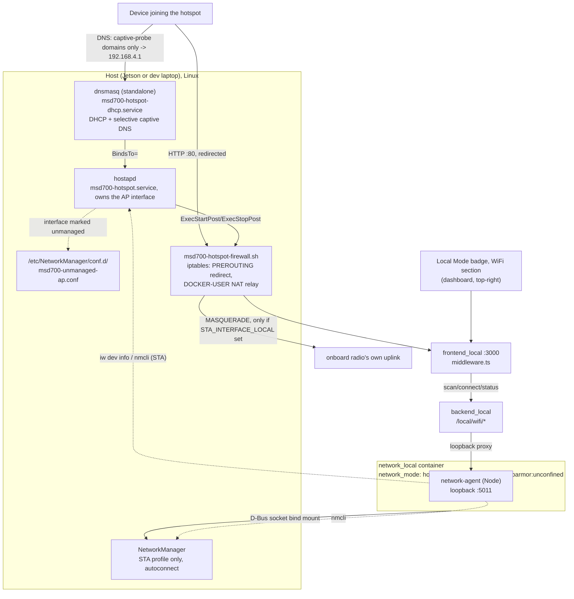

# WiFi Hotspot + Client

<RoleBadge role="technician" />

A standard part of every unit's local-mode setup ([Unit Setup](/setup/unit-setup) Step 6): the Unit
runs its own WiFi hotspot for an operator to join, gets automatically captured into its dashboard
the moment they open any HTTP page (a captive portal, the same mechanism airports and cafes use),
and, if a second radio is available, stays connected as a WiFi **client** to another network for
internet/cloud-sync fallback. Both radios' state is shown on the
[Local Mode badge](/development/data-sync#the-local-mode-badge), the same badge, the same dropdown,
and an operator can connect to a different network from there.

A unit that never runs the provisioning step below still works otherwise exactly as
[Unit Setup](/setup/unit-setup) describes; the badge just reports "no hotspot radio" and nothing
else is affected.

## Why two radios, not one

The Jetson's onboard WiFi (a Realtek RTL8822CE on this project's hardware) is **one physical
radio**. It can join a network as a client (STA) *or* broadcast a hotspot (AP), never both at the
same time, this is not a driver limitation, it is the hardware: `iw phy` shows exactly one `phy` for
the onboard card, and one radio can only be tuned to one channel at a time.

| Topology | Feasibility |
| --- | --- |
| A dongle runs the hotspot, the built-in radio stays a WiFi client | High confidence, no chipset risk. AP and client live on two physically separate radios, so there is no "concurrent mode" question at all: two independent processes (hostapd on the dongle, NetworkManager on the onboard radio), each bound to its own interface. |
| One radio does both AP and client at once (no dongle) | Conditional on the chipset. Only works if the driver reports a valid `iw list` interface combination including `{ AP, managed } <= 2` on one wiphy. Not guaranteed, and not something this project can assert in general, check it on the actual hardware. |

::: info Windows doing both at once is not proof Linux will
A laptop running Microsoft's Mobile Hotspot feature alongside a normal WiFi connection uses a
completely different driver stack (a virtual WiFi adapter Windows manages itself) from Linux's
`mac80211`/`nl80211` concurrent-AP-and-managed combination. It is a reasonable hint the *hardware*
is not fundamentally incapable of it, but it says nothing about whether the Linux driver for that
same chip reports a supporting interface combination. Verify with `iw list` on the actual host.
:::

**Hardware validated on this project**: TP-Link TL-WN722N v2/v3, Realtek **RTL8188EUS** chipset
(USB ID `2357:010c`). Any RTL8188EUS-based dongle should work with the same driver, see
`KNOWN_IDS` in `scripts/install-wifi-dongle-driver.sh` for other USB IDs of the same chipset. No
driver for this chipset ships with the Jetson's kernel out of the box (neither the in-tree
`rtl8xxxu` nor an out-of-tree module), it has to be built from source via DKMS, see
[Installing the dongle driver](#installing-the-dongle-driver) below.

## How it is wired together



The hotspot's existence does **not** depend on Docker. `hostapd` and `dnsmasq` run as their own
systemd services, brought up at boot and independent of `docker-manager.sh` ever having run, the
same way a wired Ethernet cable "just works". `network_local` only serves live status/scan for the
badge and carries out an operator's explicit "connect to a different network" request (client side
only); provisioning the hotspot itself is a separate, one-time step (below).

### Why hostapd, not NetworkManager's own AP mode

NetworkManager can create AP-mode connections itself (`nmcli connection add ... 802-11-wireless.mode
ap`), driven internally by `wpa_supplicant`. That was the original design here, but on the
RTL8188EUS dongle it **hangs every time**: NM's activation always failed after roughly 25 seconds
with `"Hotspot network creation took too long"` / `reason 'supplicant-timeout'`.

Diagnosed by running `hostapd -dd` directly against the same interface: the AP came up in under a
second (`AP-ENABLED`), fully functional. The driver does support AP mode, but its
`NL80211_CMD_START_AP` completion event arrives out of the order `wpa_supplicant`'s internal AP code
expects (visible in the hostapd debug log as `Ignored unknown event (cmd=15)`, logged *after* the AP
had already started through other means). `wpa_supplicant`'s softAP path apparently waits on that
event; `hostapd` doesn't block on it and just proceeds.

The fix: run `hostapd` directly as its own systemd service, and tell NetworkManager to leave the
interface alone entirely (`unmanaged-devices` in a `conf.d` drop-in) so the two never fight over it.
The STA side (an upstream network to join as a client) has no such problem and still goes through a
normal NM connection profile.

### Components

| Component | What it does | Lifecycle |
| --- | --- | --- |
| `msd700-hotspot.service` | Assigns the static IP `192.168.4.1/24`, runs `hostapd -i <ap-iface> /etc/hostapd/hostapd-msd700.conf`, calls `msd700-hotspot-firewall.sh apply`/`teardown` | systemd, enabled at boot, `Restart=on-failure` |
| `msd700-hotspot-firewall.sh` | Captive-portal HTTP redirect (port 80 on the AP interface, always) plus internet-relay NAT (`DOCKER-USER` chain, only when `STA_INTERFACE_LOCAL` is set) | Called from the service above's `ExecStartPost`/`ExecStopPost`, idempotent (check-then-act) |
| `msd700-hotspot-dhcp.service` | Runs a dedicated `dnsmasq` instance: DHCP server (`192.168.4.10`-`192.168.4.200`) + selective captive-portal DNS | systemd, `BindsTo=msd700-hotspot.service` |
| `/etc/NetworkManager/conf.d/msd700-unmanaged-ap.conf` | Tells NM to never touch the dongle's interface | Read by NetworkManager on restart |
| `/etc/polkit-1/rules.d/50-msd700-network-manager.rules` | Grants `org.freedesktop.NetworkManager.*` actions unconditionally, so `network_local`'s `nmcli` calls (scan, connect, forget) work without an interactive polkit prompt the container can never answer | Read by `polkit` on restart |
| NM connection profile (onboard radio only) | Normal client connection to the operator's WiFi | Managed by NetworkManager as usual, `autoconnect: yes` |

Both hotspot-side systemd services `Restart=on-failure`, so unplugging and replugging the *same*
dongle while the unit is running recovers on its own (the interface name is MAC-derived and stable
per physical dongle).

::: info Why `network_local` is not `privileged: true`
`network_local` needs a few distinct things, none of them the broad grant `msd700` already uses
(`privileged: true` + host network, see [Docker Reference](/setup/docker-reference#network-mode-host)).
A bind-mounted D-Bus socket is what lets `nmcli` control the **host's own** NetworkManager daemon for
the STA side; the client itself never touches a network interface directly. `cap_add: [NET_ADMIN]`
plus `network_mode: host` is what the AP-status read (`iw dev <iface> info`) needs, since the AP
interface lives in the host's network namespace. `security_opt: apparmor:unconfined` is the
non-obvious one: Docker's default apparmor profile denies D-Bus method calls from inside the
container even with the socket bind-mounted and `NET_ADMIN` granted, `nmcli`'s initial `Hello()` to
the bus gets an `AccessDenied` before NetworkManager's own D-Bus policy is ever consulted. The
container's only job is talking to the host's NetworkManager over that bus, so it runs unconfined
rather than fighting the default profile rule by rule.
:::

## Installing the dongle driver

One-time, per unit, before provisioning:

```bash
./scripts/install-wifi-dongle-driver.sh
```

- Installs `dkms`, kernel headers, and a C toolchain if missing.
- Clones the driver source ([aircrack-ng/rtl8188eus](https://github.com/aircrack-ng/rtl8188eus)) to
  `/usr/src/`.
- Builds and installs it via **DKMS**, not a one-off `insmod`. This matters: DKMS automatically
  rebuilds the module against every future kernel this Jetson boots, so an `apt` kernel upgrade
  doesn't silently kill the dongle the way a manual build would.
- Loads the module and waits for the second WiFi interface to appear.

Flags: `--check` (verify status only, no changes), `--remove` (uninstall).

::: info This step can also run itself
`setup.sh --provision-network` (below) detects a known RTL8188EUS dongle (`lsusb` against the same
`KNOWN_IDS` list) and, if its driver isn't loaded yet, runs this script automatically before
continuing. Running it by hand first is still useful to see the build output, or to `--check`
status without changing anything.
:::

## Provisioning the hotspot (once per unit)

Everything below lives **outside Docker** on purpose: it has to survive `local_dev` being down, and
it has to come up the instant a dongle is plugged into a unit that has never run
`docker-manager.sh` at all.

### 1. Plug in the dongle

Nothing needs to be set in `docker/.env` by hand first, plug in the validated USB WiFi dongle and
move on to provisioning below; the password and every other setting are asked for interactively at
that point.

If `nmcli` is not already on the host:

```bash
sudo apt install network-manager
```

### 2. Provision

Run from an interactive terminal (a human at the keyboard, not a piped or non-TTY session):

```bash
./setup.sh --provision-network
```

create-next-app style, it walks through every setting, interface names, SSID, and hotspot password,
showing the auto-detected or current value as a `[default]`, press Enter to accept it or type a new
one. The hotspot password is typed twice to confirm and, along with any upstream WiFi password
entered for the STA side, is deliberately **never** written to `docker/.env` or any other file on
disk, NetworkManager stores the STA key itself and hostapd's own config file
(`/etc/hostapd/hostapd-msd700.conf`, `chmod 0600`) stores the AP one. Every other answer (interface
names, SSID) is saved back to `docker/.env` so a re-run, or a human skimming the file, sees the real
values, see [Configuration reference](#configuration-reference-docker-env) below.

::: info Unattended / scripted provisioning
Without a TTY, or with `MSD700_NONINTERACTIVE=1`, the prompts above are skipped entirely and
`docker/.env` (created from `docker/.env.example` on first run if it doesn't exist yet) plus the
environment are taken as-is instead, so automation still works:

```bash
AP_PASSWORD_LOCAL='your-hotspot-password' ./setup.sh --provision-network
```

`docker/.env` is **tracked by git**, so a real password belongs on the command line as shown, never
committed to the file, `setup.sh` sources `docker/.env` without overriding variables already present
in the environment, so an inline value wins.
:::

No need to look up interface names by hand first either way. This one command:

1. **Installs udev rules.** Every `*.rules` file in `scripts/udev/`, not just the WiFi one, the
   STM32 and RealSense rules already in the repo had no install path of their own until this
   existed.
2. **Installs a PolicyKit rule** (`/etc/polkit-1/rules.d/50-msd700-network-manager.rules`) so
   `network_local`'s `nmcli` calls do not hang on an interactive auth prompt.
3. **Auto-detects the AP interface**: if a known RTL8188EUS dongle is plugged in but
   `AP_INTERFACE_LOCAL` is empty, installs its driver first (see above) if needed, then finds the
   interface by walking `/sys/class/net/*/device/driver` for whichever one is owned by the `8188eu`
   kernel driver, deterministic, independent of MAC address or plug order.
4. **Auto-detects the STA interface**: whichever *other* WiFi device exists, if there's exactly one.
   Both detected values are written back into `docker/.env` so future runs, and a human skimming the
   file, see the real values. Ambiguous cases (e.g. two onboard radios) are left for a human to set
   explicitly.
5. **Installs `hostapd`** if missing, deletes any leftover `msd700-hotspot` NetworkManager
   connection profile from before this project switched off NM's own AP mode, and writes
   `/etc/NetworkManager/conf.d/msd700-unmanaged-ap.conf` (restarting NetworkManager *before* hostapd
   claims the interface, so NM isn't still holding it).
6. **Renders and installs** `/etc/hostapd/hostapd-msd700.conf`, `/etc/dnsmasq-msd700-hotspot.conf`,
   `/usr/local/sbin/msd700-hotspot-firewall.sh`, and the two systemd unit files, then enables and
   **restarts** (not `enable --now`, which is a no-op on an already-running service and would leave
   a changed config never actually re-applied) `msd700-hotspot.service` and
   `msd700-hotspot-dhcp.service`.
7. **Creates the STA client profile**, if `STA_INTERFACE_LOCAL`/`STA_SSID_LOCAL` are filled in,
   left alone if a profile of that name already exists.

Re-running this command is always safe: every step is idempotent and only touches what actually
needs to change. To add or change a client network afterward, use the WiFi section of the dashboard
badge's dropdown instead of re-running this step, provisioning intentionally never touches an
existing STA profile.

### Why this isn't folded into `docker-manager.sh build`/`up`

Considered and rejected on purpose. `docker-manager.sh` today never needs `sudo` at all (building
and running the containers only needs `docker` group membership). Provisioning the hotspot does,
`apt install`, `systemctl`, writing to `/etc/`. Folding it in would mean every `docker-manager.sh
build`, including on a dev laptop running `--simulator` with no hotspot hardware at all, could start
prompting for a `sudo` password it never needed before. Keeping the two commands separate keeps that
surprise out of the common case.

## The captive portal

**DNS is selective, not a wildcard.** `/etc/dnsmasq-msd700-hotspot.conf` (rendered from
`docker/networkmanager/dnsmasq-hotspot.conf.tmpl`) only resolves the specific hostnames
iOS/macOS, Android, Windows, Ubuntu/GNOME, and Firefox each query to detect "is this network behind
a captive portal" (`captive.apple.com`, `connectivitycheck.gstatic.com`,
`www.msftconnecttest.com`, `detectportal.firefox.com`, `nmcheck.gnome.org`, and a few more, see the
template for the full list) to `192.168.4.1`. Every other hostname falls through to this dnsmasq's
own upstream resolver (`/etc/resolv.conf`, normally systemd-resolved, which asks whatever DNS the
onboard radio's own upstream network handed out). This replaced an earlier version of this feature
that wildcarded *every* hostname to the unit's own address, wildcarding is still effectively what
happens on an **AP-only unit** with no `STA_INTERFACE_LOCAL` configured (nothing to relay through
regardless of what DNS says), but once an onboard uplink exists, resolving real domains to their
real addresses is what lets HTTPS (port 443) traffic pass straight through the NAT relay below
untouched.

**The redirect is interface-scoped, not hostname-scoped.** `msd700-hotspot-firewall.sh` installs one
iptables rule:

```
iptables -t nat -A PREROUTING -i <ap-interface> -p tcp --dport 80 -j REDIRECT --to-port <captive-port>
```

This redirects **every** plain-HTTP (port 80) request arriving on the AP interface to the dashboard,
regardless of which hostname it was headed for, iptables acts on interface and port, not on the DNS
answer a client already resolved. That's deliberate for the captive-portal probes themselves (their
DNS was already steered to `192.168.4.1` above, so they'd land here either way), but it also means a
client's plain-HTTP request to some unrelated site (resolved to that site's real IP) still gets
redirected here rather than actually reaching that site.
`ROS-dashboard-next-ts/middleware.ts` handles that case explicitly: it answers each OS's specific
probe host+path with something that *isn't* what the OS expects (a 302 for Apple, a plain 200 page
for the rest, only when `NEXT_PUBLIC_DEPLOYMENT_MODE=local`), and for a foreign hostname that isn't
one of those probes, 302-redirects back to the dashboard's own canonical address instead of trying
to proxy it. HTTPS traffic never hits this rule at all (only `--dport 80` is redirected), so ordinary
browsing over HTTPS is unaffected once an onboard uplink is relaying it.

Applied and removed automatically via `msd700-hotspot.service`'s `ExecStartPost`/`ExecStopPost`, tied
to hostapd's own up/down, not to any container's lifecycle or a NetworkManager dispatcher script.

::: danger HTTPS is never intercepted, and that is not a bug
Redirecting TLS traffic breaks certificate validation outright: the client gets a hard security
error, not a sign-in prompt. This is a protocol constraint, the same one every real captive portal
runs into. What actually triggers the "Sign in to network" prompt is each OS's own plain-HTTP probe:

| OS | Probe URL | Expects |
| --- | --- | --- |
| Apple (iOS/macOS) | `http://captive.apple.com/hotspot-detect.html` | the literal string "Success" |
| Android | `http://connectivitycheck.gstatic.com/generate_204` | HTTP 204 |
| Windows (NCSI) | `http://www.msftconnecttest.com/connecttest.txt` | "Microsoft Connect Test" |
| Windows (legacy) | `http://www.msftncsi.com/ncsi.txt` | "Microsoft NCSI" |
| Firefox | `http://detectportal.firefox.com/success.txt` | "success\n" |
| Ubuntu/GNOME (NetworkManager) | `http://connectivity-check.ubuntu.com/` , `http://nmcheck.gnome.org/` | a non-empty 200 body |
:::

**Internet relay.** Only when `STA_INTERFACE_LOCAL` is set, `msd700-hotspot-firewall.sh` also adds:

- A `MASQUERADE` rule (`192.168.4.0/24` out the onboard radio) so return traffic has a route back to
  a client's private hotspot address.
- Two `ACCEPT` rules in Docker's **`DOCKER-USER`** chain, not `FORWARD` directly, because Docker sets
  `FORWARD`'s default policy to `DROP` and owns its own chains there, but its own documentation names
  `DOCKER-USER` as the one chain it guarantees never to insert into, flush, or otherwise touch, so
  these rules survive `docker-manager.sh` restarting Docker or the containers, which rules added
  straight to `FORWARD` would not.

**Security note:** anyone who connects to the hotspot rides the unit's own internet connection.
Worth considering if a unit is deployed somewhere the hotspot password might reach people beyond the
intended operator.

## The dashboard badge

There is no separate WiFi badge. This is a **section inside** the
[Local Mode badge](/development/data-sync#the-local-mode-badge)'s dropdown, under the sync state.
On the badge line itself there is only a WiFi **glyph**, coloured by state and carrying the summary
(an SSID, `hotspot only`, `no network`, `wifi unreachable`) as its hover tooltip and its
screen-reader label rather than as printed text, an SSID is up to 32 bytes of arbitrary characters
and the badge sits over the navbar, so the words belong one click away instead. The agent being
unreachable is also stated in words at the top of the section, since a red glyph on its own is not
something an operator can act on.

It polls `GET /local/wifi/status` every 30 seconds, faster for a short window
after an action, from the always-mounted badge rather than from the section, so the summary is
current whether or not the dropdown has ever been opened. The network scan is the opposite: it runs
when the dropdown opens and not before, because `nmcli`'s rescan is not free and most page-views
never open it.

| Endpoint | Auth | Purpose |
| --- | --- | --- |
| `GET /local/wifi/status` | none | Hotspot state (up? SSID? client count, read via `iw dev <ap-iface> info` / `station dump`), client state (connected? SSID? IP? internet reachable, via `nmcli networking connectivity`?) |
| `GET /local/wifi/scan` | none | Nearby SSIDs and security type, for the dropdown |
| `GET /local/wifi/saved` | none | Known client profiles |
| `GET /local/wifi/hotspot` | none | This unit's own hotspot SSID and the outcome of the last change. **Never returns the password** |
| `POST /local/wifi/connect` | operator session | Connect the client radio to a chosen network |
| `POST /local/wifi/forget` | operator session | Remove a saved client profile |
| `POST /local/wifi/hotspot` | operator session | Change this unit's own hotspot SSID and/or password |

The mutating routes require the same operator session every other `/api/*` route does, unlike
`/local/status`/`/local/sync`, which stay unauthenticated because a unit with no synced-down
accounts yet has nobody who could log in. Connecting to a network (and handing over a password) is
a meaningfully more sensitive action than reading a sync timestamp, so it does not get the same
pre-login exception.

## Changing the unit's own hotspot

The WiFi section of the badge's dropdown is meant to rename the hotspot and set a new password.

::: danger Currently broken after the hostapd migration
`network-agent`'s `setHotspot()` (`ros-web-ui/source/dependencies/network-agent/wifi_control.js`)
still reads and writes the AP side as an `nmcli connection modify msd700-hotspot ...` /
`nmcli connection down`/`up msd700-hotspot` NetworkManager profile. Provisioning (above) explicitly
**deletes** that exact profile if one exists, the AP interface is NM-*unmanaged* now, `hostapd` owns
it directly via `msd700-hotspot.service`. On any unit provisioned under the current architecture
there is no `msd700-hotspot` connection for `setHotspot()` to read, so it fails immediately with
`not_provisioned` before attempting any change. Reading status (`GET /local/wifi/hotspot`,
`GET /local/wifi/status`) is unaffected, `getApInfo()` was updated to read the interface directly
via `iw`, only the *write* path was not carried over. Fixing this means rewriting `setHotspot()` to
edit `/etc/hostapd/hostapd-msd700.conf` (SSID/`wpa_passphrase`) and `systemctl restart
msd700-hotspot.service` instead of touching a NetworkManager profile that no longer exists. Not yet
done.
:::

Once fixed, two behaviours are worth knowing before using it, and both are already reflected in the
API's shape:

::: danger Saving disconnects every device on the hotspot, including yours
This is unavoidable, not a rough edge: the hotspot is what serves the dashboard, so the request to
change it arrives over the very connection the change destroys. Restarting the AP under a new SSID
(or a new key) drops every associated device, and none of them will auto-rejoin, to their OS this is
now either an unknown network or one whose password no longer works.

The API is built around that rather than against it. `POST /local/wifi/hotspot` validates
immediately, answers **202 Accepted** carrying the SSID to reconnect to, and only *then* applies the
change. Applying it inline would tear down the TCP connection mid-response, and a browser cannot
tell that from a crash, the operator would see a network error for a change that actually succeeded,
with no idea which network to look for. Answering first is what lets the UI say "reconnect to
`<new name>`" while it still has a connection to say it on.

Consequently the response means *accepted*, never *succeeded*. What actually happened is reported by
`GET /local/wifi/hotspot`'s `last_change` field, read after the operator has rejoined.
:::

::: info A change that cannot activate is meant to roll back automatically
The expensive failure here is a headless robot whose only access path is its own hotspot, left with
a config that no longer activates: nobody can reach it to undo that, so it needs someone physically
at the machine. The current implementation captures the previous SSID and key first and, if the new
settings fail to come up, restores and reactivates them, with `last_change.rolled_back` set so a
reconnecting operator can tell a rolled-back change from one that was never submitted, otherwise the
two look identical, since in both cases the network in front of them is the one they started with.
This logic still targets the deleted NetworkManager profile (see above), so it needs to move to
editing/reverting the hostapd config file alongside the rest of the fix.
:::

**Validation** (enforced in the agent, not just the form): SSID is 1 to 32 **octets**, a name in a
non-Latin script hits the limit sooner than its character count suggests, and the WPA-PSK password
is 8 to 63 characters. Control characters are rejected rather than stripped, since quietly sanitising
one leaves the operator hunting for a network whose name is not what they typed. Nothing is touched
until validation passes, so a bad value can never be the reason a unit loses its hotspot.

**The password is never sent to the browser.** Anyone already on the hotspot knows it (they typed it
to get on), so returning it buys nothing, while putting it in a plain-HTTP response body hands it to
anyone reaching the dashboard from the *client-side* network, who does not know it. The form asks
for a new password and treats blank as "keep the current one".

::: warning `docker/.env` is a seed, not the source of truth
`AP_SSID_LOCAL` / `AP_PASSWORD_LOCAL` are read **only** by `setup.sh --provision-network`, and only
when `/etc/hostapd/hostapd-msd700.conf` does not already exist (in effect: only on the first
provisioning run). After that, `/etc/hostapd/hostapd-msd700.conf` is authoritative and those two keys
are stale, re-running `--provision-network` re-renders the same file from `docker/.env` again, so
edit `docker/.env` and re-run provisioning to change the hotspot from the CLI, or wait for the
dashboard path above to be fixed. The honest live answer for the broadcast SSID is
`iw dev <ap-interface> info`.
:::

Client-side internet reachability (`full` / `limited` / `portal` / `none`) is read straight from
`nmcli networking connectivity`, NetworkManager's own periodic connectivity probe, nothing here
implements a second one.

## Configuration reference (`docker/.env`)

| Variable | Meaning | Default |
| --- | --- | --- |
| `AP_INTERFACE_LOCAL` | Dongle's interface name | auto-detected during `--provision-network` |
| `STA_INTERFACE_LOCAL` | Onboard radio's interface name | auto-detected during `--provision-network` |
| `AP_SSID_LOCAL` | Hotspot's broadcast name | `MSD700-<hostname suffix>` if left blank |
| `AP_PASSWORD_LOCAL` | Hotspot's WPA2 password (8+ chars, required for provisioning to create the AP) | blank in `docker/.env.example` on purpose |
| `AP_CONNECTION_NAME_LOCAL` | Legacy, only used to clean up a leftover pre-hostapd NetworkManager profile of this name during provisioning | `msd700-hotspot` |
| `NETWORK_AGENT_PORT_LOCAL` | Port `network_local`'s loopback API listens on | `5011` |
| `STA_SSID_LOCAL` / `STA_PASSWORD_LOCAL` | Optional: an upstream network to auto-join as a client on first provisioning | empty (add later from the dashboard's WiFi dropdown instead) |
| `LOCAL_IP` | IP the dashboard's frontend build points at | `192.168.4.1` (matches the hotspot's static IP) |

## Verifying it works

```bash
# Services running?
systemctl status msd700-hotspot.service msd700-hotspot-dhcp.service

# Actually in AP mode, broadcasting?
iw dev <AP_INTERFACE_LOCAL> info        # should show: type AP

# NetworkManager correctly staying out of the way?
nmcli device status                      # dongle should show "unmanaged"

# Captive-portal domains still redirected?
dig +short @192.168.4.1 captive.apple.com       # should print 192.168.4.1

# Everything else resolving for real (only meaningful if STA_INTERFACE_LOCAL is set)?
dig +short @192.168.4.1 github.com              # should print a real GitHub IP, not 192.168.4.1

# NAT + relay rules present?
sudo iptables -t nat -L POSTROUTING -n | grep 192.168.4.0
sudo iptables -L DOCKER-USER -n
```

From another device: connect to the SSID, the OS's own "Sign in to WiFi" prompt should appear and
land on `http://192.168.4.1:3000` (or whatever port 80 redirects to, see `FRONTEND_PORT_LOCAL`).
Everything else should browse normally if `STA_INTERFACE_LOCAL` is configured.

## Troubleshooting

**`lsusb` doesn't show the dongle, or `nmcli device status` doesn't show a second WiFi device**
Driver isn't installed/loaded yet. Run `./scripts/install-wifi-dongle-driver.sh --check` to see
what's missing.

**`install-wifi-dongle-driver.sh` reports the module isn't loaded even right after a successful
build**
Retry once, there's a known race between `dkms install`'s own `depmod` and `modprobe` right after.
The script already retries this internally (5 attempts); if it still fails, check
`sudo dmesg | tail -40`.

**Hotspot won't broadcast / `iw dev` shows `type managed` instead of `AP`**
Check `journalctl -u msd700-hotspot.service`. If you see repeated activation failures, confirm
NetworkManager actually released the interface (`nmcli device status` should say `unmanaged`, not
`disconnected` or `connecting`), a stale `/etc/NetworkManager/conf.d/msd700-unmanaged-ap.conf`
pointing at the wrong interface name is the usual cause after swapping to a different dongle.

**`--provision-network` fails with "nmcli not found"**
NetworkManager is not installed on the host. `sudo apt install network-manager`.

**`--provision-network` fails, "AP_PASSWORD_LOCAL is not set"**
Only happens on a non-interactive run (no TTY, or `MSD700_NONINTERACTIVE=1`): password missing or
under 8 characters. Set an 8+ character password in `docker/.env` or pass `AP_PASSWORD_LOCAL`
inline, then re-run. An interactive run instead prompts for the password directly and re-prompts on
a short or mismatched entry.

**Clients connect to the hotspot but get no IP**
Check `systemctl status msd700-hotspot-dhcp.service` and `journalctl -u msd700-hotspot-dhcp.service`.
Confirm `/etc/dnsmasq-msd700-hotspot.conf` has the right `interface=` line (re-run
`./setup.sh --provision-network` to re-render it from the current `docker/.env`).

**Clients get the "Sign in to WiFi" prompt and reach the dashboard, but nothing else loads**
`STA_INTERFACE_LOCAL` is probably empty in `docker/.env`, that's the AP-only mode, dashboard-only by
design (no onboard uplink to relay through). If it should be set, check with `nmcli device status`,
set it, and re-run `./setup.sh --provision-network`.

**`STA_INTERFACE_LOCAL` is set but clients still have no internet**
Check the NAT rules actually exist (see [Verifying it works](#verifying-it-works) above). If missing
after a re-provision, confirm `msd700-hotspot.service` was actually **restarted** (not just
`enable`d, see step 6 of provisioning), and that `net.ipv4.ip_forward` is `1`
(`sysctl net.ipv4.ip_forward`). Otherwise, confirm the onboard radio itself has real internet
(`ping -I <STA_INTERFACE_LOCAL> 8.8.8.8`), the relay only forwards to wherever that radio's own
connection goes.

**Existing local services (backend, media, MySQL) become unreachable after provisioning**
The iptables redirect rule was not scoped correctly to the AP interface. Check it targets only
`<ap-interface>`, never the client interface or loopback: `sudo iptables -t nat -L PREROUTING -n`.

**Badge menu says "Hotspot: no hotspot radio"**
`AP_INTERFACE_LOCAL` is empty, or `--provision-network` was never run. Fill in `docker/.env` and run
`./setup.sh --provision-network`.

**No WiFi glyph on the badge at all**
Neither radio is present, with no AP and no STA interface there is nothing to report. Expected on a
unit built without WiFi; otherwise check `nmcli device` / `lsusb` for the interfaces.

**Hotspot up, but the WiFi glyph is red and the menu says "WiFi service unreachable on this unit"**
`network_local` is not running, or `backend_local` cannot reach it. `docker compose ps` for
`network_local`; confirm `NETWORK_AGENT_PORT_LOCAL` matches on both services.

**`nmcli device wifi connect` fails from the badge with an unhelpful reason**
nmcli's own stderr is passed through verbatim rather than reworded. Read the reason text directly,
it distinguishes wrong password from out-of-range from refused.

**Changing the hotspot name/password from the dashboard does nothing / reports `not_provisioned`**
Known bug, see [Changing the unit's own hotspot](#changing-the-unit-s-own-hotspot) above, `setHotspot()`
was not updated for the hostapd migration. Change `AP_SSID_LOCAL`/`AP_PASSWORD_LOCAL` in
`docker/.env` and re-run `--provision-network` instead for now (only works before hostapd's config
file already exists, see the warning under that section).

## Related

- [Unit Setup](/setup/unit-setup): the base local-mode installation this feature sits on top of
- [Docker Reference § network_mode: host](/setup/docker-reference#network-mode-host): why some
  services share the host's network namespace
- [Data Sync § The Local Mode badge](/development/data-sync#the-local-mode-badge): the badge this
  section lives inside, and the sync state shown above it
- [Architecture § Trust domains](/development/architecture#trust-domains): why `/local/wifi/connect`
  needs an operator session and `/local/status` does not
