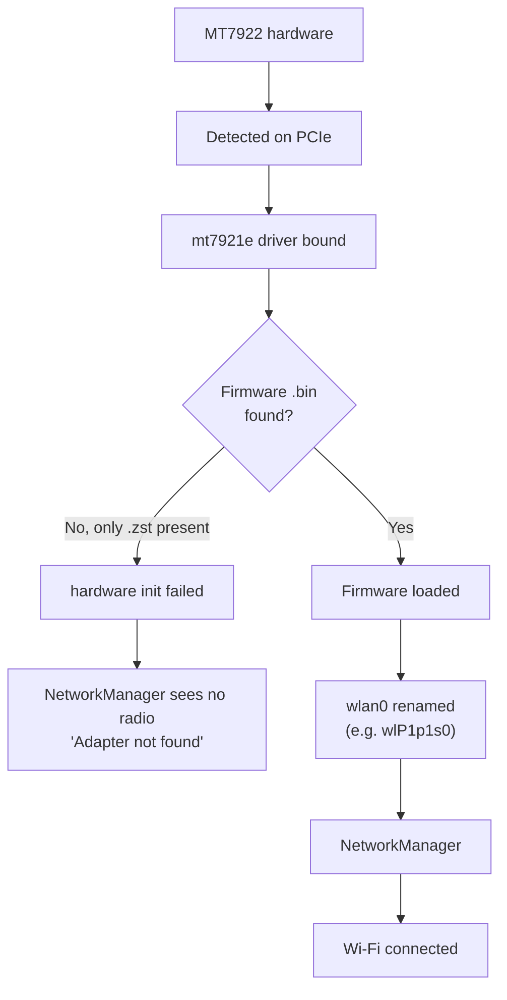

# MediaTek MT7922 Wi-Fi Setup (Tegra Kernel)

<RoleBadge role="technician" />

This is **step 1** of the [WiFi Hotspot + Client setup flow](/setup/wifi-hotspot#setup-flow): fix
the onboard radio's firmware here first, then go back and continue with hotspot provisioning.

**MediaTek MT7922-class cards are this project's primary onboard radio**: on top of being a normal
WiFi client, they can run the hotspot's access point concurrently on the same physical radio (see
[Primary radio vs. backup dongle](/setup/wifi-hotspot#primary-radio-vs-backup-dongle)), no USB
dongle needed. Units built around the older Realtek RTL8822CE instead don't support that concurrent
mode, and always need a backup dongle for the hotspot, see
[WiFi Hotspot + Client](/setup/wifi-hotspot) for that path.

On the Tegra (Jetson) kernel, the `mt7921e` in-tree driver is present, but the firmware package
installed by Ubuntu can ship only the compressed `.zst` form of the firmware files while that
particular kernel build still expects the plain, uncompressed form. The card is then detected but
never comes up, and the hotspot silently falls back to a backup dongle (if one happens to be
configured) instead of using the primary path it's meant to.

## Validated environment

| Component | Value |
| --- | --- |
| OS | Ubuntu 24.04.4 LTS |
| Architecture | arm64 |
| Kernel | `6.8.12-1021-tegra` |
| Wi-Fi card | MediaTek MT7922 |
| PCI ID | `14c3:0616` |
| Driver | `mt7921e` |

::: warning Kernel-specific workaround, not a universal fix
This is specific to Ubuntu 24.04 on the `6.8.12-1021-tegra` kernel, as observed on this project. Newer
mainline or Ubuntu kernels may already decompress `.zst` firmware on load, in which case the manual
extraction in this guide is unnecessary. Always do [Step 1](#_1-verify-hardware-and-driver) and
[Step 2](#_2-check-mt7922-firmware) first to confirm the symptom is actually present before applying
the fix.
:::

## 1. Verify hardware and driver

```bash
lspci -nnk | grep -A3 -iE 'network|wireless'
```

Expected:

```
MEDIATEK Corp. MT7922 802.11ax PCI Express Wireless Network Adapter [14c3:0616]
Kernel driver in use: mt7921e
Kernel modules: mt7921e
```

If `mt7921e` is already listed and working, do not install a third-party driver: the in-tree driver
is correct, the problem (if any) is firmware, not the driver.

::: warning If the card doesn't show up here at all, or `mt7921e` isn't a driver on this system
Two different failures, both rarer than the firmware issue this guide is otherwise about:

- **The card is missing from `lspci` entirely.** Check it is actually seated (`lspci | grep -i
  network` should list *some* wireless device). If nothing is there at all, this is a hardware
  problem (reseat the card, check the physical connection), not something any of the steps below
  can fix.
- **The card is listed, but with no `Kernel driver in use` line, or a different one.** Confirm the
  module itself exists on this kernel:

  ```bash
  modinfo mt7921e
  ```

  `mt7921e` ships with the L4T (Tegra) kernel package on this project's validated environment below,
  there is nothing to build or download separately, unlike the backup dongle's driver. If
  `modinfo` reports `ERROR: Module mt7921e not found`, the running kernel's module tree itself is
  missing it, a kernel packaging problem rather than a firmware one:

  ```bash
  uname -r
  sudo apt install --reinstall "linux-modules-$(uname -r)"
  ```

  If that package doesn't exist for this kernel build, the L4T/JetPack image this unit was flashed
  from is missing the module outright, treat it the same as a hardware problem: re-flashing or
  upgrading the L4T BSP is the fix, not anything in this guide.
:::

## 2. Check MT7922 firmware

```bash
ls -l /lib/firmware/mediatek/ | grep -i MT7922
```

In the case this guide is based on, the directory had only the compressed files:

```
WIFI_RAM_CODE_MT7922_1.bin.zst
WIFI_MT7922_patch_mcu_1_1_hdr.bin.zst
```

but the kernel was requesting the uncompressed names:

```
WIFI_RAM_CODE_MT7922_1.bin
WIFI_MT7922_patch_mcu_1_1_hdr.bin
```

Confirm with:

```bash
sudo dmesg | grep -iE 'mt792|firmware'
```

The symptomatic error looks like this:

```
Direct firmware load for mediatek/WIFI_RAM_CODE_MT7922_1.bin failed with error -2
Direct firmware load for mediatek/WIFI_MT7922_patch_mcu_1_1_hdr.bin failed with error -2
mt7921e ... hardware init failed
```

`error -2` is `ENOENT`: the kernel could not find a file by that exact name, it does not decompress
`.zst` on its own on this kernel build.

::: warning If `/lib/firmware/mediatek/` doesn't exist, or has neither `.bin` nor `.zst` files
Different from the mismatch above, this means the firmware package itself was never installed, not
just installed in the wrong format:

```bash
sudo apt update
sudo apt install --reinstall linux-firmware
ls -l /lib/firmware/mediatek/ | grep -i MT7922
```

`linux-firmware` is the package that ships these files, `./setup.sh --provision-network` already
attempts exactly this reinstall automatically as a preflight check when it notices the onboard
radio's interface never appeared, see [WiFi Hotspot + Client § Provisioning the
hotspot](/setup/wifi-hotspot#provisioning-the-hotspot-once-per-unit). If the automatic attempt
already ran and the interface still didn't appear, re-running it by hand rarely helps either, check
what actually landed in `/lib/firmware/mediatek/` with the command above. If the files come back as
`.zst` (the common case on this project's kernel), continue with steps 3 and 4 below to decompress
them. If the directory is still empty or the package install itself fails, that points at a broken
or incomplete Ubuntu package cache/mirror rather than anything specific to this card, `apt-cache
policy linux-firmware` and a plain `sudo apt update` are the usual next things to check.
:::

## 3. Make sure `zstd` is available

```bash
which zstd
```

If it's missing:

```bash
sudo apt update
sudo apt install zstd
```

## 4. Extract the `.zst` firmware into `.bin`

```bash
cd /lib/firmware/mediatek

sudo zstd -d -f WIFI_RAM_CODE_MT7922_1.bin.zst \
    -o WIFI_RAM_CODE_MT7922_1.bin

sudo zstd -d -f WIFI_MT7922_patch_mcu_1_1_hdr.bin.zst \
    -o WIFI_MT7922_patch_mcu_1_1_hdr.bin
```

Verify both forms now exist side by side:

```bash
ls -lh /lib/firmware/mediatek/*MT7922*
```

Expected:

```
WIFI_RAM_CODE_MT7922_1.bin
WIFI_RAM_CODE_MT7922_1.bin.zst
WIFI_MT7922_patch_mcu_1_1_hdr.bin
WIFI_MT7922_patch_mcu_1_1_hdr.bin.zst
```

::: info Keep the `.zst` files
Don't delete them. This only adds the decompressed `.bin` copies alongside; the `.zst` originals stay
in place for whatever package management expects them there (e.g. `dpkg` verification, future
package updates).
:::

## 5. Reload the driver

No reboot needed:

```bash
sudo modprobe -r mt7921e
sudo modprobe mt7921e
```

Then check:

```bash
sudo dmesg | grep -iE 'mt792|firmware' | tail -50
```

On success, the earlier firmware errors are gone and lines like these appear instead:

```
ASIC revision: 79220010
HW/SW Version: ...
WM Firmware Version: ...
wlP1p1s0: renamed from wlan0
```

## 6. Verify NetworkManager

```bash
nmcli device
```

Expected:

```
wlP1p1s0   wifi   connected   eduroam
```

The interface name does not have to be `wlP1p1s0`: it depends on the system's predictable network
interface naming, and can differ machine to machine.

## Diagnosis



## One-shot setup for the next unit

For another machine in the same state (MT7922, `.zst` firmware present, kernel asking for `.bin`),
this is the whole fix:

```bash
sudo apt update
sudo apt install zstd

cd /lib/firmware/mediatek

sudo zstd -d -f WIFI_RAM_CODE_MT7922_1.bin.zst \
    -o WIFI_RAM_CODE_MT7922_1.bin

sudo zstd -d -f WIFI_MT7922_patch_mcu_1_1_hdr.bin.zst \
    -o WIFI_MT7922_patch_mcu_1_1_hdr.bin

sudo modprobe -r mt7921e
sudo modprobe mt7921e

nmcli device
```

## Related

- [WiFi Hotspot + Client § Setup flow](/setup/wifi-hotspot#setup-flow): continue here after this
  page, steps 2 and 3 (hotspot provisioning, verification), step 4 (backup dongle) is optional.
- [WiFi Hotspot + Client § Primary radio vs. backup dongle](/setup/wifi-hotspot#primary-radio-vs-backup-dongle):
  why this card doesn't need a dongle, and what still does.
- [Troubleshooting](/setup/troubleshooting): general technician diagnostics.
