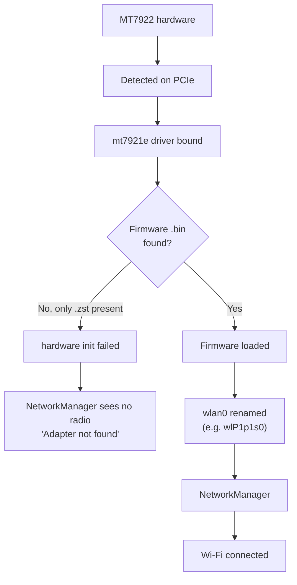

# MediaTek MT7922 Wi-Fi Setup (Tegra Kernel)

<RoleBadge role="technician" />

Some units ship or get retrofitted with a **MediaTek MT7922** Wi-Fi card instead of the project's
default Realtek RTL8822CE (see [WiFi Hotspot + Client](/setup/wifi-hotspot) for that default). On the
Tegra (Jetson) kernel, the `mt7921e` in-tree driver is present, but the firmware package installed by
Ubuntu can ship only the compressed `.zst` form of the firmware files while that particular kernel
build still expects the plain, uncompressed form. The card is then detected but never comes up.

## Validated environment

| Component | Value |
| --- | --- |
| OS | Ubuntu 24.04.4 LTS |
| Architecture | arm64 |
| Kernel | `6.8.12-1021-tegra` |
| Wi-Fi card | MediaTek MT7922 |
| PCI ID | `14c3:0616` |
| Driver | `mt7921e` |

::: warning Kernel-specific workaround, not a universal fix
This is specific to Ubuntu 24.04 on the `6.8.12-1021-tegra` kernel, as observed on this project. Newer
mainline or Ubuntu kernels may already decompress `.zst` firmware on load, in which case the manual
extraction in this guide is unnecessary. Always do [Step 1](#_1-verify-hardware-and-driver) and
[Step 2](#_2-check-mt7922-firmware) first to confirm the symptom is actually present before applying
the fix.
:::

## 1. Verify hardware and driver

```bash
lspci -nnk | grep -A3 -iE 'network|wireless'
```

Expected:

```
MEDIATEK Corp. MT7922 802.11ax PCI Express Wireless Network Adapter [14c3:0616]
Kernel driver in use: mt7921e
Kernel modules: mt7921e
```

If `mt7921e` is already listed and working, do not install a third-party driver: the in-tree driver
is correct, the problem (if any) is firmware, not the driver.

## 2. Check MT7922 firmware

```bash
ls -l /lib/firmware/mediatek/ | grep -i MT7922
```

In the case this guide is based on, the directory had only the compressed files:

```
WIFI_RAM_CODE_MT7922_1.bin.zst
WIFI_MT7922_patch_mcu_1_1_hdr.bin.zst
```

but the kernel was requesting the uncompressed names:

```
WIFI_RAM_CODE_MT7922_1.bin
WIFI_MT7922_patch_mcu_1_1_hdr.bin
```

Confirm with:

```bash
sudo dmesg | grep -iE 'mt792|firmware'
```

The symptomatic error looks like this:

```
Direct firmware load for mediatek/WIFI_RAM_CODE_MT7922_1.bin failed with error -2
Direct firmware load for mediatek/WIFI_MT7922_patch_mcu_1_1_hdr.bin failed with error -2
mt7921e ... hardware init failed
```

`error -2` is `ENOENT`: the kernel could not find a file by that exact name, it does not decompress
`.zst` on its own on this kernel build.

## 3. Make sure `zstd` is available

```bash
which zstd
```

If it's missing:

```bash
sudo apt update
sudo apt install zstd
```

## 4. Extract the `.zst` firmware into `.bin`

```bash
cd /lib/firmware/mediatek

sudo zstd -d -f WIFI_RAM_CODE_MT7922_1.bin.zst \
    -o WIFI_RAM_CODE_MT7922_1.bin

sudo zstd -d -f WIFI_MT7922_patch_mcu_1_1_hdr.bin.zst \
    -o WIFI_MT7922_patch_mcu_1_1_hdr.bin
```

Verify both forms now exist side by side:

```bash
ls -lh /lib/firmware/mediatek/*MT7922*
```

Expected:

```
WIFI_RAM_CODE_MT7922_1.bin
WIFI_RAM_CODE_MT7922_1.bin.zst
WIFI_MT7922_patch_mcu_1_1_hdr.bin
WIFI_MT7922_patch_mcu_1_1_hdr.bin.zst
```

::: info Keep the `.zst` files
Don't delete them. This only adds the decompressed `.bin` copies alongside; the `.zst` originals stay
in place for whatever package management expects them there (e.g. `dpkg` verification, future
package updates).
:::

## 5. Reload the driver

No reboot needed:

```bash
sudo modprobe -r mt7921e
sudo modprobe mt7921e
```

Then check:

```bash
sudo dmesg | grep -iE 'mt792|firmware' | tail -50
```

On success, the earlier firmware errors are gone and lines like these appear instead:

```
ASIC revision: 79220010
HW/SW Version: ...
WM Firmware Version: ...
wlP1p1s0: renamed from wlan0
```

## 6. Verify NetworkManager

```bash
nmcli device
```

Expected:

```
wlP1p1s0   wifi   connected   eduroam
```

The interface name does not have to be `wlP1p1s0`: it depends on the system's predictable network
interface naming, and can differ machine to machine.

## Diagnosis



## One-shot setup for the next unit

For another machine in the same state (MT7922, `.zst` firmware present, kernel asking for `.bin`),
this is the whole fix:

```bash
sudo apt update
sudo apt install zstd

cd /lib/firmware/mediatek

sudo zstd -d -f WIFI_RAM_CODE_MT7922_1.bin.zst \
    -o WIFI_RAM_CODE_MT7922_1.bin

sudo zstd -d -f WIFI_MT7922_patch_mcu_1_1_hdr.bin.zst \
    -o WIFI_MT7922_patch_mcu_1_1_hdr.bin

sudo modprobe -r mt7921e
sudo modprobe mt7921e

nmcli device
```

## Related

- [WiFi Hotspot + Client](/setup/wifi-hotspot): the project's default onboard radio (RTL8822CE) and
  the dongle-based hotspot setup this card is an alternative to.
- [Troubleshooting](/setup/troubleshooting): general technician diagnostics.
