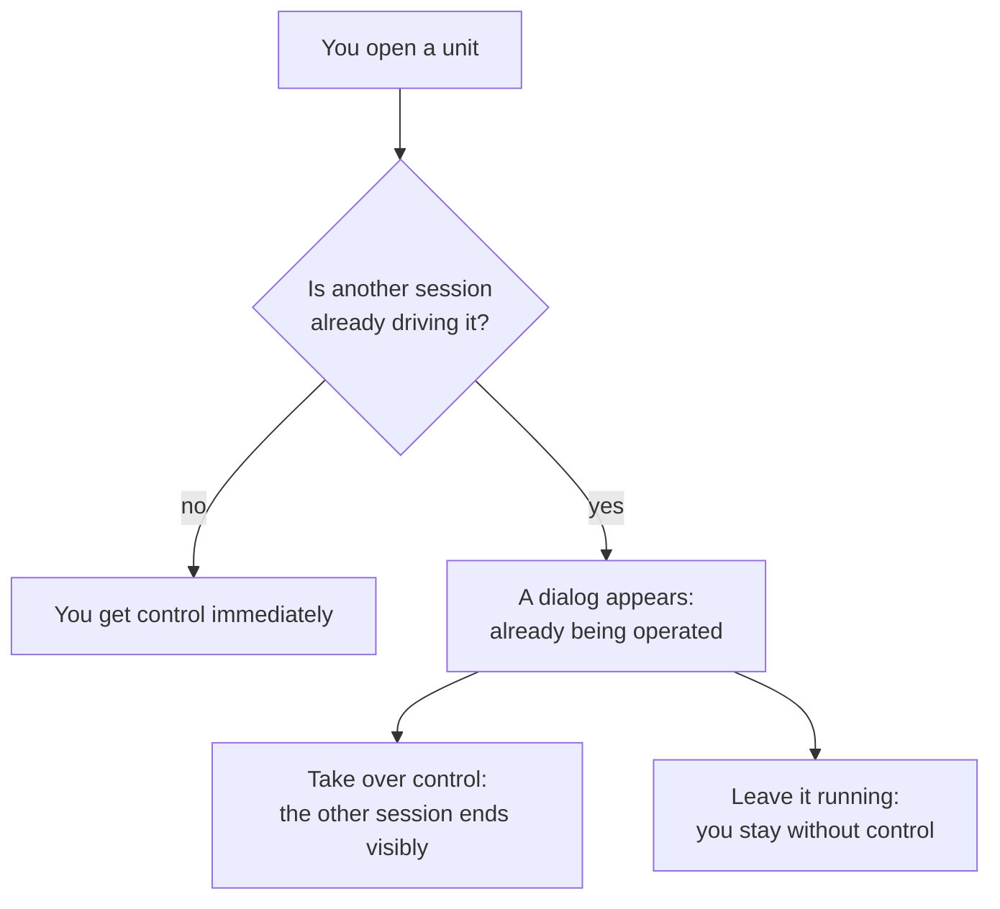
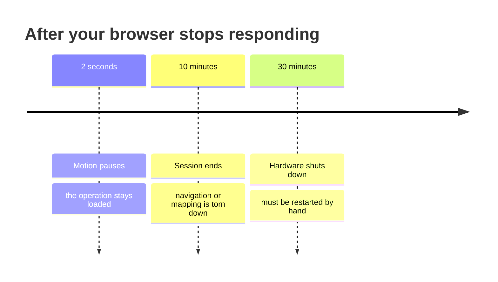
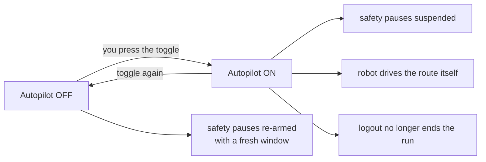
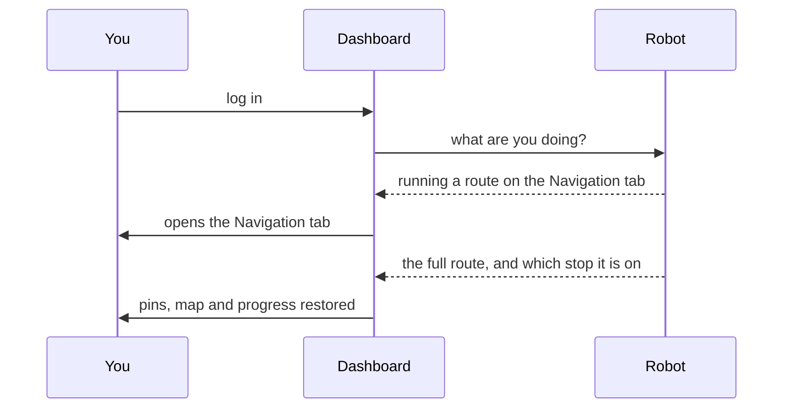

# How the Robot Behaves

<RoleBadge role="user" />

MSD700 does several things on its own, without being asked: it pauses when you disappear, it refuses
to let two people drive at once, and it remembers what it was doing when you come back. None of that
is arbitrary, and knowing the rules makes the difference between "the robot did something strange"
and "of course it did that."

This page is the plain-language version. The engineering detail is in
[State and Behavior](/development/state-and-behavior).

## What the robot is doing right now

The dashboard always shows one status for the robot. These are the ones you will actually see.

| Status | Means | Normal? |
| --- | --- | --- |
| **Idle** | Nothing running. Ready for a command. | Yes |
| **Manual** | You are driving with W-A-S-D. | Yes |
| **On Progress** | Driving to a point, or running a route. | Yes |
| **Arrived** | Reached the goal, or finished a coverage run. | Yes |
| **Mapping** | Building a map. | Yes |
| **Paused** | You paused it. It resumes where it left off. | Yes |
| **Robot Stuck** | It should be moving and it is not. | See [below](#robot-stuck) |
| **Emergency Stopped** | E-Stop is engaged. Nothing will move until it is released. | Only when you did it |

::: info The robot is the one keeping score, not your browser
Every one of those states lives on the robot itself. That is why closing the tab, refreshing, or
switching to a different computer does not lose your operation, and why the toggle switches in the
panel snap back to whatever the robot actually has engaged rather than what you last clicked.
:::

## Only one person drives at a time

| What you see | What it means | What you can do |
| --- | --- | --- |
| Nothing special | The unit is free | Drive |
| **In Use** badge on the unit list | Another session is driving: a second tab, another operator, or the unit's own local dashboard | Open the unit, then decide in the dialog |
| **"This unit is already being operated from …"** dialog | Your session was refused because someone is already driving | **Take over control**, or **Leave it running** |

::: warning Two sessions cannot both drive
That is deliberate. Two sessions each sending commands to one robot interleave, and neither one would
ever be told about the other. Whichever session takes over wins, and the other is told it lost, rather
than silently sending commands nobody applies.
:::

Control is a **lease** that has to be renewed. If your browser stops renewing it, it lapses about 15
seconds later and the unit becomes free for the next person. That is what makes a crashed tab or a
closed laptop stop stranding a robot nobody can use.

## What happens when you disconnect

The robot watches for your dashboard. When it stops hearing from you, three things happen at
increasing intervals.

| After | What happens | Recovers by itself? |
| --- | --- | --- |
| **2 seconds** | The robot stops moving. Whatever it was doing stays loaded underneath. | **Yes.** Reconnect and it picks up where it stopped |
| **10 minutes** | The whole operation is torn down and the robot goes idle. | No. Start the operation again |
| **30 minutes** | All hardware powers down. | No. A technician or an explicit restart is needed |

::: info Which page you have open matters
The 2 second pause only counts time when the page that owns the running operation stops responding.
Sitting on the unit list, or on the login page, does not hold a robot running: those pages are
deliberately read-only so that leaving a dashboard open somewhere never counts as supervising a
robot.
:::

### Turning the pause off on purpose: Autopilot

Autopilot is how you say "I am allowed to walk away." With it on:

- The robot keeps running with **no browser attached at all**.
- The disconnect pause, the 10 minute idle and the 30 minute shutdown are all suspended.
- The robot itself takes over stepping through your stops, instead of the browser doing it.
- Logging out does **not** stop the run.

::: danger Autopilot means the robot will keep moving with nobody watching
That is the entire point of it, and it is the right choice for a long unattended route. It is the
wrong choice for anything near people or in a space you have not run before. Turning it back off
re-arms every safety pause immediately.
:::

::: info Autopilot keeps the robot running; it does not reserve your seat
Your control lease still lapses after 15 seconds of not renewing it. Someone else can pick the unit
up and take over the run in progress. The run continues either way.
:::

## Coming back

Log in again after closing everything and the dashboard puts you back where you were.

The robot hands back the whole operation: your stops, which one it is on, the map, and any
coverage areas. None of that came from your browser, which is why it survives a different computer.

| Situation | What you get back |
| --- | --- |
| Refresh mid-route | Everything, and the route continues |
| Closed the tab, opened a new one | Everything, and the route continues |
| Logged in on a different machine | Everything, and the route continues |
| The robot was paused | Everything, still paused. You press play |
| The robot finished while you were away | The finished state, not a phantom run |

::: info Opening a map from the Database page is a deliberate reset
That is the one action that clears the current session state rather than restoring it. If you want
to resume what was running, go back to the unit rather than re-opening its map.
:::

## Robot Stuck

The banner means the robot believes it should be moving and is not.

| When it appears | Usually |
| --- | --- |
| Briefly, during a tight turn | Normal. Ignore it |
| Right after starting an area coverage run | Normal. It is computing a sweep path and can take up to a minute |
| For several minutes while it plainly is not moving | A real obstruction, or a planning failure |
| While the robot is visibly driving | A bug. Report it, do not work around it |

If it stays up for several minutes, check the camera feed for something in the way, then see
[Troubleshooting](/user-guide/troubleshooting).

## Emergency Stop

E-Stop is not a normal command and it does not queue behind anything.

- It outranks every other source of movement on the robot, so it takes effect immediately whatever
  else is running.
- It stays engaged until it is explicitly released.
- It is always available, on every page, regardless of who holds control.

::: warning Test it once on every new unit
Preferably before you need it, with clear space around the robot. A unit can look completely
connected while its command path is broken in one direction, and E-Stop is exactly the thing you do
not want to discover that on.
:::

## Related

- [Quick Start](/user-guide/quick-start)
- [Navigation](/user-guide/navigation)
- [FAQ](/user-guide/faq)
- [Troubleshooting](/user-guide/troubleshooting)
