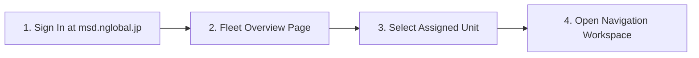
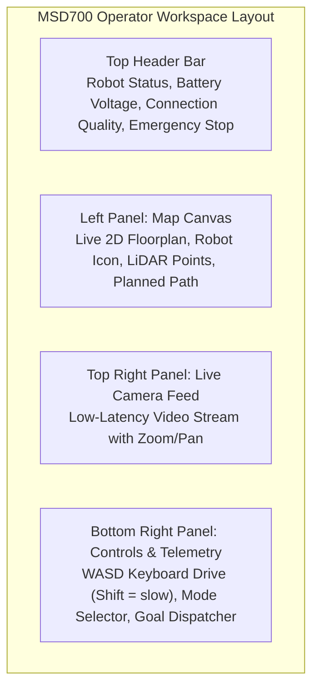
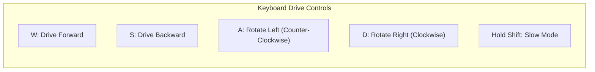
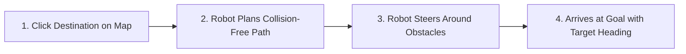

# Quick Start Guide

<RoleBadge role="user" />

This guide walks you through logging in to the MSD700 dashboard, taking control of an assigned robot unit, loading a map, and executing your first navigation mission.

## Prerequisites

Before starting, ensure you have:
1. An active user account on the dashboard.
2. At least one robot assigned to your account by an administrator.
3. Google Chrome or Microsoft Edge on a laptop or desktop computer.

---

## Step 1: Log In to the Dashboard

1. Open your browser and navigate to: `https://msd.nglobal.jp`.
2. Enter your username and password, then click **Sign In**.

---

## Step 2: Select a Robot Unit

After logging in, the **Fleet Dashboard** displays all robots assigned to your rental profile:

| Status Badge | Meaning | Action Allowed |
| --- | --- | --- |
| <Badge type="tip" text="Online" /> | Robot is active, connected, and ready for commands. | Click unit card to open dashboard. |
| <Badge type="warning" text="In Use" /> | Another operator is actively connected. | You may open the unit in view mode or request control takeover. |
| <Badge type="danger" text="Offline" /> | Robot is powered down or disconnected from the network. | Wait for the unit to reconnect or check hardware power. |

Click on any **Online** robot card to enter its control workspace.

---

## Step 3: Understand the Operator Workspace

The operator interface is divided into three main operational panels:

---

## Step 4: Load a Map

1. In the left panel header, click the **Select Map** dropdown.
2. Choose a pre-recorded map from the list (e.g. `Warehouse_Floor_1`).
3. The 2D floorplan renders on the canvas along with the robot's current position (blue circular icon with direction arrow).

::: tip No map available?
If no maps exist in the dropdown, see [Mapping](/user-guide/mapping) to create your first map.
:::

---

## Step 5: Drive Manually (Teleoperation)

You drive the robot manually with your keyboard:

### Teleoperation Controls:
- **W / S**: Drive forward / backward at normal speed (`0.40 m/s`).
- **A / D**: Turn left / right.
- **Hold Shift for slow mode**: Precise movement at `0.20 m/s` for tight spaces and mapping. The hint under the controls reads "Drive with W A S D · hold Shift = slow".
- **Release all keys** (or click **Stop**) to halt the robot immediately.

---

## Step 6: Dispatch a Navigation Goal (Point-to-Point)

To send the robot to a target destination autonomously:

1. Click the **Navigate Goal** button on the canvas toolbar.
2. Click on the desired destination point on the map.
3. Click and drag outward to orient the target heading arrow, then release.
4. The robot calculates a collision-free global path (blue line) and navigates autonomously to the target.

---

## Step 7: Emergency Stop (E-Stop)

The **Emergency Stop** button is prominently located at the top right of every page:

- **Activate E-Stop**: Click the red **Emergency Stop** button. The robot brakes immediately and halts all autonomous routines.
- **After E-Stop**: The dashboard shows an **Emergency Stop Activated** page. Check the situation in the field; when everything is safe, restart the robot and log in again via the **Go to LOGIN page** button to resume operations.

---

## Next Steps

- Learn how to perform systematic area coverage in [Routes & Coverage](/user-guide/routes-coverage).
- Understand safety timers and Autopilot in [How the Robot Behaves](/user-guide/behavior).
